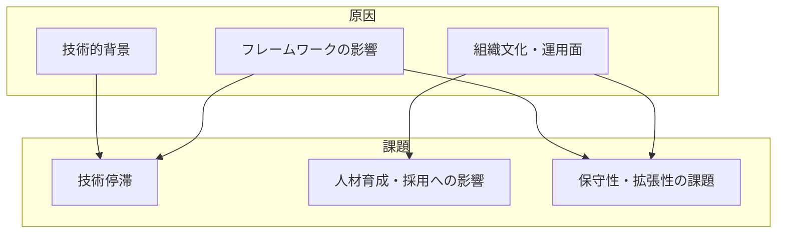

# 背景

---

## 概要

日本企業の内製システムは、長年にわたりレガシー技術や既存の開発手法に依存してきた。  
その結果、技術の停滞や人材育成の難しさ、保守性・拡張性の課題が顕在化している。  
本ドキュメントでは、現状の背景や原因について整理する。  
今後の解決策や推進体制については[構想](02_構想.md)ドキュメントを参照。

---

## 日系企業における内製システムの現状

### 現状

#### 技術停滞

- レガシーシステムの継続的な開発により、技術のレベルが停滞している。

#### 人材育成・採用への影響

- 長期間同じ技術やアーキテクチャを使い続けているため、  
  新しい技術へのキャッチアップが難しくなり、人材育成や採用にも悪影響が出ている。

#### 保守性・拡張性の課題

- 保守性の低下や技術的負債の蓄積が進み、  
  システムの柔軟な拡張や他システムとの連携が困難になっている。

### 原因

#### 技術的背景

- 2010年代に流行したC#、JavaでのMVCモデルにより閉鎖的なシステム空間となっている。

#### フレームワークの影響

- 開発工数の削減を目的としたフレームワークにより、「早く、安く」がテーマとなり、  
  将来的な技術革新への対応はリプレース、マイグレーションという手段に陥りがちである。

#### 組織文化・運用面

- 過去の成功体験や既存資産の有効活用を重視する組織文化が、新技術の導入や抜本的な刷新を妨げている。
- ドキュメントやナレッジの共有が不十分であり、属人化が進行していることも課題である。
- 外部ベンダーへの依存度が高く、内製化の推進や自社内での技術力向上が進みにくい状況となっている。

---

## 日系企業と外資系企業の比較

| 項目                   | 日系企業                                           | 外資系企業                                         |
|------------------------|---------------------------------------------------|----------------------------------------------------|
| 技術選定               | 保守性・既存資産重視、レガシー技術が多い           | 最新技術の積極導入、グローバル標準を重視           |
| 開発手法               | ウォーターフォール型が主流、ドキュメント重視       | アジャイル・DevOps推進、プロトタイピング重視       |
| 組織文化               | 合意形成重視、リスク回避、属人化しやすい           | 権限委譲・自律性重視、失敗からの学習を重視         |
| 人材育成・採用         | 長期雇用・社内育成中心、外部人材活用が限定的       | グローバルな人材流動性、専門性重視                 |
| ベンダー依存           | 外部ベンダー依存度が高い                           | 内製化・自社開発力の強化志向                       |
| ドキュメント・ナレッジ | ドキュメント形式・共有が限定的、属人化しやすい     | ナレッジ共有・標準化が進んでいる                   |

**まとめ**  
外資系企業は技術革新や組織変革への柔軟性が高く、内製化や自社技術力の強化を積極的に進めている。一方、日系企業は既存資産や組織文化の影響から変革が進みにくい傾向がある。

---

## 日系企業と外資系企業の乖離理由

- **歴史的背景・市場環境の違い**  
  日系企業は長期的な雇用や既存資産の活用を重視し、安定性や継続性を優先してきた。一方、外資系企業はグローバル競争や市場変化への即応を求められ、変化や革新を積極的に取り入れている。

- **組織構造・意思決定プロセスの違い**  
  日系企業は階層的な組織構造や合意形成を重視するため、意思決定に時間がかかりやすい。外資系企業は権限委譲や自律性を重視し、迅速な意思決定が可能。

- **人材戦略・評価制度の違い**  
  日系企業は長期雇用・年功序列が根強く、専門性や外部人材の活用が限定的。外資系企業は成果主義や専門性重視で、グローバルな人材流動性が高い。

- **技術投資・リスク許容度の違い**  
  日系企業は新技術導入に慎重で、既存技術の延命やリスク回避を優先しがち。外資系企業は新技術への投資や失敗からの学習を重視する傾向が強い。

---

## 情報のソース

- 独立行政法人情報処理推進機構（IPA）「IT人材白書」  
  https://www.ipa.go.jp/jinzai/itss/itjinzai_hakusho.html
- 経済産業省「DXレポート」「DX推進指標」  
  https://www.meti.go.jp/shingikai/mono_info_service/digital_transformation/index.html
- 日本経済新聞・日経クロステック等の業界記事  
  https://xtech.nikkei.com/
- Gartner, Forrester等のグローバルIT調査レポート  
  https://www.gartner.com/en/topics/information-technology
- 各種企業の公開事例・プレスリリース
- 筆者および関係者の実務経験・ヒアリング

---

## 筆者の疑問

- なぜ多くの日系企業は、変化の激しいIT業界においても既存の技術や手法に固執し続けるのか？
- 技術的負債や属人化のリスクが明らかであるにも関わらず、抜本的な刷新や新技術導入への意思決定がなぜ遅れるのか？
- 外部ベンダー依存から脱却し、自社の技術力を高めるための具体的な取り組みがなぜ進みにくいのか？
- ドキュメントやナレッジ共有の重要性が認識されているにも関わらず、なぜ現場での実践が徹底されないのか？
- グローバルな競争環境やデジタル変革の波に対し、日系企業はどのようにして持続的な競争力を確保していくべきなのか？

筆者としては、これらの疑問を今後の議論や施策検討の出発点としたい。
