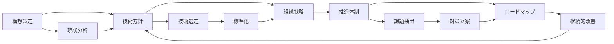
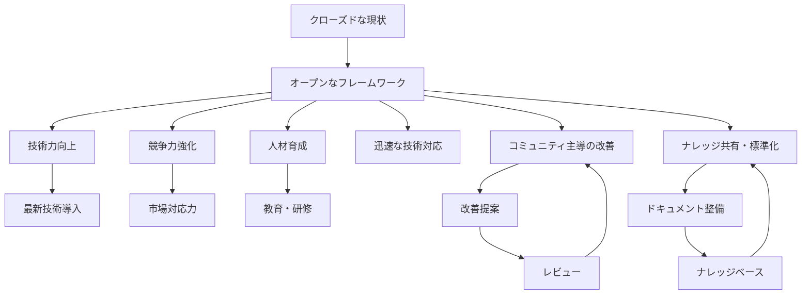
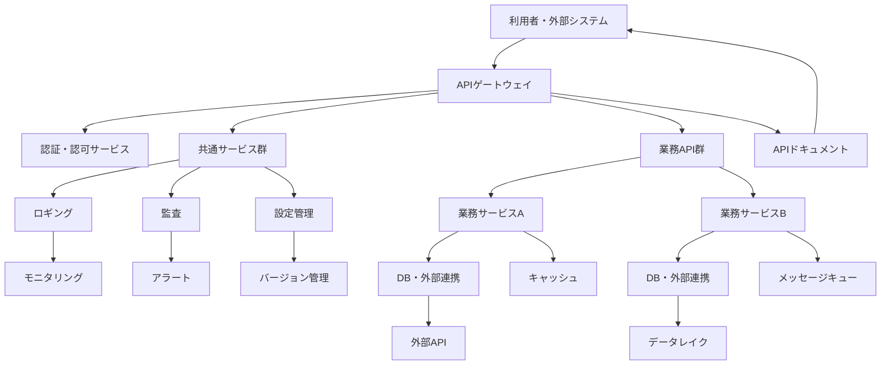
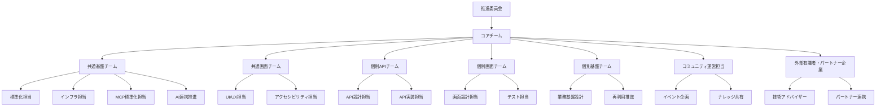
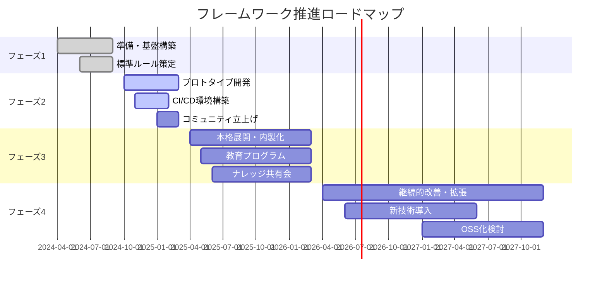
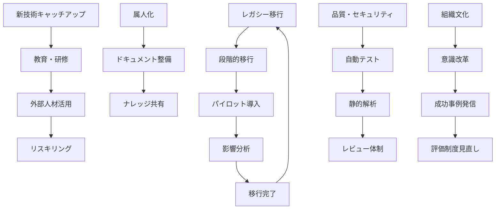

# 構想

---

## 概要

本ドキュメントは、オープンかつ拡張性の高いフレームワークの構築を目指す構想をまとめたものである。  
技術変化への柔軟な対応、知見の共有、人材育成、  
そして企業全体の技術力向上と競争力強化を実現するための基本方針・技術的アプローチ・  
組織戦略・推進体制・ロードマップ・課題と対策を示す。  
現状や課題の背景については[背景](01_背景.md)ドキュメントを参照。  
開発プロセスの詳細は[開発プロセス](03_開発プロセス.md)ドキュメントを参照。

---

## 目指す姿

従来のクローズドなフレームワークから脱却し、**オープンかつ拡張性の高いフレームワーク**を構築する。  
これにより、新技術や業界標準への迅速な対応を可能とし、継続的な進化とイノベーションを実現する。  
また、社内外のエンジニアが参加しやすい環境を整備し、知見の共有と人材育成を促進することで、  
企業全体の技術力向上と競争力強化を目指す。

---

### 具体的な目標・実現イメージ

- **技術面**
  - モジュール単位で機能追加・差し替えが容易なアーキテクチャを採用し、将来の技術変化や新規要件にも柔軟に対応できる。
  - APIファースト設計により、社内外のシステム・サービスとの連携や拡張が容易。
  - AIモデル連携・拡張性向上のため、MCP（Model Context Protocol）を標準プロトコルとして採用し、AIサービスの相互運用性を確保する。
  - クラウドネイティブ技術（コンテナ、マイクロサービス、IaC等）を標準採用し、スケーラビリティ・可用性・運用効率を高める。
  - セキュリティ・品質・パフォーマンスを設計段階から組み込み、企業システムとしての信頼性を確保。
  - **カオスエンジニアリングを導入し、システムのレジリエンス（耐障害性）を継続的に検証・強化する。**

- **組織・運営面**
  - 社内外のエンジニアがGitHub等を通じて開発・改善に参加できる「オープンな開発体制」を実現。
  - ドキュメント・ナレッジベースを整備し、属人化を排除。誰でも容易に情報を取得・参照できる。
  - コミュニティ主導での改善提案・レビュー・勉強会を定期的に実施し、知見の集約と人材育成を両立。
  - 継続的な教育・研修プログラムやキャリアパス設計により、技術者の成長と定着を支援。

- **成果・指標例**
  - 新規機能追加や技術アップデートのリードタイムを従来比で50%以上短縮。
  - コード・ドキュメントの社内外公開率100%、ナレッジ共有会の定期開催（月1回以上）。
  - コミュニティ参加者数・改善提案数の継続的増加。
  - セキュリティ・品質指標（バグ件数、カバレッジ率等）の定量的な改善。

---

### 実現イメージ図

---

## 基本方針

- オープンで拡張性の高いアーキテクチャを採用し、将来の技術変化に柔軟に対応できる基盤を構築する。

- 標準化とドキュメント整備を徹底し、属人化を排除して知見の共有を促進する。

- 社内外のエンジニアが参加しやすい開発体制を整備し、コミュニティ主導の継続的な改善を推進する。

- セキュリティ・品質・パフォーマンスを重視し、企業システムとしての信頼性を確保する。

- **カオスエンジニアリング等の実践的な耐障害性検証を取り入れ、障害に強いシステムを目指す。**

- 内製化を推進し、技術力の底上げと人材育成を両立する。

※１　「コミュニティ主導」とは  
単一の担当者や特定の部署に依存せず、社内外の多様なエンジニアが自発的に参加し、  
意見交換や改善提案を行いながらフレームワークを進化させていく運営方針を指す。  
これにより、知見の集約・共有、継続的な品質向上、技術トレンドへの迅速な対応が可能となる。

---

## 技術的アプローチ

- モジュール化・コンポーネント化を徹底し、必要な機能を柔軟に組み合わせられる構造とする。

- APIファースト設計を採用し、システム間連携や拡張性を高める。

- AIモデル連携・外部AIサービスとの統合にはMCP（Model Context Protocol）を活用し、標準化・拡張性・相互運用性を担保する。

- クラウドネイティブ技術（コンテナ、マイクロサービス、CI/CD等）の積極的な導入により、開発・運用の効率化とスケーラビリティを実現する。

- オープンソース技術の活用と、社内外への情報発信・フィードバックループの構築を推進する。

- セキュリティ・パフォーマンス・可用性を考慮した設計・実装・運用を徹底する。

- **カオスエンジニアリングを採用し、本番相当環境での障害注入・耐障害性テストを自動化する。**

- 自動テストや静的解析など品質担保のための仕組みを標準化し、継続的な品質向上を図る。

### 技術アーキテクチャイメージ

---

## 組織・人材戦略

- 技術力向上のための継続的な教育・研修プログラムを整備し、最新技術へのキャッチアップを支援する。

- 社内外のエンジニアが協働できるコミュニティやナレッジ共有の場を設け、情報発信・意見交換を活性化する。

- 内製化を推進し、プロジェクト経験を通じて実践的なスキルを身につける機会を増やす。

- 多様なバックグラウンドを持つ人材の採用・登用を進め、組織の技術的多様性を高める。

- キャリアパスの明確化や評価制度の見直しにより、エンジニアのモチベーション向上と定着を図る。

---

## 推進体制

- プロジェクト全体を統括する推進委員会を設置し、戦略策定・進捗管理・意思決定を担う。

- 技術リーダー・アーキテクト・現場エンジニアなど多様なメンバーによるコアチームを編成し、設計・開発・運用をリードする。

- コミュニティ運営担当を設け、社内外の参加者が意見交換・情報共有しやすい環境を整備する。

- 定期的なレビュー会や勉強会を開催し、知見の集約・課題の早期発見・改善サイクルの高速化を図る。

- 必要に応じて外部有識者やパートナー企業とも連携し、最新技術や業界動向を取り入れる。

- 共通基盤・共通画面・個別API・個別画面・個別基盤の5チーム制を採用し、縦（機能別）と横（共通基盤・共通画面）の両面からアプローチする体制とする。

    - 共通基盤・共通画面チームは全体最適・標準化・再利用性向上を担い、個別API・個別画面・個別基盤チームは各業務要件への迅速な対応・最適化を推進する。

    - 個別基盤チームは業務領域特有のビジネスルールを共通化し、再利用可能な基盤を構築する役割を担う。

    - チーム間の連携を強化し、横断的な知見共有・課題解決を図る。

### 推進体制イメージ（マーメイド組織図）

---

## ロードマップ

### フェーズ1：準備・基盤構築（0〜6ヶ月）

- 推進体制の確立、コアメンバーの選定

- 現状分析・要件整理・技術調査

- 基本アーキテクチャ設計・技術選定

- ドキュメント・標準ルールの整備

### フェーズ2：プロトタイプ開発・検証（6〜12ヶ月）

- コア機能のプロトタイプ開発

- 開発プロセス・CI/CD環境の構築

- 社内外コミュニティの立ち上げ

- フィードバック収集・改善サイクルの開始

### フェーズ3：本格展開・内製化推進（12〜24ヶ月）

- フレームワークの本格開発・機能拡充

- 社内プロジェクトへの適用・展開

- 教育・研修プログラムの実施

- ナレッジ共有・コミュニティ活動の活性化

### フェーズ4：継続的改善・拡張（24ヶ月以降）

- 利用状況・課題のモニタリングと改善

- 新技術・新機能の継続的な導入

- 社外への情報発信・オープンソース化の検討

- 組織・人材戦略の見直しと強化

---

## 想定される課題と対策

### 課題1：レガシーシステムからの移行リスク

- **対策**：段階的な移行計画を策定し、影響範囲を限定したパイロット導入から開始する。  
  現行システムとの共存期間を設け、業務影響を最小化する。

### 課題2：新技術へのキャッチアップ・人材不足

- **対策**：継続的な教育・研修プログラムを実施し、社内外コミュニティでの情報共有・ナレッジ蓄積を推進する。  
  外部人材の活用やリスキリングも検討する。

### 課題3：属人化・ナレッジの分散

- **対策**：ドキュメント整備・標準化を徹底し、ナレッジ共有の仕組みを構築する。  
  コミュニティ主導の運営で知見を集約する。

### 課題4：品質・セキュリティの確保

- **対策**：自動テストや静的解析、レビュー体制を標準化し、品質担保の仕組みを強化する。  
  セキュリティ要件を設計段階から組み込む。  
  **さらに、カオスエンジニアリングによる障害注入テストを定期的に実施し、システムのレジリエンスを継続的に検証・改善する。**

### 課題5：組織文化・マインドセットの変革

- **対策**：トップダウン・ボトムアップ双方からの意識改革を推進し、変革の必要性を全社で共有する。  
  成功事例の発信や評価制度の見直しも行う。

---