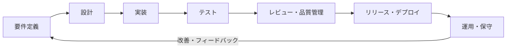

# 開発プロセス

---

## 概要

本ドキュメントは、KisoFrameworkにおけるソフトウェア開発プロセスの全体像と標準的な進め方を示すものである。  
要件定義から設計・実装・テスト・リリース・運用・改善まで、一連の工程を体系的に整理し、  
品質向上・効率化・ナレッジ共有・継続的な改善を実現するための指針を提供する。  
プロジェクトの規模や特性に応じて柔軟に適用できる標準プロセスとして、  
関係者間の共通認識形成やプロジェクト推進の基盤となることを目的とする。

---

## 開発プロセス全体像

開発プロセスは、以下の主要な工程で構成され、各工程が連携しながらプロジェクトを推進する。

1. **要件定義**  
   ビジネス・システム要件を整理し、プロジェクトの目的やゴールを明確化する。

2. **設計**  
   要件をもとにシステム全体の構成や詳細仕様を設計する。

3. **実装**  
   設計に基づき、ソースコードや各種モジュールを開発する。

4. **テスト**  
   実装した機能が要件・設計通りに動作するかを検証する。

5. **レビュー・品質管理**  
   各工程で成果物のレビューや品質チェックを行い、問題の早期発見・是正を図る。

6. **リリース・デプロイ**  
   テスト・レビューを通過した成果物を本番環境へリリースする。

7. **運用・保守**  
   リリース後のシステム運用・監視・障害対応・改善活動を継続的に実施する。

これらの工程はウォーターフォール型・アジャイル型などプロジェクト特性に応じて柔軟に適用され、  
継続的な改善サイクル（PDCA）を通じて品質と生産性の向上を目指す。

---

### 開発プロセスの流れ

---

## 開発フロー

1. **要件定義**
   - ビジネス要件・システム要件の整理
   - 関係者ヒアリング・要件レビュー

2. **設計**
   - 基本設計（アーキテクチャ、構成、外部設計）
   - 詳細設計（データモデル、API設計、UI設計等）

3. **実装**
   - モジュール・コンポーネント単位での開発
   - コーディング規約・標準に基づく実装

4. **テスト**
   - 単体テスト・結合テスト・システムテスト
   - 自動テスト・静的解析の実施

5. **レビュー**
   - コードレビュー・設計レビュー
   - 品質・セキュリティチェック

6. **リリース準備**
   - ドキュメント整備
   - リリース判定・承認

7. **リリース・デプロイ**
   - CI/CDパイプラインによる自動デプロイ
   - 本番環境へのリリース

8. **運用・保守**
   - 障害対応・監視
   - 継続的な改善・フィードバック反映

---

## 標準ドキュメント・成果物

各工程で作成・整備する標準ドキュメントおよび成果物の例は以下の通りである。

1. **要件定義**
   - 要件定義書
   - ユースケース図・業務フロー図
   - ステークホルダー一覧

2. **設計**
   - 基本設計書（アーキテクチャ設計書、外部設計書）
   - 詳細設計書（データモデル設計書、API仕様書、画面設計書）
   - ER図・シーケンス図・クラス図

3. **実装**
   - ソースコード（リポジトリ管理）
   - コーディング規約・ガイドライン
   - モジュール仕様書

4. **テスト**
   - テスト計画書
   - テスト仕様書・テストケース
   - テスト結果報告書
   - 自動テストスクリプト

5. **レビュー・品質管理**
   - レビュー記録（コードレビュー、設計レビュー）
   - 品質チェックリスト
   - 静的解析レポート

6. **リリース・運用**
   - リリースノート
   - 運用手順書・障害対応手順書
   - システム構成図・インフラ設計書

7. **ナレッジ共有・改善**
   - FAQ・ナレッジベース
   - 技術ブログ・事例集
   - 改善提案・振り返り記録

---

## レビュー・品質管理

### レビュー

- **設計レビュー**  
  基本設計・詳細設計の段階で、アーキテクチャや仕様の妥当性・実現性・拡張性を確認する。
- **コードレビュー**  
  実装段階で、コーディング規約遵守・可読性・保守性・セキュリティ観点でレビューを実施する。
- **テストレビュー**  
  テストケースやテスト結果の妥当性を確認し、品質担保を図る。

### 品質管理

- **品質基準の明確化**  
  品質目標（バグ件数、カバレッジ率、パフォーマンス等）を定め、全工程で共有する。
- **自動テスト・静的解析**  
  単体テスト・結合テストの自動化、静的解析ツールによる品質チェックを標準化する。
- **品質チェックリスト**  
  各工程での品質チェック項目を明文化し、抜け漏れを防止する。
- **定期的な品質レビュー**  
  マイルストーンごとに品質状況をレビューし、課題があれば早期に対策を講じる。
- **不具合管理・改善サイクル**  
  バグ・課題管理ツールを活用し、不具合の記録・分析・再発防止策を徹底する。

---

## CI/CD・自動化

### CI（継続的インテグレーション）

- プルリクエストやコミット時に自動でビルド・テストを実行し、不具合の早期発見・品質担保を図る。
- 静的解析やコードフォーマットチェックも自動化し、標準化を徹底する。
- **GitHub Actionsを標準CIツールとして利用し、ワークフローをリポジトリ内で管理・運用する。**

### CD（継続的デリバリー／デプロイメント）

- テスト通過後、自動でステージング・本番環境へデプロイを実施する。
- デプロイ前後の自動テストやローリングアップデート、ロールバック機能を組み込む。
- **GitHub Actionsを用いて、デプロイメントも自動化する。**

### その他の自動化

- インフラ構成管理（IaC：Infrastructure as Code）を導入し、環境構築・変更を自動化する。
- ドキュメント生成やリリースノート作成も自動化し、運用負荷を軽減する。
- セキュリティチェックや脆弱性スキャンもパイプラインに組み込む。
- **GitHub ActionsのMarketplaceを活用し、各種自動化タスクを容易に追加できる。**

---

## ナレッジ共有・コミュニティ運営

- 本章では、開発プロセスにおけるナレッジ共有やコミュニティ運営の仕組みについて記載する。
- 組織体制や人材戦略の詳細は[構想](02_構想.md)ドキュメントを参照。

### ナレッジ共有

- ドキュメントやFAQ、ナレッジベースを整備し、情報の集約・検索性を高める。
- 社内Wikiやドキュメント管理ツール（例：Confluence、Notion、GitHub Wiki等）を活用し、知見を体系的に蓄積・共有する。
- 技術ブログや事例集を通じて、成功事例やノウハウを広く発信する。
- 定期的な勉強会・ワークショップを開催し、最新技術や業務知識の共有を促進する。

### コミュニティ運営

- 社内外のエンジニアが参加できるコミュニティを設け、意見交換や情報共有の場を提供する。
- コミュニティ運営担当を配置し、参加者のサポートやイベント企画を推進する。
- オンラインチャット（例：Slack, Teams, Discord等）やQ&Aフォーラムを活用し、日常的なコミュニケーションを活性化する。
- 改善提案やフィードバックを受け付ける仕組みを設け、継続的な改善サイクルを回す。

---

## 継続的改善サイクル

- **PDCAサイクル（Plan-Do-Check-Act）** を基本とし、全工程で継続的な改善を推進する。
  - **Plan（計画）**：目標設定、課題抽出、改善計画の策定
  - **Do（実行）**：改善施策の実施、プロセスやツールの導入
  - **Check（評価）**：KPIや品質指標による効果測定、レビュー・振り返りの実施
  - **Act（改善）**：評価結果をもとにプロセスや仕組みを見直し、次の計画に反映

- **定期的な振り返り（レトロスペクティブ）** を実施し、現場の声や課題を集約して改善案を検討する。
- **ナレッジ共有・コミュニティ活動** を通じて、改善事例やノウハウを全体に展開する。
- **改善提案の受付・トラッキング** の仕組みを設け、誰でも気軽に提案できる環境を整備する。
- **小さな改善の積み重ね** を重視し、迅速なフィードバックと実践を繰り返すことで、組織全体の成熟度を高める。

