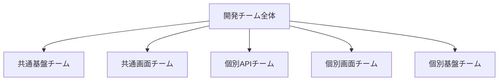
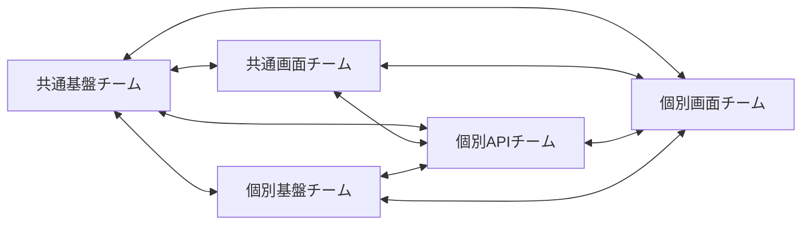
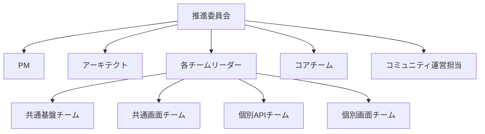

# 開発チーム体制

---

## 概要

本ドキュメントは、KisoFrameworkの開発を推進するためのチーム構成・役割分担・責任範囲・連携体制についてまとめる。  
組織全体の推進体制や人材戦略の詳細は[構想](02_構想.md)ドキュメントを参照。

---

## チーム構成

KisoFramework開発は、以下の5チーム体制で推進する。

<!-- マーメイド組織図 -->

- **共通基盤チーム**  
  フレームワークのコア機能・共通サービス・インフラ基盤の設計・開発・運用を担当。

- **共通画面チーム**  
  フレームワークの設定画面、システムで汎用的に使用されるであろう画面を担当。
  UIの共通コンポーネントの作成は担当しないので個別画面とは無関係である。

- **個別APIチーム**  
  各業務システム向けのAPI設計・開発・最適化を担当。

- **個別画面チーム**  
  各業務要件に応じた個別画面の設計・開発・カスタマイズを担当。

- **個別基盤チーム**  
  業務領域特有のビジネスルールを共通化し、再利用可能な基盤を設計・開発・運用する。

---

## チーム一覧

| チーム名         | 主な役割・担当領域                   | 主なメンバー構成例           |
|------------------|--------------------------------------|------------------------------|
| 共通基盤チーム   | コア機能、共通サービス、インフラ      | アーキテクト、SRE、開発者    |
| 共通画面チーム   | UIコンポーネント、共通画面、標準化    | フロントエンド、UI/UX担当    |
| 個別APIチーム    | 業務API、外部連携、最適化            | バックエンド、API設計者      |
| 個別画面チーム   | 業務画面、カスタマイズ、要件対応      | フロントエンド、業務SE       |
| 個別基盤チーム   | 業務領域特有のビジネスルール共通化基盤| ビジネスアナリスト、開発者   |

---

## 役割分担

- **プロジェクトマネージャー（PM）**  
  全体進捗管理、リソース調整、課題管理、対外調整

- **アーキテクト**  
  技術方針策定、アーキテクチャ設計、技術選定

- **リーダー（各チーム）**  
  チーム内進捗管理、メンバー育成、品質担保

- **開発担当（フロント/バックエンド）**  
  設計・実装・テスト・レビュー

- **SRE/インフラ担当**  
  CI/CD、運用設計、監視・障害対応

- **QA/テスト担当**  
  テスト計画・実施、品質管理

- **ドキュメント/ナレッジ担当**  
  ドキュメント整備、ナレッジ共有推進

- **個別基盤チーム**  
  業務領域特有のビジネスルールを共通化し、再利用可能な基盤の設計・開発・運用を担当。

---

## 責任範囲

- **共通基盤チーム**  
  フレームワークの安定稼働・拡張性・セキュリティ担保。CI/CDやインフラ自動化も含む。

- **共通画面チーム**  
  UI/UX標準化、共通部品の品質・再利用性担保。

- **個別APIチーム**  
  各業務要件への迅速なAPI対応、外部システム連携の品質担保。

- **個別画面チーム**  
  業務要件に即した画面開発、ユーザー要望への柔軟な対応。

- **個別基盤チーム**  
  業務領域特有のビジネスルールを共通化し、各業務システムで再利用可能な基盤の品質・拡張性を担保。

- **全体**  
  チーム間での成果物レビュー・相互フィードバックを実施し、品質・標準化を維持。

---

## チーム間連携

<!-- マーメイド チーム間連携図 -->

- **定例会議**  
  週次で全チーム合同の進捗・課題共有会を実施。

- **横断レビュー**  
  チーム横断で設計・コード・UIレビューを実施し、知見共有と品質向上を図る。

- **ドキュメント・ナレッジ共有**  
  GitHub Wiki等で設計・運用ナレッジを集約。

- **課題管理**  
  GitHub Issues等で課題・要望を一元管理し、チーム間で対応状況を可視化。

---

## 推進体制

- 本章では、開発チーム内の推進体制について記載する。
- プロジェクト全体の推進体制は[構想](02_構想.md)ドキュメントを参照。

<!-- マーメイド推進体制図 -->

### 主な推進施策

- **推進委員会**  
  PM・アーキテクト・各チームリーダーで構成し、戦略策定・意思決定・進捗管理を担う。

- **コアチーム**  
  技術リーダー・主要開発者による設計・技術検討・標準化推進。

- **コミュニティ運営担当**  
  社内外の参加者サポート、イベント企画、ナレッジ共有促進。

- **定期レビュー・勉強会**  
  振り返り・改善サイクルの高速化、知見集約。

---

## コミュニケーション・ナレッジ共有

- **日常コミュニケーション**  
  Google Chat/Teams等のチャットツールで日々の情報共有・相談を実施。

- **ドキュメント管理**  
  設計・運用・FAQ等をGitHub Wikiで体系的に管理。

- **ナレッジ共有会**  
  定期的な勉強会・ワークショップで最新技術や事例を共有。

- **Q&A・フィードバック**  
  オンラインフォーラムやチャットで質問・提案を受け付け、迅速に対応。

- **技術ブログ・事例集**  
  成功事例やノウハウを社内外に発信。

---

## 育成・評価

- **OJT・メンタリング**  
  実プロジェクトを通じたOJT、リーダーによるメンタリングを実施。

- **教育・研修プログラム**  
  新技術・標準プロセスの研修、外部セミナー参加支援。

- **キャリアパス・評価制度**  
  スキル・成果に応じたキャリアパス設計、定期評価・フィードバック。

- **振り返り・1on1**  
  定期的な振り返り・1on1面談で成長支援・課題把握。

---

## 課題と対策

- **課題1：チーム間の情報共有不足**  
  - 対策：ドキュメント整備・横断レビュー・定例会議で知見共有を徹底。

- **課題2：属人化・ナレッジ分散**  
  - 対策：ナレッジベース構築・標準化推進・コミュニティ活動強化。

- **課題3：新技術キャッチアップの遅れ**  
  - 対策：勉強会・研修・外部コミュニティ連携で最新技術を継続的に導入。

- **課題4：品質・セキュリティ担保**  
  - 対策：自動テスト・静的解析・レビュー体制の標準化。

- **課題5：人材育成・評価の仕組み不十分**  
  - 対策：OJT・メンタリング・キャリアパス明確化・定期評価の実施。

---