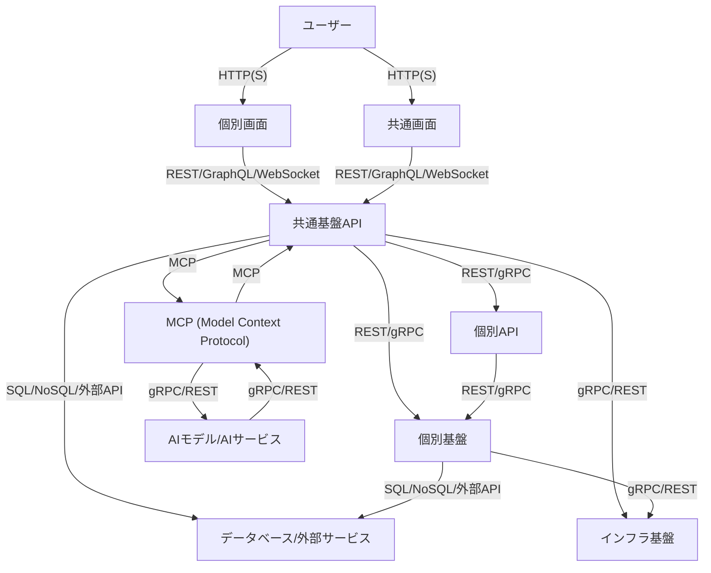
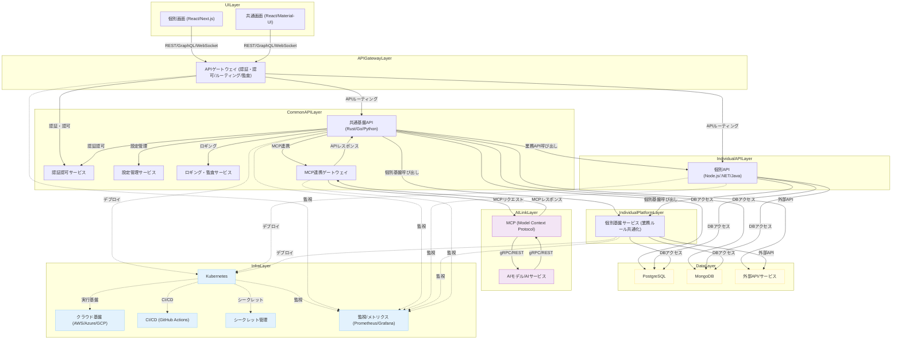
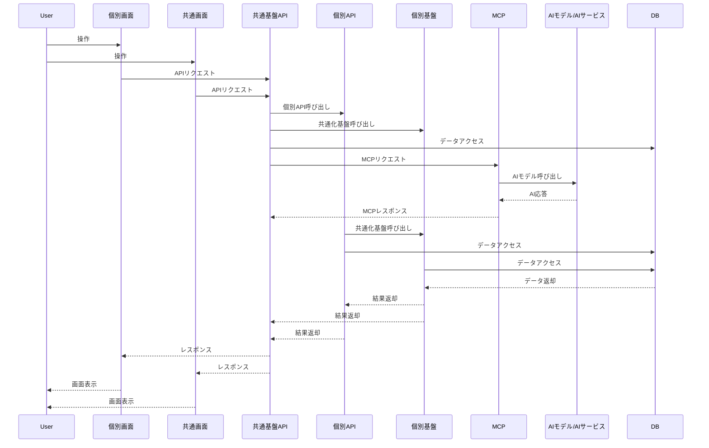
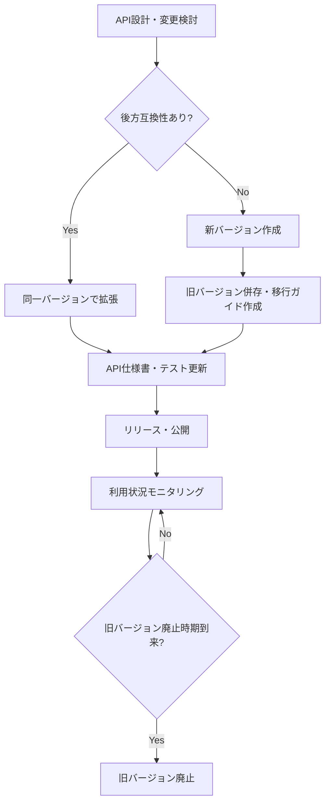
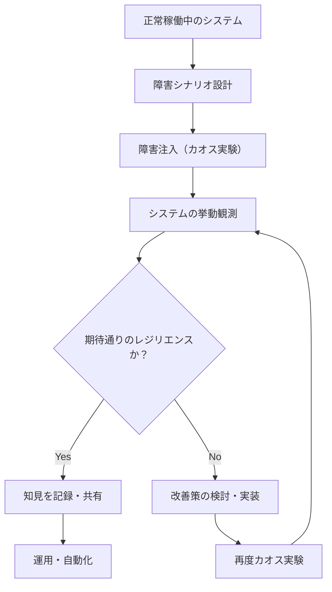
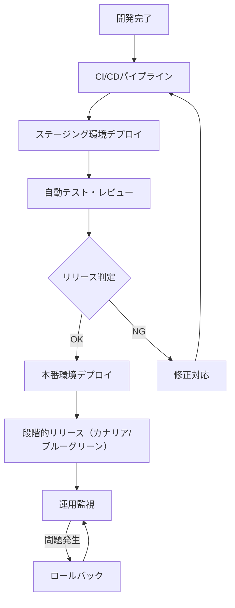
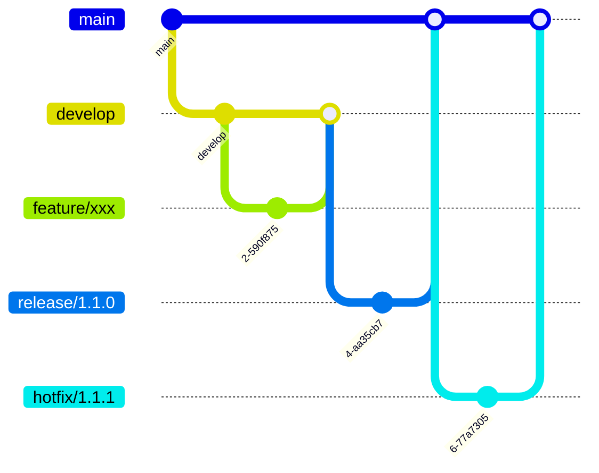
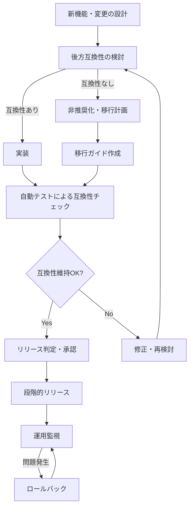

# アーキテクチャ

---

## 概要

本ドキュメントは、KisoFrameworkのシステムアーキテクチャ全体像、設計方針、構成要素、技術スタック、拡張性・保守性・セキュリティ等の観点を整理し、今後の開発・運用の指針とするものである。

---

## 目的

- システム全体の構造・設計思想を明確化し、関係者間の共通認識を形成する。
- 拡張性・保守性・セキュリティ・標準化を担保し、長期的な運用・進化を可能とする。
- チーム間の連携や開発効率向上、品質確保を実現する。

---

## 基本方針

- オープンかつ拡張性の高いアーキテクチャを採用し、将来の技術変化に柔軟に対応できるようにする。
- モジュール化・コンポーネント化を徹底し、必要な機能を柔軟に組み合わせ可能とする。
- APIファースト設計により、システム間連携や外部拡張を容易にする。
- AIモデル連携・標準APIプロトコルとしてMCP（Model Context Protocol）を採用し、AIサービスの拡張性・相互運用性を高める。
- クラウドネイティブ技術（コンテナ、マイクロサービス、CI/CD等）を積極的に導入する。
- セキュリティ・品質・パフォーマンスを重視し、企業システムとしての信頼性を確保する。
- **カオスエンジニアリングを導入し、障害注入によるレジリエンス検証を継続的に実施する。**

---

## MCP（Model Context Protocol）対応

KisoFrameworkでは、AIモデルや外部AIサービスとの連携において**MCP（Model Context Protocol）**を標準プロトコルとして採用する。

- **MCP概要**  
  MCPはGoogleが提唱するAIモデルとアプリケーション間の共通プロトコルであり、モデルの入出力やツール呼び出し、メタデータなどを標準化することで、異なるAIモデル間でも同じ形式でやり取りできる。

- **採用理由・メリット**
  - 異なるAIモデルやサービス間での互換性・拡張性が高まる
  - モデルの切り替えや複数モデルの統合が容易
  - オープン仕様のため独自実装や拡張も可能

- **今後の方針**
  - 共通基盤APIにMCP準拠のエンドポイントを実装
  - AIモデル連携機能はMCP形式で統一し、将来的なAIサービス拡張に備える

---

## 全体構成図

---

### 詳細概念図

---

## システム構成要素

- **共通基盤**  
  コア機能、認証認可、ロギング、設定管理、APIゲートウェイ等の共通サービスを提供する。

- **共通画面**  
  システム全体で利用する設定画面、管理画面等を提供する。

- **個別API**  
  各業務システム向けのAPI群である。業務要件に応じたビジネスロジックを実装する。

- **個別画面**  
  業務要件に応じた個別UIである。ユーザー操作を受け付け、APIと連携する。

- **個別基盤**  
  業務領域特有のビジネスルールを共通化し、再利用可能な基盤を設計・開発・運用する。

- **インフラ基盤**  
  クラウド環境（例：AWS, Azure, GCP）、コンテナオーケストレーション（Kubernetes等）、CI/CDパイプラインを提供する。

- **データベース/外部サービス**  
  RDBMS、NoSQL、外部API、認証基盤等を利用する。

---

## 技術スタック

### 共通基盤チーム

- **バックエンド**
  - Rust
  - Go
  - Python
- **API設計**
  - REST
  - OpenAPI (Swagger)
  - gRPC
  - GraphQL
  - WebSocket
- **データベース**
  - PostgreSQL
  - MongoDB
- **インフラ・運用**
  - Docker
  - Kubernetes
  - AWS / Azure / GCP
  - GitHub Actions（CI/CD）
- **共通サービス**
  - 認証認可：OAuth2.0, OpenID Connect, Azure AD
  - ロギング/監視：Prometheus, Grafana, ELK Stack

### 共通画面チーム

- **フロントエンド**
  - React
  - TypeScript
  - Material-UI
- **テスト・品質管理**
  - Jest
  - Cypress
  - Playwright
  - Storybook
- **デザイン**
  - Figma
  - Adobe XD

### 個別APIチーム

- **バックエンド**
  - Node.js（Express, NestJS）
  - .NET Core
  - Java（Spring Boot）
- **API設計**
  - REST
  - GraphQL
  - OpenAPI (Swagger)
- **データベース**
  - PostgreSQL
  - MySQL
  - MongoDB
- **外部連携**
  - 各種外部API
  - Webhook

### 個別画面チーム

- **フロントエンド**
  - React
  - TypeScript
  - Next.js
  - Tailwind CSS
  - Material-UI
- **ネイティブアプリ**
  - Windowsアプリ：.NET（WPF, UWP, WinForms）
  - iOSアプリ：Swift, SwiftUI
- **テスト・品質管理**
  - Jest
  - Cypress
  - Playwright
- **デザイン**
  - Figma
  - Adobe XD

### 個別基盤チーム

- **バックエンド**
  - Node.js（Express, NestJS）
  - .NET Core
  - Java（Spring Boot）
- **API設計**
  - REST
  - GraphQL
  - OpenAPI (Swagger)
- **データベース**
  - PostgreSQL
  - MySQL
  - MongoDB
- **共通化基盤**
  - 業務ルール共通化モジュール
  - 再利用API
- **外部連携**
  - 各種外部API
  - Webhook

---

## モジュール構成

- **共通基盤モジュール**
  - 認証認可モジュール
  - 設定管理モジュール
  - ロギング・監視モジュール
  - APIゲートウェイ

- **共通画面モジュール**
  - 設定画面
  - 管理画面
  - 共通UI部品

- **個別APIモジュール**
  - 業務API（各業務ごとに分割）
  - 外部連携API

- **個別画面モジュール**
  - 業務画面（各業務ごとに分割）

- **個別基盤モジュール**
  - 業務領域特有のビジネスルール共通化基盤
  - 再利用API・サービス

---

## データフロー

1. ユーザーが個別画面または共通画面から操作する。
2. 個別画面が**必ず共通基盤APIを経由して**個別APIまたは共通APIを呼び出す。
3. 共通APIは個別APIや個別基盤サービスを経由し、必要に応じてデータベースや外部サービスと連携する。
4. 共通APIはAIモデル連携時、MCP（Model Context Protocol）を介してAIモデル/AIサービスと通信する。
5. 個別APIや個別基盤も必要に応じてデータベースや外部サービスと連携する。
6. 結果を画面に返却する。

---

## セキュリティ設計

- **認証認可**  
  OAuth2.0, OpenID Connect, Passkey/FIDO2等によるシングルサインオン、ロールベースアクセス制御、パスワードレス認証を実施する。
- **Zero Trustセキュリティ**  
  全通信・全アクセスを信頼せず検証するZero Trustモデルを標準化する。
- **通信の暗号化**  
  全通信をTLS/SSLで暗号化する。
- **脆弱性対策**  
  静的解析（SAST）、動的解析（DAST）、依存ライブラリの脆弱性スキャン、SBOM（Software Bill of Materials）自動生成をCI/CDに組み込む。
- **監査ログ**  
  重要操作・アクセスログの記録と監査、OpenTelemetryによる分散トレーシングを実施する。
- **インフラセキュリティ**  
  クラウドセキュリティベストプラクティス（IAM、ネットワーク分離、WAF、CSPM等）を遵守する。
- **レジリエンス検証（カオスエンジニアリング）**  
  本番相当環境で障害注入テストを実施し、障害発生時の回復力・耐障害性を継続的に検証・強化する。

---

## 拡張性・保守性への配慮

- モジュール化・疎結合設計により、機能追加・変更の影響範囲を最小化
- APIファースト設計で外部連携や新規サービス追加が容易
- インフラはIaC（Infrastructure as Code）で管理し、環境構築・変更を自動化
- ドキュメント・標準化を徹底し、属人化を防止
- **カオスエンジニアリングの実践により、障害に強いシステム運用・改善サイクルを確立**

---

## 標準化・ガイドライン

- コーディング規約・設計ガイドラインを整備し、全体で統一する。
- API設計はOpenAPI仕様に準拠し、APIドキュメント自動生成・AIレビューを導入する。
- UI/UXはデザインシステム・コンポーネントガイドラインを策定し、AIによるUIレビューやアクセシビリティチェックも活用する。
- CI/CD・自動テスト・レビュー体制を標準化し、AIによる自動テスト生成・コードレビューを積極活用する。

---

## API管理・バージョン管理戦略

KisoFrameworkでは、APIの長期的な運用・拡張性・後方互換性を担保するため、以下のAPI管理・バージョニング戦略を採用する。

### API管理方針

- API仕様はOpenAPI（Swagger）等の標準フォーマットで一元管理し、ドキュメントを自動生成・公開する。
- API設計・変更時は必ず設計レビュー・影響範囲分析を実施し、互換性維持を重視する。
- APIの公開・廃止・変更履歴はリリースノートやAPIカタログで明確に管理する。
- API利用状況・アクセスログを定期的に分析し、未使用APIの廃止や改善に活用する。

### バージョニング戦略

- **バージョン付与方式**
  - URIバージョニング（例：`/api/v1/`）を基本とし、必要に応じてヘッダバージョニングも併用する。
  - 破壊的変更（後方互換性がない変更）は新バージョン（例：v2）としてリリースし、旧バージョンは一定期間併存させる。
  - 非破壊的変更（後方互換性あり）は同一バージョン内で追加・拡張する。

- **バージョン管理ルール**
  - セマンティックバージョニング（MAJOR.MINOR.PATCH）をAPIにも適用し、変更内容を明確化する。
  - 廃止予定APIは「Deprecated」フラグを付与し、十分な移行期間・移行ガイドを提供する。
  - バージョンごとにAPI仕様書・テストケース・リリースノートを管理する。

- **API廃止・移行フロー**
  - 廃止予定APIは事前にアナウンスし、利用者への影響を最小化する。
  - 旧バージョンのサポート終了時期を明示し、段階的な移行を促進する。

### 具体例

- `/api/v1/users`（v1系API）
- `/api/v2/users`（v2系API、仕様変更・拡張時に新設）
- リクエストヘッダ例：`Accept: application/vnd.example.v2+json`

### APIバージョニング運用フロー

---

## 今後の展望

- AI/LLMエージェント連携、AIワークフロー自動化、AI UXのさらなる強化
- サーバーレス、エッジコンピューティング、マイクロフロントエンド等の新技術の継続的な導入
- オープンソース化や社外コミュニティとの連携強化
- 利用状況・課題のAI分析と改善サイクルの高速化
- グローバル展開や多言語対応の検討

---

## カオスエンジニアリングの流れ

KisoFrameworkでは、システムのレジリエンス（耐障害性）を高めるためにカオスエンジニアリングを導入している。  
以下はカオスエンジニアリングの基本的な流れを示したものである。

- **障害シナリオ設計**: どのような障害（例：ネットワーク遅延、サーバーダウン等）を注入するか計画する。
- **障害注入**: 本番相当環境で意図的に障害を発生させる。
- **挙動観測**: システムの回復力や影響範囲を監視・記録する。
- **改善サイクル**: 問題があれば設計・運用を改善し、再度検証する。

---

## リリース戦略・バージョン管理

KisoFrameworkでは、安定した運用と継続的な進化を両立するため、計画的なリリース戦略と厳格なバージョン管理を実施する。

### リリース戦略

- **段階的リリース**  
  ステージング環境、本番環境への段階的なリリースを行い、リスクを最小化する。
- **無停止リリース**  
  ブルーグリーンデプロイメントやカナリアリリース等を活用し、サービス停止なしで新バージョンを展開する。
- **ロールバック対応**  
  問題発生時は迅速に旧バージョンへ切り戻し可能な体制を整備する。
- **リリース判定・承認フロー**  
  テスト・レビュー・承認を経てリリースを実施する。

### バージョン管理方針

- **セマンティックバージョニング（SemVer）**  
  `MAJOR.MINOR.PATCH` 形式でバージョンを管理し、互換性や変更内容を明確化する。
- **Gitによるブランチ戦略**  
  `main`（安定版）、`develop`（開発版）、`feature/*`（新機能）、`release/*`（リリース準備）、`hotfix/*`（緊急修正）等のブランチを運用する。
- **タグ付け・リリースノート**  
  リリースごとにGitタグを付与し、変更点をリリースノートとして記録・公開する。
- **CI/CD連携**  
  バージョン管理とCI/CDを連携し、自動的にビルド・テスト・デプロイ・リリースノート生成を実施する。

#### 後方互換性の担保

- **API・データ構造の後方互換性維持**  
  既存の利用者やシステムに影響を与えないよう、APIやデータ構造の変更時は後方互換性を重視する。
- **非推奨（Deprecated）機能の段階的廃止**  
  互換性維持のため、廃止予定の機能は非推奨（Deprecated）として明示し、十分な移行期間を設ける。
- **自動テストによる互換性チェック**  
  既存APIや機能の自動テストを整備し、リリース前に後方互換性が維持されているかを検証する。
- **バージョンアップ時の移行ガイド提供**  
  破壊的変更が発生する場合は、リリースノートや移行ガイドを提供し、利用者の円滑な移行を支援する。
- **段階的リリース・ロールバック体制**  
  互換性問題発生時には迅速にロールバックできる体制を整備し、リスクを最小化する。

