# 運用・監視設計

---

## 概要

本ドキュメントは、KisoFrameworkの運用・監視設計の基本方針、体制、標準プロセス、利用技術、障害対応、可観測性（オブザーバビリティ）など、安定運用と継続的改善のための指針をまとめたものである。

---

## 運用設計の基本方針

- 安定稼働・高可用性・セキュリティを重視した運用体制を構築する
- 自動化・標準化を徹底し、運用負荷・ヒューマンエラーを最小化する
- SRE（Site Reliability Engineering）観点で運用・監視・改善サイクルを回す
- 可観測性（オブザーバビリティ）を高め、障害の早期検知・根本原因分析を可能にする
- 障害発生時の迅速な対応・復旧と、再発防止策の徹底

---

## 運用体制・役割

- **運用担当（SRE/インフラ）**  
  システム運用・監視・障害対応・改善活動を担う。監視設定やアラート対応、定期メンテナンス、運用自動化も担当。
- **開発担当**  
  運用設計・監視要件の実装、障害調査・恒久対応を担う。監視用メトリクスやログ出力の実装も含む。
- **サポート担当**  
  ユーザーからの問い合わせ・一次対応・エスカレーションを担う。障害時の初動対応やFAQ整備も担当。
- **推進委員会/コアチーム**  
  運用方針・改善施策の策定、全体最適化を担う。定期レビューや運用改善提案の推進役。

---

## 運用プロセス

1. **運用設計・準備**
   - 運用手順書・監視設計書の整備
   - 権限管理・シークレット管理（例：AWS IAM, Azure Key Vault）
   - バックアップ・リストア設計（DB定期バックアップ、設定ファイルの世代管理）
   - 監視設計（監視項目・閾値・通知ルールの明確化）

2. **日常運用**
   - 定常監視（死活監視、リソース監視、ログ監視）
   - 定期メンテナンス（OS/ミドルウェアパッチ適用、証明書更新）
   - 障害・アラート対応（アラート発生時の初動対応、影響範囲の特定）
   - バージョン管理・リリース作業（CI/CDによる自動化）

3. **障害対応・復旧**
   - 障害検知（監視アラート、自動テスト、ユーザー報告）
   - 一次対応（ランブック参照、影響範囲の特定、暫定復旧）
   - インシデント管理・エスカレーション（深刻度判定、関係者連携）
   - 根本原因分析・恒久対応（ポストモーテム、恒久対策の実施）

4. **改善・振り返り**
   - 障害レビュー・ランブック更新
   - 運用改善提案・自動化推進（定期的な運用プロセス見直し）

---

## 監視設計

- **監視対象**
  - サービス稼働状況（死活監視：HTTP/HTTPS, TCP, ICMP）
  - リソース監視（CPU, メモリ, ディスク, ネットワーク帯域、Pod/Node状態）
  - アプリケーションログ・エラーログ（例：APIエラー、例外発生、遅延検知）
  - 外部サービス・API連携状況（外部APIの応答遅延・失敗率）
  - セキュリティ監視（不正アクセス、脆弱性検知、WAFログ）

- **監視方式**
  - プッシュ型（アプリケーションから監視基盤へメトリクス送信）
  - プル型（監視基盤が定期的に状態取得）
  - アラート閾値・通知ルール（例：CPU80%以上でSlack通知、APIエラー率5%以上でPagerDuty連携）
  - SLA/SLO/SLIの設定とモニタリング（例：API応答99.9%以上）

- **監視ツール例**
  - Prometheus（メトリクス収集）、Grafana（可視化）、ELK Stack（ログ集約）、OpenTelemetry（分散トレーシング）、PagerDuty/Sentry（アラート）、CloudWatch（クラウド監視）

---

## 可観測性（オブザーバビリティ）

- **メトリクス**  
  システム・アプリケーションの性能指標（例：リクエスト数、エラー率、レスポンスタイム、DBクエリ遅延）をPrometheus等で収集・可視化。
- **ログ**  
  アクセスログ・エラーログ・監査ログをELK Stack等で一元管理。検索・分析・アラート連携も実施。
- **トレース**  
  OpenTelemetry等による分散トレーシング。リクエスト経路やボトルネック特定、障害時の根本原因分析に活用。
- **ダッシュボード**  
  Grafana等で主要KPI・アラート状況をリアルタイム可視化。運用担当・開発担当が即時状況把握可能。

---

## 障害対応・インシデント管理

- **障害検知**  
  監視アラート（例：APIエラー率急増）、自動テスト失敗、ユーザー報告（サポート窓口経由）など。
- **一次対応**  
  ランブック（障害対応手順書）に基づき、影響範囲の特定・暫定復旧（例：Pod再起動、フェイルオーバー）。
- **エスカレーション**  
  深刻度（S1/S2/S3）に応じて運用・開発リーダーへ迅速連携。必要に応じて全体周知・インシデント会議開催。
- **復旧・恒久対応**  
  一時復旧後、開発担当と連携し根本原因分析（ポストモーテム）、恒久対策（バグ修正・設定変更等）を実施。
- **障害レビュー**  
  障害発生から復旧までの経緯・対応内容を記録し、再発防止策を策定。ナレッジベース・ランブックへ反映。

---

## バックアップ・リストア設計

- **バックアップ対象**  
  データベース（RDBMS/NoSQL）、設定ファイル、シークレット情報（例：Kubernetes Secret、Vault）
- **バックアップ方式**  
  フル/増分バックアップ（例：毎日フル＋1時間ごと増分）、世代管理（例：7世代保持）、自動化（スクリプト・ジョブ化）
- **リストア手順**  
  定期的なリストア訓練（年2回以上）、手順書整備（手順・所要時間・確認項目明記）
- **災害復旧（DR）**  
  DRサイト・クラウドリージョン活用、RTO（目標復旧時間）/RPO（目標復旧時点）の明確化（例：RTO2時間、RPO15分）

---

## セキュリティ運用

- **脆弱性管理**  
  定期スキャン（例：Trivy, Snyk）、パッチ適用（OS/ミドルウェア/ライブラリ）、SBOM管理（CI/CDで自動生成・監査）
- **アクセス制御**  
  RBAC（ロールベースアクセス制御）、ゼロトラスト（全通信・全アクセス検証）、シークレット管理（Vault, AWS Secrets Manager等）
- **監査ログ**  
  重要操作・アクセス履歴の記録・監査（例：管理者操作、設定変更、認証失敗）
- **インシデント対応**  
  セキュリティインシデント時の対応フロー（初動対応・影響調査・報告・恒久対策）、報告体制（CSIRT/推進委員会連携）

---

## 運用自動化・SREプラクティス

- **IaC（Infrastructure as Code）**  
  Terraform, Ansible等で環境構築・変更を自動化。Git管理・レビュー・CI/CD連携。
- **自動修復（セルフヒーリング）**  
  Pod障害時の自動再起動（Kubernetes）、ヘルスチェック失敗時の自動切替、Auto Scaling。
- **運用タスク自動化**  
  定期ジョブ（バッチ処理、証明書更新）、監視アラート対応（自動チケット発行・Slack通知）
- **エラーバジェット管理**  
  SLO違反時の改善優先度調整（例：新機能開発より障害対応を優先）

---

## 改善サイクル・ナレッジ共有

- **定期レビュー・振り返り**  
  月次/四半期ごとに障害・運用課題のレビュー、改善策の実施・進捗管理
- **ランブック・FAQ整備**  
  運用手順・障害対応ノウハウの集約・更新。新規障害発生時は必ずランブックへ反映。
- **ナレッジベース**  
  運用事例・トラブルシュート事例の共有（Confluence, GitHub Wiki等）
- **コミュニティ運営**  
  運用担当・開発担当間の情報交換・勉強会（定例会、Slack/Teamsチャンネル運用）

---

## 運用・監視全体像

```mermaid
flowchart TD
    %% 運用・監視基盤
    subgraph MonitoringPlatform [運用・監視基盤]
        A1[監視システム]
        A2[ログ集約]
        A3[メトリクス収集]
        A4[トレーシング]
        A5[ダッシュボード]
        A6[アラート通知]
        A7[バックアップ]
        A8[自動化ジョブ]
    end
    %% システム
    subgraph System [システム]
        B1[アプリケーション]
        B2[データベース]
        B3[インフラ]
    end
    %% ノード間の接続
    B1 -- ログ/メトリクス/トレース --> A2
    B1 -- メトリクス --> A3
    B1 -- トレース --> A4
    B2 -- メトリクス/ログ --> A3
    B2 -- バックアップ --> A7
    B3 -- メトリクス/ログ --> A3
    A3 --> A5
    A2 --> A5
    A4 --> A5
    A5 -->|可視化| 運用担当
    A6 -->|通知| 運用担当
    A7 -->|DR転送| DRサイト
    A8 -->|自動化| System
```

---

## 今後の展望

- AI/LLMによる運用自動化・異常検知の高度化（例：AIによるアラートノイズ削減、障害予兆検知）
- サーバーレス・エッジコンピューティング時代の新たな運用・監視手法の導入（例：FaaS監視、分散監視）
- オブザーバビリティ強化・SRE文化の全社展開（全開発チームでのSLO/SLA運用）
- 運用データの分析による継続的な改善サイクルの高度化（例：障害傾向分析、運用コスト最適化）

---
