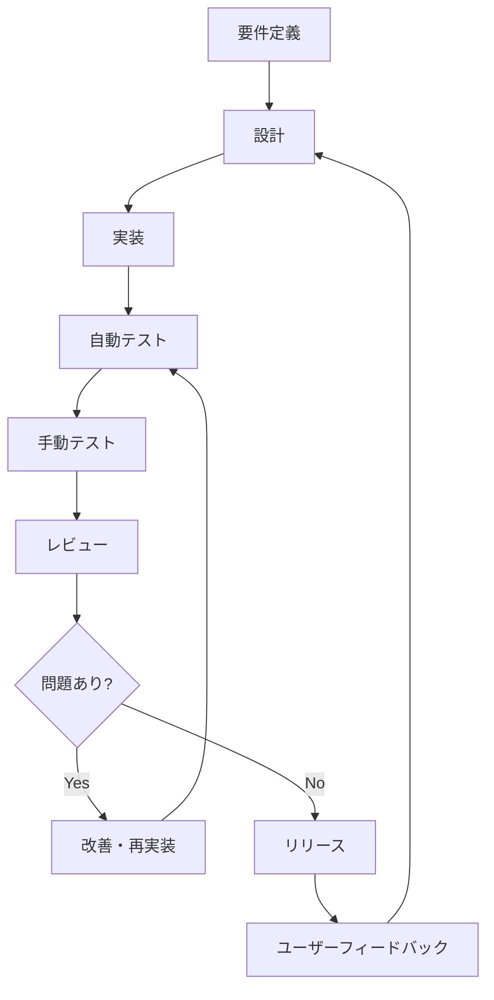
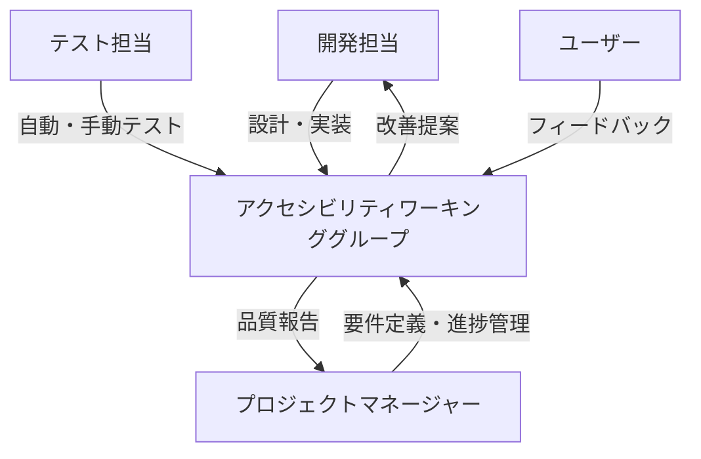
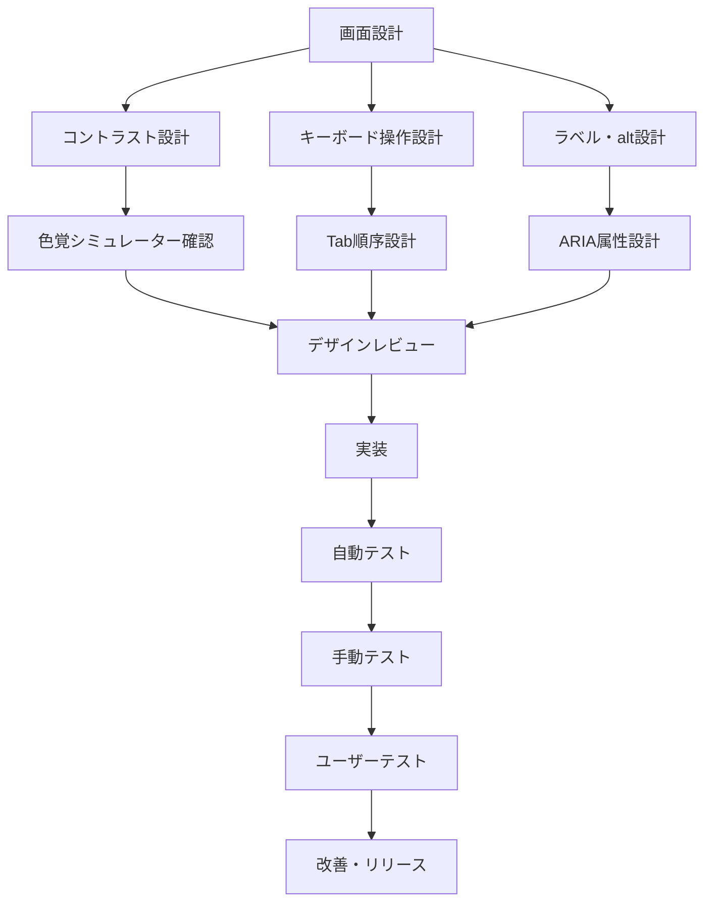

# アクセシビリティガイドライン

---

## 概要

本ドキュメントは、KisoFrameworkにおけるアクセシビリティ（A11y）対応の基本方針、設計・実装・テストの具体的なポイント、チェックリスト、運用プロセスをまとめたものである。  
すべてのユーザーが公平にシステムを利用できるよう、開発・運用の各工程でアクセシビリティを確保することを目的とする。

---

## 基本方針

- JIS X 8341-3（WCAG 2.1）等の国際標準に準拠したアクセシビリティ対応を推進する
- 設計・実装・テストの各工程でアクセシビリティ要件を明確化し、品質担保を徹底する
- アクセシビリティ改善サイクル（設計→実装→テスト→レビュー→改善）を継続的に回す
- ユーザーからのフィードバックを積極的に取り入れ、運用・改善に反映する

---

## アクセシビリティ対応プロセス

---

## 設計・実装の具体的ポイント

### 1. 色覚・視認性

- 文字色と背景色のコントラスト比は**4.5:1以上**を必須とする（重要UIは7:1以上を推奨する）
- 色だけで情報を伝えない（例：エラーは「赤色＋エラーアイコン＋エラーメッセージ」とする）
- 配色設計時は**Color Oracle**等の色覚シミュレーターで確認する
- 例:  
  - ボタンのラベルは「OK」だけでなく「保存する」など具体的にする
  - グラフやチャートは色分け＋パターンや凡例を併用する

### 2. キーボード操作

- すべての操作・遷移が**Tabキーのみで完結**することを必須とする
- フォーカス順序は論理構造・視覚順序と一致させる
- ショートカットキーやスキップリンク（例：`<a href="#main">本文へスキップ</a>`）を設置する
- 例:  
  - モーダル表示時はEscキーで閉じられるようにする
  - ドロップダウンは上下キーで選択可能とする

### 3. 画像・アイコン

- すべての画像・アイコンに**alt属性**またはaria-labelを付与する
- 装飾目的の画像はalt=""（空文字）を指定し、スクリーンリーダーで読み上げさせない
- 例:  
  - ``
  - ``

### 4. 見出し・ランドマーク

- h1～h6の**見出し階層を正しく設計**する
- `<nav>`, `<main>`, `<aside>`, `<footer>`等のランドマーク要素を活用する
- 例:  
  - ページごとにh1は1つだけとする
  - サイドバーは`<nav>`で囲む

### 5. フォーム・入力

- `<label>`タグでフォーム要素とラベルを明確に紐付ける（`for`属性を利用する）
- 入力必須項目は`required`属性＋「必須」表記とする
- エラー時は**エラーメッセージをテキストで表示**し、aria-liveで通知する
- 例:  
  - `<label for="email">メールアドレス*</label>`
  - `<input id="email" type="email" required aria-describedby="email-desc">`
  - `
メールアドレスを入力してください
`

### 6. 動的コンテンツ・ARIA

- モーダル・ダイアログは`role="dialog"`や`aria-modal="true"`を付与する
- 状態変化（例：開閉、エラー発生）は`aria-live`や`aria-expanded`等で通知する
- フォーカス制御（モーダル表示時はモーダル内にフォーカスを閉じ込める）
- 例:  
  - `
...
`
  - `<button aria-expanded="false" aria-controls="menu">メニュー</button>`

### 7. フォーカス管理

- フォーカス時は**視覚的な強調**（アウトラインや背景色）を必ず表示する
- マウス操作時もフォーカスが失われないよう配慮する
- 例:  
  - `:focus { outline: 2px solid #1976d2; }`

### 8. スクリーンリーダー対応

- NVDA, VoiceOver等で**読み上げ順・内容**を確認する
- aria-label, aria-describedby等で補足説明を付与する
- 例:  
  - `<button aria-label="設定を保存">保存</button>`
  - `*`

---

## テスト・レビューの具体的ポイント

### 自動テスト

- axe-core, Lighthouse, Storybook A11yアドオン等で**自動チェック**を行う
- CI/CDパイプラインにアクセシビリティテストを組み込む
- 例:  
  - GitHub Actionsでaxe-coreを実行し、PRごとにレポートを出力する

### 手動テスト

- キーボードのみで全機能を操作し、フォーカス遷移・操作性を確認する
- スクリーンリーダー（NVDA, VoiceOver等）で読み上げ内容・順序を確認する
- 色覚シミュレーターで配色の見え方を確認する
- 実際のユーザーによるユーザビリティテストも推奨する
- 例:  
  - 「Tab」キーだけでフォーム送信まで到達できるか確認する
  - エラー発生時にスクリーンリーダーがエラーメッセージを読み上げるか確認する

### レビュー

- アクセシビリティ観点の**コードレビュー**（alt属性、ラベル、ARIA属性等の有無）を実施する
- チェックリストによる抜け漏れ確認を行う

---

## チェックリスト例

| 項目 | 内容 | チェック |
|------|------|---------|
| コントラスト比 | 文字・背景のコントラスト比が4.5:1以上である | □ |
| 色以外の情報伝達 | 色だけでなくアイコンやテキストで状態を伝えている | □ |
| キーボード操作 | すべての操作がTabキー等で可能である | □ |
| フォーカス表示 | フォーカス時に視覚的な強調がある | □ |
| 画像の代替テキスト | 画像・アイコンにalt属性またはaria-labelがある | □ |
| ラベル付与 | フォーム要素にlabelタグがある | □ |
| エラーメッセージ | 入力エラー時に説明がテキストで表示される | □ |
| ARIA属性 | 必要な箇所に適切なARIA属性が付与されている | □ |
| ランドマーク | nav, main, aside等のランドマーク要素を利用している | □ |
| スクリーンリーダー | 音声読み上げで正しく内容が伝わる | □ |

---

## 参考資料・ツール

- [JIS X 8341-3:2016（日本産業規格）](https://www.jisc.go.jp/)
- [WCAG 2.1（W3C Web Content Accessibility Guidelines）](https://www.w3.org/TR/WCAG21/)
- [axe-core](https://www.deque.com/axe/)
- [Google Lighthouse](https://developers.google.com/web/tools/lighthouse)
- [Storybook A11yアドオン](https://storybook.js.org/addons/@storybook/addon-a11y)
- [Color Oracle（色覚シミュレーター）](https://colororacle.org/)
- [NVDA（無料スクリーンリーダー）](https://www.nvaccess.org/)
- [VoiceOver（macOS/iOS標準スクリーンリーダー）](https://www.apple.com/jp/accessibility/)

---

## 付録：アクセシビリティ対応体制イメージ

---

## 付録：アクセシビリティ設計の具体例

---
