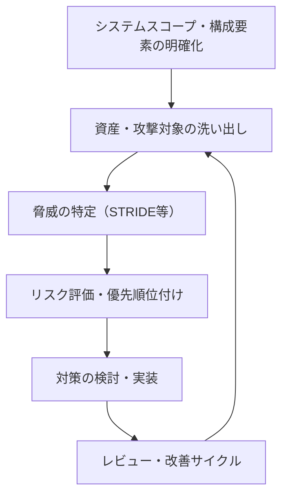
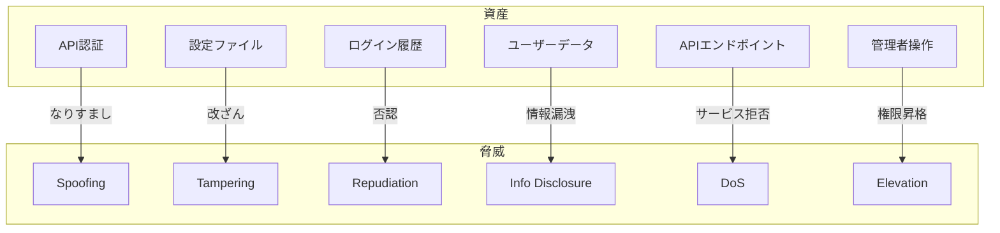
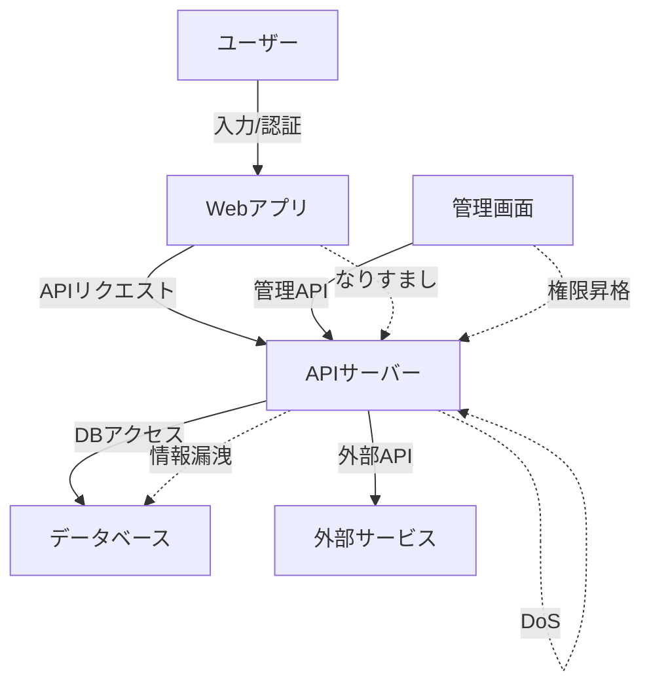

# セキュリティ標準・脅威モデリング

---

## 概要

本ドキュメントは、KisoFrameworkにおけるセキュリティ設計・実装・運用の標準方針と、脅威モデリングの基本プロセス・具体例をまとめたものである。  
全ての開発・運用工程でセキュリティを確保し、脅威に強いシステムを実現することを目的とする。

---

## セキュリティ設計の基本方針

- **セキュリティ・バイ・デザイン**  
  設計段階からセキュリティ要件を明確化し、仕様・設計書に必ず記載すること。
- **ゼロトラストモデルの採用**  
  全通信・全アクセスを信頼せず、認証・認可・検証を徹底すること。
- **最小権限原則**  
  システム・ユーザー・サービスアカウントに必要最小限の権限のみを付与すること。
- **セキュリティ標準・ベストプラクティスの遵守**  
  OWASP Top 10、NIST SP800シリーズ等の国際標準を参照し、設計・実装に反映すること。
- **セキュリティレビュー・脆弱性診断の定期実施**  
  設計・実装・リリース前に必ずレビュー・診断を実施し、記録を残すこと。
- **インシデント対応・監査ログの整備**  
  重大インシデント発生時の対応フロー、監査ログの記録・保管・分析体制を整備すること。

---

## セキュリティ標準・ガイドライン

### 認証・認可

- **認証方式**  
  - OAuth2.0, OpenID Connect, SSO, パスワードレス認証（FIDO2, Passkey等）を標準化する。
  - 多要素認証（MFA）の導入を推奨する。
- **認可方式**  
  - RBAC（ロールベースアクセス制御）を徹底する。
  - API認証・認可はAPIゲートウェイ等で一元管理する。
- **セッション管理**  
  - セッションIDは推測困難なランダム値を使用し、HTTPSのみで送信すること。
  - セッションタイムアウト・自動失効を設定すること。

### 通信・データ保護

- **通信の暗号化**  
  - 全通信をTLS1.2以上で暗号化する（HTTP Strict Transport Security有効化）。
- **データ暗号化**  
  - 機密データは保存時・転送時ともにAES256等で暗号化する。
  - シークレット情報はVault, Key Vault等で安全に管理する。
- **証明書管理**  
  - 証明書の自動更新（Let's Encrypt等）、失効・更新手順を整備する。

### 脆弱性対策

- **静的解析（SAST）・動的解析（DAST）**  
  - CI/CDパイプラインで自動実行し、検出結果を記録・対応する。
- **依存ライブラリの脆弱性スキャン**  
  - SBOM（Software Bill of Materials）を自動生成・監査する。
- **セキュリティパッチ管理**  
  - OS/ミドルウェア/ライブラリのパッチ適用を定期化し、適用記録を残す。

### ログ・監査

- **監査ログ**  
  - 重要操作（認証、設定変更、権限変更等）は必ず監査ログに記録する。
  - ログは改ざん防止（WORMストレージ等）・長期保管（3年以上推奨）とする。
- **分散トレーシング**  
  - OpenTelemetry等でリクエスト経路・操作履歴を可視化する。

### インフラ・運用

- **クラウドセキュリティ**  
  - IAM最小権限、ネットワーク分離（VPC, NSG等）、WAF・CSPM導入を徹底する。
- **IaCによるセキュリティ設定**  
  - Terraform, Ansible等でセキュリティ設定をコード化し、レビュー・監査を実施する。
- **バックアップ・災害復旧（DR）**  
  - バックアップデータの暗号化・多重保管、DRサイトへの定期転送を行う。

---

## 脅威モデリングのプロセス

1. **システムのスコープ・構成要素の明確化**  
   データフロー図（DFD）、構成図を作成し、外部・内部の境界を明確化する。  
   例：ユーザー、APIサーバー、DB、外部サービス、管理画面など

2. **資産・攻撃対象の洗い出し**  
   守るべき資産（機密データ、認証情報、API、管理画面等）をリストアップする。  
   例：個人情報、認証トークン、設定ファイル、監査ログ

3. **脅威の特定（STRIDE等のフレームワーク活用）**  
   - S: Spoofing（なりすまし）
   - T: Tampering（改ざん）
   - R: Repudiation（否認）
   - I: Information Disclosure（情報漏洩）
   - D: Denial of Service（サービス拒否）
   - E: Elevation of Privilege（権限昇格）

4. **リスク評価・優先順位付け**  
   影響度（High/Medium/Low）・発生可能性（High/Medium/Low）でリスクマトリクスを作成する。  
   例：High×Highは最優先で対策する。

5. **対策の検討・実装**  
   技術的対策（認証強化、暗号化、WAF等）、運用的対策（監査、教育等）を明確化する。

6. **レビュー・改善サイクル**  
   定期的な脅威モデリング見直し（年1回以上、重大変更時は都度）を実施する。

---

## 脅威モデリング例（STRIDE）

| 資産/機能         | 脅威カテゴリ | 想定される脅威例                | 主な対策例                     |
|------------------|--------------|----------------------------------|-------------------------------|
| API認証          | Spoofing     | 不正な認証トークン利用           | JWT署名検証、IP制限、MFA      |
| 設定ファイル      | Tampering    | 設定値の改ざん                   | ファイル権限、改ざん検知、監査ログ |
| ログイン履歴      | Repudiation  | 操作否認（証拠隠滅）             | 監査ログの不可逆記録、WORMストレージ |
| ユーザーデータ    | Info Disclosure | データ漏洩・不正アクセス      | データ暗号化、アクセス制御、監査 |
| APIエンドポイント | DoS          | リクエスト過多によるサービス停止 | レートリミット、WAF、Auto Scaling |
| 管理者操作        | Elevation    | 権限昇格・不正操作               | RBAC、MFA、操作ログ監査       |

---

## 脅威モデリング具体例（DFD＋STRIDE）

---

## セキュリティレビュー・運用プロセス

- **設計・実装段階でのセキュリティレビュー**  
  設計書・コードに対し、脅威モデリング観点でレビューを実施する。  
  チェックリスト例：認証・認可、暗号化、エラーハンドリング、ログ出力、外部連携等
- **脆弱性診断・ペネトレーションテストの定期実施**  
  リリース前・定期（年1回以上）で診断を実施し、報告書を残す。
- **インシデント対応フロー・連絡体制の整備**  
  インシデント発生時の初動対応、エスカレーション、報告・復旧・再発防止策を明確化する。
- **セキュリティ教育・啓発活動の実施**  
  年次教育、eラーニング、模擬攻撃訓練（フィッシング等）を実施する。
- **セキュリティインシデントの記録・振り返り・改善**  
  インシデント記録台帳、ポストモーテム、改善策の実施・再発防止を行う。

---

## セキュリティチェックリスト例

| 項目 | 内容 | チェック |
|------|------|---------|
| 認証・認可 | 強固な認証・RBAC・MFA導入 | □ |
| 通信暗号化 | 全通信のTLS化・証明書管理 | □ |
| データ暗号化 | 機密データの保存・転送時暗号化 | □ |
| セッション管理 | セッションIDの安全性・タイムアウト | □ |
| 脆弱性対策 | SAST/DAST・SBOM・パッチ管理 | □ |
| ログ・監査 | 重要操作の監査ログ・改ざん防止 | □ |
| インシデント対応 | 対応フロー・連絡体制・記録 | □ |
| 教育・訓練 | 年次教育・模擬訓練の実施 | □ |

---

## 参考資料・ツール

- [OWASP Top 10](https://owasp.org/www-project-top-ten/)
- [NIST SP800シリーズ](https://csrc.nist.gov/publications/sp800)
- [Microsoft Threat Modeling Tool](https://www.microsoft.com/en-us/securityengineering/sdl/threatmodeling)
- [Trivy（脆弱性スキャン）](https://aquasecurity.github.io/trivy/)
- [OpenSCAP（セキュリティ自動化）](https://www.open-scap.org/)
- [OpenTelemetry（監査・トレーシング）](https://opentelemetry.io/)
- [OWASP Threat Dragon（脅威モデリング図作成）](https://owasp.org/www-project-threat-dragon/)

---
