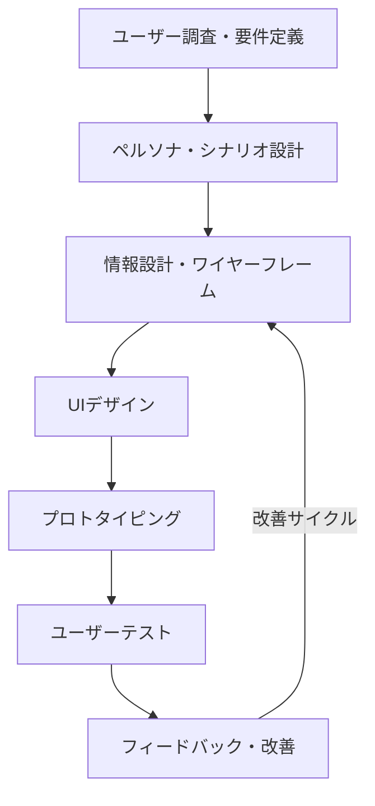
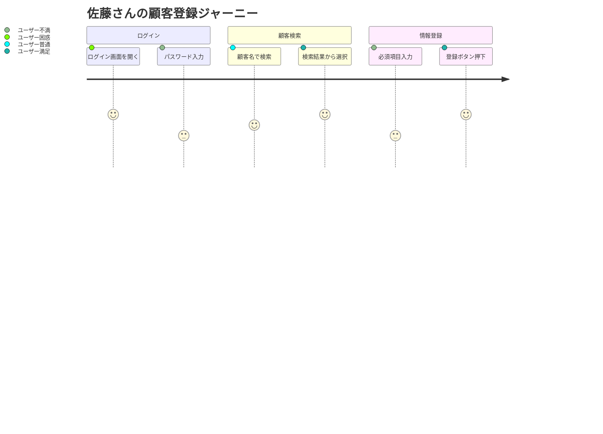
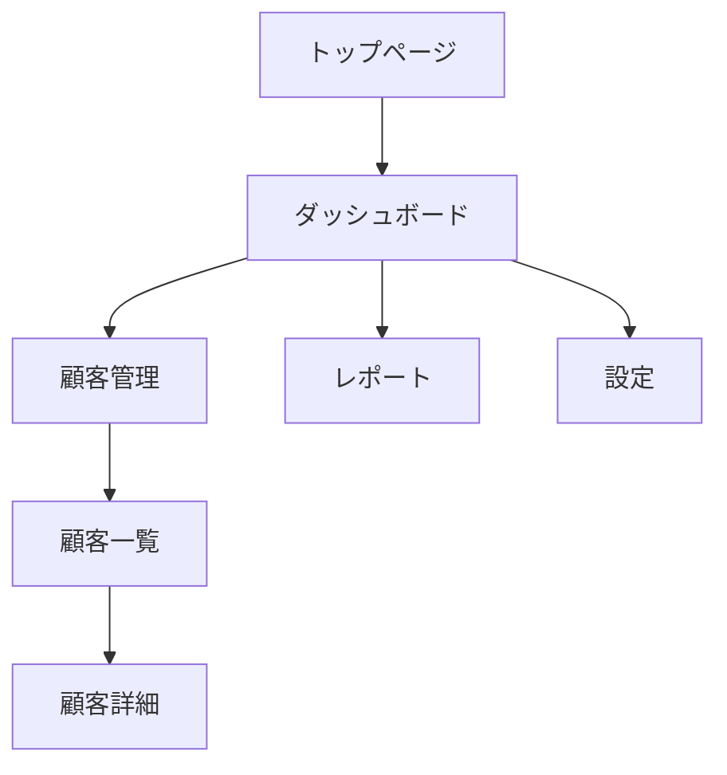
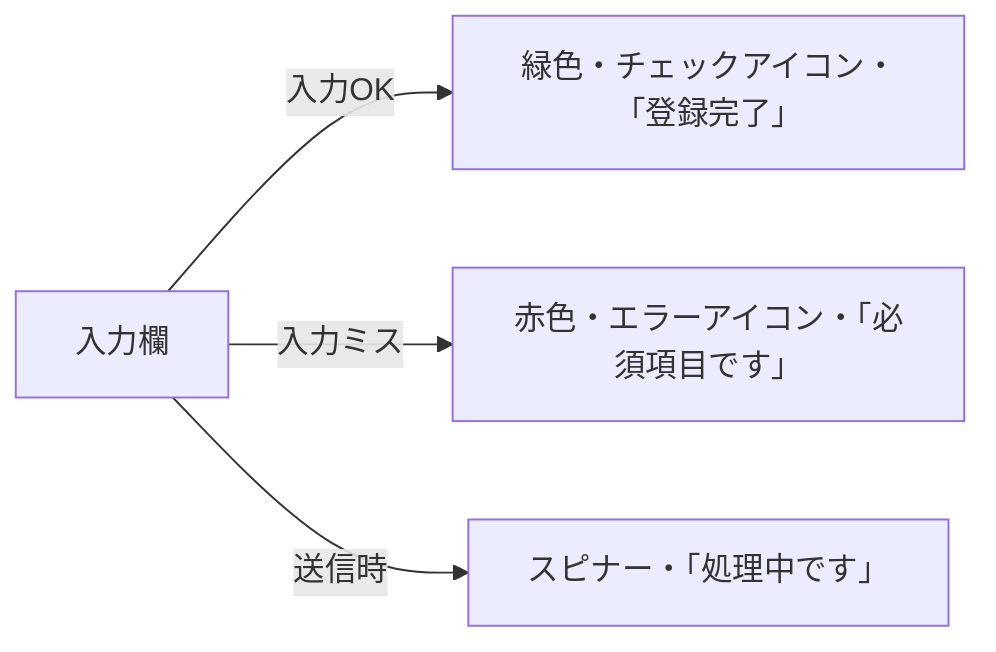
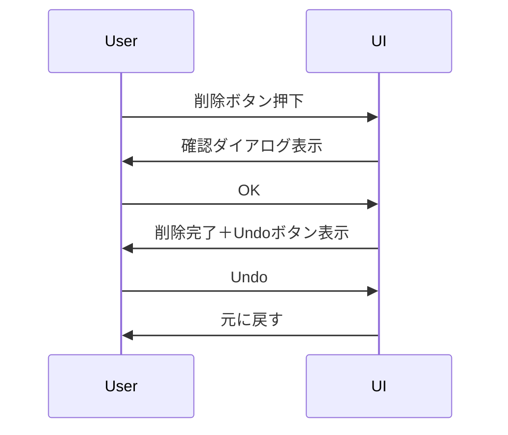
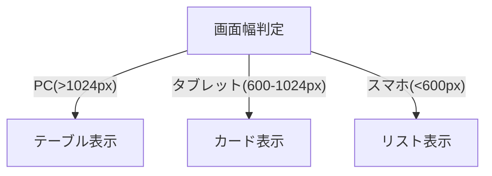
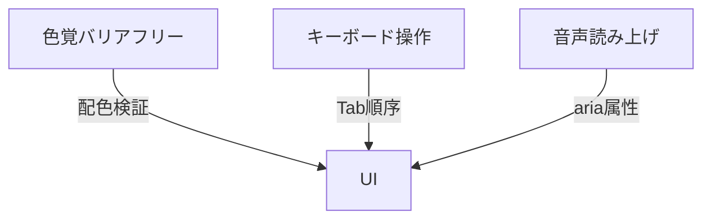
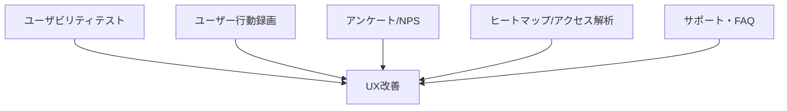
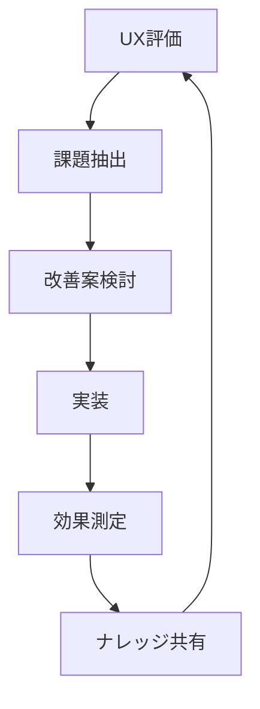

# ユーザー体験（UX）ガイドライン

---

## 概要

本ドキュメントは、KisoFrameworkにおけるユーザー体験（UX）設計・実装・評価の標準方針、具体的な設計ポイント、チェックリスト、運用・改善サイクルをまとめたものである。  
すべてのユーザーが快適かつ効率的にシステムを利用できるよう、開発・運用の各工程でUX品質を担保することを目的とする。

---

## 基本方針

- ユーザー中心設計（UCD）を徹底し、ユーザーの課題・目的・利用シナリオを起点に設計する。
- シンプルで直感的な操作性、分かりやすい情報設計、ストレスのない体験を重視する。
- アクセシビリティ・多様性・一貫性を考慮し、誰もが使いやすいUI/UXを目指す。
- 定量・定性の両面からUXを評価し、継続的な改善サイクルを回す。

---

## UX設計プロセス

---

## 具体的な設計ポイント・具体例

### 1. ペルソナ・シナリオ設計

- 代表的なユーザー像（ペルソナ）を定義し、利用シナリオ・課題・ゴールを明確化する。
- ユーザーストーリーやカスタマージャーニーマップを活用する。

#### 具体例

| ペルソナ名 | 属性 | 主な利用目的 | 主な課題 |
|------------|------|--------------|----------|
| 佐藤さん    | 40代・営業 | 顧客情報の検索・登録 | 操作が煩雑、外出先での利用 |
| 鈴木さん    | 20代・事務 | データ入力・集計 | 入力ミスが多い、説明不足 |

#### さらに具体的な実践例

- ペルソナごとに「1日の業務フロー」や「利用頻度の高い機能」を洗い出す。
- シナリオ例：「営業担当が外出先からスマホで顧客情報を検索し、5分以内に登録作業を完了する」。
- カスタマージャーニーマップを作成し、各タッチポイントでの感情・課題を可視化する。

---

### 2. 情報設計・ナビゲーション

- 情報の階層・構造を整理し、ユーザーが迷わず目的に到達できる導線を設計する。
- 一貫したナビゲーション、分かりやすいラベル・アイコンを使用する。

#### 具体例

- サイドメニュー：ダッシュボード／顧客管理／レポート／設定
- パンくずリスト：ホーム > 顧客管理 > 顧客詳細
- アイコン例：検索（虫眼鏡）、編集（鉛筆）、削除（ゴミ箱）

#### さらに具体的な実践例

- サイトマップや画面遷移図を作成し、全体の情報構造を可視化する。
- 主要導線は3クリック以内で到達できるよう設計する。
- ナビゲーションのラベルはユーザーの業務用語に合わせる。
- パンくずリストや「戻る」ボタンで迷子防止を図る。

---

### 3. UIデザイン

- 一貫性のあるデザインシステム・コンポーネントを活用する。
- 余白・配色・タイポグラフィ・アイコン等の視認性・可読性を重視する。
- 状態変化（エラー・成功・処理中等）は明確にフィードバックする。

#### 具体例

- ボタン：プライマリ（青）、セカンダリ（グレー）、無効（薄グレー）
- 入力欄：未入力時はグレー枠、エラー時は赤枠＋エラーメッセージ
- ローディング：スピナー＋「処理中です」表示

#### さらに具体的な実践例

- ボタンは「保存」「キャンセル」など動詞＋目的語で明確にする。
- 入力欄のプレースホルダーは例示のみ、説明はラベルで明示する。
- エラー時は「赤色＋エラーアイコン＋具体的なメッセージ（例：メールアドレス形式が正しくありません）」を表示する。
- 成功時は「緑色＋チェックアイコン＋完了メッセージ」を表示する。

---

### 4. 操作性・レスポンス

- 操作フローは最小限・直感的にし、不要な手順や入力を排除する。
- レスポンスは高速にし、待機時はローディング表示や進捗を明示する。
- Undo/Redoや確認ダイアログ等、誤操作防止策を設ける。

#### 具体例

- 1クリックで保存、2クリックで削除（確認ダイアログあり）
- 入力内容を自動保存（オートセーブ）
- 操作ミス時の「元に戻す」ボタン

#### さらに具体的な実践例

- 保存ボタンは画面右下に固定し、常にアクセス可能にする。
- 削除操作は「本当に削除しますか？」の確認ダイアログ＋元に戻す（Undo）機能を設ける。
- 入力内容は一定間隔で自動保存（例：30秒ごと）する。
- ローディング時は進捗バーや残り時間目安も表示する。

---

### 5. モバイル・多デバイス対応

- レスポンシブデザインを採用し、PC・タブレット・スマートフォン等で最適な体験を提供する。
- タッチ操作・画面サイズごとのUI最適化を行う。

#### 具体例

- ハンバーガーメニューによるナビゲーション
- タッチ領域は48px以上
- モバイル時はリスト表示、PC時はテーブル表示

#### さらに具体的な実践例

- モバイル時はメニューをハンバーガーアイコンに集約し、ワンタップで展開する。
- テーブルは横スクロールまたはカード型リストに自動変換する。
- 画面幅に応じてフォントサイズ・ボタンサイズを自動調整する。
- タッチ操作時はボタンの押下アニメーションを追加する。

---

### 6. アクセシビリティ・多様性配慮

- 色覚・視覚・聴覚等、多様なユーザーに配慮した設計とする。
- アクセシビリティガイドライン（JIS X 8341-3, WCAG 2.1等）を遵守する。

#### 具体例

- コントラスト比4.5:1以上、色だけでなくアイコンやテキストで状態を伝える。
- すべての画像・アイコンにalt属性、aria-labelを付与する。
- キーボード操作（Tab移動、ショートカットキー）、スクリーンリーダー対応を行う。

#### さらに具体的な実践例

- 色覚シミュレーターで配色を検証し、赤緑色覚でも識別可能な配色を採用する。
- すべての操作はキーボード（Tab/Enter/Esc）で完結できるようにする。
- モーダル表示時は背景を非アクティブ化し、フォーカスをモーダル内に限定する。
- aria-liveで動的なエラーメッセージや完了通知を即時読み上げる。

---

## UX評価・テスト

- ユーザビリティテスト（実ユーザーによる操作観察・インタビュー）を実施する。
  - 例：5名のユーザーに実際の操作を依頼し、課題点を記録する。
- アンケート・NPS（ネットプロモータースコア）等による定量評価を行う。
  - 例：「このシステムを他者に勧めたいか」10段階評価を実施する。
- アクセス解析・ヒートマップ等による行動データ分析を行う。
  - 例：Google Analyticsで離脱率・滞在時間を計測する。
- フィードバック収集（サポート窓口・FAQ・ユーザー会等）を実施する。
  - 例：FAQページの閲覧数、問い合わせ件数の集計を行う。

#### さらに具体的な実践例

- ユーザビリティテストは「5秒ルール」（5秒で目的の操作ができるか）で評価する。
- ユーザー行動を録画し、どこで迷ったか・離脱したかを分析する。
- アンケートは「操作の分かりやすさ」「見やすさ」「ストレス度」など5段階評価で実施する。
- ヒートマップでクリック集中箇所・未使用機能を可視化し、UI改善に活用する。

---

## チェックリスト例

| 項目 | 内容 | チェック |
|------|------|---------|
| ペルソナ設計 | 代表的なユーザー像・利用シナリオが明確か | □ |
| 情報設計 | 情報構造・ナビゲーションが分かりやすいか | □ |
| UI一貫性 | デザイン・操作性が一貫しているか | □ |
| 操作性 | 主要操作が直感的・シンプルか | □ |
| レスポンス | 操作後のレスポンス・フィードバックが明確か | □ |
| エラー対応 | エラー時の説明・復帰方法が分かりやすいか | □ |
| モバイル対応 | 各デバイスで最適な表示・操作ができるか | □ |
| アクセシビリティ | 多様なユーザーに配慮されているか | □ |
| フィードバック | ユーザーの声を収集・改善に反映しているか | □ |

---

## 継続的改善サイクル

- 定期的なユーザビリティテスト・アンケートを実施する。
- アクセス解析・行動データのモニタリングを行う。
- フィードバック受付・改善提案のトラッキングを行う。
- 改善案の優先順位付け・実装・効果測定を実施する。

#### さらに具体的な実践例

- 月1回のUXレビュー会を開催し、ユーザーの声やデータをもとに改善案を議論する。
- 改善案はJiraやGitHub Issuesで管理し、優先度・担当者・期限を明確化する。
- 改善後はA/Bテストやユーザビリティテストで効果を検証し、結果をナレッジベースに記録する。

---

## 参考資料・ツール

- [Nielsen Norman Group UXガイドライン](https://www.nngroup.com/)
- [Google Material Design](https://m3.material.io/)
- [WCAG 2.1（アクセシビリティ）](https://www.w3.org/TR/WCAG21/)
- [Figma（UIデザイン・プロトタイピング）](https://www.figma.com/)
- [UserTesting.com（ユーザビリティテスト）](https://www.usertesting.com/)
- [Google Analytics（アクセス解析）](https://analytics.google.com/)
- [Hotjar（ヒートマップ）](https://www.hotjar.com/)

---
