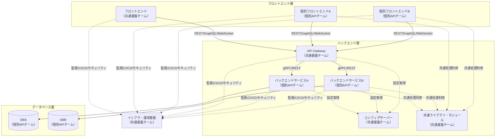

# アーキテクチャ設計図

## 概要

## ベースのアーキテクチャ

マイクロサービスアーキテクチャ  
バーティカルスライスアーキテクチャ  
※バーティカルスライスアーキテクチャとは、機能単位でフロントエンドからバックエンド、DBまでを一貫して設計・実装するアプローチです。これにより、変更の影響範囲を限定しやすく、チームごとの独立性を高めます。

### アーキテクチャ全体図（マーメイド）

## 方針

- 単一責任原則（Single Responsibility Principle）を徹底
- 各モジュールは疎結合・高凝集を目指す

## 想定チーム構成

- **共通基盤チーム**  
  - フロントエンド共通基盤
  - API Gateway
  - インフラ・運用基盤（CI/CD、監視、セキュリティ、IaC等）
  - **コンフィグサーバー（全サービス共通の設定管理）**
  - **共通ライブラリ・共通モジュールの設計・提供（個別API間のコード重複排除）**
- **個別APIチーム**  
  - バックエンドサービス（各業務API）
  - 各サービスのDB設計・運用
  - 個別フロントエンド（業務ごとのUI/UXを持つフロントエンド）

---

## 技術スタック

### 1. フロントエンド技術（共通基盤チーム担当）

- フレームワーク: React (TypeScript, 推奨: v18以降)
- 状態管理: Redux（Redux Toolkit推奨）
- UIコンポーネント: MUI (Material-UI)推奨
- UIドキュメント: Storybook等のUIドキュメントツール推奨
- 型安全性: TypeScriptによる型安全な実装
- テスト: Jest, React Testing Library等による単体・結合テスト
- テストカバレッジ計測: coverageレポートの自動生成
- パフォーマンス計測: Lighthouse等によるパフォーマンス監視
- アクセシビリティ: a11y対応（eslint-plugin-jsx-a11y等の導入推奨）
- 静的解析: ESLint, Prettier等
- セキュリティ: XSS/CSRF対策、依存パッケージの脆弱性チェック

---

### 1-2. フロントエンド技術（個別APIチーム担当）

- フレームワーク: React, Vue, Angular等（プロジェクト要件に応じて選定）
- 状態管理: Redux, Pinia, NgRx等（フレームワークに応じて選定）
- UIコンポーネント: MUI, Vuetify, Angular Material等
- 型安全性: TypeScript推奨
- テスト: Jest, React Testing Library, Vue Test Utils等
- 静的解析: ESLint, Prettier等
- セキュリティ: XSS/CSRF対策、依存パッケージの脆弱性チェック

---

### 2. バックエンド技術（個別APIチーム担当）

- 言語: Rust (推奨: stable最新版)
- Webフレームワーク: Actix-web または Axum
- API設計: OpenAPI準拠, gRPC対応, バージョニング方針明確化
- APIドキュメント: 自動生成（ex. paperclip, utoipa等）
- スキーマバリデーション: OpenAPI/JSON Schemaベース
- ORM: 型安全ORM（例: sea-orm, diesel等）
- テスト: cargo test, mockall等
- 静的解析: clippy, cargo-audit等
- CI/CDパイプライン: 自動ビルド・テスト・デプロイ
- API認証・認可: OAuth2, JWT等
- パフォーマンス計測: Prometheus, OpenTelemetry等
- 監査ログ: 重要操作の監査証跡記録
- セキュリティ: 入力値検証、SQLインジェクション対策、依存ライブラリの脆弱性管理

---

### 3. データベース技術（個別APIチーム担当）

- RDBMS: PostgreSQL (推奨: v14以降)
- NoSQL: MongoDB
- マイグレーション: sqlx
- インデックス設計・パフォーマンスチューニング
- バックアップ・リストア戦略
- スキーマ管理: バージョン管理徹底
- 監査ログ: 監査証跡の記録
- 暗号化: データ暗号化（静止・転送時）
- パフォーマンス監視: slow query log等

---

### 4. インフラ・運用技術（共通基盤チーム担当）

- コンテナ: Docker（Docker Compose, Kubernetes対応を推奨）
- IaC: Terraform
- CI/CD: GitHub Actions等（テスト自動化, セキュリティスキャン推奨）
- セキュリティ: 脆弱性スキャン, シークレット管理（ex. HashiCorp Vault等）
- セキュリティグループ: ネットワークアクセス制御
- WAF: Web Application Firewallの導入
- トレーシング: OpenTelemetry対応（共通基盤チームが設計・実装）
- ロギング: 構造化ログ(JSON形式), 分散トレーシング連携（共通基盤チームが設計・実装）
- 監視: 共通基盤チームが設計、実装（OSSは使用しない。理由: セキュリティ要件・独自要件への対応のため）
- オブザーバビリティ: メトリクス収集・可視化
- 自動スケーリング: Kubernetes等によるオートスケール
- **コンフィグサーバー: 全サービス共通の設定管理（例: Spring Cloud Config, Consul, etcd等）**
- **共通ライブラリ・共通モジュール: 個別API間で再利用可能なRustクレートやnpmパッケージ等を設計・提供し、コード重複を排除**

---

## 共通基盤チームによる個別APIのコード重複対策

- 共通処理（認証・認可、バリデーション、エラーハンドリング、ロギング、APIレスポンス整形など）を**共通ライブラリ**としてRustクレートやnpmパッケージ等で提供
- API設計・実装のベースとなる**テンプレート/スキャフォールド**を用意し、プロジェクト開始時に活用
- ドキュメント・サンプルコードを整備し、個別APIチームが容易に共通部品を利用できるよう支援
- 共通基盤チームが共通部品の保守・アップデートを担当し、個別APIチームは差分実装に集中できる体制を構築

---

### 5. 個別API（個別APIチーム担当）

- フロントエンド、バックエンド、データベースの指定なし  
（プロジェクト要件に応じて選定）

---

## API・通信方式

### フロントエンド ⇔ バックエンド（共通基盤チーム・個別APIチーム連携）

- REST API
- GraphQL
- WebSocket
- 認証・認可: OAuth2対応
- API Gateway: 認証・認可、レートリミット、監査ログ等の統合管理
- レートリミット: API利用制限

### バックエンド ⇔ バックエンド（個別APIチーム間連携）

- gRPC
- WebSocket
- サービスディスカバリ: Consul等
- セキュア通信: mTLS等
