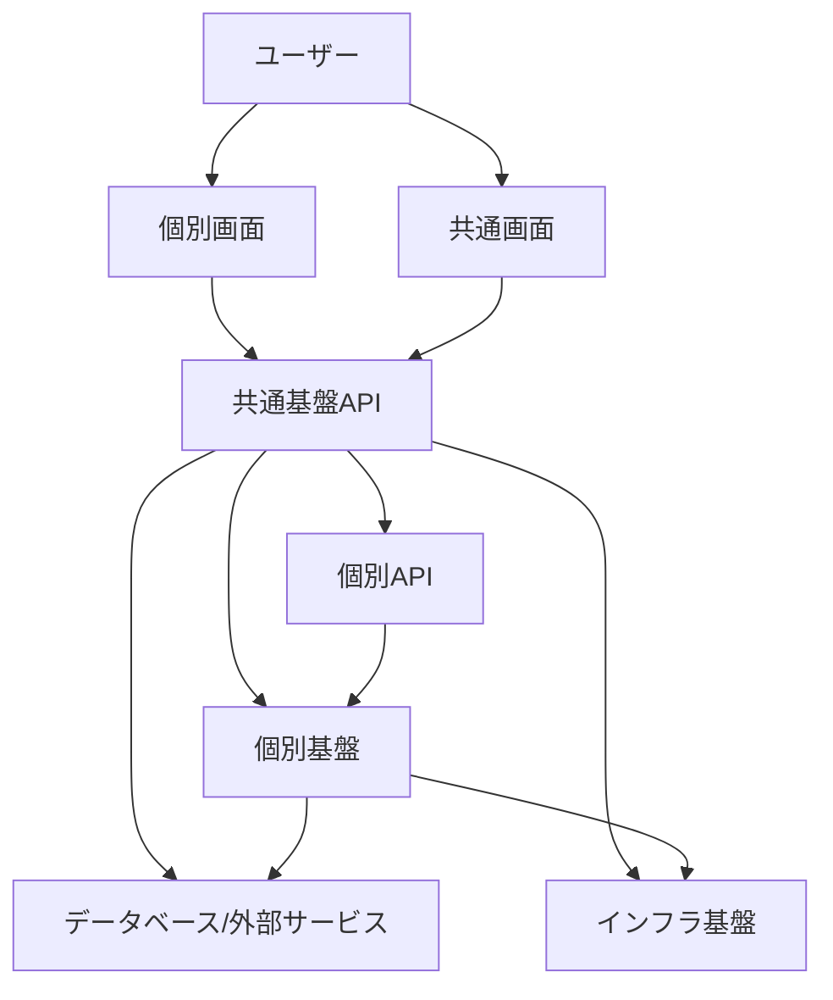
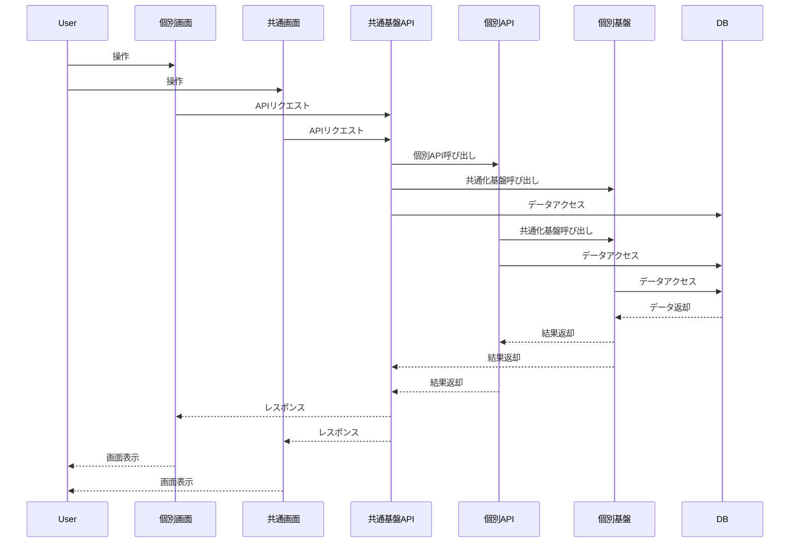

# アーキテクチャ

---

## 概要

本ドキュメントは、KisoFrameworkのシステムアーキテクチャ全体像、設計方針、構成要素、技術スタック、拡張性・保守性・セキュリティ等の観点を整理し、今後の開発・運用の指針とする。

---

## 目的

- システム全体の構造・設計思想を明確化し、関係者間の共通認識を形成する。
- 拡張性・保守性・セキュリティ・標準化を担保し、長期的な運用・進化を可能とする。
- チーム間の連携や開発効率向上、品質確保を実現する。

---

## 基本方針

- オープンかつ拡張性の高いアーキテクチャを採用し、将来の技術変化に柔軟に対応。
- モジュール化・コンポーネント化を徹底し、必要な機能を柔軟に組み合わせ可能とする。
- APIファースト設計により、システム間連携や外部拡張を容易にする。
- クラウドネイティブ技術（コンテナ、マイクロサービス、CI/CD等）を積極的に導入。
- セキュリティ・品質・パフォーマンスを重視し、企業システムとしての信頼性を確保。

---

## 全体構成図

---

## システム構成要素

- **共通基盤**  
  コア機能、認証認可、ロギング、設定管理、APIゲートウェイ等の共通サービスを提供。

- **共通画面**  
  システム全体で利用する設定画面、管理画面等。

- **個別API**  
  各業務システム向けのAPI群。業務要件に応じたビジネスロジックを実装。

- **個別画面**  
  業務要件に応じた個別UI。ユーザー操作を受け付け、APIと連携。

- **個別基盤**  
  業務領域特有のビジネスルールを共通化し、再利用可能な基盤を設計・開発・運用。

- **インフラ基盤**  
  クラウド環境（例：AWS, Azure, GCP）、コンテナオーケストレーション（Kubernetes等）、CI/CDパイプライン。

- **データベース/外部サービス**  
  RDBMS、NoSQL、外部API、認証基盤等。

---

## 技術スタック

### 共通基盤チーム

- **バックエンド**
  - Rust
  - Go
  - Python
- **API設計**
  - REST
  - OpenAPI (Swagger)
  - gRPC
  - GraphQL
  - WebSocket
- **データベース**
  - PostgreSQL
  - MongoDB
- **インフラ・運用**
  - Docker
  - Kubernetes
  - AWS / Azure / GCP
  - GitHub Actions（CI/CD）
- **共通サービス**
  - 認証認可：OAuth2.0, OpenID Connect, Azure AD
  - ロギング/監視：Prometheus, Grafana, ELK Stack

### 共通画面チーム

- **フロントエンド**
  - React
  - TypeScript
  - Material-UI
- **テスト・品質管理**
  - Jest
  - Cypress
  - Playwright
  - Storybook
- **デザイン**
  - Figma
  - Adobe XD

### 個別APIチーム

- **バックエンド**
  - Node.js（Express, NestJS）
  - .NET Core
  - Java（Spring Boot）
- **API設計**
  - REST
  - GraphQL
  - OpenAPI (Swagger)
- **データベース**
  - PostgreSQL
  - MySQL
  - MongoDB
- **外部連携**
  - 各種外部API
  - Webhook

### 個別画面チーム

- **フロントエンド**
  - React
  - TypeScript
  - Next.js
  - Tailwind CSS
  - Material-UI
- **ネイティブアプリ**
  - Windowsアプリ：.NET（WPF, UWP, WinForms）
  - iOSアプリ：Swift, SwiftUI
- **テスト・品質管理**
  - Jest
  - Cypress
  - Playwright
- **デザイン**
  - Figma
  - Adobe XD

### 個別基盤チーム

- **バックエンド**
  - Node.js（Express, NestJS）
  - .NET Core
  - Java（Spring Boot）
- **API設計**
  - REST
  - GraphQL
  - OpenAPI (Swagger)
- **データベース**
  - PostgreSQL
  - MySQL
  - MongoDB
- **共通化基盤**
  - 業務ルール共通化モジュール
  - 再利用API
- **外部連携**
  - 各種外部API
  - Webhook

---

## モジュール構成

- **共通基盤モジュール**
  - 認証認可モジュール
  - 設定管理モジュール
  - ロギング・監視モジュール
  - APIゲートウェイ

- **共通画面モジュール**
  - 設定画面
  - 管理画面
  - 共通UI部品

- **個別APIモジュール**
  - 業務API（各業務ごとに分割）
  - 外部連携API

- **個別画面モジュール**
  - 業務画面（各業務ごとに分割）

- **個別基盤モジュール**
  - 業務領域特有のビジネスルール共通化基盤
  - 再利用API・サービス

---

## データフロー

1. ユーザーが個別画面または共通画面から操作
2. 個別画面が**必ず共通基盤APIを経由して**個別APIまたは共通APIを呼び出し
3. 共通APIは個別APIや個別基盤サービスを経由し、必要に応じてデータベースや外部サービスと連携
4. 個別APIや個別基盤も必要に応じてデータベースや外部サービスと連携
5. 結果を画面に返却

---

## セキュリティ設計

- **認証認可**  
  OAuth2.0, OpenID Connect等によるシングルサインオン、ロールベースアクセス制御

- **通信の暗号化**  
  全通信をTLS/SSLで暗号化

- **脆弱性対策**  
  静的解析・依存ライブラリの脆弱性スキャンをCI/CDに組み込み

- **監査ログ**  
  重要操作・アクセスログの記録と監査

- **インフラセキュリティ**  
  クラウドセキュリティベストプラクティス（IAM、ネットワーク分離等）を遵守

---

## 拡張性・保守性への配慮

- モジュール化・疎結合設計により、機能追加・変更の影響範囲を最小化
- APIファースト設計で外部連携や新規サービス追加が容易
- インフラはIaC（Infrastructure as Code）で管理し、環境構築・変更を自動化
- ドキュメント・標準化を徹底し、属人化を防止

---

## 標準化・ガイドライン

- コーディング規約・設計ガイドラインを整備し、全体で統一
- API設計はOpenAPI仕様に準拠
- UI/UXはデザインシステム・コンポーネントガイドラインを策定
- CI/CD・自動テスト・レビュー体制を標準化

---

## 今後の展望

- 新技術（例：AI、サーバーレス、マイクロフロントエンド等）の継続的な導入検討
- オープンソース化や社外コミュニティとの連携強化
- 利用状況・課題のモニタリングと改善サイクルの高速化
- グローバル展開や多言語対応の検討

---

