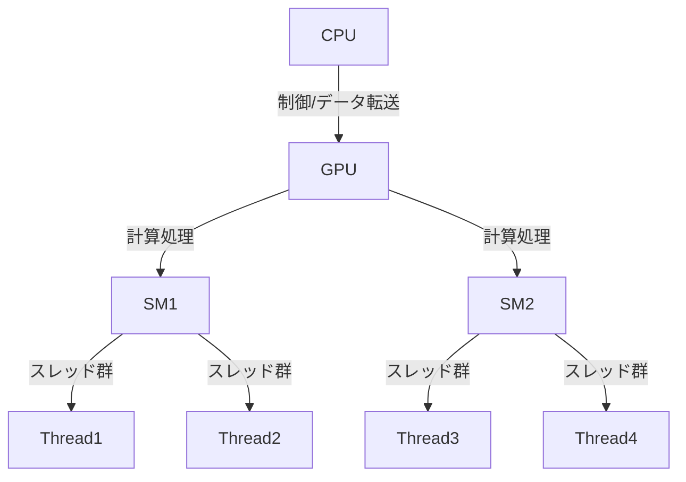
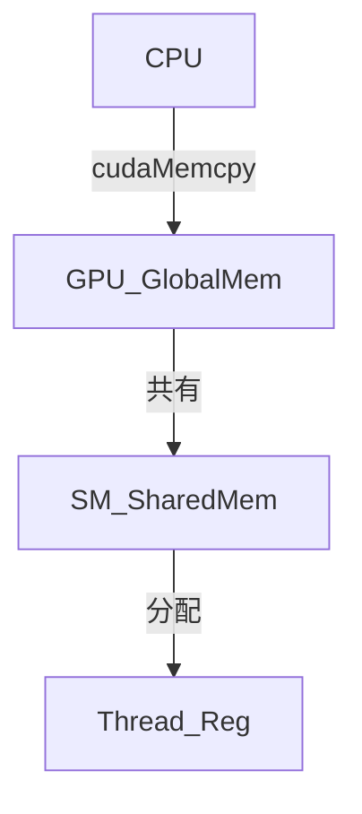
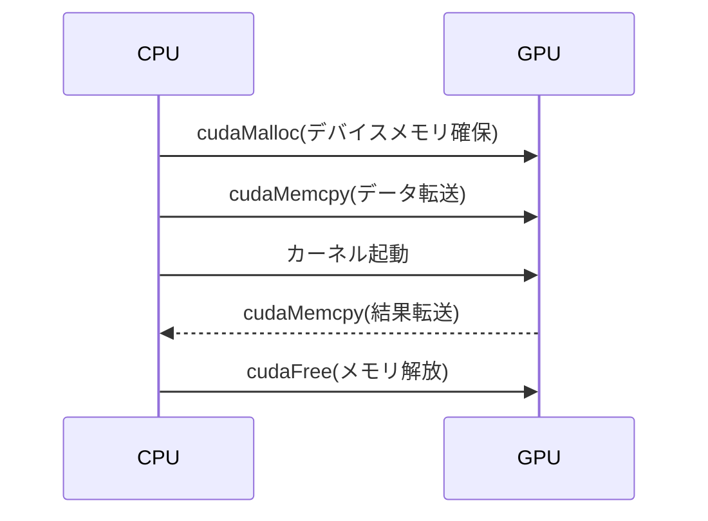

# CUDA

---

## 概要

CUDA（Compute Unified Device Architecture）は、NVIDIAが開発した並列計算プラットフォームおよびAPIである。CUDAを利用することで、従来グラフィックス用途に限定されていたGPUの計算資源を、汎用的な数値計算やデータ処理に活用できる。CUDAはC/C++をベースとした拡張言語を提供し、開発者はGPU向けのカーネル関数を記述して、膨大なデータを高速に処理できる。主な用途は科学技術計算、機械学習、画像処理、金融工学、シミュレーションなど多岐にわたる。

CUDAの特徴は、GPUの膨大な並列計算能力をプログラムから直接制御できる点にある。CPUとGPUは異なるメモリ空間を持ち、データ転送や同期制御が必要となるが、適切に設計することでCPU単体では実現困難な高性能を発揮できる。

---

## 歴史

CUDAは2006年にNVIDIAによって発表された。初期はG80アーキテクチャのGeForce 8800シリーズでサポートされ、以降Tesla、Fermi、Kepler、Maxwell、Pascal、Volta、Turing、Ampere、Hopperなど、各世代のGPUで機能拡張が続いている。CUDAの登場以前は、GPUプログラミングはOpenGLやDirectXのシェーダー言語を用いる必要があり、汎用計算には不向きであった。CUDAの普及により、GPGPU（General Purpose computing on GPU）が一般化し、HPC（High Performance Computing）分野やAI分野でのGPU活用が急速に進展した。

CUDA Toolkitはバージョンアップごとに新機能や最適化が追加されている。たとえば、Fermi世代でL1/L2キャッシュやECCサポート、Kepler世代で動的並列性やHyper-Q、Pascal世代でUnified Memoryの強化、Ampere世代でTensor Coreの進化などが挙げられる。

---

## アーキテクチャ

CUDAアーキテクチャは、SIMT（Single Instruction, Multiple Threads）モデルを採用している。GPUは複数のSM（Streaming Multiprocessor）で構成され、各SMは数十から数百のCUDAコアを持つ。各SMは同時に多数のスレッドを管理し、スレッドは32個単位のワープ（warp）としてスケジューリングされる。ワープ内のスレッドは同一命令を実行するため、分岐が発生すると性能低下の要因となる。

GPUはCPUと比較して、より多くの演算ユニットと高いメモリ帯域を持つが、制御系や分岐処理は苦手である。そのため、データ並列性が高く、同じ処理を大量のデータに適用する用途に適している。



---

## 開発環境

CUDA開発には以下が必要である。
- NVIDIA製CUDA対応GPU（Compute Capability 2.0以降推奨）
- CUDA Toolkit（コンパイラ、ライブラリ、サンプル、ドキュメントを含む）
- 対応GPUドライバ
- 開発言語：主にC/C++、Python（PyCUDA, Numba等）、Fortran（PGI CUDA Fortran）
- IDE：Visual Studio（Windows）、Nsight Eclipse Edition（Linux）、JetBrains CLion等
- ビルドツール：nvcc（CUDA C/C++コンパイラ）、CMake等

CUDA Toolkitには、nvccコンパイラ、各種ライブラリ、デバッグ・プロファイリングツール、サンプルコードが含まれている。PythonからはCuPyやPyCUDA、Numbaなどを利用することで、GPU計算を手軽に実装できる。

---

## 主な機能

- GPUによる大規模並列計算（数千〜数万スレッドの同時実行）
- メモリ管理API（cudaMalloc, cudaMemcpy, cudaFree等）
- ストリームによる非同期処理とイベント管理
- 高速な数学・線形代数・FFT・乱数生成等のライブラリ（cuBLAS, cuFFT, cuRAND, cuDNN, Thrust等）
- Unified Memory（CPU/GPU間のメモリ共有）
- マルチGPUサポート
- 動的並列性（カーネルからカーネルの起動）
- Tensor CoreによるAI演算高速化（Ampere以降）

---

## メモリ管理

CUDAでは以下のメモリ空間が存在する。
- **グローバルメモリ**：全スレッドからアクセス可能。大容量だがレイテンシが高い。
- **シェアードメモリ**：同一ブロック内のスレッドで共有。低レイテンシで高速。バンクコンフリクトに注意。
- **レジスタ**：各スレッド専用。最速だが容量制限あり。レジスタ溢れはローカルメモリへのスピルを招く。
- **コンスタントメモリ／テクスチャメモリ**：読み取り専用。特定用途で高速化。
- **ローカルメモリ**：スレッドごとの一時領域。レジスタ不足時に利用される。

データ転送は`cudaMemcpy`で行い、ホスト（CPU）とデバイス（GPU）間の帯域幅や転送回数を最小化することが重要である。Unified Memoryを利用すると、明示的な転送を省略できるが、性能面での考慮が必要である。



---

## 並列処理モデル

CUDAの並列処理は、カーネル関数を多数のスレッドで同時実行することで実現される。スレッドはブロック単位で管理され、ブロックはグリッドとしてまとめられる。スレッドID（threadIdx）、ブロックID（blockIdx）、グリッドサイズ（gridDim）、ブロックサイズ（blockDim）を用いて、各スレッドが処理すべきデータ領域を決定する。

スレッド間の同期はブロック内でのみ可能（`__syncthreads()`）。グリッド全体の同期にはカーネルの再起動が必要となる。


---

## カーネル開発

カーネルは`__global__`修飾子を付与して定義し、ホストから`<<<グリッド数, ブロック数>>>`構文で起動する。カーネル内ではスレッドIDやブロックIDを用いて、各スレッドが担当するデータを処理する。同期処理には`__syncthreads()`を利用する。カーネルは戻り値を持たず、結果はデバイスメモリに格納する。

### ベクトル加算カーネル例

```cpp
__global__ void vectorAdd(const float* A, const float* B, float* C, int N) {
    int i = blockIdx.x * blockDim.x + threadIdx.x;
    if (i < N) {
        C[i] = A[i] + B[i];
    }
}
```

### カーネル起動例

```cpp
int N = 1 << 20;
vectorAdd<<<(N+255)/256, 256>>>(A_d, B_d, C_d, N);
```

---

## デバイス管理

複数GPU環境では、`cudaGetDeviceCount`でデバイス数を取得し、`cudaSetDevice`で利用するGPUを切り替える。デバイスごとにメモリ空間が独立しているため、データの分散や同期が必要となる。P2P（Peer-to-Peer）通信やNVLinkを活用することで、GPU間のデータ転送を高速化できる。

### デバイス選択例

```cpp
int deviceCount;
cudaGetDeviceCount(&deviceCount);
cudaSetDevice(0); // 0番目のGPUを利用
```

---

## エラー処理

CUDA APIは`cudaError_t`型の戻り値でエラー情報を返す。エラー発生時は`cudaGetErrorString`で詳細を取得できる。カーネル実行後は`cudaGetLastError`や`cudaDeviceSynchronize`で非同期エラーを検出することが重要である。

### エラーチェック例

```cpp
cudaError_t err = cudaMemcpy(...);
if (err != cudaSuccess) {
    printf("CUDA Error: %s\n", cudaGetErrorString(err));
}
```

---

## バージョン互換性

CUDA Toolkit、GPUドライバ、GPUアーキテクチャには互換性の制約がある。新しいToolkitでビルドしたバイナリは古いドライバで動作しない場合がある。Compute Capability（計算能力）によって利用可能な機能が異なるため、ターゲットGPUに合わせたビルド設定が必要である。

- PTX（中間コード）とバイナリ（cubin）の両方を埋め込むことで、将来のGPUにも対応しやすくなる。
- サポートマトリクスはNVIDIA公式サイトで随時更新されている。

---

## APIとライブラリ

CUDAは低レベルAPI（メモリ管理、カーネル起動等）に加え、以下の高水準ライブラリを提供する。
- cuBLAS：BLAS（Basic Linear Algebra Subprograms）
- cuFFT：高速フーリエ変換
- cuDNN：ディープラーニング向けニューラルネットワーク演算
- cuSPARSE：疎行列演算
- cuRAND：乱数生成
- Thrust：C++ STLライクな並列アルゴリズム

これらを活用することで、複雑な数値計算や機械学習処理を効率的に実装できる。たとえばcuBLASは行列積やLU分解、cuDNNは畳み込みやプーリングなどのディープラーニング演算を高速に実行できる。

---

## 開発フロー

1. ホスト側でデータを準備し、`cudaMalloc`でデバイスメモリを確保する。
2. `cudaMemcpy`でデータをGPUに転送する。
3. カーネル関数を`<<<グリッド数, ブロック数>>>`で起動する。
4. 結果を`cudaMemcpy`でホストに転送する。
5. `cudaFree`でデバイスメモリを解放する。



---

## 利用例

- 機械学習：TensorFlowやPyTorch等のフレームワークはCUDAを利用してニューラルネットワークの学習・推論を高速化している。特に畳み込み演算や行列積などで大きな性能向上が得られる。
- 科学技術計算：分子動力学（GROMACS, LAMMPS）、流体解析（OpenFOAM）、気象シミュレーション等で大規模並列計算に活用されている。
- 画像・映像処理：OpenCVやFFmpeg等でCUDAによるフィルタリング、エンコーディング、デコーディングが実装されている。リアルタイム処理や高解像度映像の処理に有効である。
- 金融工学：モンテカルロ法によるリスク評価やオプション価格計算などでGPUの高速性が活かされている。

---

## 注意点・制限事項

- GPUメモリ容量がCPUより小さいため、大規模データ処理時は分割やストリーミング処理が必要となる。
- ホストとデバイス間のデータ転送はPCIe帯域に依存し、頻繁な転送は性能低下の要因となる。
- GPUアーキテクチャごとに最適化手法やサポート機能が異なるため、移植性に注意が必要である。
- デバッグやプロファイリングはCPUプログラムより難易度が高い。
- 浮動小数点演算の精度や再現性に注意が必要である。
- スレッド間の同期や排他制御が不十分な場合、データ競合や不正な動作が発生する。

---

## パフォーマンス最適化

- メモリアクセスのcoalescing（連続アクセス）を意識し、グローバルメモリ帯域を最大限活用する。
- シェアードメモリやレジスタを活用し、グローバルメモリアクセスを最小化する。
- スレッド・ブロック数をGPUアーキテクチャに合わせて調整し、SMの占有率（occupancy）を高める。
- ストリームやイベントを活用し、データ転送と計算をオーバーラップさせる。
- プロファイラ（Nsight Compute, nvprof等）でボトルネックを特定し、逐次的に最適化を行う。
- 分岐やループの最適化、命令レベル並列性の向上も重要である。

---

## デバッグとプロファイリング

CUDAプログラムのデバッグには`cuda-gdb`やVisual StudioのNsightプラグインが利用できる。プロファイリングには`nvprof`、`Nsight Systems`、`Nsight Compute`等があり、カーネルの実行時間、メモリアクセスパターン、SMの利用率などを詳細に解析できる。エラー検出には`cuda-memcheck`や`compute-sanitizer`が有効である。

### デバッグ・プロファイリングTips

- `cuda-memcheck`でメモリリークや不正アクセスを検出
- `nvprof`でカーネルごとの実行時間やメモリ転送量を可視化
- `Nsight Compute`でワープダイバージェンスやメモリアクセス効率を解析

---

## セキュリティと安全性

CUDAプログラムでは、バッファオーバーフローや不正なメモリアクセス、データ競合（レースコンディション）に注意が必要である。特に複数スレッド間での同期や排他制御が不十分な場合、予期せぬ動作やデータ破壊が発生する。セキュリティ要件が高い場合は、入力データの検証やエラーハンドリングを徹底することが重要である。

---

## サポートされているプラットフォーム

CUDAは主にWindows、Linux、macOS（一部旧バージョンのみ）で利用可能である。最新のmacOSでは公式サポートが終了している。GPUドライバやCUDA ToolkitのバージョンはOSごとに異なるため、公式サポートマトリクスを参照すること。

- Windows: Visual Studioとの連携が強力
- Linux: HPC用途で広く利用
- macOS: Mojaveまで公式サポート（以降は非対応）

---

## 他技術との比較

- **OpenCL**：マルチベンダー対応で移植性が高いが、CUDAに比べて最適化や開発ツールが限定的である。
- **DirectCompute**：主にWindows/DirectX環境向け。ゲームやグラフィックス用途が中心。
- **SYCL/oneAPI**：Intel主導の新しいGPGPU標準。今後の動向に注目が集まる。

CUDAはNVIDIA GPU専用であるが、最適化やサポートツールが充実しており、HPCやAI分野でのデファクトスタンダードとなっている。

---

## 今後の展望

AIやHPC分野の発展に伴い、CUDAの機能拡張や最適化が継続される見込みである。今後はより高性能なGPUアーキテクチャへの対応、AI専用命令セットの拡充、マルチGPU・分散環境でのスケーラビリティ向上が期待される。また、Python等の高水準言語との連携強化や、開発ツールの進化も進むと考えられる。

---

## コミュニティとサポート

NVIDIA公式フォーラム、Stack Overflow、GitHub等で活発な情報交換が行われている。公式ドキュメントやサンプルコード、オンライン講座、書籍も豊富であり、初心者から上級者まで幅広くサポートされている。NVIDIA Developer Programに登録することで、最新情報やイベント案内を受け取ることができる。

---

## よくある質問

- Q: CUDAはどのGPUで動作するか？
  - A: NVIDIA製のCUDA対応GPU（GeForce, Quadro, Tesla, RTX, A100等）で動作する。Compute Capability 3.0以降が推奨される。
- Q: PythonからCUDAを使うには？
  - A: PyCUDA、Numba、CuPy等のライブラリを利用することで、PythonからCUDAカーネルを記述・実行できる。
- Q: CUDAとOpenCLの違いは？
  - A: CUDAはNVIDIA専用で最適化やツールが充実している。OpenCLはマルチベンダー対応だが、最適化やサポートは限定的である。
- Q: GPUメモリが足りない場合は？
  - A: データ分割やストリーミング処理、Unified Memoryの活用、マルチGPU分散処理等で対応する。
- Q: カーネルのデバッグ方法は？
  - A: cuda-gdbやNsight、cuda-memcheck等のツールを利用する。

---

## 用語集

- **カーネル**: GPU上で実行される関数。`__global__`修飾子で定義。
- **スレッド**: 並列実行単位。1つのカーネル呼び出しで数千〜数万スレッドが生成される。
- **ブロック**: スレッドのグループ。ブロック内でシェアードメモリを共有できる。
- **グリッド**: ブロックの集合。カーネル起動時に指定。
- **SIMT**: Single Instruction, Multiple Threads。ワープ単位で同一命令を実行。
- **ワープ**: 32スレッド単位の実行グループ。分岐があると性能低下。
- **Unified Memory**: CPU/GPU間でメモリ空間を共有する仕組み。
- **Tensor Core**: AI演算向けの専用ユニット。Ampere以降で強化。

---

## Rustとの相性

Rustは安全性とパフォーマンスを両立するシステムプログラミング言語であり、近年CUDAとの連携も注目されている。Rust自体はC/C++のようにCUDAカーネルを直接記述する公式サポートはないが、いくつかの方法でCUDAと連携できる。

### RustからCUDAを利用する方法

- **FFI（Foreign Function Interface）による呼び出し**  
  RustからC言語のFFIを利用して、CUDAのランタイムAPIやcuBLAS等のライブラリ関数を呼び出すことができる。これにより、ホスト側のロジックをRustで記述しつつ、カーネルはC/C++で実装する構成が一般的である。

- **カーネルのビルドとリンク**  
  CUDAカーネル（`.cu`ファイル）はC/C++で実装し、nvccでコンパイルしたバイナリをRustのビルドシステム（Cargo）でリンクする。RustからはunsafeブロックでC関数として呼び出す。

- **Rust製クレートの活用**  
  `cust`や`rust-cuda`など、RustからCUDAを扱うためのクレートが存在する。`cust`はCUDAランタイムAPIのラッパーであり、`rust-cuda`はRustでカーネルを記述しPTXを生成できるが、C++に比べてエコシステムやドキュメントは限定的である。

### メリット・デメリット

- **メリット**
  - Rustの型安全性や所有権モデルにより、メモリ安全性の高いGPUプログラムが記述できる。
  - 並列処理やエラー処理の堅牢性が向上する。
- **デメリット**
  - C/C++に比べて公式サポートや情報が少なく、エコシステムが発展途上である。
  - カーネルの記述やデバッグはC/C++を併用する必要がある場合が多い。

### 代表的なクレート

- [`cust`](https://github.com/denzp/rust-cuda): CUDAランタイムAPIのRustバインディング
- [`rust-cuda`](https://github.com/Rust-GPU/Rust-CUDA): Rustでカーネルを記述しPTXを生成

### まとめ

現時点ではRustとCUDAの連携はC/C++ほど成熟していないが、FFIや専用クレートを活用することで十分に実用可能である。今後Rustエコシステムの発展により、より安全かつ高性能なGPUプログラミングが期待される。

---

## Goとの相性

Go（Golang）はシンプルな構文と高い並行処理性能を持つプログラミング言語であるが、CUDAとの直接的な統合は公式にはサポートされていない。しかし、いくつかの方法でGoからCUDAを利用することが可能である。

### GoからCUDAを利用する方法

- **CGOによるC/C++連携**  
  GoのCGO機能を利用し、C/C++で実装したCUDAカーネルやAPIをGoから呼び出すことができる。カーネルはC/C++で実装し、Go側からC関数として呼び出す構成が一般的である。

- **外部バイナリの呼び出し**  
  CUDA処理を行うC/C++プログラムを外部プロセスとして実行し、Goから標準入出力やファイル、RPC等で連携する方法もある。

- **Go用バインディング/ラッパーの利用**  
  `gocudnn`や`cu`など、GoからCUDAライブラリを利用するためのバインディングやラッパーが一部存在する。ただし、C/C++に比べてエコシステムやドキュメントは限定的である。

### メリット・デメリット

- **メリット**
  - Goの並行処理（goroutine）と組み合わせて、CPU/GPUの協調処理が記述しやすい。
  - サーバーサイドや分散処理システムでGPU計算を組み込む用途に適している。
- **デメリット**
  - CUDAカーネル自体はC/C++で実装する必要があり、Goのみで完結しない。
  - CGO利用時はビルドやデバッグが複雑になる場合がある。
  - Go用のCUDAラッパーはC/C++やPythonに比べて成熟度が低い。

### 代表的なプロジェクト・ライブラリ

- [`gocudnn`](https://github.com/dereklstinson/gocudnn): cuDNNのGoバインディング
- [`cu`](https://github.com/barnex/cuda5): CUDAランタイムAPIのGoバインディング（メンテナンス状況に注意）

### まとめ

GoとCUDAの連携はC/C++やPythonほど容易ではないが、CGOや外部バイナリ連携、専用バインディングを活用することで実現可能である。特にサーバーサイドや分散システムでGPU計算を活用したい場合に有効であるが、開発・保守の難易度やエコシステムの成熟度には注意が必要である。

---

## 参考文献・リンク

- [NVIDIA CUDA公式サイト](https://developer.nvidia.com/cuda-zone)
- [CUDA Toolkit Documentation](https://docs.nvidia.com/cuda/)
- [CUDAサンプルコード集](https://github.com/NVIDIA/cuda-samples)
- [CUDA C Programming Guide](https://docs.nvidia.com/cuda/cuda-c-programming-guide/index.html)
- [NVIDIA Developer Forums](https://forums.developer.nvidia.com/)