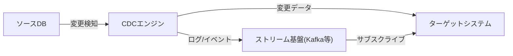
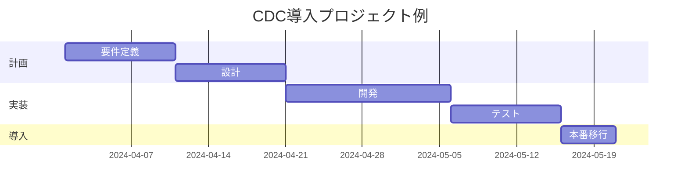
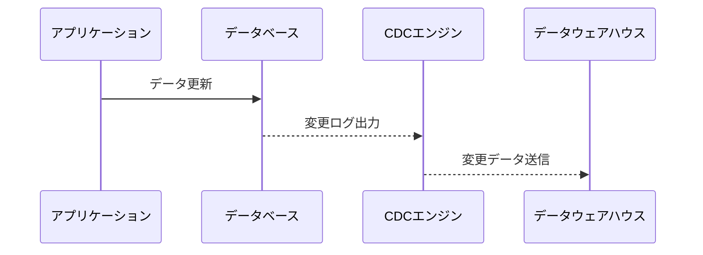

# Change Data Capture

---

## 概要

Change Data Capture（CDC）は、データベースやシステム内で発生したデータの変更（挿入・更新・削除）を検知し、他システムへリアルタイムまたはバッチで伝播する技術である。CDCは、データ連携やデータレイク、データウェアハウスへのデータ同期、監査、イベント駆動アーキテクチャ、マイクロサービス連携など多様な用途で活用される。従来のバッチ連携と比較し、データの鮮度向上や運用負荷の低減、システム間の疎結合化を実現できる。  
CDCの導入により、データの即時性が求められるビジネス要件（例：在庫連携、リアルタイム分析、異常検知など）に柔軟に対応できるようになる。

---

## 歴史

CDCの起源は1970年代のメインフレーム時代に遡る。当時はバッチ処理による差分抽出が主流であり、夜間バッチで前日との差分を抽出していた。1990年代以降、RDBMSの普及とともに、トリガやストアドプロシージャを利用したCDCが登場した。2000年代にはトランザクションログを直接解析するログベースCDCが普及し、リアルタイム性やパフォーマンスが大幅に向上した。近年はクラウドや分散システムの発展により、Kafkaなどのストリーム処理基盤と連携したCDCが主流となっている。  
また、クラウドサービスの普及により、CDCはオンプレミス・クラウド・ハイブリッド環境を問わず利用されるようになった。

---

## 用語集

- **CDC**: Change Data Captureの略。データ変更検知技術。
- **ソース**: 変更を検知する元データベースやシステム。例：業務DB、外部サービスAPI。
- **ターゲット**: 変更データを反映する先システム。例：DWH、データレイク、他DB。
- **ログベース**: トランザクションログを利用したCDC方式。高パフォーマンス・低負荷。
- **トリガベース**: データベーストリガを利用したCDC方式。柔軟だがDB負荷が高い。
- **イベントソーシング**: すべての変更イベントを記録し、状態を再構築する設計パターン。
- **冪等性**: 同じ操作を複数回実行しても結果が変わらない性質。
- **ストリーム処理**: データの流れをリアルタイムで処理する方式。KafkaやKinesisなどが代表例。
- **DWH**: Data Warehouse。大量データの集約・分析基盤。

---

## 特徴

- データ変更をリアルタイムまたは準リアルタイムで検知可能である。
- ソースシステムへの負荷を最小限に抑えられる（特にログベースCDC）。
- データ連携の自動化・省力化が可能であり、バッチ処理の手間を削減できる。
- イベント駆動アーキテクチャやマイクロサービス連携の基盤としても有効である。
- データの鮮度・一貫性を高めることができる。
- 監査証跡やデータガバナンスの強化にも寄与する。
- システム間の疎結合化により、個別システムの変更が全体に波及しにくくなる。

---

## メリット・デメリット

| メリット | デメリット |
|---|---|
| リアルタイム連携が可能 | 実装・運用が複雑 |
| ソース負荷が低い | データ整合性の担保が課題 |
| バッチ不要 | 権限・セキュリティ要件が高い |
| データ鮮度向上 | DBバージョンや構成依存が強い |
| システム間の疎結合化 | 障害時のリカバリ設計が必要 |

**補足**  
CDCはリアルタイム性や運用効率化の観点で大きなメリットがあるが、導入・運用にはDBのバージョンや構成、ネットワーク設計、セキュリティ要件など多くの考慮点がある。特に障害時のリカバリ設計や、データ整合性の担保はプロジェクト初期から十分に検討すべきである。

---

## 代表的な実装例

- **ログベースCDC**: データベースのトランザクションログを解析し、変更内容を抽出する。代表例：Debezium、Oracle GoldenGate、SQL Server CDC。高パフォーマンス・低負荷で大規模システムに適する。DBのバージョンや構成に依存するため、導入前に要件確認が必要である。
- **トリガベースCDC**: データベーストリガを利用し、変更時に履歴テーブルやキューへ記録する。柔軟だがDB負荷が高く、運用管理が煩雑になりやすい。小規模システムやカスタム要件に向く。
- **アプリケーションレベルCDC**: アプリケーション層で変更イベントを発行し、メッセージキューやAPI経由で連携する。ビジネスロジックと密結合しやすいが、柔軟な制御が可能。

---

## 関連技術

- **ETL（Extract, Transform, Load）**: データ抽出・変換・格納プロセス。CDCはETLの「E」をリアルタイム化する技術である。従来のバッチETLと比較し、データの即時性が大きく向上する。
- **データレプリケーション**: DB間のデータ複製。CDCはレプリケーションの一手法であり、特に非同期・リアルタイム連携に強みがある。
- **イベントストリーミング**: Kafka等によるイベント駆動連携。CDCはイベントソースとして利用される。イベントストリームを活用することで、複数システムへの同時配信や再処理が容易になる。
- **データウェアハウス（DWH）**: 分析用データ集約基盤。CDCでDWHへリアルタイム連携が可能となり、分析データの鮮度が向上する。

---

## サポートされているデータベース

主要なRDBMS（Oracle, SQL Server, MySQL, PostgreSQLなど）はCDC機能を標準または追加モジュールでサポートしている。NoSQLではMongoDBやCassandraなど一部が対応している。クラウドDB（Amazon Aurora, Google Cloud SQL等）もCDC機能を提供する場合が多い。  
DBごとにCDCの実装方式や制約が異なるため、導入時は公式ドキュメントやベンダーサポート情報を必ず確認すること。

---

## 主要ベンダー比較

| 製品名 | 方式 | 対応DB | 特徴 |
|---|---|---|---|
| Debezium | ログベース | MySQL, PostgreSQL, MongoDB 他 | OSS、Kafka連携、コミュニティ活発。拡張性が高い。 |
| Oracle GoldenGate | ログベース | Oracle, MySQL 他 | 商用、豊富な機能、エンタープライズ向け。大規模・高可用性対応。 |
| SQL Server CDC | ログベース | SQL Server | 標準機能、設定容易。SQL Server Management Studioから設定可能。 |
| AWS DMS | ログベース | 多数 | クラウドサービス、スケーラブル。マネージド運用が可能。 |

**選定ポイント**  
- サポートDBの種類・バージョン
- 運用コスト（OSS/商用/クラウド）
- スケーラビリティ・可用性要件
- サポート体制・コミュニティ活性度

---

## 利用シーン

- データウェアハウスやデータレイクへのリアルタイムデータ連携  
  例：営業DBの変更を即座にDWHへ反映し、BI分析の鮮度を高める。
- マイクロサービス間のイベント通知・非同期連携  
  例：注文情報の更新をイベントとして他サービスへ配信。
- 監査証跡の取得やデータガバナンス強化  
  例：重要データの変更履歴を自動記録し、不正検知や監査対応に活用。
- 異種DB間のデータ同期・移行  
  例：オンプレミスDBからクラウドDBへの段階的移行。
- IoTやモバイルアプリのデータ収集基盤  
  例：センサーデータのリアルタイム集約・分析。

---

## ユースケース別ベストプラクティス

- **大規模データ連携**: ログベースCDCを推奨。Kafka等のストリーム基盤と組み合わせることで高スループットを実現できる。バッファ設計やパーティション分割も重要。
- **セキュリティ要件が高い場合**: 権限管理・暗号化・監査ログを徹底する。アクセス権限は最小限に設定し、監査証跡を必ず残す。
- **データ品質重視**: 変更データの検証・補正処理を自動化し、異常検知アラートを設ける。データ検証ルールは運用開始前に十分にテストすること。

---

## アーキテクチャ

CDCの基本アーキテクチャは以下の通りである。CDCエンジンがソースDBの変更を検知し、ターゲットシステムへ変更データを伝播する。ストリーム基盤を介することで、複数のターゲットやリアルタイム分析基盤への同時連携も容易となる。

**補足**  
CDCエンジンはDBのトランザクションログやトリガ、API等を利用して変更を検知する。ストリーム基盤（Kafka等）を利用する場合、複数のターゲットが同時に変更データを受信できるため、拡張性が高い。

---

## モデル設計パターン

- **イベントソーシング**: すべての変更イベントを記録し、任意時点の状態を再構築する。監査やリプレイに有効。イベントストアの設計が重要。
- **CQRS（Command Query Responsibility Segregation）**: 更新系（コマンド）と参照系（クエリ）を分離し、CDCで更新イベントを伝播する。スケーラビリティやパフォーマンス向上に寄与する。

---

## 標準化とベストプラクティス

- 変更データのスキーマ管理を徹底し、バージョン管理を行う。スキーマ変更時は後方互換性を考慮する。
- エラー時のリトライ・再送設計を行い、冪等性を担保する。重複配信や順序保証も考慮する。
- 監査証跡やログの長期保存ポリシーを策定する。法令遵守の観点からも重要。
- テスト自動化・CI/CDパイプラインの導入を推奨する。CDC設定やスキーマ変更も自動テスト対象とする。

---

## データガバナンスフレームワーク

データの品質・整合性・セキュリティを担保するため、組織横断のガバナンス体制を構築する。データ所有者・管理者の明確化、利用ポリシー策定、監査体制の整備が重要である。  
ガバナンスフレームワークには、データカタログ、データリネージ、データ品質管理、アクセス制御、監査証跡などが含まれる。

---

## データガバナンス

- データ所有者・管理者の明確化
- データ利用ポリシー・アクセス権限の策定
- データライフサイクル管理（生成～廃棄）
- データリネージ（データの流れ・変換履歴）の可視化

---

## データ品質管理

- 欠損値・異常値の検知と自動補正
- データ検証ルールの自動化
- 品質指標（Completeness, Consistency, Accuracy等）の定義
- 品質改善サイクル（PDCA）の運用

---

## データ品質モニタリング

- 定期的なデータ品質レポートの作成
- 品質異常時のアラート通知
- 品質ダッシュボードの運用
- 品質指標のトレンド分析

---

## データ分類とタグ付け

- 機密性・重要度・利用目的に応じた分類
- タグによる検索性・管理性向上
- データカタログとの連携
- データ分類に基づくアクセス制御

---

## データ整合性の確保

- トランザクション管理による一貫性担保
- 冪等性設計による重複防止
- ソース・ターゲット間の整合性検証
- データ検証バッチの定期実行

---

## データ暗号化

- 転送時（TLS/SSL）・保存時（TDE等）の暗号化を徹底する。
- 鍵管理ポリシーの策定と運用
- 暗号化対象データの明確化（個人情報・機密情報等）

---

## データマスキング

- テスト・開発環境では個人情報等をマスキングし、情報漏洩リスクを低減する。
- マスキングルールの標準化

---

## データ匿名化

- 個人情報保護法やGDPR等に対応するため、必要に応じて匿名化処理を行う。
- 匿名化後のデータ活用性・再識別リスクの評価

---

## データ削除・ガバナンス

- データ削除時の監査証跡を残し、不正削除を防止する。
- 削除ポリシーの明確化
- 削除データの復元可否・手順の整備

---

## データリテンション管理

- 保持期間ポリシーの策定と自動削除機能の実装
- 法令遵守のための保存期間設定
- リテンション違反時のアラート

---

## データ圧縮とストレージ最適化

- 圧縮アルゴリズム（gzip, zstd等）の選定
- ストレージコスト削減のためのアーカイブ設計
- 圧縮率・復元速度のバランス評価

---

## データアーカイブ戦略

- アクセス頻度に応じた階層化ストレージ（ホット/コールド/アーカイブ）
- アーカイブデータの検索・復元手順
- アーカイブデータの暗号化・監査

---

## データフォーマット変換

- JSON, Avro, Parquet等への変換によるデータ活用性向上
- フォーマット変換時のスキーマ管理
- 変換エラー時のリカバリ設計

---

## データベース間レプリケーション

- 異種DB間のデータ同期（例：Oracle→PostgreSQL）
- スキーマ変換・型変換の考慮
- レプリケーション遅延・整合性監視

---

## データレイクとの連携

- 大容量データの蓄積・分析基盤（Amazon S3, Azure Data Lake等）との連携
- バッチ/ストリーム両対応
- データレイクのスキーマ管理・パーティション設計

---

## データ統合基盤との連携

- DWH（Snowflake, BigQuery等）、DMP、BIツール等との連携
- CDCデータの加工・集約
- データ統合時の名寄せ・重複排除

---

## データ連携パターン集

- Push型（CDCエンジンがターゲットへ送信）
- Pull型（ターゲットがCDCエンジンから取得）
- イベント駆動型（Kafka等でPub/Sub）
- バッチ連携とのハイブリッド運用

---

## データ連携APIのセキュリティ

- OAuth, APIキー等による認証・認可
- APIアクセスログの監査
- APIレートリミット・DoS対策

---

## サードパーティ製品との連携

- Salesforce, SAP, Workday等SaaS/PaaSとのデータ連携
- コネクタ・アダプタの活用
- サードパーティAPIのバージョン管理

---

## クラウドサービスでの利用

- AWS DMS, Azure Data Factory, Google Dataflow等のCDCサービス
- マネージドサービスによる運用負荷軽減
- クラウド間・オンプレミス連携の設計

---

## オンプレミスとクラウドの比較

| 項目 | オンプレミス | クラウド |
|---|---|---|
| 初期コスト | 高い | 低い |
| 拡張性 | 低い | 高い |
| 運用負荷 | 高い | 低い |
| セキュリティ | 柔軟 | 標準化 |
| バージョン管理 | 自己責任 | 自動アップデート |

---

## マルチクラウド対応

- 複数クラウド間のデータ連携
- クラウドロックイン回避
- マルチクラウド運用時の監視・運用統合

---

## マルチリージョン対応

- 災害対策・可用性向上
- 地理的分散によるレイテンシ低減
- リージョン間のデータ整合性設計

---

## マルチテナント対応

- 複数顧客データの分離管理
- テナントごとのアクセス制御
- テナント追加・削除時の運用設計

---

## IoTデバイスとの連携

- センサーデータのリアルタイム収集・分析
- エッジ～クラウド間のデータ連携
- デバイスID管理・データ正規化

---

## モバイル環境での利用

- モバイルアプリへのデータ配信
- オフライン対応・再送設計
- モバイル特有のネットワーク制約考慮

---

## エッジコンピューティングでの活用

- エッジ側でのデータ前処理・フィルタリング
- 帯域最適化
- エッジ障害時のデータバッファリング

---

## ノーコード/ローコードツールとの連携

- ノーコードETLツール（ex. DataSpider, MuleSoft等）との連携
- 業務部門によるデータ連携自動化
- ノーコードツールの権限・監査設計

---

## マイクロサービスアーキテクチャでの活用

- サービス間の疎結合連携
- イベント駆動設計
- サービス分割・統合時のCDC設計

---

## API設計指針

- REST, gRPC等のAPI設計
- バージョニング・エラーハンドリング
- APIドキュメント自動生成

---

## サービス利用規約・ポリシー

- 利用条件・禁止事項の明記
- サービスレベル・サポート範囲の明確化
- 利用者責任範囲の明示

---

## 法的・コンプライアンス考慮事項

- GDPR, 個人情報保護法等への対応
- データ移転・越境要件の確認
- 法令改正時の運用見直し

---

## 権限管理とアクセス制御

- RBAC（ロールベース）、ABAC（属性ベース）等の導入
- 最小権限原則の徹底
- 権限変更時の監査証跡

---

## インフラストラクチャ要件

- ネットワーク帯域、ストレージ容量、CPU/メモリ要件
- 冗長化・可用性設計
- インフラ障害時の自動復旧

---

## サービス導入時のチェックリスト

- 要件定義、PoC、運用設計、セキュリティレビュー、パフォーマンステスト
- ステークホルダー合意形成

---

## 導入手順

1. 要件定義（対象DB・連携先・非機能要件の整理）
2. システム設計（アーキテクチャ・運用設計）
3. 実装・テスト（CDC設定、データ検証）
4. 本番導入（段階移行、監視設定）
5. 運用開始後の定期レビュー

---

## マイグレーション戦略

- 段階的移行（旧システムと並行稼働）
- データ検証・リハーサルの徹底
- 移行失敗時のロールバック設計

---

## データ移行時のベストプラクティス

- データ検証、リハーサル実施
- 移行計画・ロールバック手順の明確化
- 移行後のデータ整合性チェック

---

## サンドボックス環境での検証

- 本番データを使わない検証
- テストデータのマスキング・匿名化
- サンドボックス環境の自動構築

---

## サービス導入プロジェクト管理

- プロジェクト管理ツール（Jira, Redmine等）の活用推奨
- マイルストーン・進捗管理の徹底

---

## 導入事例

- 金融機関でのリアルタイム取引監査（不正検知・監査証跡）
- ECサイトでの在庫同期（在庫切れ防止・顧客満足度向上）
- 製造業でのIoTデータ収集（設備稼働監視・予知保全）
- 医療業界での患者データ連携（法令遵守・監査対応）

---

## サービス導入のROI分析

- 投資対効果の定量評価（コスト削減、業務効率化、売上向上等）
- KPI設定と定期的な効果測定
- 定性的効果（運用負荷軽減、リスク低減等）の評価も重要

---

## 導入後の評価指標

- レイテンシ（変更検知～反映までの遅延）
- データ損失率（ロストイベントの有無）
- 運用コスト（人件費・インフラ費用）
- SLA/SLO達成率

---

## サービス拡張性

- 新規データソース追加の容易性
- スケールアウト対応
- 新規ターゲット追加時の影響範囲最小化

---

## サービス終了時のデータ処理

- データ消去、バックアップ取得
- サービス終了時の監査証跡保存
- 終了後のデータ移行計画

---

## サービス停止時の対応

- フェイルオーバー設計
- サービス停止時の通知・切替手順
- 停止時のデータ整合性担保

---

## サービス利用時のトラブル事例

- データ遅延（ネットワーク障害・バッファ詰まり）
- 重複配信（冪等性設計不足）
- データ欠損（ログローテーション・設定ミス）
- 権限設定ミスによるデータ取得失敗

---

## サポート体制

- 24時間365日サポート、SLA保証
- 障害時のエスカレーションフロー
- サポートレベル（L1/L2/L3）の明確化

---

## サポート窓口・問い合わせ方法

- メール、電話、Webフォーム
- サポートポータルの提供
- 問い合わせ履歴の管理・分析

---

## ユーザー教育・トレーニング

- 操作マニュアル、eラーニング、ハンズオン研修
- FAQ・ナレッジベースの整備
- 定期的な教育・アップデート

---

## FAQ

Q. CDCはどのようなシステムに向いているか？  
A. データ連携やリアルタイム分析が必要なシステム、イベント駆動アーキテクチャ、監査証跡が求められる業務に適している。特に、データ鮮度や運用効率が重視される領域で効果を発揮する。

---

## よくある質問と回答

Q. CDC導入時の注意点は？  
A. データ整合性とセキュリティ要件を十分に検討し、監査証跡や障害時のリカバリ設計を行う必要がある。DBバージョンや構成、ネットワーク設計も事前に確認すること。

---

## 今後の展望

- AI・機械学習との連携強化（リアルタイムデータ活用）
- クラウドネイティブCDCの普及と自動化
- 標準化・ベストプラクティスのさらなる進化
- サーバーレスCDCやエッジCDCの登場

---

## 今後の課題

- データ品質のさらなる向上
- 標準化の推進
- マルチクラウド・マルチリージョン対応の強化
- 法令・規制対応の継続的見直し

---

## ロードマップ

- 2024年：PoC・小規模導入、運用自動化の検討
- 2025年：全社展開・自動化推進、AI連携強化
- 2026年以降：標準化・グローバル展開

---

## バージョン管理

- スキーマバージョン管理の徹底
- CDCエンジン・連携先のバージョン互換性管理
- バージョンアップ時の影響範囲分析

---

## バージョンアップ時の注意点

- 後方互換性の確保
- バージョンアップ時のリハーサル・検証
- バージョンアップ手順書の整備

---

## 開発・運用自動化

- CI/CDパイプラインの構築
- テスト自動化・デプロイ自動化
- 運用自動化ツール（Ansible, Terraform等）の活用

---

## CI/CDとの統合

- CDC設定・スキーマ変更の自動反映
- 自動テスト・自動デプロイ
- 本番環境への段階的リリース

---

## モニタリングと運用

- メトリクス収集（遅延、エラー数、スループット等）
- アラート設定・自動通知
- モニタリングダッシュボードの運用

---

## SLA管理

- サービスレベル目標（可用性、遅延等）の設定と監視
- SLA違反時の対応フロー
- SLAレポートの定期配信

---

## サービス品質保証（SLA/SLO/SLI）

- 可用性、レイテンシ、データ損失率の指標管理
- 定期的な品質レビュー
- SLI/SLOの見直し・改善

---

## サービスレベル指標（SLI/SLO）

- SLI: Service Level Indicator（品質指標）
- SLO: Service Level Objective（目標値）
- SLI/SLOの定義・運用・改善サイクル

---

## コスト最適化

- リソース最適配置、無駄な処理の削減
- クラウドリソースの自動スケール
- コスト最適化ツールの活用

---

## コストシミュレーション

- 想定データ量・処理量に基づくコスト試算
- コスト最適化シナリオの検討
- コスト予実管理

---

## 運用コスト管理

- 月次・年次のコストモニタリング
- コスト異常時のアラート
- コスト削減施策の実施

---

## パフォーマンス最適化

- ボトルネック分析とチューニング
- 並列処理・バッファ設計
- パフォーマンステストの定期実施

---

## スケーラビリティ

- 水平・垂直スケールの設計
- クラウドサービスのオートスケール活用
- スケールアウト時の整合性担保

---

## エラー検知と通知

- 障害発生時の自動通知（メール・Slack等）
- エラー内容の自動集計・分析
- エラー傾向の可視化

---

## ロギングと監査

- 変更履歴の記録と監査証跡
- ログの長期保存・検索性向上
- ログの改ざん検知

---

## 監査証跡の活用

- 監査対応・不正検知
- 監査ログの可視化・レポート
- 監査証跡の自動収集

---

## 監査・証跡の自動化

- ログ収集・分析の自動化
- 監査レポートの自動生成
- 監査証跡の保管・検索

---

## 監査ログの長期保存

- 法令遵守のための保存期間設定
- アーカイブストレージの活用
- 保存期間満了時の自動削除

---

## テスト戦略

- 単体・結合・性能・障害テスト
- CDC特有のリグレッションテスト
- テストデータの自動生成

---

## セキュリティ考慮事項

- アクセス制御、暗号化、監査ログ
- セキュリティパッチの適用
- セキュリティインシデント対応手順の整備

---

## トラブルシューティング

- 代表的な障害（遅延、データ欠損、重複配信等）と対処法
- FAQ・ナレッジベースの活用
- トラブル発生時のエスカレーションフロー

---

## 失敗時のリカバリ戦略

- 差分再送、ロールバック
- 障害時の自動復旧設計
- リカバリ手順書の整備

---

## バックアップとリカバリ

- 定期バックアップ、リストア手順
- バックアップデータの検証
- バックアップの多重化・分散保管

---

## サンプルコード

- 上記は典型的なCDC連携のシーケンス例である。実際の実装では、エラー処理やリトライ、バッファリング等も考慮する必要がある。

---

## AI・機械学習との連携

- CDCで収集したデータをAI分析基盤へ連携し、リアルタイム予測や異常検知に活用する。
- 機械学習モデルのトレーニングデータとしてCDCデータを利用する。
- AI連携時はデータ品質・前処理・ラベル付け等も重要となる。

---

## 参考文献・リンク

- [Debezium公式ドキュメント](https://debezium.io/documentation/)
- [Oracle GoldenGate](https://www.oracle.com/jp/middleware/technologies/goldengate.html)
- [AWS DMS](https://aws.amazon.com/jp/dms/)
- [Change Data Capture - Wikipedia](https://en.wikipedia.org/wiki/Change_data_capture)
- [Kafka Connect CDCパターン](https://docs.confluent.io/platform/current/connect/index.html)
- [Microsoft SQL Server CDC解説](https://learn.microsoft.com/ja-jp/sql/relational-databases/track-changes/about-change-data-capture-sql-server)

---

