# Dart

---
## 概要
DartはGoogleが開発したクライアントサイド向けのオブジェクト指向プログラミング言語である。主な用途はWeb、モバイル、デスクトップアプリケーションの開発であり、特にFlutterフレームワークの主要言語として広く利用されている。Dartはシンプルな構文と高いパフォーマンス、クロスプラットフォーム対応を特徴とする。

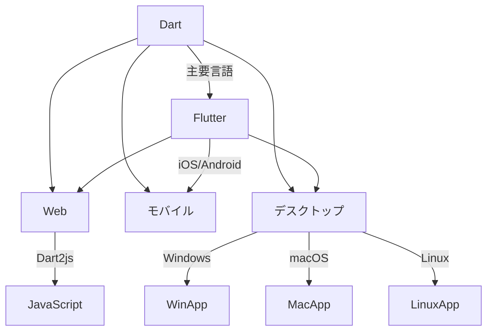

---
## 歴史と特徴
Dartは2011年にGoogleによって発表された。当初はJavaScriptの代替を目指していたが、現在はFlutterの普及によりモバイル開発言語としての地位を確立している。特徴として、静的型付けと動的型付けの両方をサポートし、JIT（Just-In-Time）およびAOT（Ahead-Of-Time）コンパイル、ガベージコレクション、Null安全、豊富な標準ライブラリを備えている。

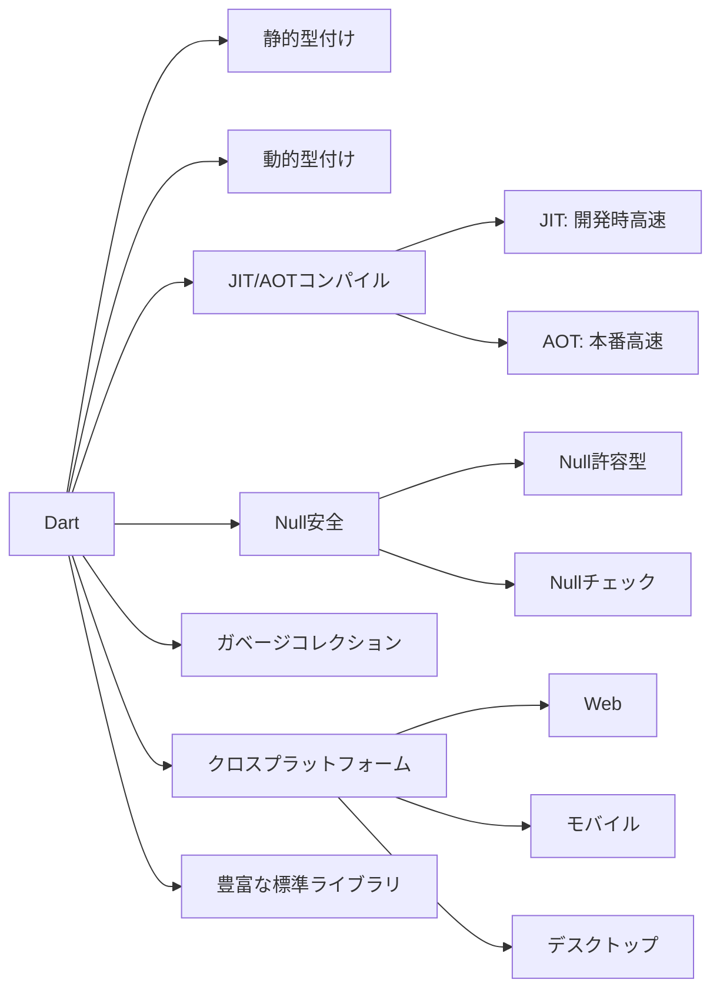

---
## インストール方法
Dart SDKは公式サイト（https://dart.dev/get-dart）からダウンロードできる。インストールはOSごとに異なるが、一般的な手順は以下の通りである。

1. インストーラまたはパッケージマネージャでSDKをインストール
2. 環境変数PATHにDart SDKのパスを追加
3. コマンドラインで`dart --version`を実行し、バージョンが表示されることを確認

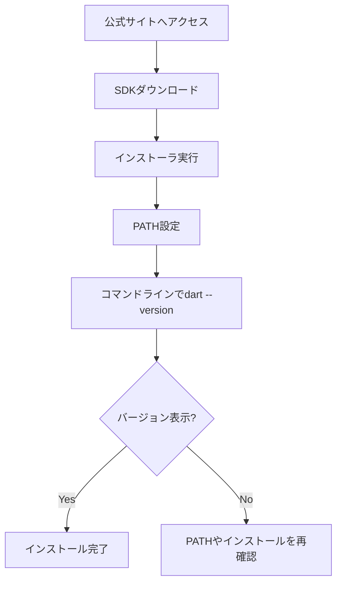

---
## 環境構築
Dart SDKのインストール後、エディタとしてVisual Studio CodeやIntelliJ IDEA、Android Studioなどを利用すると効率的である。VS Codeの場合、DartおよびFlutter拡張機能をインストールすることで、補完やデバッグ、フォーマットなどの機能が利用できる。

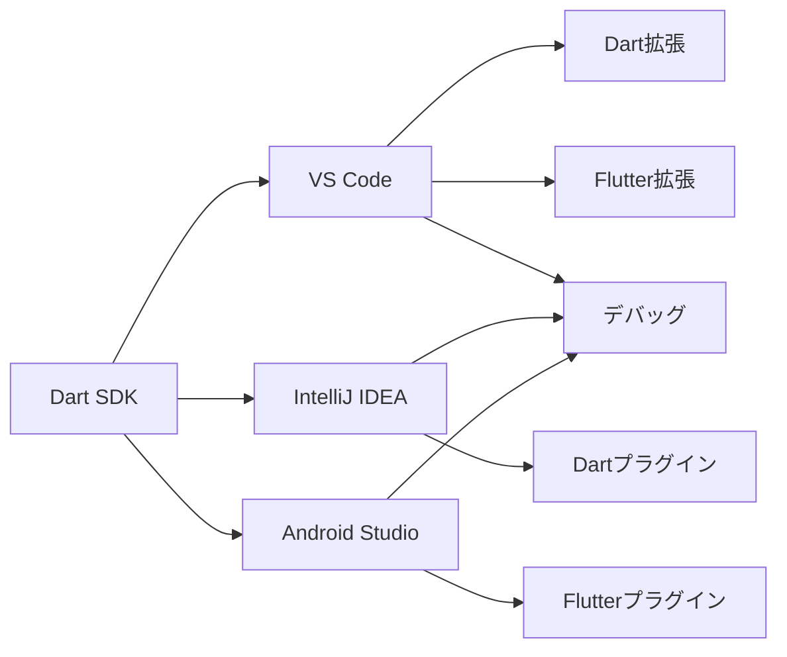

---
## プロジェクトの作成
新規プロジェクトは以下のコマンドで作成する。

```sh
dart create my_app
```
`dart create`コマンドは、CLIアプリやWebアプリ、パッケージなど複数のテンプレートをサポートしている。テンプレートを指定する場合は`-t`オプションを利用する。

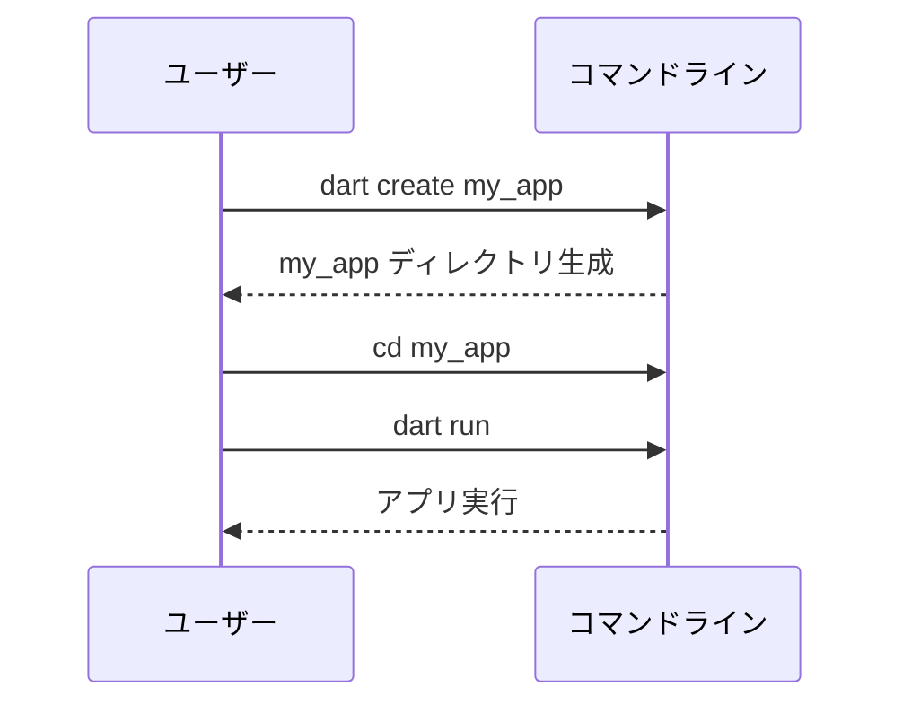

---
## ディレクトリ構成
標準的なDartプロジェクトのディレクトリ構成は以下の通りである。

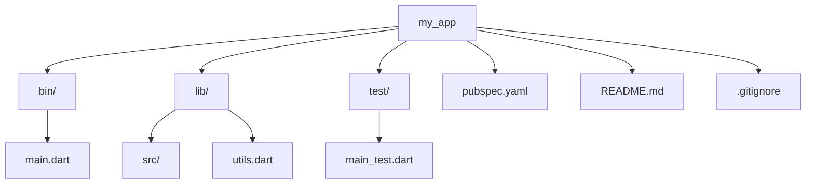
- `bin/`: エントリポイントとなる実行ファイルを配置
- `lib/`: ライブラリや主要なコードを配置
- `test/`: テストコードを配置
- `pubspec.yaml`: パッケージ管理やメタ情報を記述

---
## 基本構文
Dartの基本的な構文はC系言語に近い。main関数がエントリポイントとなる。

```dart
void main() {
  print('Hello, Dart!');
}
```
- セミコロンで文を区切る
- コメントは`//`または`/* ... */`で記述

---
## データ型
Dartは静的型付け言語であり、主なデータ型は以下の通りである。
- `int`: 整数
- `double`: 浮動小数点数
- `String`: 文字列
- `bool`: 真偽値
- `List`: 配列
- `Set`: 集合
- `Map`: 連想配列
- `dynamic`: 任意の型

```dart
int a = 10;
double b = 3.14;
String s = 'hello';
bool flag = true;
```

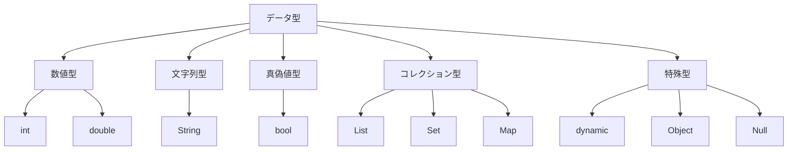

---
## 変数と定数
変数は`var`または型指定で宣言できる。定数は`final`または`const`で宣言する。

```dart
var name = 'Taro'; // 型推論
String city = 'Tokyo'; // 明示的な型指定
final age = 20; // 実行時定数
const pi = 3.14; // コンパイル時定数
```
- `final`は一度だけ代入可能
- `const`はコンパイル時に値が決定

---
## 演算子
Dartは算術演算子、比較演算子、論理演算子、ビット演算子、型判定演算子などをサポートする。

```dart
int a = 10, b = 3;
print(a + b); // 13
print(a / b); // 3.333...
print(a == b); // false
print(a is int); // true
```

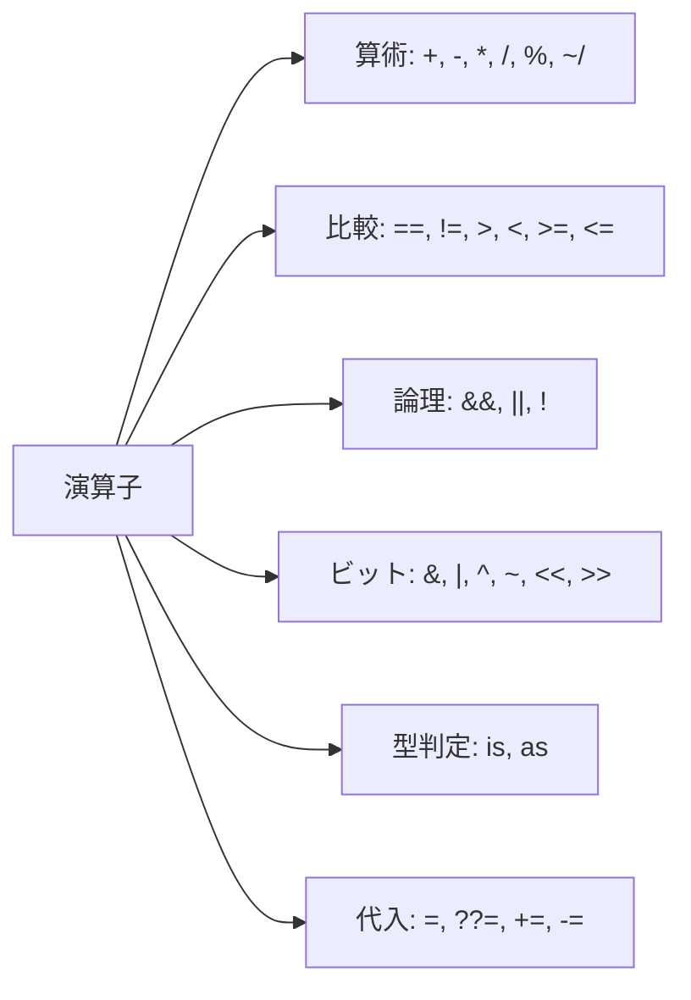

---
## 制御構文
if文、for文、while文、do-while文、switch文が利用できる。

```dart
if (a > b) {
  print('aはbより大きい');
} else {
  print('aはb以下');
}

for (int i = 0; i < 5; i++) {
  print(i);
}
```

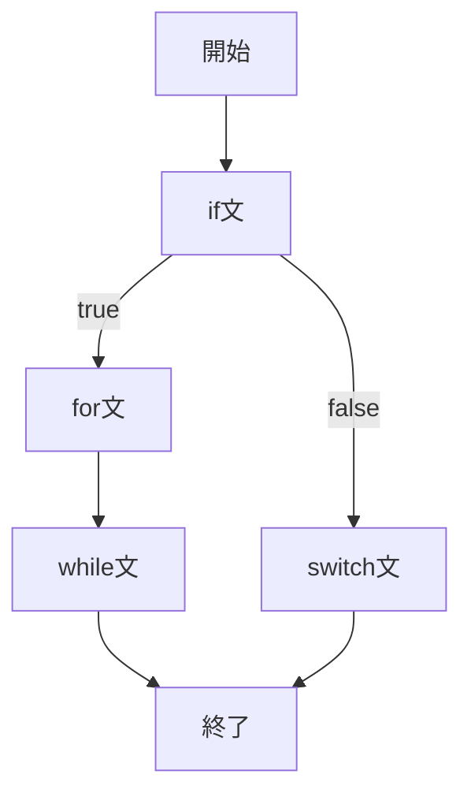

---
## コレクション（List, Set, Map）
リスト、セット、マップは以下のように扱う。

```dart
List<int> numbers = [1, 2, 3];
Set<String> fruits = {'apple', 'banana'};
Map<String, int> scores = {'math': 90, 'english': 80};
```
- Listは順序あり、重複可
- Setは順序なし、重複不可
- Mapはキーと値のペア

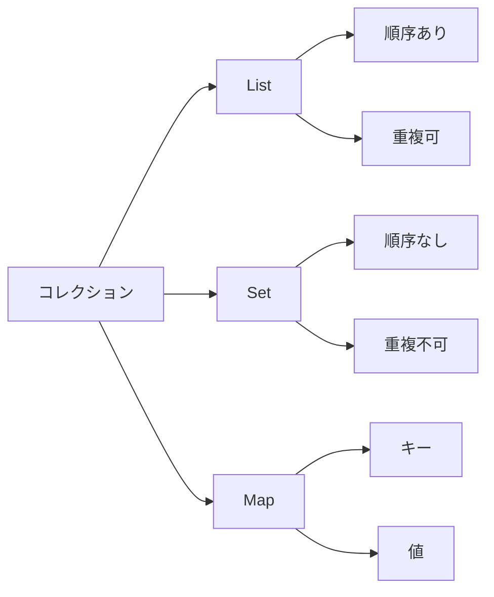

---
## イテレーション
for-in文やforEach、map、whereなどの高階関数でコレクションを反復できる。

```dart
for (var n in numbers) {
  print(n);
}

numbers.forEach((n) => print(n));
```

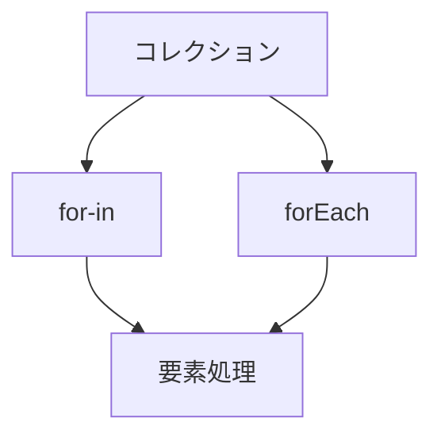

---
## Null安全
DartはNull安全をサポートしており、Nullable型は`?`で表現する。NullチェックやNull合体演算子`??`、Null安全呼び出し`?.`が利用できる。

```dart
String? name;
name = null; // 許容される
print(name ?? 'No Name');
```

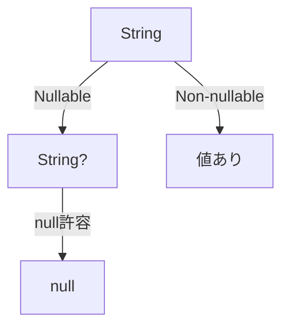

---
## 関数
関数は通常の形式、無名関数、ファットアロー（`=>`）形式で定義できる。デフォルト引数や名前付き引数もサポートする。

```dart
int add(int a, int b) {
  return a + b;
}

int sub(int a, {int b = 1}) => a - b;
```

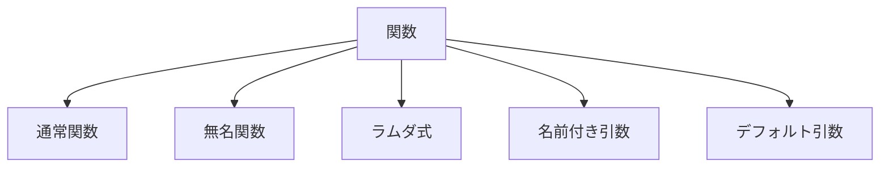

---
## ラムダ式
ラムダ式（無名関数）は関数型プログラミングで多用される。

```dart
var multiply = (int x, int y) => x * y;
```

---
## クラスとオブジェクト
Dartはクラスベースのオブジェクト指向言語であり、カプセル化、継承、ポリモーフィズムをサポートする。

```dart
class Person {
  String name;
  int age;
  Person(this.name, this.age);

  void greet() {
    print('こんにちは、$nameです。');
  }
}
```

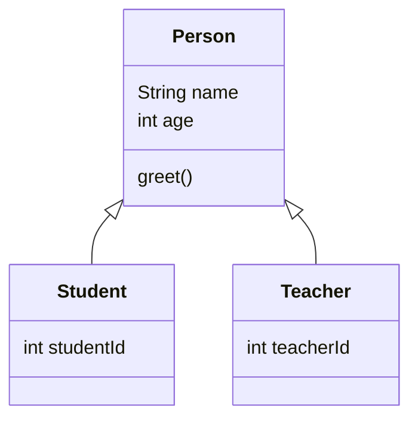

---
## コンストラクタ
コンストラクタは複数定義できる。名前付きコンストラクタや初期化リストも利用可能。

```dart
class Point {
  int x, y;
  Point(this.x, this.y);
  Point.origin() : x = 0, y = 0;
}
```

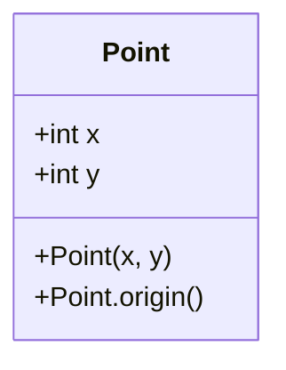

---
## ゲッターとセッター
プロパティのカプセル化や計算プロパティに利用する。

```dart
class Circle {
  double radius;
  Circle(this.radius);
  double get area => 3.14 * radius * radius;
  set diameter(double d) => radius = d / 2;
}
```

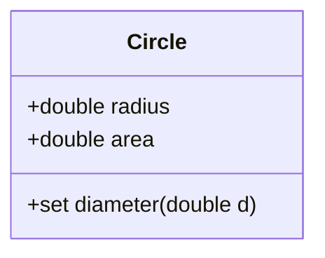

---
## 静的メンバー
`static`キーワードでクラス全体で共有されるメンバーを定義できる。

```dart
class MathUtil {
  static double pi = 3.14;
  static double square(double x) => x * x;
}
```

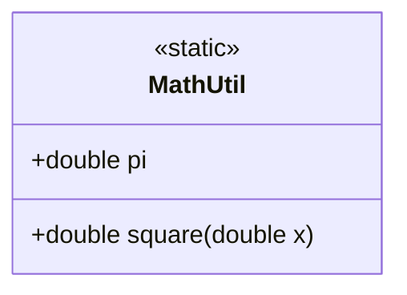

---
## 継承とミックスイン
Dartは単一継承とミックスイン（`with`）をサポートする。ミックスインは複数のクラスの機能を合成できる。

```dart
class Animal {
  void eat() => print('eat');
}
class Dog extends Animal {}
mixin Swimmer {
  void swim() => print('swimming');
}
class Fish extends Animal with Swimmer {}
```

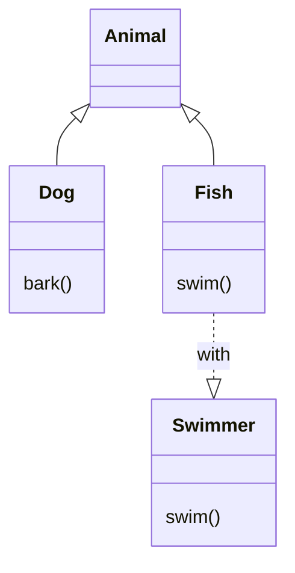

---
## 抽象クラスとインターフェース
抽象クラスは`abstract`で定義し、インターフェースとしても利用できる。Dartではすべてのクラスがインターフェースとして機能する。

```dart
abstract class Shape {
  double area();
}
class Circle extends Shape {
  double radius;
  Circle(this.radius);
  @override
  double area() => 3.14 * radius * radius;
}
```

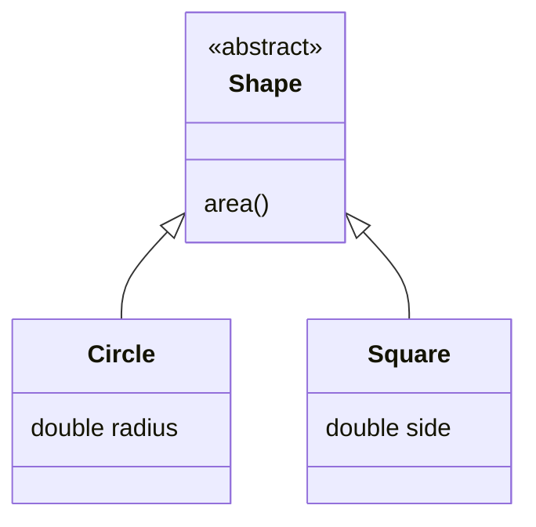

---
## ジェネリクス
ジェネリクスにより型安全なコレクションやクラスを作成できる。

```dart
List<String> names = <String>[];
class Box<T> {
  T value;
  Box(this.value);
}
```

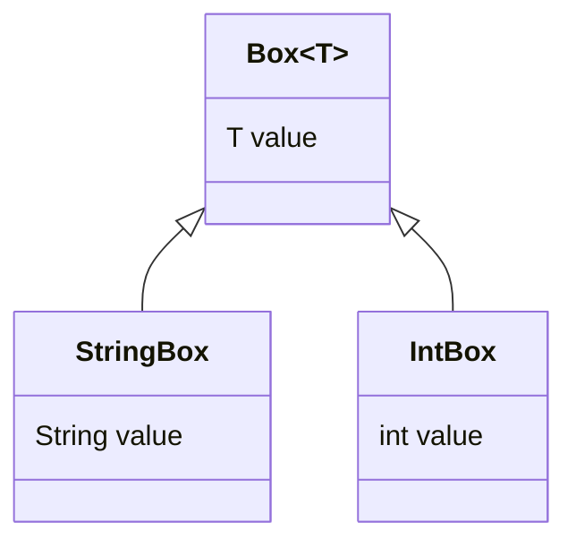

---
## 拡張メソッド
既存の型にメソッドを追加できる。

```dart
extension NumberParsing on String {
  int toInt() => int.parse(this);
}
print('123'.toInt());
```

```mermaid
%% 拡張メソッドのイメージ
classDiagram
    class String
    class NumberParsing
    String <.. NumberParsing : extension
    NumberParsing : toInt()
```

---
## 非同期処理
非同期処理は`Future`と`async`/`await`で記述する。非同期関数は`Future`型を返す。

```dart
Future<void> fetchData() async {
  await Future.delayed(Duration(seconds: 1));
  print('完了');
}
```

```mermaid
%% 非同期処理の流れ（詳細）
sequenceDiagram
    participant M as main
    participant F as fetchData
    M->>F: fetchData()呼び出し
    F-->>M: Future返却
    M->>F: await
    F-->>M: 結果
```

---
## ストリーム
ストリームは複数の非同期イベントを扱う。`await for`でストリームを消費できる。

```dart
Stream<int> countStream() async* {
  for (int i = 0; i < 3; i++) {
    yield i;
  }
}

void main() async {
  await for (var value in countStream()) {
    print(value);
  }
}
```

```mermaid
%% ストリームの流れ（詳細）
sequenceDiagram
    participant S as Stream
    participant L as Listener
    S-->>L: データ1
    S-->>L: データ2
    S-->>L: データ3
    L-->>S: listen()
```

---
## Future
Futureは1回限りの非同期処理を表す。`then`や`catchError`でコールバックを登録できる。

```dart
Future<String> fetchUser() async {
  return 'user';
}
fetchUser().then((user) => print(user));
```

```mermaid
%% Futureの利用イメージ
sequenceDiagram
    participant U as ユーザー
    participant F as Future
    U->>F: then()
    F-->>U: 結果
    F-->>U: catchError()
```

---
## 例外処理
例外は`try-catch`で処理し、`finally`で後処理を記述できる。

```dart
try {
  int x = int.parse('abc');
} catch (e) {
  print('エラー: $e');
} finally {
  print('終了');
}
```

```mermaid
%% 例外処理のフロー（詳細）
flowchart TD
    Try[try] -->|例外発生| Catch[catch]
    Try -->|正常終了| End[終了]
    Catch --> Finally[finally]
    End --> Finally
    Catch --> ErrorLog[ログ出力]
```

---
## パッケージ管理
Dartのパッケージ管理は`pub`で行う。依存関係やバージョン管理は`pubspec.yaml`で記述する。

```yaml
name: my_app
description: サンプルアプリ
dependencies:
  http: ^0.14.0
dev_dependencies:
  test: ^1.16.0
```

```mermaid
%% パッケージ管理の流れ
flowchart TD
    A[pubspec.yaml編集] --> B[dart pub get]
    B --> C[依存パッケージ取得]
    C --> D[プロジェクトで利用可能]
```

---
## 外部パッケージの利用
外部パッケージは`pubspec.yaml`に記載し、`dart pub get`で取得する。インポートして利用する。

```dart
import 'package:http/http.dart' as http;
```

```mermaid
%% 外部パッケージ利用の流れ
flowchart TD
    A[pubspec.yamlに記載] --> B[dart pub get]
    B --> C[importで利用]
    C --> D[コードで呼び出し]
```

---
## よく使うコマンド
- プロジェクト作成: `dart create`
- 実行: `dart run`
- テスト: `dart test`
- パッケージ取得: `dart pub get`
- 静的解析: `dart analyze`
- フォーマット: `dart format .`

```mermaid
%% コマンドの利用フロー
flowchart TD
    A[dart create] --> B[プロジェクト作成]
    B --> C[dart pub get]
    C --> D[依存取得]
    D --> E[dart run]
    E --> F[実行]
    D --> G[dart test]
    G --> H[テスト実行]
```

---
## テスト
Dartでは`test`パッケージを利用して単体テストやグループテストを記述できる。

```dart
import 'package:test/test.dart';

void main() {
  group('加算テスト', () {
    test('1 + 1 = 2', () {
      expect(1 + 1, 2);
    });
    test('2 + 2 = 4', () {
      expect(2 + 2, 4);
    });
  });
}
```

```mermaid
%% テストの流れ（詳細）
sequenceDiagram
    participant U as ユーザー
    participant T as テストフレームワーク
    participant C as コード
    U->>T: テスト実行
    T->>C: テストケース呼び出し
    C-->>T: 結果返却
    T-->>U: 結果出力
```

---
## モックとスタブ
テストで依存オブジェクトを置き換えるためにモックやスタブを利用する。`mockito`パッケージなどが代表的である。

```dart
import 'package:mockito/mockito.dart';

class MockClient extends Mock implements http.Client {}
```

```mermaid
%% モック・スタブの利用関係
classDiagram
    class Service
    class MockService
    class Test
    Service <|-- MockService
    Test --> MockService : 利用
```

---
## 開発ツール
主な開発ツールは以下の通りである。
- Dart DevTools: プロファイリングやデバッグ、メモリ解析
- VS Code拡張: コード補完、デバッグ、フォーマット
- IntelliJ/Android Studio: 高機能IDE

```mermaid
%% 開発ツールの関係
graph TD
    A[開発者] --> B[VS Code]
    A --> C[IntelliJ]
    A --> D[Android Studio]
    B --> E[Dart拡張]
    B --> F[Flutter拡張]
    B --> G[Dart DevTools]
    C --> G
    D --> G
```

---
## デバッグ
Dart DevToolsやIDEのデバッガを利用してブレークポイント設定、ステップ実行、変数ウォッチなどが可能である。

```mermaid
%% デバッグの流れ
sequenceDiagram
    participant Dev as 開発者
    participant IDE as IDE
    participant App as アプリ
    Dev->>IDE: ブレークポイント設定
    IDE->>App: 実行
    App-->>IDE: 停止
    IDE-->>Dev: 変数ウォッチ・ステップ実行
```

---
## コーディング規約
公式の`dartfmt`や`dart analyze`でコードスタイルや静的解析を行う。命名規則やインデント、コメントの書き方なども推奨されている。

```mermaid
%% コーディング規約の適用
flowchart TD
    A[コード記述] --> B[dart format]
    B --> C[整形]
    C --> D[dart analyze]
    D --> E[静的解析]
    E --> F[警告・エラー表示]
```

---
## ドキュメンテーション
Dartでは`///`でドキュメントコメントを記述し、`dart doc`でAPIドキュメントを生成できる。Markdown記法も利用可能である。

```dart
/// これはサンプル関数である
int add(int a, int b) => a + b;
```

```mermaid
%% ドキュメント生成の流れ
flowchart TD
    A["///コメント記述"] --> B["dart doc"]
    B --> C["APIドキュメント生成"]
    C --> D["HTML出力"]
```

---
## よくあるエラーと対処法
- Null参照エラー：Null安全を活用し、Nullable型を適切に扱うこと。
- 型エラー：型推論や明示的な型指定を活用すること。
- パッケージの依存関係エラー：`dart pub get`や`pubspec.yaml`の記述を見直すこと。
- 実行時エラー：例外処理やデバッグツールを活用すること。

```mermaid
%% エラーと対処法のフロー
flowchart TD
    A[エラー発生] --> B[エラーメッセージ確認]
    B --> C[原因特定]
    C --> D[対処法調査]
    D --> E[修正]
    E --> F[再実行]
    F -->|解決| G[完了]
    F -->|未解決| B
```

---
## ベストプラクティス
- 型安全を意識し、Nullable型や型推論を適切に使うこと
- コードの再利用性を高めるために関数やクラスを小さく保つこと
- パッケージ分割やレイヤー設計を意識すること
- テストコードを充実させること
- コーディング規約や静的解析を活用すること

```mermaid
%% ベストプラクティスの関係
graph TD
    A[型安全] --> B[Nullable型の活用]
    A --> C[型推論]
    D[再利用性] --> E[小さな関数・クラス]
    D --> F[パッケージ分割]
    G[テスト] --> H[単体テスト]
    G --> I[モック・スタブ]
    J[規約] --> K[静的解析]
    J --> L[フォーマット]
```

---
## 参考リンク
- [Dart公式サイト](https://dart.dev/)
- [Dart言語ツアー](https://dart.dev/guides/language/language-tour)
- [Flutter公式サイト](https://flutter.dev/)
- [DartPad（オンライン実行環境）](https://dartpad.dev/)
---