# Flutter

---

## 概要

FlutterはGoogleが開発したクロスプラットフォーム対応のUIフレームワークである。単一のコードベースからiOS、Android、Web、デスクトップアプリを構築できる。Dart言語を用い、宣言的なUI構築と高いパフォーマンスを両立している。オープンソースであり、世界中の開発者コミュニティによって活発にメンテナンス・拡張が行われている。

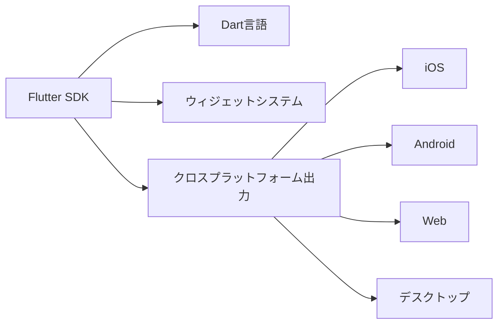

---

## Flutterとは

Flutterは、Dartプログラミング言語を基盤とし、ウィジェットベースの設計思想を持つアプリケーション開発フレームワークである。UIの各要素をウィジェットとして構築し、レイアウトやスタイル、動作を柔軟にカスタマイズできる。ネイティブコードへのコンパイルにより、プラットフォーム固有のパフォーマンスを実現する。

---

## 開発思想

Flutterの開発思想は「すべてはウィジェット」である。UIの最小単位から画面全体まで、すべてがウィジェットとして表現される。これにより、再利用性・保守性・拡張性が高いコード設計が可能となる。また、宣言的UI構築を重視し、状態変化に応じてUIを自動的に再描画する仕組みを持つ。ホットリロード機能により、コード変更を即座にアプリに反映できるため、開発効率が大幅に向上する。

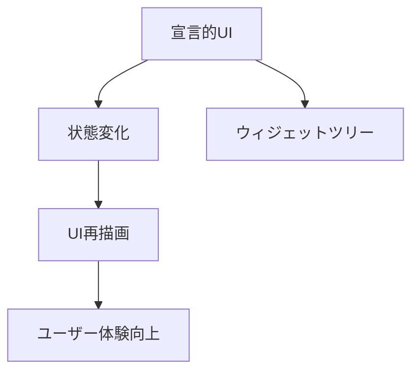

---

## Flutterの歴史とバージョン変遷

- 2015年：Google内部プロジェクト「Sky」として開発開始
- 2017年：Flutterベータ版公開、開発者コミュニティ拡大
- 2018年：Flutter 1.0正式リリース。iOS/Android対応
- 2020年：Flutter 1.12で安定性向上、Webサポートのベータ開始
- 2021年：Flutter 2.0リリース。Web・デスクトップ（Windows/macOS/Linux）対応が安定版に
- 2022年以降：安定性・パフォーマンス向上、Material 3対応、DartのNull Safety導入など継続的な進化

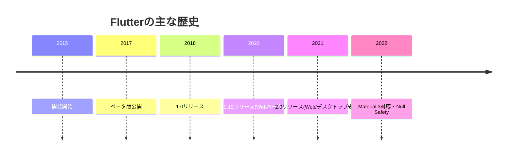

---

## Flutterの主な特徴

- クロスプラットフォーム対応：単一コードベースで複数プラットフォームに対応
- ホットリロード：コード変更を即座にアプリへ反映し、開発効率を向上
- 豊富なウィジェット群：Material DesignやCupertinoなど、標準で多様なUI部品を提供
- ネイティブに近いパフォーマンス：DartのAOTコンパイルとSkiaエンジンにより高速描画を実現
- オープンソース：活発なコミュニティと豊富なサードパーティパッケージ

---

## アーキテクチャ概要

Flutterのアーキテクチャは、アプリケーション層・フレームワーク層・エンジン層・プラットフォーム層に分かれる。

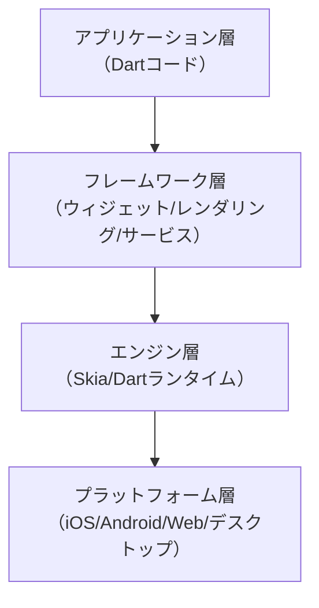

- アプリケーション層：開発者が記述するDartコード（UI・ロジック）
- フレームワーク層：ウィジェットツリー、レンダリング、アニメーション、サービスなど
- エンジン層：C++で実装されたSkia描画エンジン、Dartランタイム
- プラットフォーム層：OSごとのAPI呼び出し、ネイティブコード連携

---

## ウィジェットシステム

FlutterのUIはStatelessWidget（不変）とStatefulWidget（状態を持つ）の2種類のウィジェットを基本とする。ウィジェットはツリー構造で管理され、親子関係によってレイアウトやイベント伝播が制御される。カスタムウィジェットの作成も容易であり、複雑なUIもシンプルに構築できる。

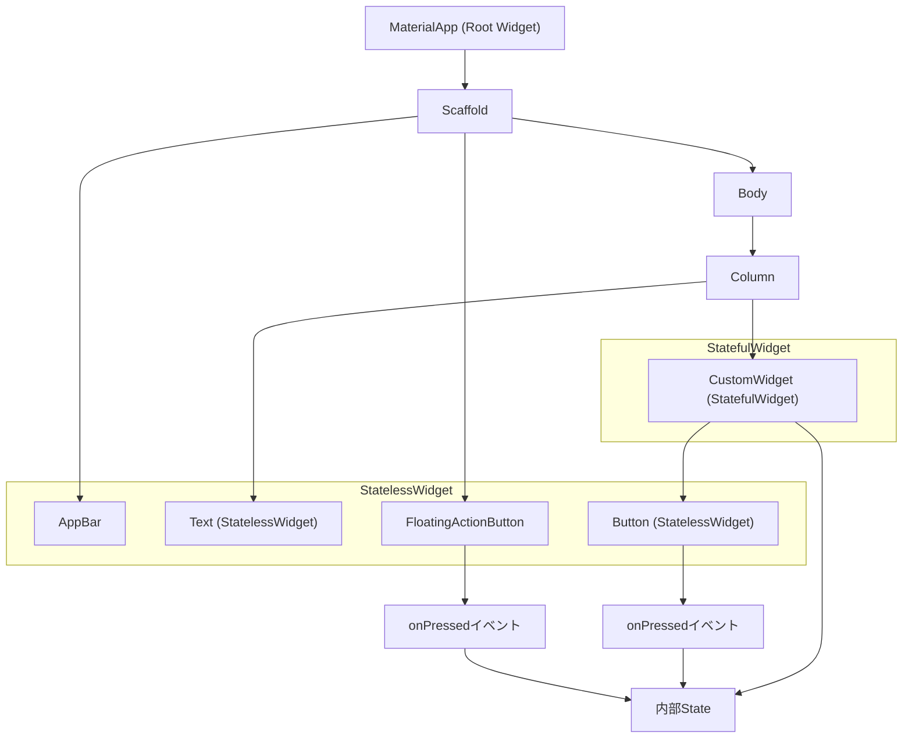

- ルートウィジェット（MaterialApp）からScaffold、AppBar、Bodyなどがツリー構造で展開される。
- Body内に複数のStatelessWidgetやStatefulWidgetが混在し、StatefulWidgetは内部状態（State）を持つ。
- ボタンなどのイベントはStatefulWidgetの状態を変更し、setStateによって再描画が発生する。
- StatelessWidgetは状態を持たず、常に同じ描画結果を返す。

---

## レンダリングエンジン

FlutterはSkiaという高性能2Dグラフィックスエンジンを利用し、各プラットフォームで一貫したUI描画を実現する。DartコードはAOT（Ahead-of-Time）コンパイルされ、ネイティブコードとして実行されるため、アニメーションや描画のパフォーマンスが高い。

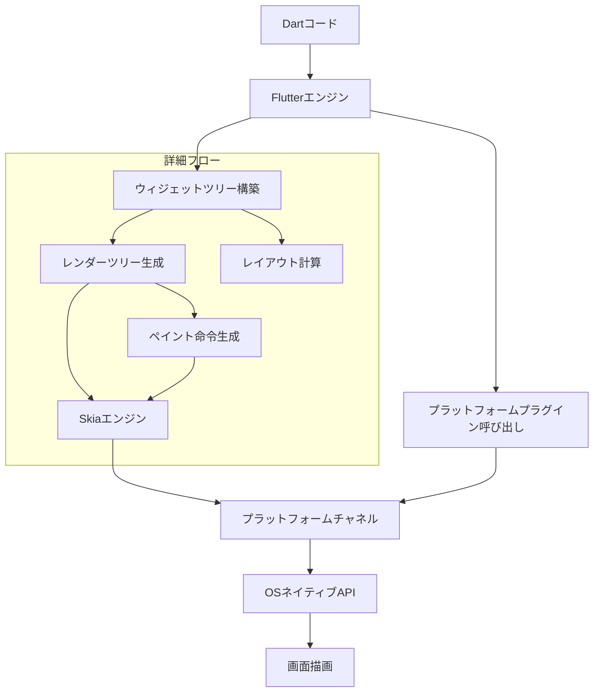

- Dartコードでウィジェットツリーを構築し、レンダーツリーへ変換する。
- レンダーツリーはレイアウト計算・ペイント命令生成を経てSkiaエンジンへ渡される。
- Skiaエンジンがプラットフォームチャネル経由でOSのネイティブAPIを呼び出し、最終的に画面へ描画される。
- プラットフォームプラグインもチャネルを通じて連携される。

---

## 状態管理の手法

状態管理はFlutterアプリの設計で重要な要素である。小規模アプリではsetStateによるローカルな状態管理が有効だが、中〜大規模アプリではProvider、Riverpod、Bloc、Redux、GetXなどのパターンが推奨される。状態管理の選択は、アプリの規模・複雑さ・チーム構成に応じて最適化すべきである。

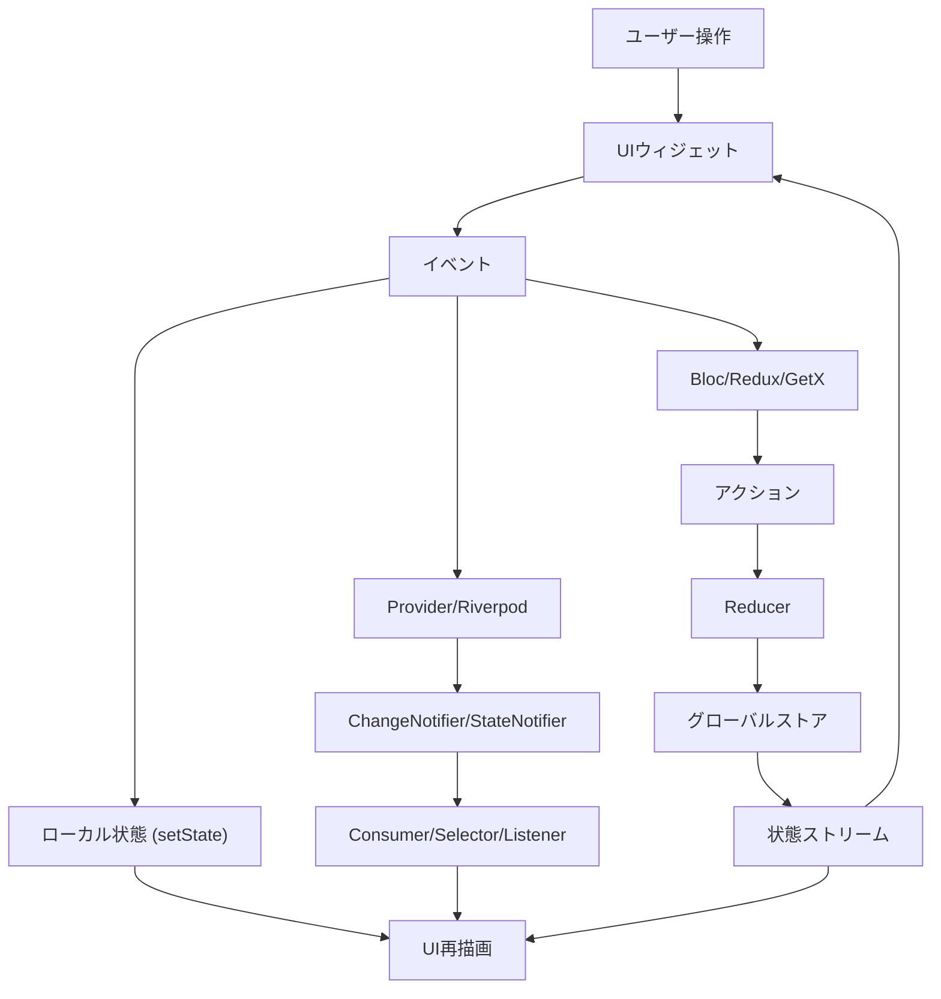

- setStateはウィジェット単位のローカル状態管理に適する。
- ProviderやRiverpodはChangeNotifierやStateNotifierを用いてグローバルな状態共有や依存注入を実現する。
- BlocやReduxはイベント・アクション・リデューサ・ストアによる状態遷移とストリーム購読で大規模な状態管理に対応する。
- 状態の変更はリスナーやUIに伝播し、必要な部分のみ再描画される。

---

## 開発環境のセットアップ

1. [公式サイト](https://docs.flutter.dev/get-started/install)からFlutter SDKをダウンロードし、パスを通す
2. Dart SDKはFlutter SDKに同梱されている
3. Android StudioまたはVisual Studio Codeをインストールし、Flutter/Dartプラグインを追加
4. `flutter doctor`コマンドでセットアップ状況を確認し、不足があれば指示に従い対応

---

## 推奨IDEとツール

- **Android Studio**：公式推奨。エミュレータやデバッグ機能が充実
- **Visual Studio Code**：軽量で拡張性が高い。Flutter/Dartプラグインで快適な開発が可能
- **Flutter DevTools**：パフォーマンス解析、ウィジェットツリーの可視化、メモリ・CPUプロファイリングなど

---

## エコシステムとパッケージ管理

Flutterのパッケージは[pub.dev](https://pub.dev/)で管理される。依存関係は`pubspec.yaml`で宣言し、`flutter pub get`で取得する。公式・サードパーティ製の多様なパッケージが利用可能であり、ネットワーク通信、データベース、認証、UI拡張など幅広い用途をカバーする。

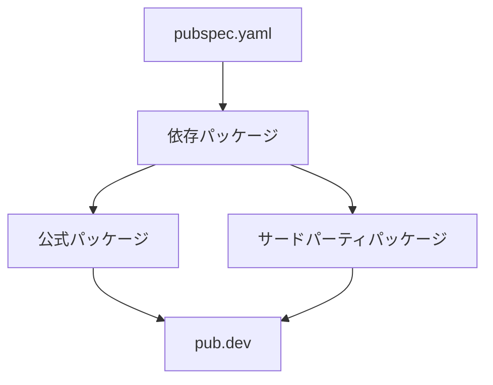

---

## サポートされているプラットフォーム一覧

- **iOS**：iOS 11以降
- **Android**：Android 5.0（API 21）以降
- **Web**：主要ブラウザ（Chrome, Edge, Firefox, Safari等）
- **Windows**：Windows 7以降
- **macOS**：macOS 10.11以降
- **Linux**：主要ディストリビューション

---

## パフォーマンス最適化のポイント

- ウィジェットの再構築を最小限に抑えるため、`const`ウィジェットや`shouldRebuild`の活用
- 画像やアニメーションはキャッシュや圧縮を利用し、メモリ消費を抑制
- リスト表示には`ListView.builder`などの遅延生成ウィジェットを利用
- パフォーマンス測定にはFlutter DevToolsのプロファイラを活用

---

## UI設計のベストプラクティス

- レスポンシブデザイン：`MediaQuery`や`LayoutBuilder`で画面サイズに応じたレイアウトを実装
- テーマ設定：`ThemeData`でアプリ全体の色・フォント・スタイルを統一
- アクセシビリティ：`Semantics`ウィジェットやラベル付与で支援技術に対応
- アニメーション：`Animated*`ウィジェットや`AnimationController`で滑らかな動きを実現

---

## テスト戦略（ユニット・ウィジェット・統合）

- **ユニットテスト**：ビジネスロジックや関数単位の検証。`test`パッケージを利用
- **ウィジェットテスト**：UIの見た目や動作の検証。`flutter_test`パッケージで実装
- **統合テスト**：アプリ全体のフローや画面遷移の検証。`integration_test`パッケージを利用し、実機やエミュレータで自動テストを実行

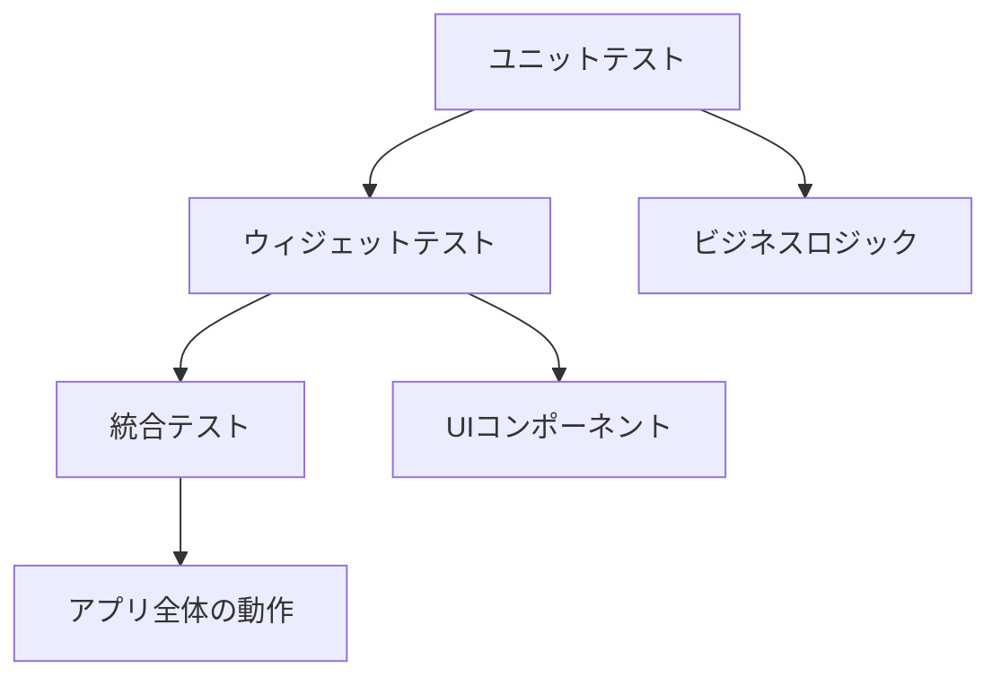

---

## セキュリティ対策

- 通信は必ずHTTPSを利用し、証明書ピンニングも検討する
- 機密情報は`flutter_secure_storage`などのセキュアストレージに保存
- 入力値検証やサニタイズを徹底し、XSSやSQLインジェクション等のリスクを低減
- サードパーティパッケージの脆弱性にも注意する

---

## デバッグ手法

- **Flutter DevTools**でウィジェットツリーやパフォーマンスを可視化
- `print`や`debugPrint`によるログ出力
- IDEのブレークポイントやステップ実行
- `flutter analyze`で静的解析を実施し、コード品質を保つ

---

## デプロイ手順（iOS/Android/Web/デスクトップ）

1. `flutter build`コマンドで各プラットフォーム向けにビルド
2. iOSはXcodeで署名・アーカイブし、App Store Connectへ申請
3. Androidは署名付きAPK/AABを生成し、Google Play Consoleへ申請
4. Webは`build/web`ディレクトリをWebサーバへ配置
5. デスクトップは各OSの配布形式（exe, dmg, deb等）で配布

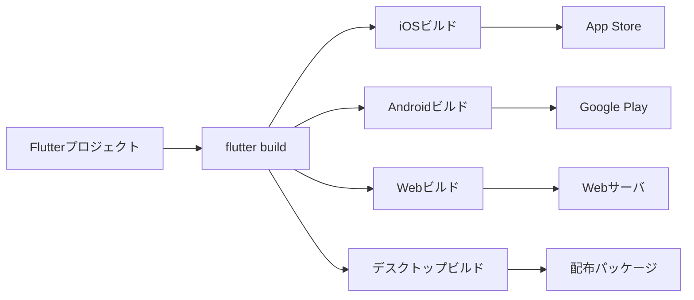

---

## バージョン管理とCI/CD

- Gitでソースコード・ブランチ管理を行う
- GitHub ActionsやBitrise、CodemagicなどのCI/CDサービスで自動ビルド・テスト・デプロイを構築
- `flutter test`や`flutter analyze`をCIパイプラインに組み込むことで品質を担保

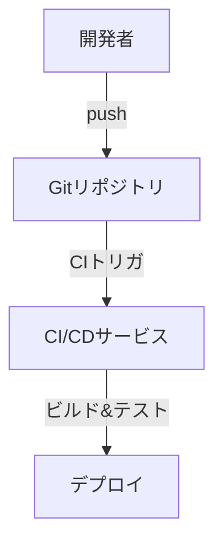

---

## 公式・サードパーティ製プラグイン

- **公式**：`shared_preferences`（ローカルストレージ）、`url_launcher`（外部リンク起動）、`path_provider`（ファイルパス取得）など
- **サードパーティ**：`firebase_core`（Firebase連携）、`dio`（HTTPクライアント）、`provider`（状態管理）、`image_picker`（画像選択）など

---

## サードパーティ製ライブラリの選定基準

- メンテナンス状況（最終更新日、Issue対応状況）
- 利用実績（pub.devのスコアやダウンロード数）
- ドキュメントやサンプルコードの充実度
- ライセンスの確認（商用利用可否）

---

## コミュニティとサポートチャネル

- Flutter公式フォーラム、Stack Overflow、GitHub Issuesで技術的な質問や議論が可能
- TwitterやDiscord、SlackなどのSNSでも情報交換が活発
- 日本語コミュニティも存在し、勉強会やイベントが開催されている

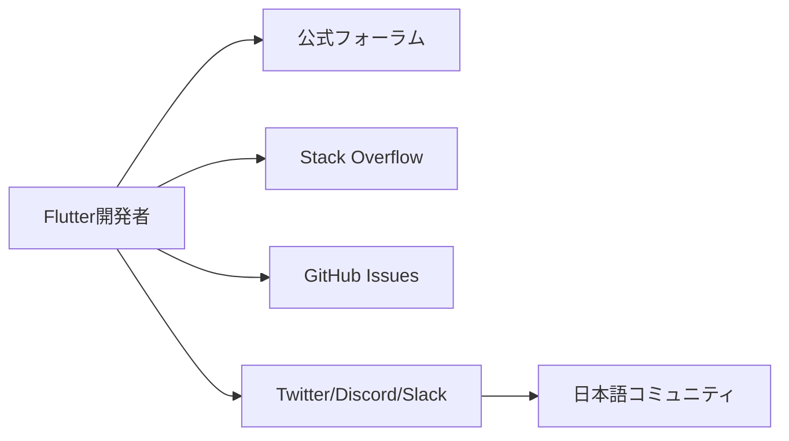

---

## 公式ドキュメント・学習リソース

- [Flutter公式ドキュメント](https://docs.flutter.dev/)：セットアップから応用まで網羅
- [Dart公式ドキュメント](https://dart.dev/guides)：言語仕様や標準ライブラリ
- [Flutter Codelabs](https://codelabs.developers.google.com/?cat=Flutter)：実践的なチュートリアル
- YouTubeやUdemyなどの動画教材も豊富

---

## サンプルコード集

```dart
// カウンターアプリの例
import 'package:flutter/material.dart';

void main() => runApp(const MyApp());

class MyApp extends StatelessWidget {
  const MyApp({super.key});
  @override
  Widget build(BuildContext context) {
    return MaterialApp(
      home: Scaffold(
        appBar: AppBar(title: const Text('Flutter Demo')),
        body: const Center(child: CounterWidget()),
      ),
    );
  }
}

class CounterWidget extends StatefulWidget {
  const CounterWidget({super.key});
  @override
  State<CounterWidget> createState() => _CounterWidgetState();
}

class _CounterWidgetState extends State<CounterWidget> {
  int _count = 0;
  @override
  Widget build(BuildContext context) {
    return Column(
      mainAxisAlignment: MainAxisAlignment.center,
      children: [
        Text('$_count', style: const TextStyle(fontSize: 32)),
        ElevatedButton(
          onPressed: () => setState(() => _count++),
          child: const Text('Increment'),
        ),
      ],
    );
  }
}
```

- 公式サンプル：[Flutter Gallery](https://gallery.flutter.dev/)や[Awesome Flutter](https://github.com/Solido/awesome-flutter)も参照

---

## よくある質問（FAQ）

- Q. Flutterは無料であるか。  
  A. はい、オープンソースで無料である。

- Q. ネイティブアプリと比べてパフォーマンスはどうか。  
  A. ほぼ同等のパフォーマンスを実現できる。

- Q. 既存のネイティブコードと連携できるか。  
  A. プラットフォームチャネルを利用して、ネイティブコード（Java/Kotlin/Swift/Objective-C）と連携可能である。

- Q. Flutterでゲーム開発は可能か。  
  A. 2Dゲームであれば`Flame`などのゲームエンジンを利用して開発可能である。

---

## トラブルシューティングガイド

- ビルドエラー時は`flutter clean`を実行し、キャッシュをクリアする
- 依存関係の不整合は`flutter pub get`で解決する
- エミュレータや実機で動作しない場合は、`flutter doctor`で環境を確認し、指示に従う
- プラグインのバージョン不一致は`pubspec.yaml`を見直し、互換性を確認する

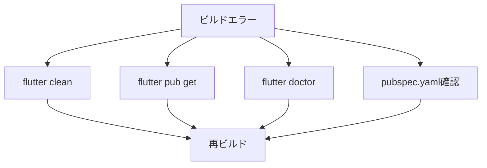

---

## 参考リンク・書籍

- [Flutter公式サイト](https://flutter.dev/)
- [Google Codelabs: Flutter](https://codelabs.developers.google.com/?cat=Flutter)
- [Awesome Flutter (GitHub)](https://github.com/Solido/awesome-flutter)
- 書籍：『Flutter逆引きハンドブック』『基礎から学ぶFlutter』『Flutterモバイルアプリ開発バイブル』

---