# Go

---

## 概要

GoはGoogleによって2007年から開発が始まり、2009年にオープンソースとして公開された静的型付け・コンパイル型のプログラミング言語である。C言語のシンプルさとパフォーマンス、現代的な言語設計、並行処理の容易さを兼ね備えている。主にサーバーサイドやクラウドネイティブなシステム、マイクロサービス、ネットワークツール、CLIツールなどで広く利用されている。

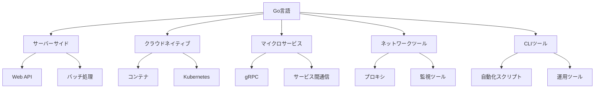

---

## 歴史

Goは、Googleのエンジニアであるロブ・パイク、ケン・トンプソン、ロバート・グリースマーによって設計された。C++やJavaのビルド速度や複雑さに対する不満から、よりシンプルで高速な言語を目指して開発された。2009年に最初のバージョンが公開され、2012年にバージョン1.0がリリースされた。以降は後方互換性を重視しつつ、標準ライブラリやツールチェーンの拡充、ジェネリクスの導入など進化を続けている。

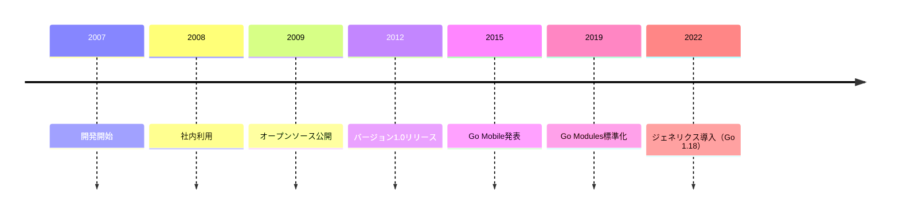

---

## 特徴

- **シンプルで読みやすい構文**：冗長な記述を排除し、誰が書いても同じようなコードになるよう設計されている。
- **高速なコンパイル**：大規模なプロジェクトでも数秒でビルドが完了する。
- **ガベージコレクション搭載**：メモリ管理が自動化されている。
- **並行処理をサポートするゴルーチン**：軽量スレッドであるゴルーチンとチャネルにより、並行処理が容易に実装できる。
- **クロスプラットフォーム対応**：主要なOS・CPUアーキテクチャ向けにクロスコンパイルが可能。
- **豊富な標準ライブラリ**：ネットワーク、暗号化、Webサーバー、テストなど多くの機能を標準で提供。

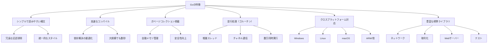

---

## 基本構文

Goの基本的な構文例を以下に示す。型推論や短縮変数宣言、複数値の返却など、Go独自の特徴がある。

```go
package main

import "fmt"

func add(a int, b int) int {
    return a + b
}

func main() {
    message := "Hello, World!"
    fmt.Println(message)
    sum := add(3, 5)
    fmt.Println("3 + 5 =", sum)
}
```

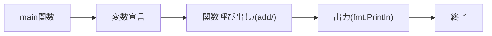

---

## パッケージ管理

Goは標準で`go mod`によるモジュール管理をサポートしている。依存関係の管理やバージョン管理が容易であり、`go.mod`ファイルによりプロジェクトの再現性が担保される。

```sh
go mod init example.com/myapp
go get github.com/gin-gonic/gin@v1.8.2
go mod tidy
```

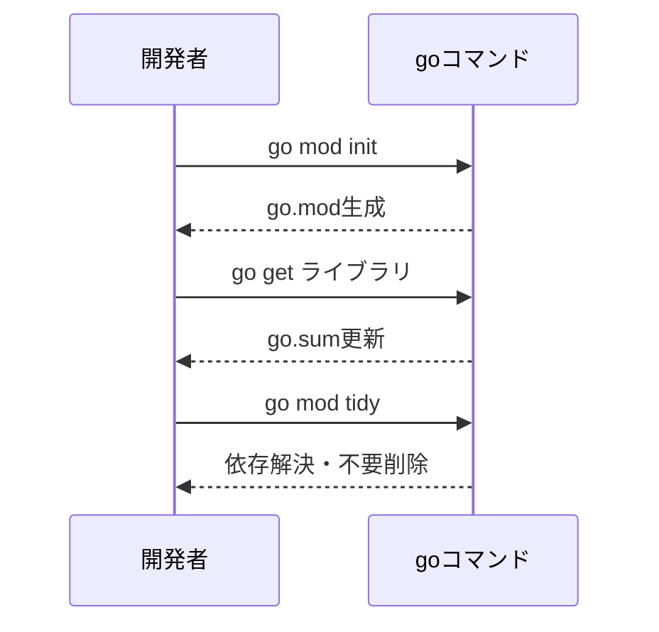

---

## 開発ツール

- **goコマンド**：ビルド、テスト、フォーマット、依存管理など多機能な公式CLI。
- **gopls**：Go公式のLanguage Server Protocolサーバーで、エディタ補完やリファクタリングを支援。
- **Delve**：Go専用のデバッガ。ブレークポイントやステップ実行、変数ウォッチが可能。
- **golangci-lint**：複数のリンターを統合して実行できるツール。
- **godoc**：Goコードから自動でドキュメントを生成するツール。

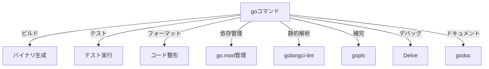

---

## エコシステム

GoにはWebフレームワーク、ORM、テストツール、クラウドSDK、CLIツールなど多様なサードパーティ製ライブラリが存在する。公式のパッケージリポジトリ`pkg.go.dev`で検索・利用が可能である。

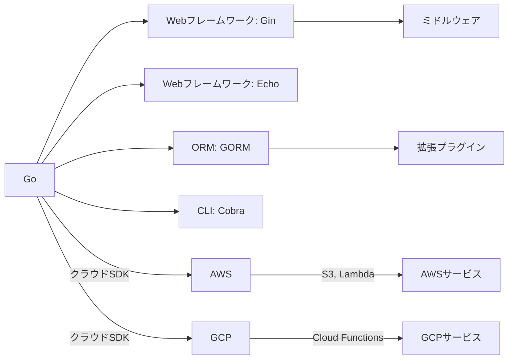

---

## よくある課題

- **ジェネリクス導入前の型再利用性の低さ**：Go 1.18以前はジェネリクスがなく、型ごとに同じようなコードを書く必要があった。
- **エラーハンドリングの冗長さ**：関数呼び出しごとにエラー判定が必要で、コードが冗長になりやすい。
- **サードパーティ製ライブラリの品質差**：公式でないライブラリはメンテナンス状況や品質にばらつきがあるため、選定時に注意が必要である。
- **GUIアプリ開発の選択肢が少ない**：Goは主にサーバーサイドやCLI向けであり、GUI開発には向かない。

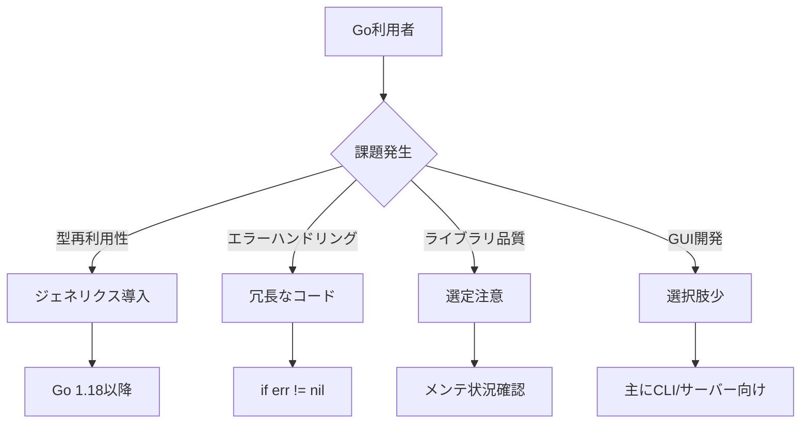

---

## ベストプラクティス

- **gofmtによるコード整形**：全てのGoコードは`gofmt`で自動整形し、可読性と一貫性を保つ。
- **明確なエラーハンドリング**：エラーは必ずチェックし、適切に処理またはラップして返す。
- **パッケージ分割の徹底**：機能ごとにパッケージを分割し、責任範囲を明確にする。
- **標準ライブラリの積極的活用**：まず標準ライブラリで実現できるか検討し、サードパーティは必要最小限にとどめる。
- **インターフェースによる抽象化**：テスト容易性や拡張性のため、インターフェースを活用する。

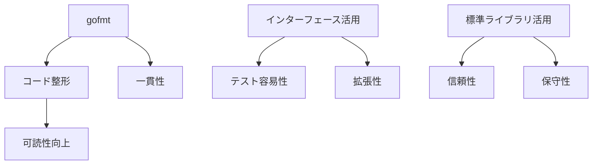

---

## セキュリティ

Goは型安全性が高く、バッファオーバーフローやメモリ破壊などの脆弱性が発生しにくい。標準ライブラリもセキュリティを考慮して設計されている。ただし、外部からの入力値検証や依存パッケージの脆弱性、認証・認可の実装には注意が必要である。

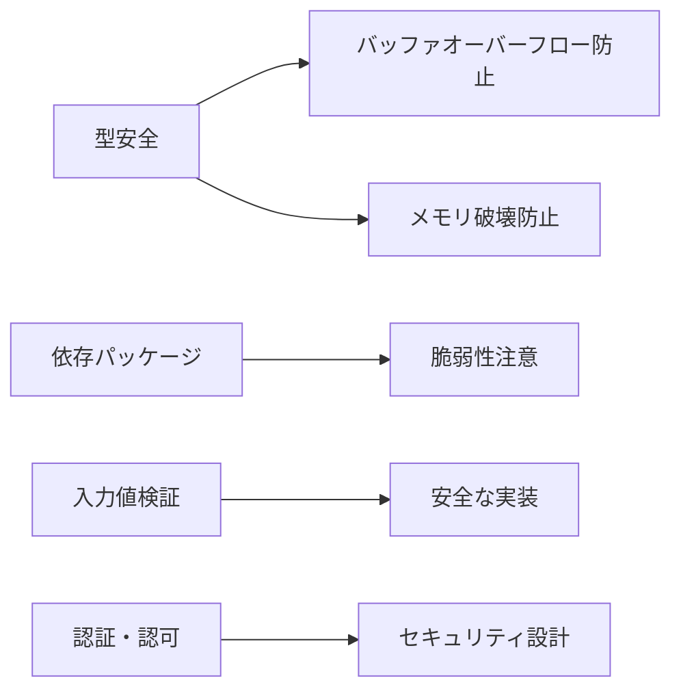

---

## パフォーマンス最適化

GoはC言語に匹敵する実行速度を持つが、パフォーマンスチューニングも重要である。プロファイリングツール（`pprof`）でボトルネックを特定し、ガーベジコレクションやgoroutineの数、チャネルの使い方などを最適化する。

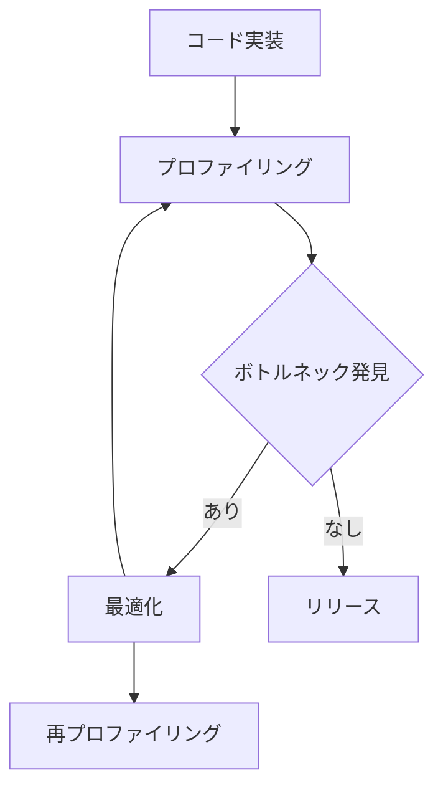

---

## テストとデバッグ

Goは標準で`testing`パッケージを備え、ユニットテスト・テーブル駆動テスト・ベンチマークテストが容易に記述できる。`go test`コマンドで自動実行でき、カバレッジ計測も可能である。Delveを用いたデバッグや、`race`オプションによるデータ競合検出もサポートされている。

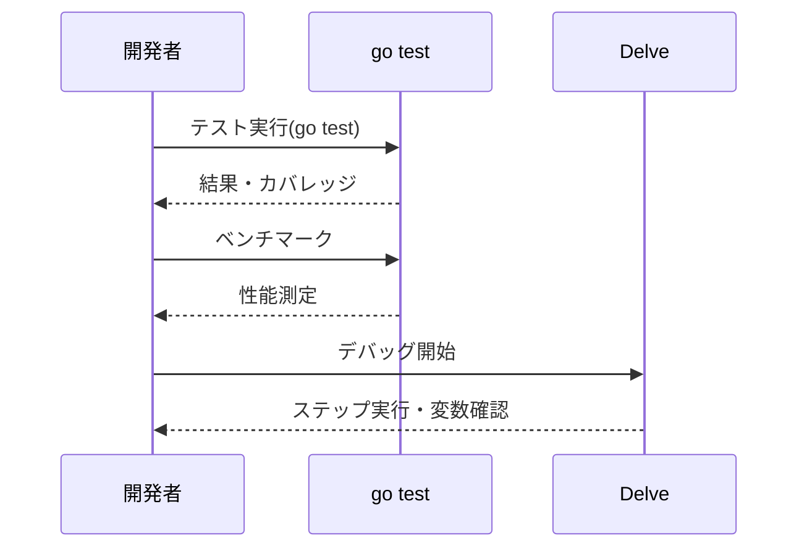

---

## 主要なフレームワーク

- **Gin**：高速なWebフレームワーク。ミドルウェアやルーティングが充実。
- **Echo**：シンプルかつ高性能なWebフレームワーク。
- **GORM**：Go向けのORM。DB操作を抽象化できる。
- **Cobra**：CLIツール作成用フレームワーク。コマンド階層やフラグ管理が容易。

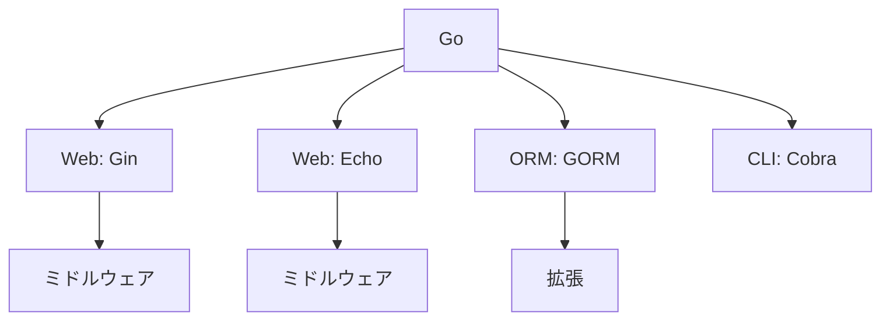

---

## コーディングスタイル

Goは`gofmt`による統一的なコードフォーマットを推奨している。命名規則はパッケージ名は小文字、エクスポートする識別子は大文字始まり、変数名は短く簡潔にする。パッケージ構成やインポート順序も公式ガイドラインに従うべきである。

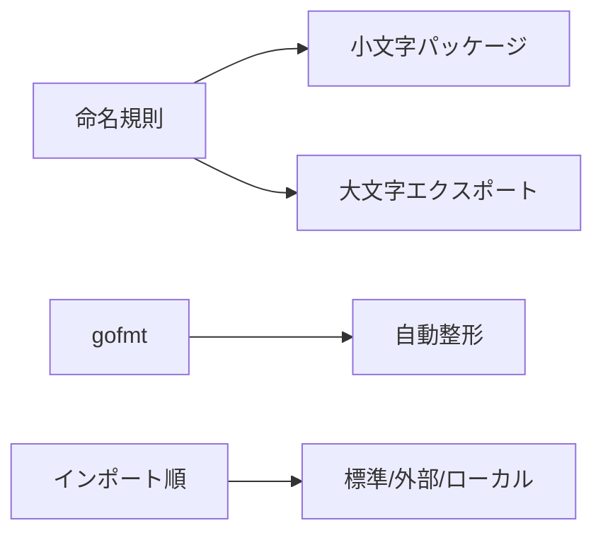

---

## ドキュメンテーション

Goは`godoc`による自動ドキュメント生成をサポートしている。関数や型にはコメントを記載し、APIドキュメントを充実させることが推奨される。コメントは`// 関数名 ...`の形式で記述する。

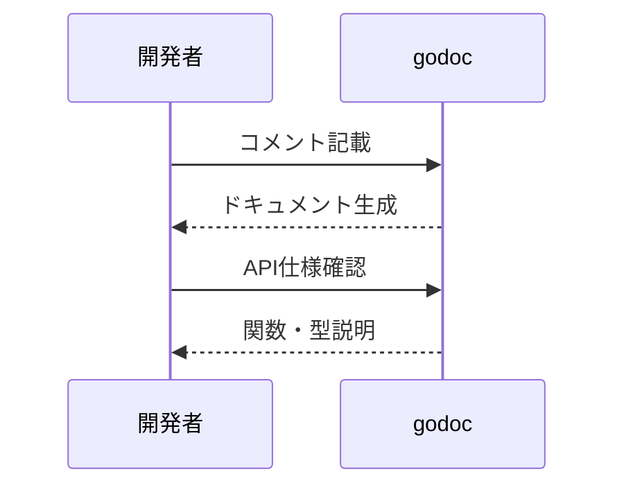

---

## コミュニティとサポート

Goは活発なコミュニティを持ち、公式フォーラム、GitHub、Slack、Qiita、Stack Overflowなどで情報交換が行われている。日本語の書籍や勉強会も豊富である。

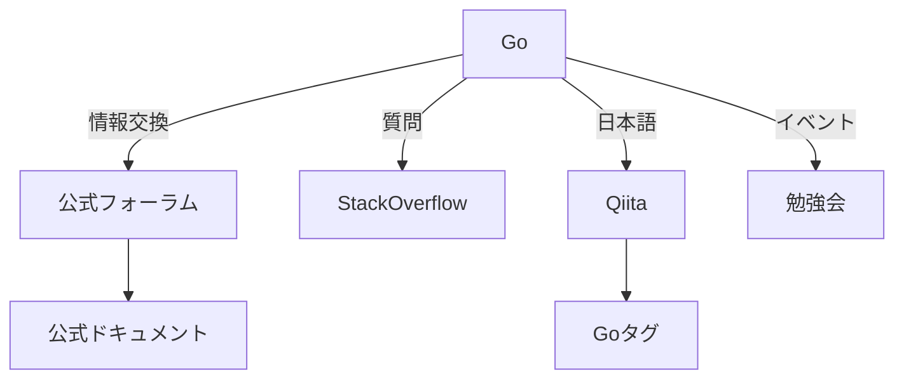

---

## 事例紹介

- **Docker**や**Kubernetes**などの主要OSSがGoで実装されている。
- クラウドサービス（Google Cloud, AWS Lambdaの一部）やマイクロサービス基盤での採用事例が多い。
- 大規模なWebサービスや分散システム、ネットワークツールの開発にも利用されている。

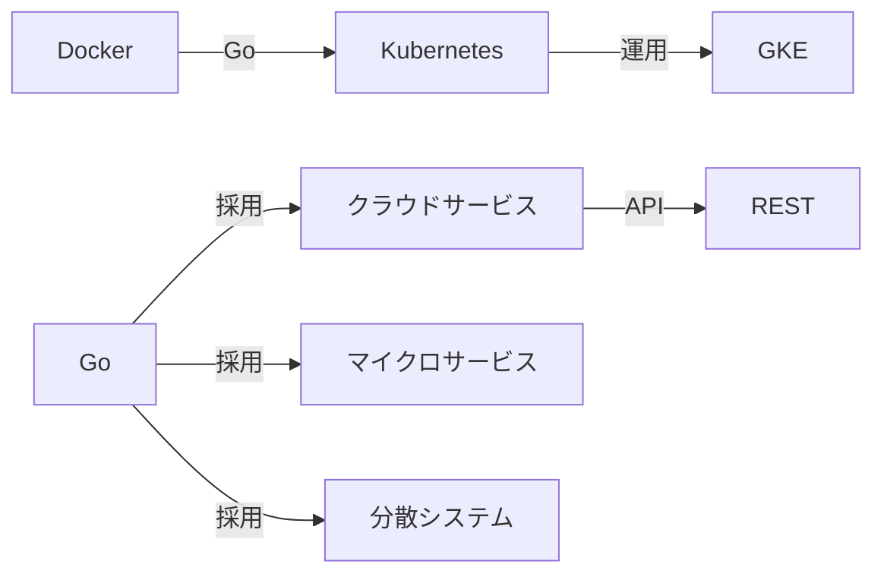

---

## コントリビューションガイド

Goプロジェクトへの貢献は、公式リポジトリのガイドラインに従い、IssueやPull Requestを通じて行う。コードレビューやテスト、ドキュメントの整備も重要な貢献である。

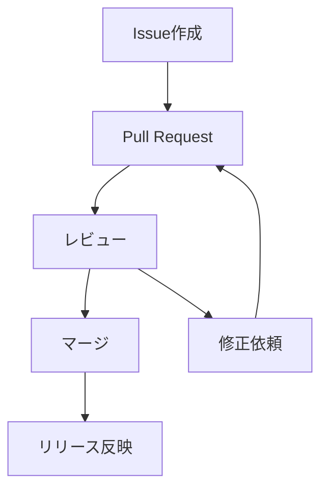

---

## バージョン管理とリリース

Goはセマンティックバージョニングを採用しており、後方互換性を重視したリリースポリシーを持つ。新機能やバグ修正は定期的なリリースサイクルで提供される。`go.mod`でバージョン指定が可能。

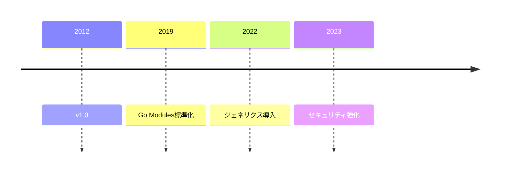

---

## マルチプラットフォーム対応

Goはクロスコンパイルを標準でサポートし、Windows、Linux、macOS、ARMなど複数のプラットフォーム向けにバイナリを生成できる。`GOOS`や`GOARCH`環境変数でターゲット指定が可能。

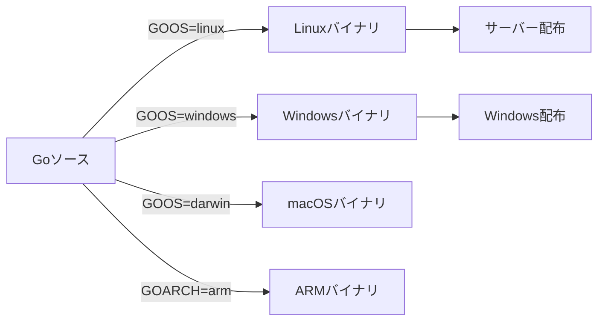

---

## モジュールと依存関係管理

Go Modulesにより、依存関係のバージョン管理や再現性のあるビルドが可能である。`replace`や`exclude`ディレクティブで依存関係の調整もできる。

```mermaid
sequenceDiagram
    participant Dev as 開発者
    participant Go as go mod
    Dev->>Go: go mod tidy
    Go-->>Dev: 依存解決
    Dev->>Go: go mod vendor
    Go-->>Dev: vendorディレクトリ生成
```

---

## サンプルコード集

```go
// 並行処理の例
go func() {
    fmt.Println("goroutine")
}()

// チャネルによる通信
ch := make(chan int)
go func() { ch <- 42 }()
value := <-ch
fmt.Println(value)
```

```mermaid
flowchart TD
    A[main] --> B[goroutine起動]
    B --> C[チャネル送信]
    C --> D[チャネル受信]
    D --> E[出力]
    E --> F[終了]
```

---

## よくある質問（FAQ）

- Q: Goで例外処理はどうするか？
  - A: Goは例外処理ではなく、エラー値によるハンドリングを推奨している。panic/recoverは致命的なエラーやリカバリ不能な場合にのみ使用する。
- Q: ジェネリクスは使えるか？
  - A: Go 1.18以降でジェネリクスが導入された。型パラメータを使った汎用的な関数や型が記述できる。
- Q: クラスや継承はあるか？
  - A: Goにはクラスや継承はなく、構造体とインターフェースによる組み合わせでオブジェクト指向的な設計が可能である。

```mermaid
graph TD
    A[FAQ]
    A --> B[例外処理]
    B --> B1[panic/recover]
    B --> B2[エラー値]
    A --> C[ジェネリクス]
    C --> C1[Go 1.18以降]
    A --> D[クラス・継承]
    D --> D1[構造体]
    D --> D2[インターフェース]
```

---

## サーバーサイド開発

Goは高いパフォーマンスと並行処理能力により、サーバーサイド開発に適している。標準ライブラリの`net/http`でWebサーバーやAPIサーバーの構築が容易であり、ミドルウェアやルーティングも柔軟に実装できる。

```mermaid
flowchart LR
    A[net/http] --> B[Webサーバー]
    B --> C[APIサーバー]
    C --> D[ミドルウェア]
    D --> E[認証・認可]
    D --> F[ロギング]
```

---

## クラウド・コンテナとの連携

GoはDockerやKubernetesなどのクラウド・コンテナ技術と親和性が高い。公式SDKやCLIツールもGoで実装されており、クラウドネイティブな開発に最適である。

```mermaid
graph TD
    Go --> Docker
    Go --> Kubernetes
    Go -->|SDK| AWS
    Go -->|SDK| GCP
    Docker --> Dockerfile
    Kubernetes --> Helm
    AWS --> Lambda
    GCP --> CloudRun
```

---

## 並行処理とゴルーチン

Goの最大の特徴の一つが軽量スレッドであるゴルーチンである。数万単位のゴルーチンを同時に扱うことができ、チャネルを用いた通信も容易である。

```mermaid
sequenceDiagram
    participant Main
    participant Goroutine1
    participant Goroutine2
    Main->>Goroutine1: go func() {...}
    Main->>Goroutine2: go func() {...}
    Goroutine1-->>Main: チャネルで結果1
    Goroutine2-->>Main: チャネルで結果2
```

---

## エラーハンドリング

Goはエラー値による明示的なエラーハンドリングを推奨している。`errors`パッケージや`fmt.Errorf`によるラップ、`errors.Is`や`errors.As`によるエラー判定も活用できる。

```mermaid
flowchart TD
    A[関数呼び出し] --> B[エラー値返却]
    B --> C{エラー判定}
    C -- あり --> D[処理・ラップ]
    D --> E[ログ出力]
    C -- なし --> F[通常処理]
```

---

## インターフェースと型システム

Goはインターフェース型による抽象化を重視している。構造体とインターフェースの組み合わせで柔軟な設計が可能であり、依存性注入やテスト容易性にも寄与する。

```mermaid
classDiagram
    Animal <|.. Dog
    Animal <|.. Cat
    class Animal {
        +Speak()
        +Move()
    }
    class Dog {
        +Speak()
        +Move()
    }
    class Cat {
        +Speak()
        +Move()
    }
    Dog : -name string
    Cat : -name string
```

---

## ネットワークプログラミング

Goは標準ライブラリでHTTPやTCP/UDP通信をサポートしており、ネットワークアプリケーションの開発が容易である。TLSやWebSocket、プロキシなども標準で対応している。

```mermaid
flowchart LR
    Client[クライアント] --TCP/HTTP--> Server[Goサーバー]
    Server --レスポンス--> Client
    Server --> DB[DBアクセス]
    Server --> Cache[キャッシュ]
```

---

## Webアプリケーション開発

Goは高速なWebサーバーを簡単に構築できる。GinやEchoなどのフレームワークも充実しており、REST APIやGraphQL、WebSocketなど多様なWebアプリケーション開発が可能である。

```mermaid
flowchart TD
    Req[リクエスト] --> Route[ルーティング]
    Route --> Handler[ハンドラ]
    Handler --> Logic[ビジネスロジック]
    Logic --> Resp[レスポンス]
    Handler --> MW[ミドルウェア]
    MW --> Handler
```

---

## モバイルアプリ開発

Go Mobileを利用することで、AndroidやiOS向けのバイナリ生成やライブラリ作成が可能である。C言語やJavaとの連携もサポートされている。

```mermaid
flowchart LR
    GoCode[Goコード] -->|Go Mobile| MobileBin[Android/iOSバイナリ]
    MobileBin -->|連携| Java[Java]
    MobileBin -->|連携| ObjC[ObjC]
    MobileBin -->|API| App[アプリ本体]
```

---

## データベース連携

Goは`database/sql`パッケージを標準で備え、MySQLやPostgreSQL、SQLiteなど主要なDBと連携できる。ORMとしてGORMやsqlxなども利用される。トランザクションやプリペアドステートメントもサポートされている。

```mermaid
flowchart TD
    App[Goアプリ] -->|database/sql| Driver[DBドライバ]
    Driver --> MySQL[MySQL]
    Driver --> PostgreSQL[PostgreSQL]
    Driver --> SQLite[SQLite]
    App --> ORM[GORM/sqlx]
    ORM --> Driver
```

---

## マイクロサービス開発

Goは軽量なバイナリと高速な起動、並行処理能力により、マイクロサービスアーキテクチャに適している。gRPCやOpenAPI、サービスディスカバリ、分散トレーシングなどの実装も容易である。

```mermaid
flowchart LR
    ServiceA[サービスA] --gRPC/HTTP--> ServiceB[サービスB]
    ServiceB --メッセージング--> ServiceC[サービスC]
    ServiceC --監視/トレース--> Monitor[モニタリング]
    ServiceA --> Discovery[サービスディスカバリ]
    ServiceB --> Tracing[分散トレーシング]
```

---

## CI/CDパイプライン

Goはビルドやテストが高速なため、CI/CDパイプラインの構築が容易である。GitHub ActionsやCircleCI、GitLab CIなどと組み合わせて利用される。Dockerイメージのビルドやデプロイも自動化しやすい。

```mermaid
flowchart TD
    Git[Git Push] --> CI[CIビルド]
    CI --> Test[テスト]
    Test --> Lint[静的解析]
    Lint --> CD[CDデプロイ]
    CD --> Prod[本番環境]
    CD --> Stg[ステージング]
```

---

## ロギングとモニタリング

Goは標準でログ出力機能を持ち、logパッケージやzap、logrusなどのサードパーティ製ロガーも利用できる。PrometheusやGrafanaなどのモニタリングツールとも連携しやすい。

```mermaid
flowchart LR
    App[Goアプリ] --> Log[log出力]
    App --> Metric[メトリクス送信]
    Log --> LogSrv[ログ集約基盤]
    Metric --> Prom[Prometheus]
    Prom --> Grafana[Grafana]
    App --> Trace[トレース送信]
    Trace --> Jaeger[Jaeger]
```

---

## 国際化とローカライズ

Goは`x/text`パッケージなどを利用して国際化・ローカライズ対応が可能である。文字コード変換や多言語対応、日付・数値フォーマットなどもサポートされている。

```mermaid
flowchart TD
    App[Goアプリ] --> XText[x/text]
    XText --> Lang[多言語対応]
    XText --> Encode[文字コード変換]
    XText --> Format[日付・数値フォーマット]
```

---

## サードパーティライブラリ活用

Goには豊富なサードパーティライブラリが存在し、公式の`pkg.go.dev`で検索・利用できる。ライブラリ選定時はメンテナンス状況やライセンス、利用実績を確認することが重要である。

```mermaid
flowchart TD
    Project[Goプロジェクト] --> Pkg[pkg.go.dev]
    Pkg --> Lib[ライブラリ選定]
    Lib --> Check[品質・ライセンス確認]
    Lib --> Doc[ドキュメント確認]
    Lib --> Star[利用実績確認]
```

---

## 移行と互換性

Goは後方互換性を重視しており、バージョンアップ時の移行コストが低い。`go fix`コマンドや`go vet`による静的解析も提供されている。

```mermaid
flowchart LR
    Old[旧バージョン] -->|go fix| New[新バージョン]
    New -->|go vet| Vet[静的解析]
    New -->|テスト| Test[動作確認]
```

---

## ライセンスと法的注意点

Go本体はBSDライセンスで提供されているが、サードパーティ製ライブラリのライセンスにも注意が必要である。商用利用時は依存パッケージのライセンスを必ず確認すること。

```mermaid
flowchart TD
    GoBSD["Go本体(BSD)"] --> Commercial[商用利用可]
    GoBSD --> Third[サードパーティ]
    Third --> License[ライセンス確認]
    License --> Risk[リスク管理]
```

---

## 参考リンク

- [Go公式サイト](https://golang.org/)
- [Go by Example](https://gobyexample.com/)
- [GoDoc](https://pkg.go.dev/golang.org/x/tools/cmd/godoc)
- [Awesome Go](https://awesome-go.com/)
- [Go公式ブログ](https://blog.golang.org/)
- [Go言語日本ユーザー会](https://golang.jp/)

---

