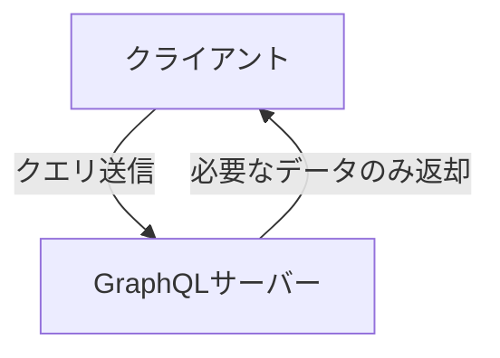
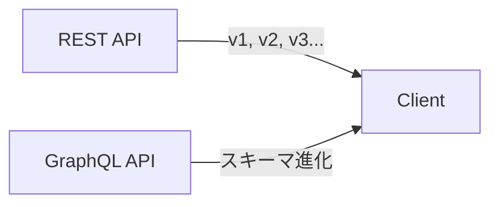
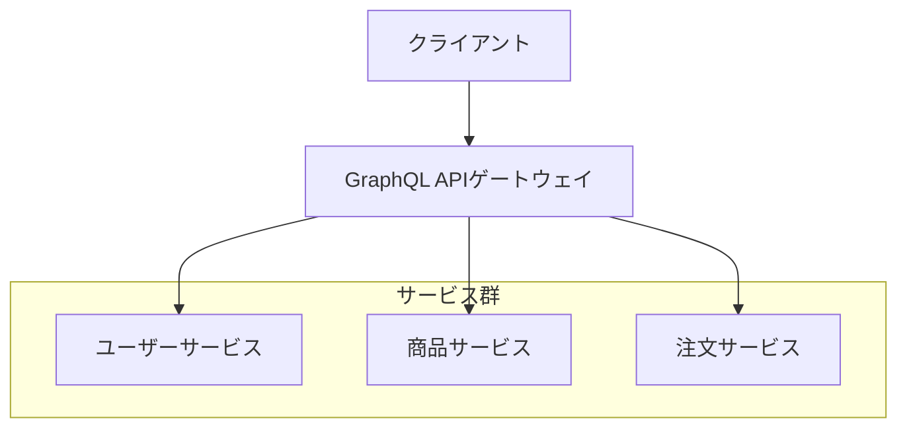
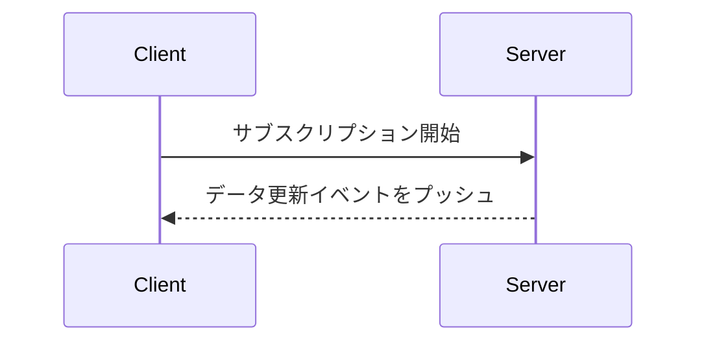
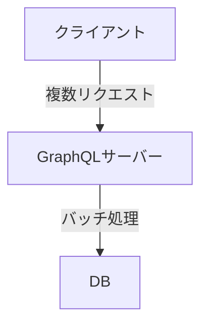

# GraphQL

---

## 概要

GraphQLは、Facebookが2012年に開発したAPIクエリ言語およびランタイムである。クライアントが必要なデータだけを柔軟に取得できるため、従来のREST APIの課題を解決できる。

---

## GraphQLとは
### GraphQLの歴史
#### Facebookによる開発背景
Facebookは、モバイルアプリのパフォーマンス向上と開発効率化のため、REST APIの「過剰取得・過少取得」問題を解決する新しいAPI設計としてGraphQLを開発した。

#### 公開と標準化の経緯
2015年にオープンソース化され、現在はGraphQL Foundationが管理している。

### GraphQLの基本概念
#### クライアント主導のデータ取得
クライアントが必要なデータ構造をクエリで指定し、サーバーはその通りにデータを返す。

#### 型システムの概要
スキーマで型を厳密に定義し、クエリやレスポンスの整合性を保証する。

---

## GraphQLの特徴
### 柔軟なデータ取得
#### 必要なデータのみ取得
クライアントは必要なフィールドだけを指定できる。

#### ネストしたリクエスト
関連するデータを1回のリクエストで取得可能である。



### 型システムによる安全性
#### スキーマ定義
APIの型や構造をスキーマで明示する。

#### 型検証
クエリやレスポンスがスキーマに準拠しているか検証される。

### 単一エンドポイント
#### エンドポイント統合のメリット
全てのリソースに対して単一のエンドポイントでアクセスできる。

### 強力な開発者ツール
#### Playground/GraphiQLの活用
インタラクティブなクエリ実行やドキュメント参照が可能である。

---

## RESTとの違い
### エンドポイント設計の違い
#### RESTの複数エンドポイント
リソースごとにエンドポイントが必要となる。

#### GraphQLの単一エンドポイント
全ての操作を1つのエンドポイントで行う。

### データ取得方法の違い
#### オーバーフェッチ・アンダーフェッチ
RESTでは必要以上・以下のデータ取得が発生しやすい。

#### クエリによる柔軟な取得
GraphQLは必要なデータのみ取得できる。

### バージョニングの考え方
#### RESTのバージョニング
APIのバージョン管理が必要となる。

#### GraphQLの進化的設計
スキーマの進化的変更（フィールド追加等）が容易である。



---

## メリット
### 過剰取得・過少取得の解消
必要なデータのみ取得できるため、通信量や処理量を最適化できる。

### APIの一元管理
単一エンドポイントでAPIを管理でき、保守性が向上する。

### 型安全性の向上
スキーマにより型が保証され、開発時のエラーを減らせる。

### ドキュメント自動生成
スキーマから自動でAPIドキュメントを生成できる。

---

## デメリット・注意点
### キャッシュの難しさ
RESTのようなHTTPキャッシュが使いにくく、独自のキャッシュ戦略が必要となる。

### 複雑なクエリによるパフォーマンス低下
複雑なネストや大量データ取得でサーバー負荷が増加する。

### 学習コスト
スキーマ設計やリゾルバ実装など新たな知識が必要となる。

---

## 代表的な利用例
### フロントエンドとバックエンドの分離
フロントエンドが必要なデータを柔軟に取得できるため、開発分業がしやすくなる。

### モバイルアプリでの活用
通信量を最小限に抑えられるため、モバイルアプリに最適である。

### マイクロサービス連携
複数のサービスを統合したAPIゲートウェイとして利用できる。



---

## 主要な用語解説
### スキーマ
#### 型定義（Type Definitions）
GraphQL APIの型や構造を定義する。

#### スキーマ言語（SDL）
スキーマ定義用の言語である。

```graphql
type User {
  id: ID!
  name: String!
}
```

### クエリ
#### クエリ構文
データ取得用のリクエストである。

```graphql
query {
  user(id: "1") {
    name
  }
}
```

#### 引数・変数
クエリにパラメータを渡すことができる。

### ミューテーション
#### データ更新の仕組み
データの作成・更新・削除を行う。

```graphql
mutation {
  addUser(name: "Taro") {
    id
    name
  }
}
```

### サブスクリプション
#### リアルタイム通信
データの変更をリアルタイムで受信できる。



### リゾルバ
#### データ取得ロジック
各フィールドのデータ取得処理を実装する。

### 型（Type）
#### オブジェクト型・スカラー型
オブジェクト型（Userなど）やスカラー型（String, Intなど）がある。

### フラグメント
#### クエリの再利用
複数クエリで共通部分を再利用できる。

### ディレクティブ
#### 条件付き取得
`@include`や`@skip`で条件付き取得が可能である。

---

## サーバー実装例
### Node.js（Apollo Server）による実装例
#### スキーマ定義例

```javascript
const typeDefs = `
  type Query {
    hello: String
  }
`;
```

#### リゾルバ実装例

```javascript
const resolvers = {
  Query: {
    hello: () => 'Hello world!',
  },
};
```

### Python（Graphene）による実装例
#### スキーマ定義例

```python
import graphene

class Query(graphene.ObjectType):
    hello = graphene.String()

    def resolve_hello(root, info):
        return "Hello world!"
```

#### リゾルバ実装例
上記の`resolve_hello`がリゾルバである。

---

## クライアント実装例
### Apollo Clientの利用例
#### クエリ送信例

```javascript
import { gql, useQuery } from '@apollo/client';

const GET_HELLO = gql`
  query {
    hello
  }
`;

function Hello() {
  const { data } = useQuery(GET_HELLO);
  return <div>{data.hello}</div>;
}
```

#### キャッシュ管理
Apollo Clientは自動でキャッシュを管理する。

### Relayの利用例
#### フラグメント活用
Relayではフラグメントを活用して型安全なクエリを記述できる。

---

## よくある課題と対策
### N+1問題
#### DataLoaderによる解決



### 認証・認可
#### ミドルウェアの活用
リクエストごとに認証・認可処理を挟む。

### スキーマの設計指針
#### モジュール分割
スキーマを機能ごとに分割して管理する。

---

## 参考リンク

- [GraphQL公式サイト](https://graphql.org/)
- [Apollo GraphQL](https://www.apollographql.com/)
- [Graphene-Python](https://graphene-python.org/)
- [Relay](https://relay.dev/)