# HOLブロッキング

---
## 概要

HOLブロッキング（Head-of-Line Blocking）とは、ネットワークやシステムにおいて、キューやバッファの先頭にある処理が完了しないために、後続の全ての処理が待たされる現象である。特にパケット転送やキューイング処理、ストリーム型通信プロトコルなどで顕著に発生する。HOLブロッキングはシステム全体のパフォーマンスや応答性に大きな影響を与えるため、ネットワーク設計やプロトコル設計において重要な課題となっている。現代の大規模分散システムやクラウドサービス、IoT環境においても、HOLブロッキングの影響は無視できない。

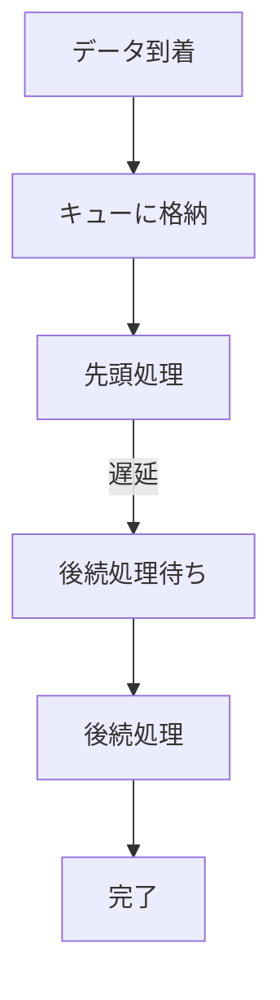

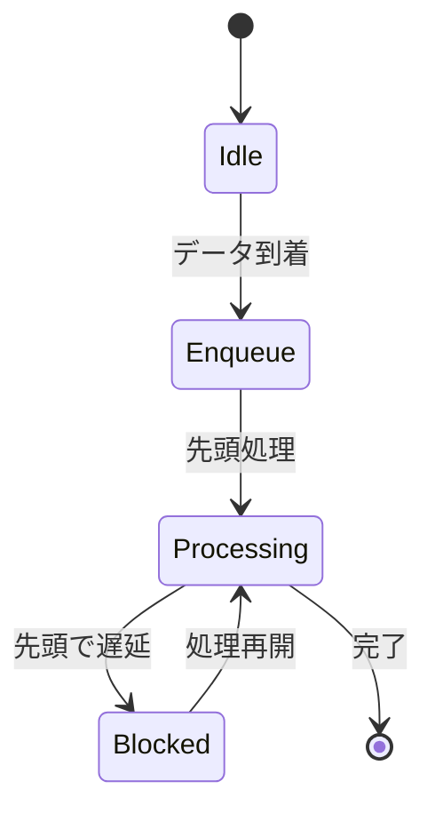

---
## 用語定義

- **HOL（Head-of-Line）**: キューやバッファの先頭に位置するデータやリクエストを指す。ネットワーク機器やソフトウェアの待ち行列において、最初に処理されるべきエンティティである。
- **ブロッキング（Blocking）**: 何らかの要因で処理が停止または遅延すること。特に先頭の処理が完了しないことで、後続の処理が進まなくなる状態を指す。
- **VOQ（Virtual Output Queue）**: 出力先ごとに仮想的なキューを設ける方式。HOLブロッキングの回避策として利用される。スイッチやルータの設計で重要な概念である。
- **マルチプレクシング**: 複数のデータストリームやリクエストを同時に伝送・処理する技術。HTTP/2やQUICなどで採用されている。

---
## 歴史

HOLブロッキングの問題は1970年代の初期ネットワーク機器の研究に端を発する。当時のイーサネットやATMスイッチなどのパケット転送装置では、単一の入力キューを用いる設計が一般的であり、これによりHOLブロッキングが頻繁に発生した。1990年代にはATMスイッチの分野でVOQ（Virtual Output Queue）技術が提案され、以降多くのネットワーク機器で採用されるようになった。TCP/IPの普及とともに、ストリーム型プロトコルにおけるHOLブロッキングも問題視されるようになり、HTTP/2やQUICなどの新しいプロトコル設計に影響を与えている。

---
## 原因

HOLブロッキングの主な原因は、キューやバッファの先頭にあるパケットやリクエストが何らかの理由で処理できない場合、後続の全ての処理が待たされる構造にある。例えば、ネットワークスイッチの入力キューで先頭パケットの出力先がビジー状態の場合、他の出力先に送信すべき後続パケットも処理できなくなる。また、TCPストリームではパケットロスが発生すると、ロストしたパケットの再送が完了するまで後続のデータがアプリケーション層に渡らない。データベースや分散システムでも、先頭のトランザクションやリクエストがロックやリソース待ちで滞留すると、全体の処理が停滞する。

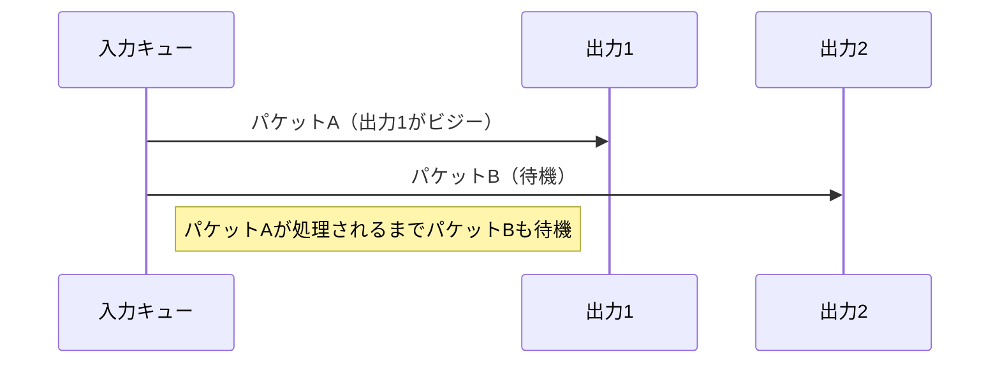

---
## 発生箇所

- **ネットワークスイッチやルータの入力キュー**: 出力先ごとにキューを分割しない場合、HOLブロッキングが発生しやすい。特にクロスバースイッチや従来型のイーサネットスイッチで顕著である。
- **TCPプロトコルのストリーム伝送**: パケットロス時、ロストしたパケットの再送が完了するまで後続データが配信されない。高遅延・高損失環境で問題となる。
- **WebブラウザのHTTP/1.1パイプライン**: 先頭リクエストの応答が遅延すると、後続リクエストも待たされる。HTTP/2以降で改善された。
- **データベースのトランザクションキュー**: 先頭トランザクションがロック待ちの場合、後続のトランザクションも進まない。高負荷時や競合が多い場合に発生する。

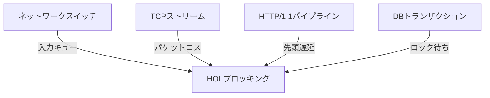

---
## 影響

HOLブロッキングが発生すると、システム全体のスループットが低下し、遅延が増大する。特にリアルタイム性が求められるアプリケーションや高トラフィック環境では、ユーザ体験やサービス品質に深刻な影響を及ぼす。例えば、動画ストリーミングやオンラインゲームでは、HOLブロッキングによる遅延が顕著に現れる。クラウドサービスやAPIゲートウェイでも、リクエストの集中やバックエンドの遅延が全体の応答性を悪化させる。

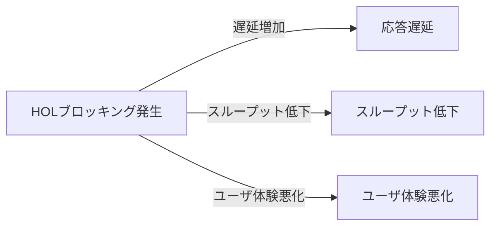
---
## パフォーマンスへの影響

パフォーマンス劣化の主な要因は、先頭の処理が完了するまで後続の処理が進まない点にある。これにより、平均遅延やジッタ（遅延のばらつき）が増加し、スループットが低下する。特に高負荷時やパケットロスが多発する環境では、HOLブロッキングの影響が顕著となる。ネットワーク機器ではバッファオーバーフローやパケットドロップの原因にもなり、アプリケーション層ではタイムアウトや再試行の増加を招く。

```mermaid
gantt
    dateFormat  HH:mm
    title HOLブロッキングによる処理遅延例
    section パケット処理
    パケット1: done, 00:00, 00:05
    パケット2: active, 00:05, 00:10
    パケット3: 00:15, 00:05
```

---
## セキュリティへの影響

HOLブロッキング自体は直接的なセキュリティリスクではないが、攻撃者が意図的に先頭の処理を遅延させることで、サービス妨害（DoS攻撃）を誘発する可能性がある。また、HOLブロッキングによる遅延が発生しているシステムは、攻撃検知や障害検知が遅れるリスクもある。さらに、リソースの枯渇やタイムアウトの増加が、システムの脆弱性を顕在化させる場合もある。

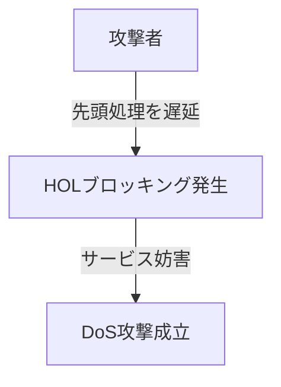

---
## 検出方法

- **パケットキャプチャ**: ネットワーク上のパケットをキャプチャし、キューの先頭で長時間滞留するパケットを特定する。Wiresharkなどのツールが有効である。
- **ログ解析**: システムやアプリケーションのログから、処理待ちや遅延の発生箇所を分析する。キュー長や処理時間の異常値を検出する。
- **パフォーマンスモニタリング**: キュー長や遅延時間を定期的に監視し、閾値を超えた場合にアラートを発報する。PrometheusやZabbixなどの監視ツールが利用される。
- **可視化ダッシュボード**: Grafana等でリアルタイムにキューの状態や遅延を可視化し、異常を早期発見する。

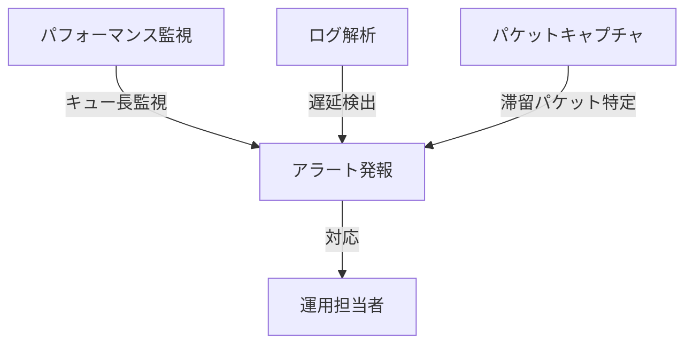

---
## テスト方法

- **シミュレーション**: ネットワークシミュレータ（ns-3, GNS3等）を用いて、意図的に遅延やパケットロスを発生させ、HOLブロッキングの挙動を観察する。
- **負荷試験ツール**: tcpreplayや自作スクリプトを用いて、特定の条件下でのパフォーマンスを測定する。HTTP/2やQUICの比較も有効である。
- **A/Bテスト**: HOLブロッキング対策の有無でシステム挙動を比較し、効果を定量的に評価する。
- **障害注入テスト**: Chaos Engineeringの手法で意図的に障害や遅延を発生させ、システムの耐性を検証する。

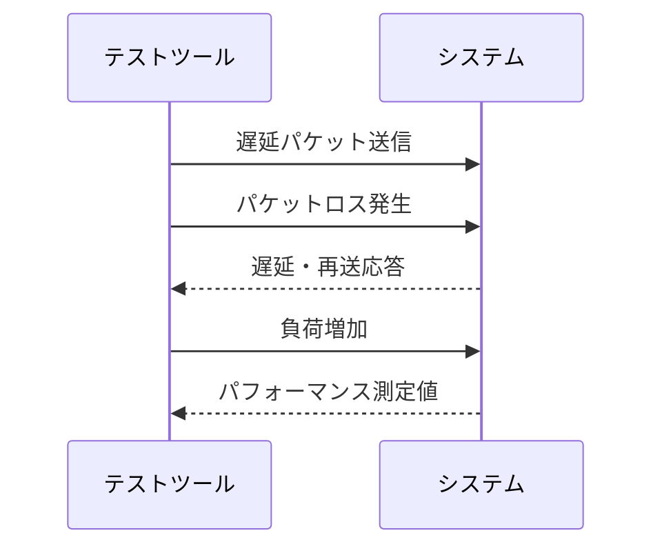

---
## 回避策

- **入力キューの分割（VOQ: Virtual Output Queue）の導入**: 出力先ごとに仮想的なキューを設けることで、特定の出力先がビジーでも他の出力先へのパケット転送を妨げない。クロスバースイッチや高性能ルータで広く採用されている。
- **マルチプレクシングプロトコルの利用**: HTTP/2やQUICのように、複数のストリームを同時に処理できるプロトコルを採用することで、HOLブロッキングを回避する。TCPのストリーム依存を排除し、独立したデータ転送を実現する。

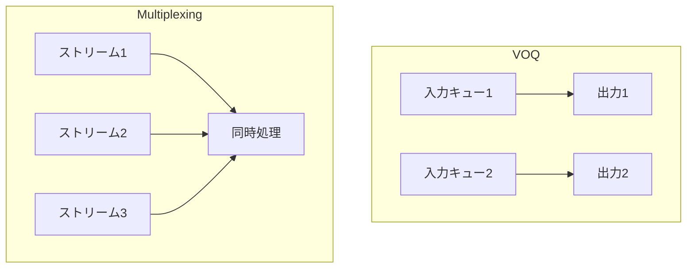

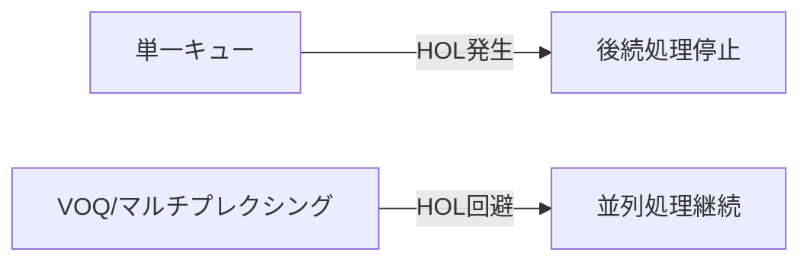

- **パケットの優先度制御**: 重要度の高いパケットを優先的に処理することで、全体の遅延を抑制する。QoS（Quality of Service）設定が有効である。
- **非同期処理の導入**: アプリケーションやシステムで非同期I/Oやマルチスレッド処理を活用し、ボトルネックを分散する。イベント駆動型アーキテクチャも有効である。
- **バッファサイズの最適化**: 過剰なバッファリングはHOLブロッキングを助長するため、適切なサイズ設定が重要である。

---
## ベストプラクティス

- プロトコルやアーキテクチャ設計時にHOLブロッキングの発生を考慮し、単一キュー依存を避ける。
- マルチスレッドや非同期処理を積極的に導入し、処理の並列化を図る。
- 定期的なパフォーマンス測定とボトルネック分析を実施し、設計の見直しを行う。
- システム全体のスケーラビリティと耐障害性を確保し、障害時の影響範囲を最小化する。

---
## 設計指針

- キューイング構造を柔軟に設計し、必要に応じてキューの分割や優先度制御を導入する。
- プロトコル選定時には、HOLブロッキングの発生しにくいものを選択する。
- システム全体のスケーラビリティと耐障害性を考慮し、単一障害点を排除する。
- モニタリングとアラート設計を徹底し、異常時の早期対応を可能にする。

---
## 運用上の注意点

- ネットワーク機器やサーバのキュー長を適切に設定し、過剰なバッファリングを避ける。
- パフォーマンス監視ツールを導入し、遅延やキュー長の異常を早期に検知する。
- 障害発生時には、HOLブロッキングの有無を必ず確認する。
- システムアップデートや構成変更時は、HOLブロッキングの影響を事前に評価する。

---
## 実例

- **TCPストリーム上でのパケットロスによる再送待ち**: 1つのパケットがロストすると、その再送が完了するまで後続のデータがアプリケーションに渡らない。高遅延回線や無線通信で顕著である。
- **HTTP/1.1パイプラインでの先頭リクエスト遅延**: 先頭リクエストの応答が遅れると、後続リクエストもすべて待たされる。Webブラウザのパフォーマンス低下の一因となる。
- **データベースのロック競合**: 先頭のトランザクションがロック待ちで滞留し、後続のトランザクションが進まない。

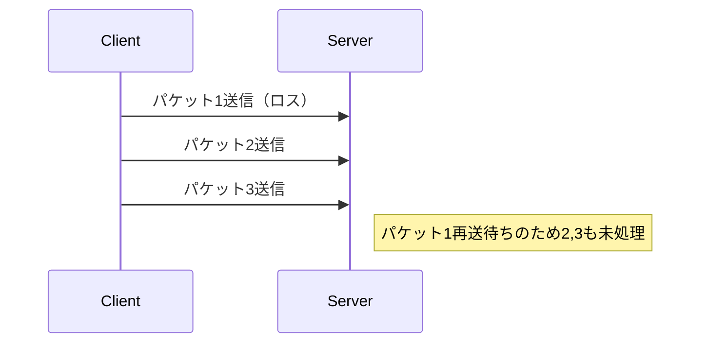

---
## ケーススタディ

ある大規模Webサービスでは、HTTP/1.1からHTTP/2へ移行したことで、同時に複数のリクエストを処理できるようになり、HOLブロッキングによる遅延が大幅に解消された。これにより、ページ表示速度が平均30%向上し、ユーザ離脱率も低減した。さらに、QUIC導入後はモバイル環境でのパフォーマンスも大幅に改善された。

---
## 対応事例

- GoogleはQUICプロトコルを導入し、UDPベースのマルチプレクシングによりHOLブロッキングの影響を最小化した。これにより、YouTubeやGoogle検索の応答速度が向上した。
- Facebookは独自のプロキシサーバでVOQを実装し、データセンター内のトラフィック効率を改善した。これにより、ピーク時の遅延が大幅に減少した。

---
## 実装例

- Linuxカーネルのネットワークスタックでは、VOQをサポートするドライバが存在し、複数の出力キューを持つNICでHOLブロッキングを回避している。IntelやMellanox製NICが代表例である。
- NGINXやApacheなどのWebサーバは、HTTP/2やQUICのサポートにより、同時多発的なリクエスト処理を実現している。Node.jsやGo言語のWebサーバも非同期I/OでHOLブロッキングを回避している。

---
## 関連プロトコル

- **HTTP/2**: ストリームごとに独立したリクエスト処理が可能。ヘッダ圧縮や優先度制御も特徴。
- **QUIC**: UDPベースのマルチプレクシングプロトコルで、TCPのHOLブロッキングを回避。TLS暗号化を標準搭載。
- **ATM**: VOQ技術が初めて導入されたネットワークプロトコル。セルベースの転送方式。

---
## 関連RFC

- RFC 7540（HTTP/2）: HTTP/2の仕様を定義。
- RFC 9000（QUIC）: QUICプロトコルの仕様を定義。
- RFC 793（TCP）: TCPの基本仕様。

---
## 関連用語

- **VOQ（Virtual Output Queue）**: 出力先ごとに仮想的なキューを設ける方式。
- **パイプライン処理**: 複数の処理を直列に並べて効率化する手法。
- **マルチプレクシング**: 複数のデータストリームを同時に伝送する技術。
- **ジッタ**: 遅延のばらつき。

---
## 関連標準化団体

- **IETF（Internet Engineering Task Force）**: インターネット標準プロトコルの策定団体。
- **IEEE**: ネットワーク機器や通信規格の標準化団体。

---
## 関連ツール

- **Wireshark**: ネットワークパケットのキャプチャ・解析ツール。HOLブロッキングの発生箇所を特定できる。
- **tcpreplay**: パケットの再送信によるネットワークテストツール。負荷試験や障害注入に利用される。
- **Prometheus/Grafana**: パフォーマンス監視と可視化。

---
## 関連技術

- **非同期I/O**: 入出力処理を非同期で実行し、待ち時間を短縮する技術。Node.jsやGo言語で広く利用される。
- **マルチスレッド処理**: 複数のスレッドで並列に処理を実行する技術。高性能サーバや分散システムで必須。
- **イベント駆動アーキテクチャ**: イベント発生時に非同期で処理を実行する設計手法。

---
## 特徴

- 単一キュー構造で発生しやすい。
- マルチプレクシングやVOQの導入で回避可能。
- パフォーマンスや応答性に大きな影響を与える。
- システムの規模や設計によって影響度が大きく異なる。

---
## 今後の展望

今後はマルチプレクシング技術やAIによる動的キュー制御の進展により、HOLブロッキングの影響はさらに低減していくと考えられる。また、IoTや5Gなど新しい通信分野でもHOLブロッキング対策が重要となる。クラウドネイティブアーキテクチャやサーバレス環境でも、HOLブロッキングの影響を最小化する設計が求められる。

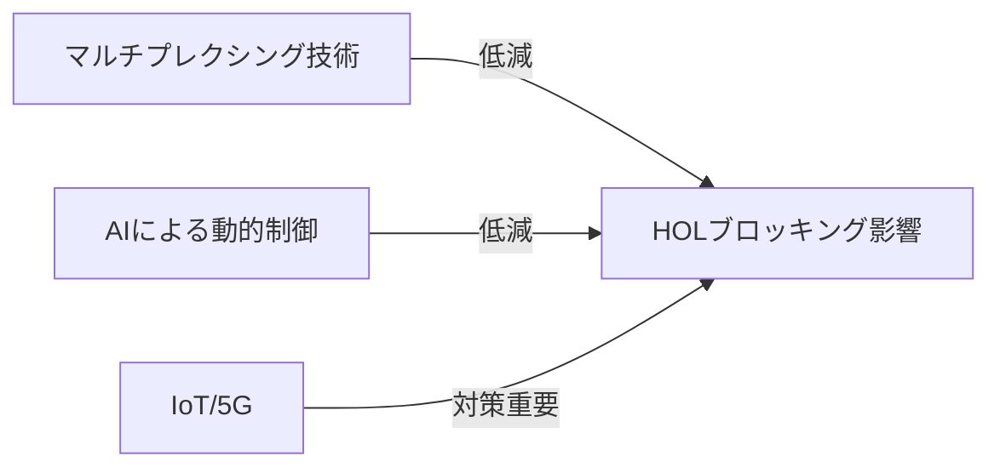

---
## まとめ

HOLブロッキングはシステム設計上の重要な課題であり、適切な対策を講じることでパフォーマンスと信頼性を向上させることができる。設計・運用の両面から継続的な対策が求められる。今後も新しい技術やプロトコルの登場により、HOLブロッキングの影響は減少していくが、根本的な理解と対策が不可欠である。

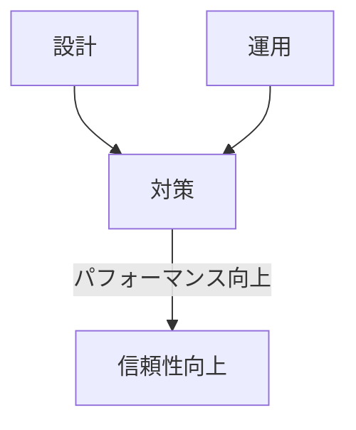

---
## FAQ

**Q. HOLブロッキングはどのような場面で発生しやすいか？**  
A. 単一キュー構造やストリーム型プロトコルで発生しやすい。特に高負荷時やパケットロスが多い環境で顕著である。

**Q. HOLブロッキングを完全に回避することは可能か？**  
A. VOQやマルチプレクシングの導入で大幅に軽減できるが、システム全体の設計によっては完全な回避は難しい場合もある。

**Q. HOLブロッキングの発生を早期に検知するには？**  
A. パフォーマンス監視やログ解析、可視化ダッシュボードの活用が有効である。

---
## 参考文献

- "Computer Networks" by Andrew S. Tanenbaum
- RFC 7540, RFC 9000, RFC 793
- "High Performance Browser Networking" by Ilya Grigorik
- "TCP/IP Illustrated" by W. Richard Stevens

---
## 参考リンク

- [IETF RFC 7540](https://tools.ietf.org/html/rfc7540)
- [IETF RFC 9000](https://datatracker.ietf.org/doc/html/rfc9000)
- [Wikipedia: Head-of-line blocking](https://ja.wikipedia.org/wiki/Head-of-line_blocking)
- [QUIC Working Group](https://quicwg.org/)

---
## 脚注

1. 本資料は2024年6月時点の情報に基づく。
2. 記載内容は一般的な知見に基づくものであり、個別システムへの適用時は追加検証が必要である。

---