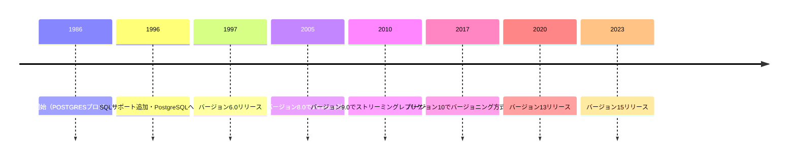
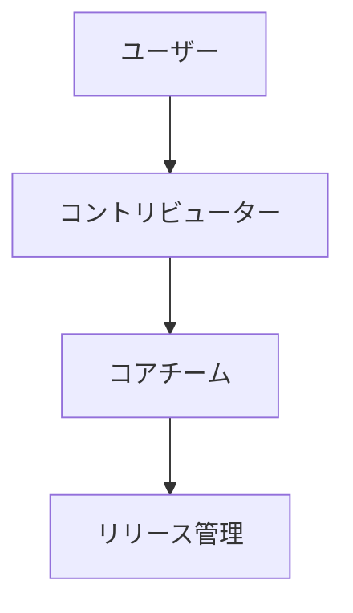
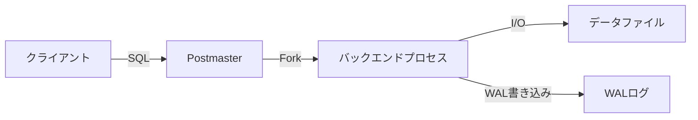

# Postgres

---

## 概要

Postgres（正式名称：PostgreSQL）は、オープンソースのリレーショナルデータベース管理システム（RDBMS）である。高い拡張性と標準SQLへの準拠、豊富な機能を持つため、企業から個人まで幅広く利用されている。PostgreSQLは、トランザクションの信頼性、データ整合性、柔軟な拡張性を重視して設計されている。オブジェクト指向的な機能や、NoSQL的な機能も備えており、現代の多様なアプリケーション要件に対応できる。PostgreSQLは、リレーショナルデータベースとしての堅牢性に加え、オブジェクト指向的な拡張やNoSQL的な柔軟性も持ち合わせている。トランザクションの信頼性はWAL（Write Ahead Log）によって担保され、障害発生時にもデータの一貫性を維持できる。標準SQLに加え、独自拡張や多様なデータ型、ストアドプロシージャ、トリガー、ビュー、マテリアライズドビューなど、現代的なアプリケーション開発に必要な機能を網羅している。大規模データ処理や分析、地理空間情報、IoT、Webサービス、金融システムなど多様な分野で採用実績がある。

---

## 歴史

Postgresは1986年にカリフォルニア大学バークレー校のMichael Stonebraker教授のもとで開発が始まった。当初はIngresの後継として「POSTGRES」と呼ばれていた。1996年にSQLサポートが追加され、名称が「PostgreSQL」となった。以降、オープンソースコミュニティによる活発な開発が続き、現在では世界中の多くの企業や団体で利用されている。PostgreSQLは、オープンソースRDBMSの中でも最も歴史が長い部類に入り、長年にわたり安定性と信頼性を重視した開発が続けられている。1997年以降、毎年のように新バージョンがリリースされ、コミュニティ主導で新機能やパフォーマンス改善が積極的に取り込まれている。商用サポートやクラウドサービスも充実し、エンタープライズ用途でも広く利用されている。



---

## 特徴

- ACID準拠のトランザクション処理により、データの一貫性と信頼性を保証する。
- 拡張可能なデータ型・演算子・関数・集約関数・インデックス方式をユーザーが追加できる。
- 外部データラッパー（FDW）を利用することで、他のRDBMSやNoSQL、CSVファイル等の外部データソースと透過的に連携できる。
- JSONB型やXML型など、非構造データの格納・検索・インデックス作成が可能である。
- マルチバージョン同時実行制御（MVCC）により、ロック競合を最小限に抑えた高い並行性を実現している。
- パーティショニング、レプリケーション、ストリーミングレプリケーション、論理レプリケーションなど大規模システム向けの機能も充実している。
- 標準SQL:2011に高いレベルで準拠しつつ、独自の拡張機能も豊富である。
- テーブル継承や配列型、JSONB型、hstore型など、他RDBMSにはない高度なデータ構造をサポートする。
- 拡張機能（Extension）として、PostGIS（地理空間）、pg_partman（パーティション管理）、pg_stat_statements（クエリ統計）などを容易に追加できる。
- 柔軟な認証・権限管理、SSL/TLS通信、監査ログ、ロールベースアクセス制御など、セキュリティ機能も充実している。
- クラスタ構成やレプリケーション、フェイルオーバー、シャーディングなど、可用性・スケーラビリティにも優れる。

---

## ライセンス

PostgreSQLはPostgreSQLライセンス（MITライセンスに類似）で配布されている。商用・非商用問わず無償で利用・改変・再配布が可能である。ライセンス条項は非常に緩やかであり、ソースコードの改変や独自配布も制限なく行えるため、商用製品への組み込み事例も多い。PostgreSQLライセンスは、GPLのようなコピーレフト義務がなく、商用・非商用を問わず自由に利用・改変・再配布できる。ライセンス条項は数行で構成されており、企業での利用や製品組み込みにも最適である。

---

## バージョニングとリリースサイクル

PostgreSQLは年1回のメジャーバージョンアップ（通常9月頃）と、四半期ごとのマイナーバージョンアップが行われる。バージョン番号は「X.Y」の形式で表記され、メジャーバージョンごとに新機能や非互換変更が導入される。各バージョンは5年間のサポートが提供される。マイナーバージョンアップでは主にバグ修正やセキュリティパッチが提供される。メジャーバージョンアップ時には新機能追加や非互換変更が含まれるため、事前検証やバックアップが重要である。サポート期間終了後はセキュリティアップデートが提供されないため、定期的なバージョンアップが推奨される。

---

## エコシステム

PostgreSQLには多くの拡張モジュールやツールが存在し、エコシステムが非常に充実している。代表的なものにPostGIS（地理空間拡張）、pgAdmin（管理ツール）、pg_partman（パーティショニング自動化）、pg_stat_statements（クエリ統計）、Citus（シャーディング）などがある。これらの拡張により、PostgreSQLは多様な業務要件に柔軟に対応できる。また、pgpool-II（コネクションプーリング・負荷分散）、repmgr（レプリケーション管理）、Patroni（HAクラスタ管理）、各種監視ツール（Prometheus, Zabbix, Nagios）など、運用管理を支援するツールも豊富である。多言語バインディングやORマッパー、各種フレームワークとの連携も充実している。

---

## コミュニティと開発体制

世界中の開発者が参加するオープンなコミュニティによって開発が進められている。主要な意思決定はコアチームによって行われる。開発はGitHub上で公開されており、誰でもバグ報告やパッチ投稿が可能である。ドキュメントや翻訳、イベント運営など多様な貢献方法がある。コミュニティは世界中に広がっており、日本語を含む多言語のメーリングリストやフォーラム、Slack/Discordなどのチャット、年次カンファレンス（PGConf, PGDay）など活発な情報交換が行われている。バグ修正や新機能提案、ドキュメント翻訳、イベント運営など、さまざまな形で参加できる。



---

## ロードマップ

今後のバージョンでは、さらなるパフォーマンス向上やクラウドネイティブ機能の強化、分散処理機能の拡充、セキュリティ機能の強化が予定されている。詳細は公式サイトのロードマップを参照。コミュニティ主導で要望や提案が議論され、優先度の高いものから順次実装されている。近年はクラウドネイティブ対応（Kubernetes連携、オートスケーリング）、分散SQL、より高度なパーティショニング、JSON/全文検索機能の強化、AI/機械学習連携などが注目されている。公式サイトやコミュニティで最新の議論や提案を確認できる。

---

## 利用事例

- 金融機関の基幹システム（高い信頼性とトランザクション性能が求められる領域）
- Webサービスのバックエンド（スケーラビリティや柔軟なスキーマ設計が可能）
- IoTデータの蓄積基盤（大量データの高速書き込み・分析）
- 地理情報システム（GIS）（PostGIS拡張による空間データ処理）
- データウェアハウスやBI基盤（大規模集計・分析処理）
- 官公庁や自治体の情報システム（高いセキュリティ要件への対応）
- 大規模ECサイトやSNS（高トラフィック・高可用性構成）
- 医療・バイオ分野のデータ解析基盤（大容量データ・複雑な検索）

---

## 他DBとの比較

| 項目         | PostgreSQL | MySQL | Oracle | SQL Server |
|--------------|------------|-------|--------|------------|
| ライセンス   | OSS        | OSS   | 商用   | 商用       |
| 拡張性       | 高い       | 普通  | 高い   | 普通       |
| 標準SQL準拠  | 高い       | 普通  | 高い   | 高い       |
| JSON対応     | あり       | あり  | あり   | あり       |
| 空間拡張     | PostGIS    | あり  | あり   | あり       |
| レプリケーション | 多様   | 標準  | 標準   | 標準       |
| パーティショニング | あり | あり  | あり   | あり       |
| 商用サポート | あり       | あり  | あり   | あり       |
| バックアップ/リストア | 柔軟・多機能 | 標準 | 高機能 | 高機能 |
| サポートコミュニティ | 活発 | 活発 | 企業中心 | 企業中心 |

---

## インストール方法

PostgreSQLは公式パッケージやソースコード、各種パッケージマネージャでインストール可能である。主要なOS向けに公式インストーラーやリポジトリが提供されているため、導入は容易である。クラウド環境（AWS, GCP, Azure等）では、マネージドサービスとして数クリックで導入できる。

---

### OS別インストール手順

- Windows: 公式インストーラー（EnterpriseDB）を利用し、ウィザード形式で簡単に導入できる。
- Linux: 公式リポジトリ追加後、`sudo apt install postgresql`や`sudo yum install postgresql-server`でインストール。サービス起動・自動起動設定も容易。
- macOS: Homebrewで`brew install postgresql`後、`brew services start postgresql`で常駐化。

---

### Dockerによるインストール

Dockerイメージを利用することで、環境構築やバージョン切り替えが容易である。公式イメージには各種バージョンが用意されている。ボリュームマウントや環境変数で初期設定、永続化、ユーザー作成、DB作成も自動化できる。複数バージョンの同時運用やテスト環境構築にも最適。

```bash
docker run --name some-postgres -e POSTGRES_PASSWORD=mysecretpassword -d postgres
```

---

## 初期設定のポイント

インストール後は設定ファイルの調整やロケール・エンコーディングの確認が必要である。特に日本語環境では`ja_JP.UTF-8`のロケール設定や、`UTF8`エンコーディングの指定が推奨される。セキュリティの観点から、不要な外部接続やデフォルトユーザーのパスワード変更も重要である。データベースクラスタの初期化（`initdb`）や、管理ユーザー（postgres）のパスワード設定も重要である。ファイアウォールやOSユーザー権限、SELinux/AppArmor等のOSセキュリティ設定も確認すること。

---

### 設定ファイルの場所

- Linux: `/etc/postgresql/<version>/main/`や`/var/lib/pgsql/<version>/data/`
- Windows: `C:\Program Files\PostgreSQL\<version>\data\`
- 設定ファイルには`postgresql.conf`（本体設定）、`pg_hba.conf`（認証設定）、`pg_ident.conf`（ユーザー対応付け）が含まれる。
- 設定ファイルのパスは`SHOW config_file;`や`SHOW hba_file;`でDBからも確認できる。

---

### 文字コードとロケール

データベース作成時に`UTF8`や`ja_JP.UTF-8`など適切な値を指定することが推奨される。ロケールやエンコーディングは後から変更できないため、初期設定時に慎重に選択する必要がある。ロケールやエンコーディングは`initdb`や`createdb`コマンドで指定できる。例：`initdb --encoding=UTF8 --locale=ja_JP.UTF-8`

---

## 設定方法

主要な設定は`postgresql.conf`と`pg_hba.conf`で行う。`postgresql.conf`ではパフォーマンスやログ、接続に関するパラメータを調整し、`pg_hba.conf`では接続元や認証方式を制御する。設定変更後は`SELECT pg_reload_conf();`やサービス再起動で反映される。

---

### postgresql.confの主な設定項目

- `listen_addresses`: 接続を受け付けるIPアドレス
- `port`: リッスンするポート番号
- `max_connections`: 同時接続数の上限
- `shared_buffers`: データベースキャッシュ用メモリサイズ
- `work_mem`: ソートやハッシュ処理用の一時メモリ
- `maintenance_work_mem`: VACUUMやCREATE INDEX時のメモリ
- `logging_collector`: ログ収集の有効化
- `log_directory`, `log_filename`: ログ出力先とファイル名
- `effective_cache_size`: OSキャッシュを含めた想定キャッシュサイズ
- `log_min_duration_statement`: 遅いクエリのログ出力閾値
- `autovacuum`: 自動バキュームの有効化・調整

---

### pg_hba.confの設定

接続元IPや認証方式（md5, trust, peer等）を設定する。各行は「タイプ」「データベース」「ユーザー」「アドレス」「認証方式」で構成される。セキュリティのため、必要最小限の許可設定とすることが推奨される。認証方式にはmd5（パスワード）、scram-sha-256（より安全なパスワード）、peer（OSユーザー連携）、cert（証明書認証）などがある。

---

## 運用管理ツール

PostgreSQLの運用管理にはGUI・CLI両方のツールが用意されている。バックアップ、リストア、監視、パフォーマンス分析など多様な用途に対応する。CLIツールには`pg_basebackup`（物理バックアップ）、`pg_isready`（接続確認）、`pg_ctl`（起動・停止・再起動）などもある。

---

### GUIツール

- pgAdmin: 公式のWebベース管理ツール。データベース設計、クエリ実行、バックアップ等が可能。
- DBeaver: 複数DB対応の汎用GUIクライアント。ER図作成やデータ編集も可能。
- DataGripやHeidiSQLなど、他DBも扱える汎用ツールも利用可能。

---

### CLIツール

- psql: 標準の対話型SQLクライアント。スクリプト実行やバッチ処理にも利用できる。
- pg_dump: 論理バックアップ取得ツール。テーブル単位や全体のエクスポートが可能。
- pg_restore: pg_dumpで取得したバックアップのリストアツール。
- `psql`はSQLスクリプトのバッチ実行や、CSV/TSV出力、履歴・補完機能も備える。

---

## 自動化・CI/CD連携

CI/CDパイプラインでの自動テストやマイグレーションに対応している。GitHub ActionsやJenkins、GitLab CIなどと連携し、テスト用DBの自動構築やスキーママイグレーション、データ投入を自動化できる。テスト用DBのセットアップやマイグレーション適用、データ投入、バックアップ・リストアの自動化が可能。Docker ComposeやTestcontainersを使った統合テストも一般的である。

---

## バージョン管理と構成管理

スキーマやマイグレーションファイルをGit等で管理することで、構成管理が容易になる。FlywayやLiquibaseなどのマイグレーションツールを利用することで、DBスキーマのバージョン管理や自動適用が可能である。マイグレーションツールはSQLファイルの管理や適用履歴の記録、ロールバック機能も備える。

---

## アーキテクチャ

PostgreSQLはプロセスベースのアーキテクチャを採用している。クライアントごとにバックエンドプロセスが生成され、各プロセスが独立してSQL処理を行う。WAL（Write Ahead Log）による障害耐性や、バッファキャッシュによる高速化も特徴である。WALはトランザクションの耐障害性を担保し、レプリケーションやPITRにも利用される。バックエンドプロセスはクエリごとに独立して動作し、OSのプロセス分離による安定性が高い。



---

### プロセスモデル

各クライアント接続ごとにバックエンドプロセスが生成される。Postmaster（マスタープロセス）が接続要求を受け付け、必要に応じてバックエンドプロセスをforkする。自動VACUUMやWAL書き込みなどの補助プロセスも存在する。補助プロセスにはautovacuum launcher、WAL writer、background writer、stats collectorなどがある。

---

### ストレージ構造

データはテーブルスペース→データベース→テーブル→ページ（8KB単位）→行の階層で管理される。WALによるトランザクションログ、TOASTによる大容量データ格納、インデックスファイルなどが存在する。TOAST（The Oversized-Attribute Storage Technique）により、巨大なテキストやバイナリデータも効率的に格納できる。

---

## データ型

標準SQLのデータ型（整数、浮動小数点、文字列、日付時刻等）に加え、配列型、JSON型、UUID型、hstore型、カスタム型など多様な型をサポートする。型変換やキャストも柔軟に行える。配列型は任意の型の多次元配列をサポートし、JSONB型は高速な検索・インデックス作成が可能である。

---

### ユーザー定義型

CREATE TYPE文により独自のデータ型を定義できる。列挙型（ENUM）、複合型、配列型、関数型などが作成可能であり、アプリケーション要件に応じた柔軟なスキーマ設計ができる。複合型（ROW型）は複数カラムを1つの型として扱えるため、構造化データの格納や関数の戻り値に便利である。

---

## インデックス

B-tree, Hash, GiST, GIN, SP-GiST, BRINなど多様なインデックスタイプをサポートする。用途に応じて最適なインデックスを選択することで、検索性能を大幅に向上できる。複合インデックス、部分インデックス、式インデックス、カスタムインデックスも作成できる。

---

### インデックスタイプの比較

| タイプ   | 用途           | 特徴                       |
|----------|----------------|----------------------------|
| B-tree   | 一般的な検索   | デフォルト、範囲検索に強い |
| GIN      | 配列・全文検索 | 多対多・全文検索に最適     |
| GiST     | 空間検索       | R-tree等の拡張が可能       |
| Hash     | 等価検索       | ハッシュ値による高速検索   |
| BRIN     | 大規模範囲検索 | 物理配置に依存、巨大テーブル向け |
| GIN      | 全文検索       | 高速な全文検索が可能       |
| GiST     | 空間データ     | 空間データのインデックスに最適 |
| SP-GiST  | 特殊なデータ   | 特殊なデータ型に対応      |
| BRIN     | 大規模データ   | データの物理配置に基づく  |

---

## パーティショニング

テーブルを条件ごとに分割し、大規模データの管理や検索効率化を実現する。レンジ、リスト、ハッシュなど複数のパーティション方式が利用可能であり、パーティションごとのメンテナンスやアーカイブも容易である。パーティションテーブルは継承や制約、インデックスの継承も柔軟に設定できる。

---

## 外部データラッパー（FDW）

他のDBやファイルシステムと連携し、外部データを透過的に扱うことができる。postgres_fdw（PostgreSQL同士）、mysql_fdw、file_fdw（CSV等）など多様なFDWが存在する。外部テーブルとして定義し、通常のテーブルと同様にクエリ可能である。外部DBとのJOINやサブクエリも可能であり、データ統合基盤としても活用できる。

---

## ストアドプロシージャと関数

SQLやPL/pgSQL、Python等でストアドプロシージャや関数を作成できる。複雑なビジネスロジックやバッチ処理をDB内で効率的に実装できる。ストアドプロシージャはトランザクション制御（COMMIT/ROLLBACK）も可能である。

---

### PL/pgSQL

PostgreSQL独自の手続き型言語であり、変数宣言、制御構文、例外処理などが利用できる。トリガーや関数、プロシージャの実装に広く利用されている。例外処理（EXCEPTION）、ループ、条件分岐、動的SQLなど高度な制御が可能。

---

### 他言語サポート

PL/Python, PL/Perl, PL/Tclなど多様な言語をサポートする。外部ライブラリの利用や高度なデータ処理も可能である。PL/R（R言語）、PL/V8（JavaScript）なども利用できる。

---

## トリガー

データ操作時（INSERT/UPDATE/DELETE）に自動で処理を実行する仕組みである。監査ログ記録や自動集計、データ整合性維持など多様な用途に利用できる。BEFORE/AFTER/INSTEAD OFトリガー、行/文単位トリガーを柔軟に設定できる。

---

## ビューとマテリアライズドビュー

ビューは仮想テーブルであり、複雑なクエリを簡易化できる。マテリアライズドビューは実体を持つビューであり、定期的なリフレッシュにより集計結果等を高速に参照できる。マテリアライズドビューは`REFRESH MATERIALIZED VIEW`で再構築できる。

---

## シーケンスとシリアル

連番生成のための仕組みであり、主キー等に利用される。SERIAL型やGENERATED AS IDENTITY型、CREATE SEQUENCE文で柔軟に運用できる。シーケンスは複数テーブルで共有したり、カスタムインクリメントや最小/最大値も設定できる。

---

## テーブルスペース

データベースオブジェクトの物理配置先を指定できる。ストレージの分散やI/O負荷分散、バックアップ運用の最適化に活用できる。テーブルスペースごとにストレージの種類やパフォーマンスを最適化できる。

---

## 認証と権限管理

ロールとユーザーによる細かな権限管理が可能である。スキーマ単位、テーブル単位、カラム単位でのアクセス制御ができる。権限はスキーマ、テーブル、カラム、関数、シーケンス、データベース単位で細かく制御できる。ロールの継承やグループ化、スーパーユーザー権限の付与・制限も可能。

---

### ロールとユーザー管理

CREATE ROLE/USER文で管理し、GRANT/REVOKEで権限を付与・剥奪する。ロールの階層化や継承も可能であり、大規模組織でも柔軟な権限設計ができる。

---

## セキュリティ

---

### 暗号化

通信のSSL/TLS暗号化や、データ暗号化拡張（pgcrypto等）が利用できる。SSL証明書の設定や、クライアント証明書認証もサポートされている。pgcrypto拡張でカラム単位の暗号化・復号化も可能。

---

### アクセス制御

pg_hba.confやGRANT文で詳細なアクセス制御が可能である。IPアドレスやユーザー、DB単位での接続制御ができる。アクセス制御リスト（ACL）で細かな権限制御ができる。

---

## ロギングと監査

ログ出力や監査拡張（pgaudit等）により、操作履歴を記録できる。SQL実行ログ、エラーログ、監査ログなど多様なログを用途に応じて出力できる。ログはsyslogやファイル出力、CSV形式など多様な形式で出力できる。

---

## モニタリング

---

### 主要な監視項目

- 接続数
- ロック状況
- ディスク使用量
- レプリケーション状態
- バッファヒット率
- クエリ実行時間
- デッドロック発生状況
- チェックポイント発生回数、WAL書き込み量、バキューム状況なども重要な指標である。

---

### 監視ツール

- pg_stat_statements（クエリ統計）
- Prometheus + Grafana（メトリクス可視化）
- Zabbix, Nagios（統合監視）
- 監視ツールはアラート通知やダッシュボード可視化も対応。

---

## パフォーマンス計測

EXPLAINやpg_stat_statements等でクエリの実行計画や統計情報を取得できる。auto_explain拡張で遅いクエリの自動記録も可能である。パラメータチューニングはワークロードやハードウェア構成に応じて最適化する。クエリチューニングはインデックス設計やSQL最適化によりパフォーマンスを向上させる。EXPLAINで実行計画を確認し、ボトルネックを特定する。実行計画のキャッシュやパラメータ化、サブクエリの最適化も重要。

---

## スケーラビリティ

レプリケーションやシャーディングにより、スケールアウトが可能である。読み取り専用レプリカや、Citus等による分散DB構成も実現できる。クラスタ構成やロードバランサー連携で高可用性・高スループットを実現できる。

---

## 基本的な使い方

---

### SQLの基本

```sql
-- テーブル作成
CREATE TABLE users (
  id SERIAL PRIMARY KEY,
  name TEXT NOT NULL,
  age INTEGER
);

-- データ挿入
INSERT INTO users (name, age) VALUES ('山田太郎', 30);

-- データ取得
SELECT * FROM users WHERE age > 20;

-- インデックス作成
CREATE INDEX idx_users_age ON users(age);

-- 更新・削除
UPDATE users SET age = 31 WHERE name = '山田太郎';
DELETE FROM users WHERE age < 18;
```

---

### トランザクション管理

```sql
BEGIN;
UPDATE users SET age = age + 1 WHERE id = 1;
COMMIT;
-- エラー時はROLLBACKでロールバック可能

-- SAVEPOINTによる部分ロールバック
SAVEPOINT sp1;
UPDATE users SET age = 99 WHERE id = 2;
ROLLBACK TO sp1;
```

---

## よく使うコマンド

- `psql`：対話型SQLクライアント。`\dt`でテーブル一覧、`\d テーブル名`で定義確認。
- `pg_dump`：バックアップ取得。`pg_dump -Fc dbname > db.dump`でカスタム形式出力。
- `pg_restore`：リストア。`pg_restore -d dbname db.dump`で復元。
- `pg_basebackup`：物理バックアップ取得
- `pg_isready`：接続確認
- `pg_ctl`：起動・停止・再起動

---

## バックアップとリストア

---

### 論理バックアップ

`pg_dump`コマンドでSQL形式やカスタム形式でバックアップ可能である。テーブル単位やスキーマ単位のバックアップも対応。オプションで圧縮や並列バックアップも可能（`-Z`, `-j`）。

---

### 物理バックアップ

`pg_basebackup`等でデータディレクトリごとバックアップする。WALアーカイブと組み合わせることでポイントインタイムリカバリ（PITR）が可能。バックアップ取得中もオンラインでDBサービスを継続できる。

---

## レプリケーション

---

### ストリーミングレプリケーション

マスター・スタンバイ構成でリアルタイム複製を実現する。WALをネットワーク経由で転送し、スタンバイサーバで適用する。スタンバイは読み取り専用として利用でき、負荷分散やバックアップ用途にも活用される。

---

### 論理レプリケーション

テーブル単位での柔軟なレプリケーションが可能である。パブリッシャー・サブスクライバー方式で、異なるバージョン間や部分的なデータ同期も可能。複数サブスクライバーへの配信や、フィルタリング・変換も可能。

---

## フェイルオーバーとHA構成

Patroniやrepmgr等のツールで自動フェイルオーバーや高可用性構成を実現できる。VIP切替や監視連携による自動昇格も可能。クラスタ管理ツールと監視連携で自動昇格・切替が実現できる。

---

## シャーディング

Citus等の拡張により、データを分散配置し大規模データ処理が可能となる。シャードキーによる分割や、ノード追加によるスケールアウトが容易である。Citusは分散クエリやノード追加・削除も容易で、数十TB規模のデータにも対応できる。

---

## データ圧縮と暗号化

TOAST機構やpgcrypto拡張でデータ圧縮・暗号化が可能である。TOASTは大容量テキストやバイナリデータを自動圧縮・分割保存する。データ圧縮はストレージの節約やI/O負荷の軽減に寄与する。

---

## チューニング

---

### クエリチューニング

インデックス設計やSQL最適化によりパフォーマンスを向上させる。EXPLAINで実行計画を確認し、ボトルネックを特定する。実行計画のキャッシュやパラメータ化、サブクエリの最適化も重要。

---

### サーバーチューニング

メモリ・パラメータ調整やOS設定で全体性能を最適化する。`shared_buffers`や`work_mem`、`effective_cache_size`などのパラメータを適切に設定することが重要である。OSのHugePagesやI/Oスケジューラ、ネットワーク設定もパフォーマンスに影響する。

---

## 拡張機能

---

### 代表的な拡張

- PostGIS（地理空間情報）
- pg_partman（パーティショニング自動化）
- pg_stat_statements（クエリ統計）
- pg_repack（テーブル再編成）
- citus（分散DB）
- timescaledb（時系列DB拡張）
- btree_gin, btree_gist（インデックス拡張）

---

## クラウドサービスでの利用

AWS RDSやGoogle Cloud SQL、Azure Database for PostgreSQL等でマネージドサービスとして利用できる。自動バックアップ、スケーリング、監視、フェイルオーバー等の運用負荷軽減機能が提供されている。バックアップ自動化、スケールアップ/ダウン、監視、障害復旧など運用負荷を大幅に軽減できる。

---

### 各クラウドサービス比較

| サービス名 | SLA | バックアップ | レプリケーション | 拡張機能 | 
|------------|-----|-------------|------------------|----------|
| AWS RDS    | 99.95% | 自動/手動 | マルチAZ, リードレプリカ | 一部制限 |
| GCP Cloud SQL | 99.95% | 自動/手動 | リードレプリカ | 一部制限 |
| Azure DB   | 99.99% | 自動/手動 | ゾーン冗長 | 一部制限 |

---

## マイグレーション

他DBからの移行にはpgloaderやOra2Pg等のツールが利用できる。データ型変換やスキーマ変換、データ移行の自動化が可能である。大規模移行時は事前検証や段階的移行が推奨される。Oracle, SQL Server, MySQL等からの移行事例も多く、ツールやノウハウが豊富である。

---

## 注意点

バージョン間の非互換や設定ミスによる障害に注意が必要である。特にメジャーバージョンアップ時は、非推奨機能の廃止やパラメータ変更に注意すること。設定変更やバージョンアップ時は事前検証・バックアップ・リストア手順の確認が必須。

---

## トラブルシューティング

ログや監視ツールを活用し、問題発生時は公式ドキュメントやコミュニティを参照することが推奨される。`pg_stat_activity`や`pg_locks`等のシステムビューで状況を把握し、必要に応じて設定変更やリカバリを行う。ログレベルや監査設定を適切に調整し、障害発生時の原因特定を迅速化する。

---

## バージョンアップ手順

1. バックアップ取得（論理・物理両方推奨）
2. 新バージョンのインストール
3. データ移行（pg_upgradeやpg_dump/pg_restore等）
4. 設定ファイルの移行・調整
5. 動作確認（アプリケーション接続、パフォーマンス検証）
6. アプリケーション側の互換性やドライババージョンも事前に確認すること。

---

## 参考リンク

- [公式サイト](https://www.postgresql.org/)
- [日本PostgreSQLユーザ会](https://www.postgresql.jp/)
- [ドキュメント](https://www.postgresql.org/docs/)
- [PostGIS公式](https://postgis.net/)
- [pgAdmin公式](https://www.pgadmin.org/)
- [pgpool-II公式](https://www.pgpool.net/)
- [repmgr公式](https://repmgr.org/)
- [Citus公式](https://www.citusdata.com/)