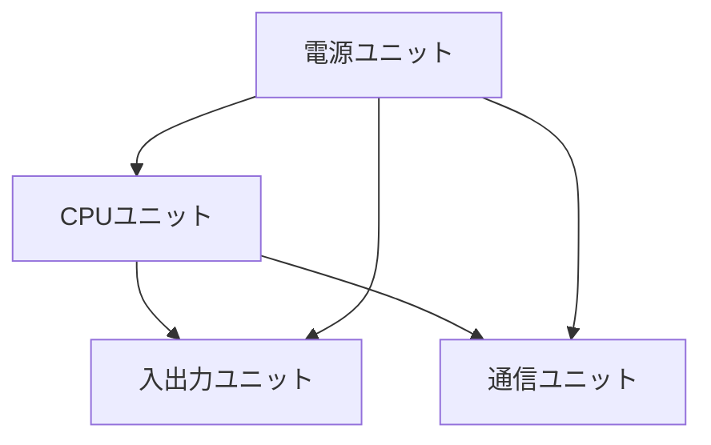
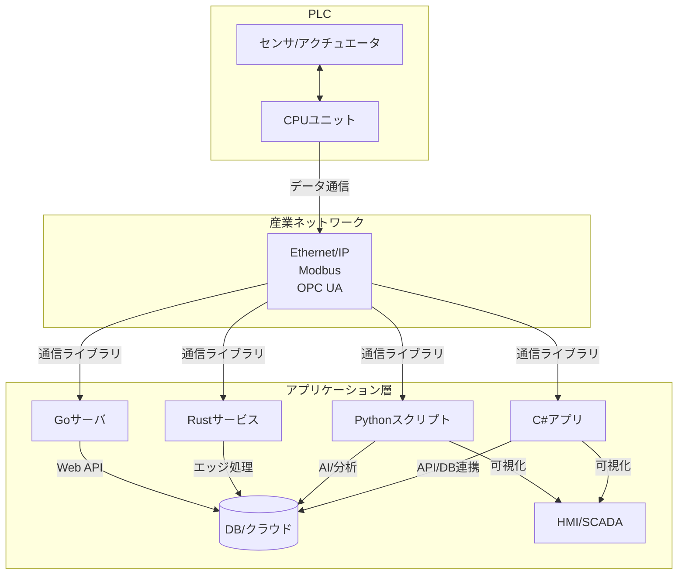
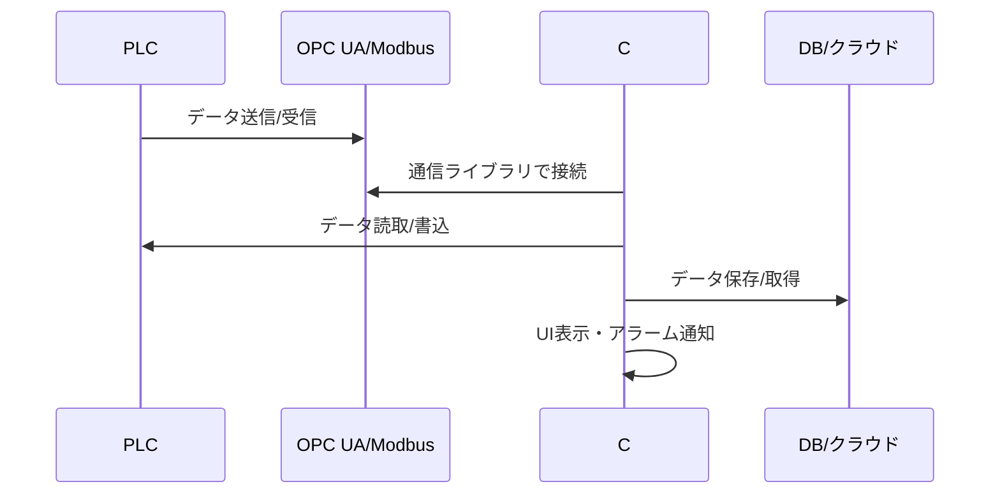
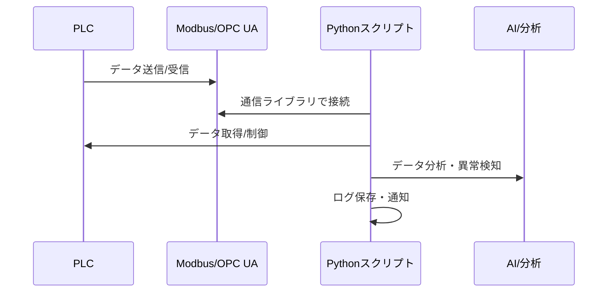
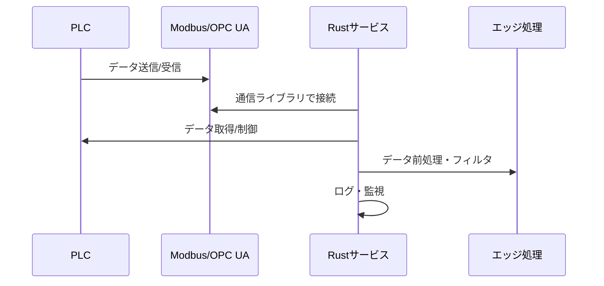
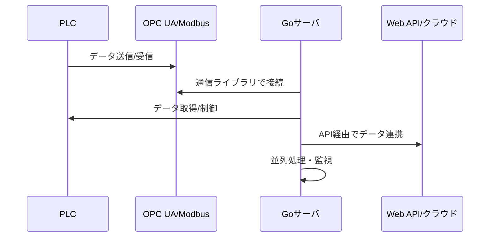

# Programmable Logic Controller

---

## 概要

本ドキュメントはPLCと通信するシステムにおいての技術資料である。  
C#、Python、Rust、Goを対象とする。  
PLC（Programmable Logic Controller）は、産業用オートメーションにおいて機械やプロセスの制御を担う専用コンピュータである。  
主に工場の生産ラインやインフラ設備の自動化に利用され、リアルタイム性・信頼性・拡張性を重視した設計となっている。  
近年はIoTやクラウド連携、AI技術との融合も進んでいる。

---

## 歴史

PLCは1960年代後半、米国自動車産業においてリレー制御盤の複雑化と設計変更の困難さを解決するために開発された。  
初代PLCはBedford Associates社（後のModicon社）によって開発され、Modicon 084が最初の製品である。  
以降、PLCはリレー回路の置き換えから始まり、半導体技術の進化とともに演算能力や通信機能を強化し、世界中の産業分野に普及した。

---

## 発展の経緯

1970年代にはプログラム容量やI/O点数の増加、タイマ・カウンタ機能の追加が進んだ。  
1980年代にはネットワーク機能や分散制御、自己診断機能が搭載され、より大規模なシステム構築が可能となった。  
1990年代以降はPCとの連携やオープンネットワーク対応、IEC 61131-3準拠のプログラミング言語の採用が進み、近年はIoTやAIとの連携も注目されている。

---

## 標準化の動き

PLCの標準化は、国際電気標準会議（IEC）によるIEC 61131シリーズが中心である。  
IEC 61131-3はPLCのプログラミング言語（ラダー、FBD、ST等）を規定し、メーカー間の互換性向上に寄与している。  
また、通信プロトコルではEthernet/IP、PROFINET、Modbusなどの標準化が進み、異種機器間の連携が容易となっている。

---

## 基本構成

PLCは主に以下のユニットで構成される。

- CPUユニット：制御プログラムの実行、I/O制御、通信管理
- 電源ユニット：各ユニットへの安定した電源供給
- 入出力（I/O）ユニット：外部機器との信号のやり取り
- 通信ユニット：他PLCや上位システムとのデータ通信



---

## 主要コンポーネント

- **CPUユニット**：プログラムの格納・実行、I/O制御、タイマ・カウンタ管理、自己診断などを行う。クロック周波数やメモリ容量は用途により異なる。
- **入力ユニット**：センサやスイッチからのデジタル・アナログ信号を受信し、CPUに伝達する。絶縁回路やフィルタ回路を備える場合が多い。
- **出力ユニット**：CPUの制御信号をリレー、ソリッドステートリレー、トランジスタ等を介して外部機器に出力する。
- **通信ユニット**：Ethernet、RS-232C、RS-485、フィールドバス等のインターフェースを持ち、他機器や上位システムとデータ交換を行う。

---

## ハードウェア構成

PLCのハードウェアはモジュール式（ラック式、スライス式）が主流である。  
各ユニットはバックプレーンバスで接続され、必要に応じてI/O点数や通信機能を拡張できる。  
産業用途のため、耐ノイズ性、耐熱性、耐振動性、防塵・防滴性などが考慮されている。  
一部の小型PLCは一体型（オールインワン）構成も存在する。

---

## ソフトウェア構成

PLCのソフトウェアは以下で構成される。

- **ファームウェア**：PLC本体の基本動作を制御するソフトウェア。メーカーごとに最適化されている。
- **ユーザプログラム**：制御対象に応じてユーザが作成する。ラダー、FBD、ST等で記述。
- **通信設定**：ネットワークアドレスやプロトコル設定、データマッピング等。
- **診断・保守機能**：エラー検出、ログ記録、遠隔監視など。

---

## 動作原理

PLCはサイクル制御方式（スキャン方式）を採用している。  
1サイクルは「入力読取り→プログラム実行→出力書込み→自己診断」の順で繰り返される。  
サイクルタイムは数ms～数十ms程度であり、リアルタイム性が求められる制御に適している。


---

## 制御方式

PLCは以下の制御方式に対応する。

- **シーケンス制御**：工程の順序や条件に従い動作を制御。ラダー図で記述されることが多い。
- **PID制御**：温度・圧力・流量等の連続値制御。専用命令やファンクションブロックで実装。
- **タイマ・カウンタ制御**：時間や回数による動作制御。
- **イベント駆動制御**：割込みや外部信号に応じた即時処理。

---

## 冗長化・信頼性

産業用途ではシステム停止が大きな損失となるため、以下の冗長化技術が用いられる。

- **CPU二重化**：メイン・スタンバイCPUを用意し、障害時に自動切替
- **電源二重化**：2系統の電源供給で安定稼働を確保
- **通信経路冗長化**：ネットワークの二重化による耐障害性向上
- **自己診断機能**：ハード・ソフトの異常を検出し、アラームやフェールセーフ動作を実施

---

## 特徴

- **高信頼性**：産業現場の厳しい環境下でも安定稼働
- **拡張性**：用途に応じてI/Oや通信機能を追加可能
- **リアルタイム性**：高速なサイクルタイムで制御を実現
- **長期供給・保守**：10年以上の長期供給・サポート体制
- **ユーザビリティ**：ラダー図等の視覚的なプログラミング環境

---

## メリット・デメリット

**メリット**
- 専用設計による高信頼性・長寿命
- プログラム変更や保守が容易
- 豊富なI/O・通信インターフェース
- 世界中で実績があり、技術者が多い

**デメリット**
- 汎用PCやマイコンに比べて初期コストが高い場合がある
- プログラミング言語や開発環境がメーカー依存
- 高度な演算や画像処理には不向き

---

## 主なメーカー

- **三菱電機**（MELSECシリーズ）：日本国内シェアが高く、幅広いラインナップを持つ
- **オムロン**（SYSMACシリーズ）：FA分野で豊富な実績
- **シーメンス**（SIMATICシリーズ）：欧州を中心にグローバル展開
- **ロックウェル・オートメーション**（Allen-Bradley）：北米市場で高いシェア
- **シュナイダーエレクトリック**（Modiconシリーズ）：初代PLCメーカー

---

## 代表的な製品

- **MELSEC iQ-R/iQ-Fシリーズ**（三菱電機）：高速処理・冗長化・ネットワーク対応
- **SYSMAC NJ/NXシリーズ**（オムロン）：モーション制御や安全制御に強み
- **SIMATIC S7シリーズ**（シーメンス）：大規模システムや分散制御に対応

---

## プログラミング言語

PLCのプログラミングにはIEC 61131-3で規定された以下の言語が用いられる。

- **ラダー（LD）**：リレー回路を模した視覚的な言語。保守性が高い。
- **ファンクションブロック（FBD）**：ブロックを組み合わせて制御ロジックを構築。
- **構造化テキスト（ST）**：Pascal風のテキスト言語。複雑な演算やデータ処理に適する。
- **命令リスト（IL）**：アセンブリ風の低水準言語（新規格では非推奨）。
- **順序機能チャート（SFC）**：工程の流れをチャートで記述。

---

## 開発ツール

各メーカーが専用の開発環境を提供している。  
例：GX Works（MELSEC）、CX-Programmer（オムロン）、TIA Portal（シーメンス）など。  
近年はPC上でのシミュレーション、オンラインモニタ、リモートデバッグ、バージョン管理機能も充実している。

---

## シミュレーション

仮想PLCやエミュレータを用いたプログラム検証が可能である。  
現場導入前に動作確認やデバッグを行うことで、トラブルや工数削減に寄与する。  
一部ツールでは3Dシミュレーションやデジタルツインとの連携も可能である。

---

## 通信プロトコル

PLCは多様な通信プロトコルに対応している。代表的なものは以下の通りである。

- **Ethernet/IP**：イーサネットベースの産業用プロトコル。ロックウェル系で普及。
- **Modbus**：シリアル・イーサネット両対応。シンプルで多機種間連携に強い。
- **PROFINET**：シーメンス系のリアルタイムイーサネットプロトコル。
- **CC-Link**：三菱電機系のフィールドネットワーク。
- **DeviceNet、CANopen、EtherCAT**なども用途に応じて利用される。

---

## セキュリティ

ネットワーク接続の拡大に伴い、PLCのセキュリティ対策が重要となっている。  
アクセス制御（ユーザ認証・権限管理）、暗号化通信（TLS等）、ファームウェア署名検証、不正アクセス検知、ログ監視などが導入されている。  
また、物理的なポート制限やネットワーク分離も有効な対策である。

---

## 関連技術

- **SCADA（Supervisory Control and Data Acquisition）**：遠隔監視・制御システム。PLCと連携し、全体監視やデータ収集を担う。
- **DCS（Distributed Control System）**：分散制御システム。大規模プラントでのプロセス制御に用いられる。
- **HMI（Human Machine Interface）**：オペレータ向けの操作・監視画面。タッチパネルやPCベースが主流。

---

## 他システムとの連携

PLCはMES（製造実行システム）、ERP（基幹業務システム）、ロボット、センサ、アクチュエータ等と連携し、工場全体の自動化・最適化を実現する。  
OPC UAなどのオープンプロトコルを用いることで、異種システム間のデータ連携も容易となる。

---

## C#、Python、Rust、GoによるPLC連携

PLCと各種プログラミング言語で連携することで、データ収集、監視、制御、上位システムとの統合が可能となる。ここでは各言語ごとの連携アーキテクチャ、代表的なライブラリ、実装例、活用シーン、設計上の注意点を詳述する。



### C#によるPLC連携

#### アーキテクチャと用途
C#はWindows環境での業務アプリケーションやHMI、SCADA、データ収集・可視化システムの開発に多用される。PLCとの連携は主に以下の方法で実現される。

#### 代表的な連携方法・ライブラリ
- **OPC UA/DAクライアント**  
  OPCFoundation.NetStandard.Opc.Ua、OPC Labs QuickOPC など
- **PLCメーカー提供SDK**  
  MELSEC Communication Protocol（MCプロトコル）、Siemens S7.NetPlus など
- **Modbus/TCPライブラリ**  
  NModbus4 など

#### 実装例（OPC UA）
```csharp
// filepath: example.cs
using Opc.Ua.Client;
using Opc.Ua.Configuration;
// ...OPC UAサーバへの接続とデータ読取り例...
ApplicationInstance application = new ApplicationInstance();
application.ApplicationName = "OpcUaClient";
application.ApplicationType = ApplicationType.Client;
await application.LoadApplicationConfiguration(false);
Session session = await Session.Create(
    application.ApplicationConfiguration,
    new ConfiguredEndpoint(null, new EndpointDescription("opc.tcp://plc-server:4840")),
    false, "", 60000, null, null);
DataValue value = session.ReadValue("ns=2;s=Channel1.Device1.Tag1");
Console.WriteLine($"PLC Value: {value.Value}");
```

#### 活用シーン
- 工場の生産データのリアルタイム可視化
- 設備監視・アラーム通知
- MES/ERPとのデータ連携

#### 設計上の注意点
- .NET環境での動作が前提
- マルチスレッド設計や非同期処理でUI応答性・リアルタイム性を確保
- 通信エラー時のリトライ・再接続処理
- セキュリティ（認証・暗号化）の実装



---

### PythonによるPLC連携

#### アーキテクチャと用途
Pythonはデータロギング、AI/機械学習連携、プロトタイピング、バッチ処理、スクリプト自動化などに適している。PLCとの連携は柔軟かつ迅速に実装できる。

#### 代表的な連携方法・ライブラリ
- **OPC UAクライアント**  
  opcuaパッケージ（FreeOpcUa/opcua）
- **Modbus/TCPクライアント**  
  pymodbus
- **S7通信**  
  python-snap7（Siemens S7 PLC向け）

#### 実装例（Modbus/TCP）
```python
# filepath: example.py
from pymodbus.client import ModbusTcpClient

client = ModbusTcpClient('192.168.0.10', port=502)
client.connect()
result = client.read_holding_registers(0, 2, unit=1)
print(result.registers)
client.close()
```

#### 活用シーン
- 生産ラインのデータ収集・CSV/DB保存
- AIによる異常検知・予知保全
- Web APIやクラウド連携のゲートウェイ

#### 設計上の注意点
- GILやスレッド制御、タイミング精度に注意
- 例外処理・再接続処理の実装
- 長時間運用時のメモリリークやリソース管理
- セキュリティ（証明書管理、通信暗号化）



---

### RustによるPLC連携

#### アーキテクチャと用途
Rustは高速・高信頼性が求められるエッジ処理やIoTゲートウェイ、リアルタイムデータ処理に適している。安全性・パフォーマンス重視のシステムに向く。

#### 代表的な連携方法・ライブラリ
- **Modbus/TCPクライアント**  
  tokio-modbus
- **OPC UAクライアント**  
  opcua crate

#### 実装例（Modbus/TCP）
```rust
// filepath: example.rs
use tokio_modbus::prelude::*;
use tokio;

#[tokio::main]
async fn main() -> Result<(), Box<dyn std::error::Error>> {
    let socket_addr = "192.168.0.10:502".parse()?;
    let mut ctx = tcp::connect(socket_addr).await?;
    let response = ctx.read_holding_registers(0x00, 2).await?;
    println!("PLC Registers: {:?}", response);
    Ok(())
}
```

#### 活用シーン
- エッジデバイスでのリアルタイムデータ収集・前処理
- 高信頼性が求められるIoTゲートウェイ
- 産業用プロトコル変換サーバ

#### 設計上の注意点
- ライブラリの成熟度やサポート状況を事前に確認
- 非同期処理・エラーハンドリングの設計
- 長期運用時のリソース管理
- セキュリティ（TLS対応、認証）



---

### GoによるPLC連携

#### アーキテクチャと用途
Goは軽量なサーバ・ゲートウェイ、Web API連携、クラウド連携、IoTバックエンドなどに適している。並列処理やネットワーク通信に強みがある。

#### 代表的な連携方法・ライブラリ
- **Modbus/TCPクライアント**  
  github.com/goburrow/modbus
- **OPC UAクライアント**  
  github.com/gopcua/opcua

#### 実装例（OPC UA）
```go
// filepath: example.go
package main

import (
    "context"
    "fmt"
    "github.com/gopcua/opcua"
    "github.com/gopcua/opcua/ua"
)

func main() {
    ctx := context.Background()
    c := opcua.NewClient("opc.tcp://plc-server:4840")
    if err := c.Connect(ctx); err != nil {
        panic(err)
    }
    defer c.Close()
    req := &ua.ReadRequest{
        NodesToRead: []*ua.ReadValueID{
            {NodeID: ua.NewStringNodeID(2, "Channel1.Device1.Tag1")},
        },
    }
    res, err := c.Read(req)
    if err != nil {
        panic(err)
    }
    fmt.Printf("PLC Value: %v\n", res.Results[0].Value)
}
```

#### 活用シーン
- PLCデータのWeb API化・クラウド連携
- 軽量なデータ収集サーバやMQTTゲートウェイ
- マイクロサービスアーキテクチャでの産業データ連携

#### 設計上の注意点
- 並列処理やチャネルを活用した設計
- 通信エラー時のリトライ・再接続処理
- タイムアウト・監視機構の実装
- セキュリティ（証明書管理、TLS通信）



---

#### 共通の設計ポイント

- PLC側の通信設定（IPアドレス、ポート、プロトコル、アクセス権限）を正確に行うこと
- 通信プロトコル（OPC UA/DA、Modbus、メーカー独自プロトコル等）に応じたライブラリ選定
- ネットワーク遅延や瞬断、PLC再起動時の例外処理
- ログ記録・監査証跡の実装
- セキュリティ要件（認証、暗号化、アクセス制御）の遵守
- 長期運用を見据えた保守性・拡張性の確保

---

## IoTとの関係

IoT技術の進展により、PLCもクラウド連携やビッグデータ解析への対応が進んでいる。  
エッジコンピューティングの一端を担い、現場データの収集・前処理・フィルタリングを行い、必要な情報のみを上位システムへ送信する役割を持つ。  
また、リモート監視や予知保全、AIによる異常検知など新たな応用が拡大している。

---

## 応用例

- **組立ラインの自動化**：多軸ロボットや搬送装置の協調制御
- **プロセス制御**：化学・食品工場での温度・圧力・流量制御
- **ビル管理システム**：空調・照明・エレベータ等の統合管理
- **エネルギー管理**：発電・配電設備の監視制御、デマンドコントロール

---

## 導入事例

- **自動車工場の溶接ライン制御**：多台数PLCによる工程間連携と品質管理
- **飲料工場の充填・包装ライン**：高速ライン制御とトレーサビリティ管理
- **発電所の監視制御**：冗長化PLCによる高信頼性運転と遠隔監視

---

## 今後の展望

AIやIoTとの連携強化、セキュリティ機能の高度化、オープン化・標準化の進展が期待される。  
また、5GやエッジAIの活用によるリアルタイムデータ解析、クラウドベースの遠隔保守、ノーコード/ローコード開発環境の普及も進む見込みである。

---

## 参考文献

- IEC 61131-3
- 各メーカー公式サイト
- 「PLC入門」技術評論社
- 「産業用ネットワークのすべて」日刊工業新聞社
