# QUIC

---

## 概要

QUIC（Quick UDP Internet Connections）は、Googleが2012年に提案し、IETFで標準化された次世代トランスポート層プロトコルである。HTTP/3の基盤技術として採用されており、従来のTCP+TLSに比べて高速なコネクション確立、低遅延、パケットロス耐性、マルチプレックス、コネクション移動、ヘッドオブラインブロッキング（HoL Blocking）の解消など、現代のインターネット利用に最適化された多くの機能を持つ。QUICはUDP上で動作し、TLS 1.3を必須とすることで、通信の秘匿性・完全性・認証性を高いレベルで実現している。HTTP/3以外にも、リアルタイム通信、IoT、ゲーム、VPNなど多様な分野での活用が進んでいる。

---

## 歴史

QUICはGoogleのJim Roskindによって2012年に提案され、2013年にはGoogle Chromeに実験的に実装され、YouTubeやGoogle検索などで限定運用された。2016年からIETFで標準化が本格化し、Google版QUIC（gQUIC）からIETF版QUICへと大きく仕様が刷新された。IETF版ではTLS 1.3の統合、パケット構造の見直し、バージョンネゴシエーションの導入などが行われ、2021年5月にRFC 9000として正式公開された。HTTP/3（RFC 9114）もQUICを基盤として標準化されている。

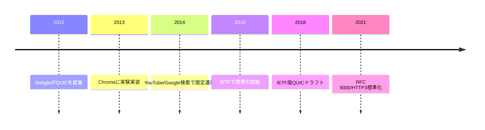

---

## 標準化の動向

IETF QUICワーキンググループが中心となり、QUICの基本仕様（RFC 9000）、HTTP/3（RFC 9114）、QPACK（RFC 9204）などが策定された。今後は、バージョンネゴシエーション、マルチパスQUIC、さらなるパフォーマンス最適化、運用ベストプラクティス、セキュリティ強化などの標準化が進行中である。QUICはバージョン管理が設計に組み込まれており、将来的な機能追加や仕様変更にも柔軟に対応できる。

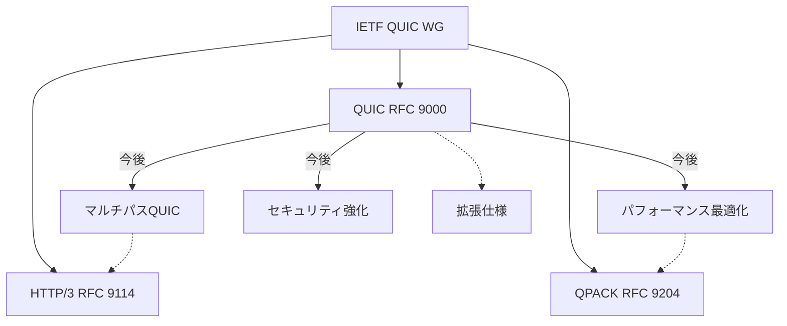

---

## 関連プロトコル

QUICはHTTP/3のトランスポート層として利用されるほか、TLS 1.3を組み込んでいる。従来のTCPやUDPと比較されることが多く、QUICはUDPの上に独自の信頼性制御やフロー制御、暗号化を実装している点が特徴である。また、DTLSやSCTPなど他のUDPベースのプロトコルとも比較される。QUICはTCPの課題（HoL Blocking、コネクション確立遅延、ネットワーク経路変更時の切断など）を解決するために設計されている。

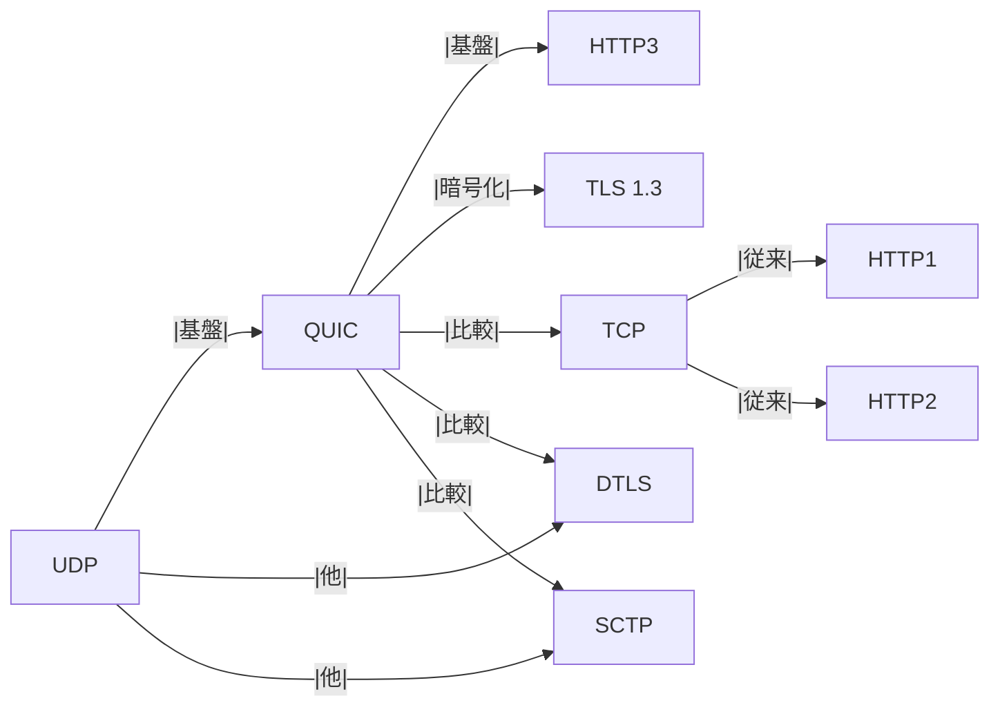

---

## 用語集

- **ストリーム**: QUICコネクション内で独立してデータを送受信する単位。双方向・単方向の両方が存在し、HTTP/3ではリクエストごとにストリームが割り当てられる。
- **コネクションID**: コネクションを識別するためのID。ネットワーク経路変更時にもコネクションを維持可能で、モバイル環境でのハンドオーバーに有効。
- **ハンドシェイク**: 通信開始時の認証・暗号化手続き。TLS 1.3を利用し、1-RTTまたは0-RTTで完了する。
- **パケット番号**: パケットごとに付与される連番。再送制御や暗号化に利用され、パケットの順序や重複検出にも使われる。
- **フロー制御**: ストリームやコネクション単位での送信量制御。受信側がウィンドウサイズを通知し、送信側がそれを超えないように制御する。
- **リトライ**: サーバがDoS対策等のためにクライアントに再接続を要求する仕組み。初回接続時にリトライパケットを返すことで、クライアントのアドレス検証を行う。
- **ACK**: 受信確認応答。QUICではSelective ACKが利用され、パケットロスや再送の効率化に寄与する。
- **0-RTT/1-RTT**: ハンドシェイク時の往復回数。0-RTTは過去の接続情報を利用し、即座にデータ送信が可能。

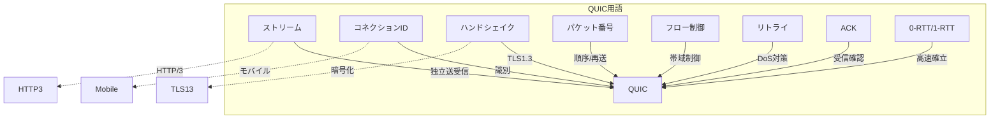

---

## 利用シナリオ

- WebブラウザとWebサーバ間の高速通信（HTTP/3）
- モバイルアプリのAPI通信（ネットワーク切替時もコネクション維持）
- 動画ストリーミングやリアルタイム通信（低遅延・高信頼性が求められる）
- CDNやエッジサーバによる高速配信
- IoTデバイス間のセキュアな通信
- ゲームサーバとクライアント間のリアルタイムデータ転送
- VPNやプロキシのトランスポート層としての利用
- WebRTCやライブ配信などの低遅延メディア転送

---

## 特徴

- 低遅延なコネクション確立（1-RTT/0-RTTハンドシェイク）
- パケットロス時の高速なリカバリ（ストリーム単位の再送制御）
- マルチプレックスによる効率的なデータ転送（HoL Blockingの解消）
- ネットワーク切替時のコネクション維持（コネクションIDによる識別）
- 標準で暗号化（TLS 1.3）
- UDPベースのため、ファイアウォールやNAT越えの工夫が必要
- バージョンネゴシエーションによる将来的な拡張性
- 0-RTTデータ送信による初回通信の高速化
- パスMTUディスカバリやコネクション移動のサポート
- パケットサイズや送信間隔の最適化による輻輳制御

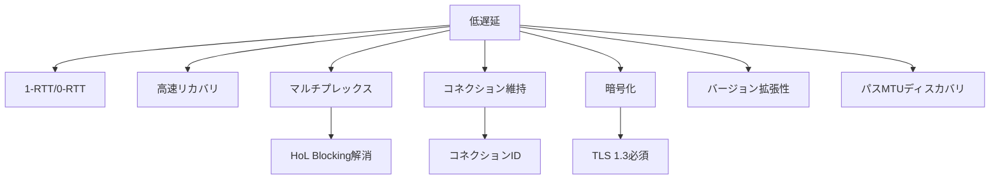

---

## RESTとの関係

REST（Representational State Transfer）は、Web API設計のためのアーキテクチャスタイルであり、HTTPプロトコルを用いてリソース指向の通信を行う。従来はHTTP/1.1やHTTP/2がトランスポート層として利用されてきたが、QUICの登場によりHTTP/3がREST APIの新たな基盤となっている。

QUIC上のREST通信の特徴は以下の通りである。

- **コネクション確立の高速化**: QUICは1-RTTまたは0-RTTでコネクション確立が可能なため、REST APIの初回リクエスト応答時間が短縮される。
- **ヘッドオブラインブロッキング（HoL Blocking）の解消**: HTTP/2ではストリーム間でHoL Blockingが発生する場合があったが、QUICのマルチプレックス機能により、複数のRESTリクエストが独立して処理される。
- **パケットロス耐性**: パケットロス時もストリーム単位で再送が行われるため、他のRESTリクエストへの影響が最小限となる。
- **モバイル環境での強み**: コネクションIDによるコネクション維持により、モバイルネットワークの切り替え時もREST API通信が途切れにくい。
- **セキュリティの向上**: TLS 1.3が必須となるため、REST API通信の暗号化・認証が常に保証される。

一方で、UDPベースであるため一部の企業ネットワークやファイアウォール環境ではQUIC/HTTP3によるREST APIが利用できない場合がある。運用時はクライアント・サーバ双方のQUIC/HTTP3対応状況やネットワーク環境の検証が重要となる。

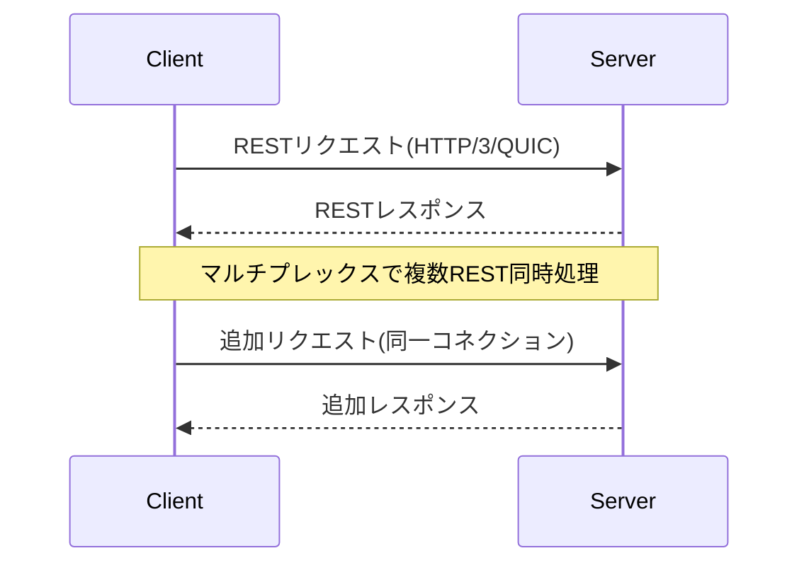

---

## gRPCとの関係

gRPCはGoogleが開発した高性能なRPC（Remote Procedure Call）フレームワークであり、IDL（Protocol Buffers）による型安全なインターフェース定義、ストリーミング通信、双方向通信などをサポートする。gRPCはもともとHTTP/2上で動作していたが、QUIC/HTTP3への対応が進んでいる。

QUIC上のgRPC通信の特徴は以下の通りである。

- **マルチプレックスの活用**: gRPCは多数のRPC呼び出しやストリームを同時に扱うため、QUICのストリーム機能と親和性が高い。各gRPCストリームが独立して処理され、パケットロスや遅延の影響を受けにくい。
- **低遅延・高速化**: QUICの高速なハンドシェイクや0-RTTデータ送信により、gRPCの初回呼び出しや双方向ストリーミングの遅延が大幅に削減される。
- **モバイル・IoT環境での安定性**: コネクションIDによるコネクション維持により、ネットワーク切替時もgRPC通信が継続しやすい。
- **セキュリティ**: QUICはTLS 1.3を必須とするため、gRPC通信も常に暗号化・認証される。
- **パフォーマンス**: HTTP/2上のgRPCと比較して、パケットロス時のリカバリや輻輳制御が最適化されているため、特に高遅延・不安定なネットワークでのgRPC通信が安定する。

gRPCはHTTP/3（QUIC）上で動作する際、従来のHTTP/2ベースと比べてプロトコルスタックが変化するため、サーバ・クライアント双方の実装やロードバランサ、監視ツールの対応状況を確認する必要がある。また、QUICの暗号化によりトラブルシューティングやパケット解析が難しくなる点にも注意が必要である。

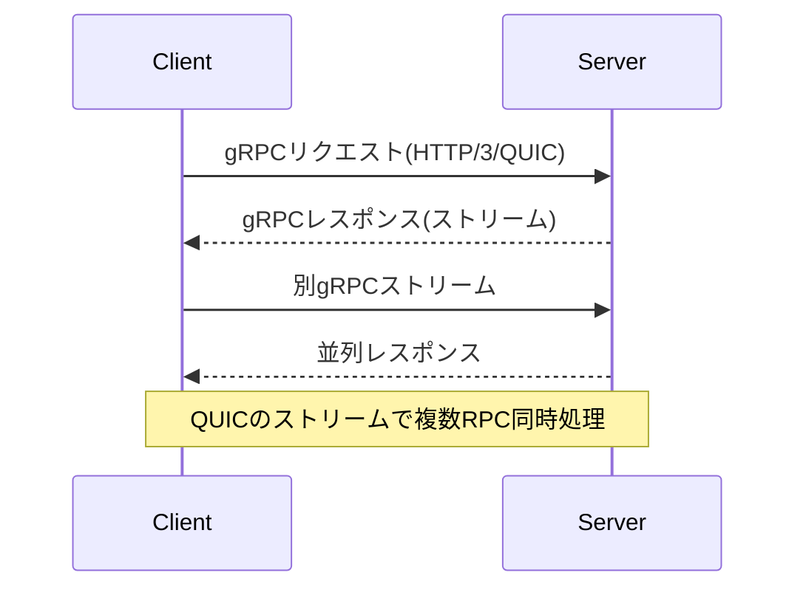

---

## メリットとデメリット

**メリット**
- 低遅延な通信（高速なハンドシェイクと再送制御）
- パケットロス時の高速回復（ストリーム単位の再送）
- モバイル環境での強い耐障害性（ネットワーク切替時もコネクション維持）
- 標準で暗号化されているためセキュリティが高い
- マルチプレックスによる効率的な帯域利用
- バージョンネゴシエーションによる将来的な拡張性
- UDPのためカーネルバイパスやユーザ空間実装が容易

**デメリット**
- UDPベースのため一部ネットワーク機器で制限される場合がある
- 実装が複雑であり、デバッグや運用が難しい
- UDPトラフィックがブロックされる環境では利用できない
- パケットキャプチャやトラブルシューティングが難しい場合がある
- ファイアウォールやNATの設定によっては通信が遮断される

---

## プロトコルの仕組み

QUICはUDP上で動作し、TLS 1.3による暗号化を標準で組み込んでいる。コネクションごとに複数のストリームを持ち、各ストリームは独立してデータを送受信できる。パケットにはコネクションIDやパケット番号が含まれ、再送制御やフロー制御が行われる。QUICは、パケットロス時にもストリーム単位で再送を行うため、他のストリームへの影響を最小限に抑えることができる。輻輳制御アルゴリズム（CUBICやBBRなど）も実装可能であり、ネットワーク状況に応じた最適な転送が可能。

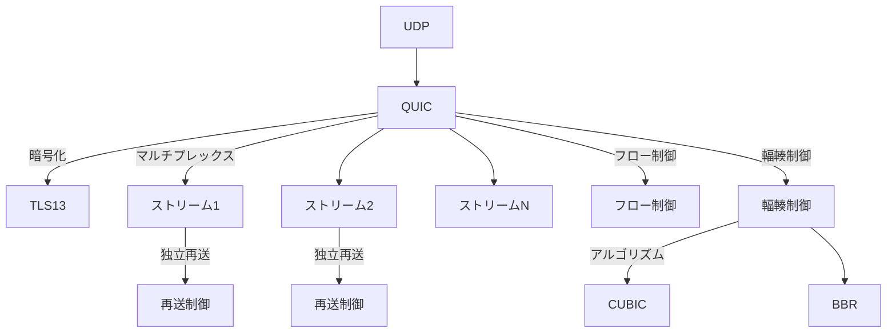

---

## ハンドシェイク

QUICのハンドシェイクはTLS 1.3を利用し、1-RTTまたは0-RTTで完了する。0-RTTでは過去の接続情報を利用して即座にデータ送信が可能である。ハンドシェイク中に暗号化・認証が完了し、従来のTCP+TLSよりも高速なコネクション確立が可能である。TLSの証明書検証や鍵交換もQUICパケット内で行われるため、通信開始から暗号化通信までの遅延が大幅に短縮される。リトライパケットによるアドレス検証や、DoS耐性のためのCookie機構も実装されている。

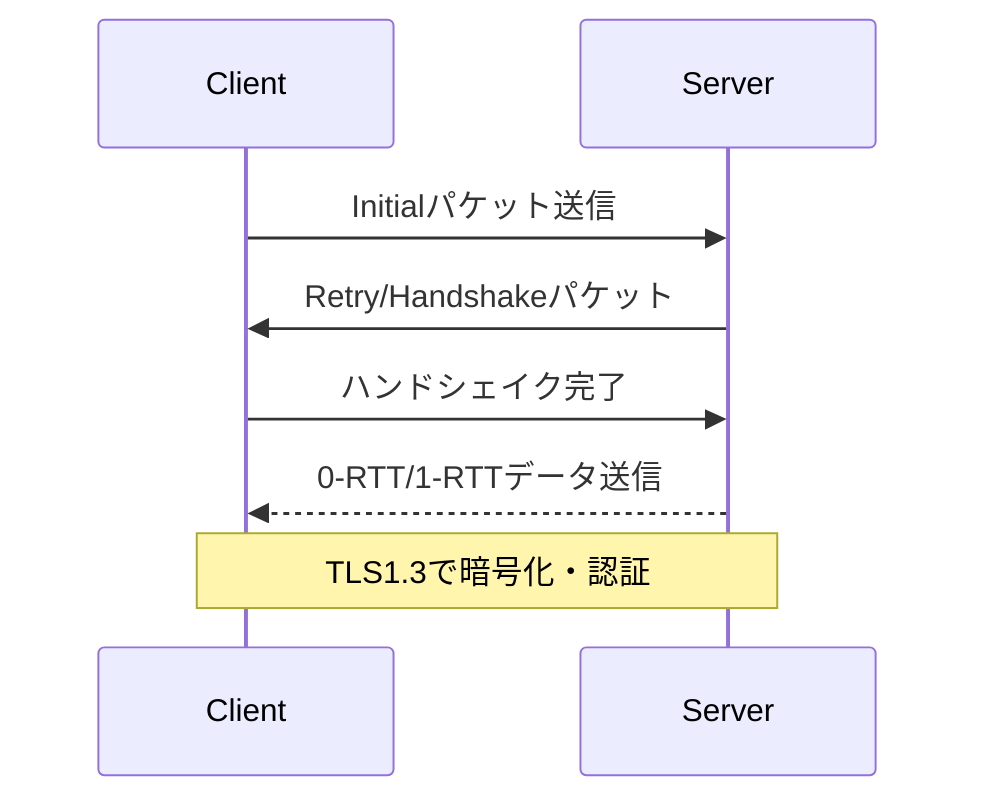

---

## パケット構造

QUICパケットはヘッダ部とペイロード部から構成される。ヘッダにはコネクションIDやパケット番号、バージョン、フラグなどが含まれる。ペイロードにはストリームデータや制御情報が格納される。パケットは暗号化されており、盗聴や改ざんに強い。パケットの種類には、Initial、Handshake、0-RTT、1-RTT、Retryなどがある。パケットサイズはMTUに合わせて調整され、パスMTUディスカバリもサポートされる。

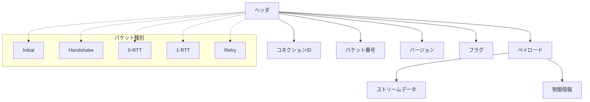

---

## ストリーム管理

QUICは1つのコネクション内で最大2^62本のストリームを同時に管理できる。各ストリームは独立しており、他のストリームの遅延やロスの影響を受けない。ストリームごとにフロー制御が行われ、効率的な帯域利用が可能である。HTTP/3では、リクエストごとにストリームが割り当てられ、同時に多数のリクエストを処理できる。ストリームIDには役割（双方向/単方向、クライアント/サーバ起点）が埋め込まれている。

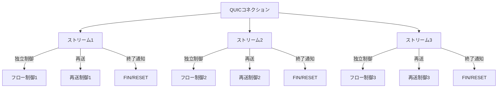

---

## アーキテクチャ

QUICのアーキテクチャは、アプリケーション層、QUIC層、UDP層、IP層で構成される。QUIC層は信頼性制御、暗号化、マルチプレックス、フロー制御、輻輳制御、コネクション管理など多くの機能を担う。アプリケーションはQUICのAPIを通じてストリームの生成やデータ送信を行う。ユーザ空間での実装が主流であり、カーネル空間への依存が少ない。

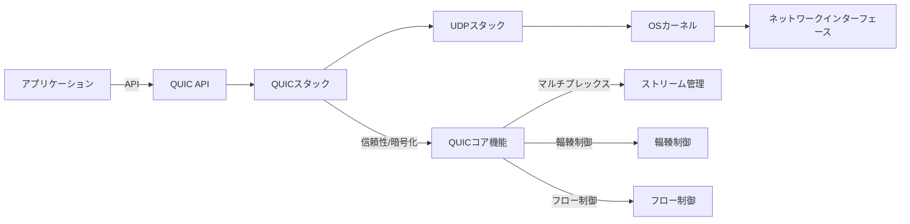

---

## 実装例

- Google quiche: GoogleによるC++実装。ChromeやGoogleサーバで利用。
- Cloudflare quiche: Rustによる実装。CloudflareのCDNで利用。
- Microsoft MsQuic: Cによるクロスプラットフォーム実装。Windows ServerやAzureで利用。
- LiteSpeed lsquic: Webサーバ向けのC実装。
- quic-go: Go言語による実装。オープンソースで広く利用されている。
- ngtcp2: C言語によるIETF QUIC準拠の実装。
- aioquic: Pythonによる実装。学術・検証用途で利用される。

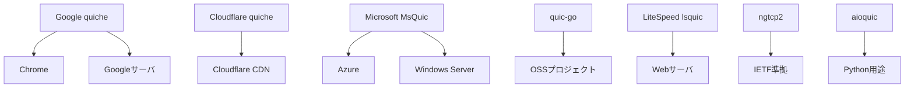

---

## サポート状況

主要なWebブラウザ（Chrome, Firefox, Edge, Safari）やWebサーバ（nginx, Caddy, LiteSpeed）でサポートされている。CDN事業者やクラウドサービスでも広く導入が進んでいる。Linuxカーネルや主要OSでもUDP高速化やQUIC対応が進められている。主要なクラウドプロバイダ（AWS, Azure, GCP）もQUIC/HTTP3対応を進めている。

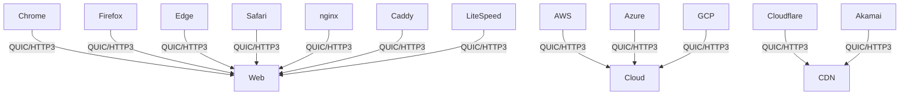

---

## 利用例

- YouTubeやGoogle検索などの大規模サービスでの高速配信
- CloudflareやAkamaiなどのCDNによるWeb高速化
- モバイルアプリのAPI通信（LINE, Facebook等）
- ゲームやIoTデバイスのリアルタイム通信
- ZoomやWebRTCなどのリアルタイムメディア配信
- VPNやプロキシの高速化
- 金融・証券分野での低遅延通信

---

## 運用上の注意点

UDPトラフィックのフィルタリングやNAT越えの問題に注意が必要である。ファイアウォールやロードバランサの設定によってはQUIC通信が遮断される場合があるため、運用前に十分な検証が必要である。また、パケットキャプチャやトラブルシューティングのためのツール整備も重要である。QUICは暗号化が標準のため、従来のTCP/HTTPよりもトラブルシューティングが難しい場合がある。運用時は、QUIC対応の監視・可視化ツールの導入が推奨される。UDPの特性上、パケットロスや順序入れ替え、MTU問題にも注意が必要。

---

## セキュリティ

QUICはTLS 1.3を必須とし、通信内容の暗号化と認証を実現している。パケットリプレイ攻撃や盗聴に対して強い耐性を持つ。0-RTTデータのリプレイ攻撃対策や、DoS攻撃への耐性も考慮されている。QUICはパケットの暗号化により、従来のTCP/HTTPよりも通信内容の秘匿性が高い。証明書管理や鍵交換の運用も重要である。TLSの脆弱性や証明書失効、鍵管理のベストプラクティスもQUIC運用時に考慮すべきである。

---

## パフォーマンス

TCPと比較してコネクション確立が高速であり、パケットロス時のリカバリも迅速である。特にモバイル環境や高遅延ネットワークで効果を発揮する。マルチプレックスによりHoL Blockingが解消され、Webページの表示速度が向上する。パスMTUディスカバリやコネクション移動のサポートにより、ネットワーク環境の変化にも柔軟に対応できる。輻輳制御アルゴリズムの選択や最適化もパフォーマンス向上の鍵となる。

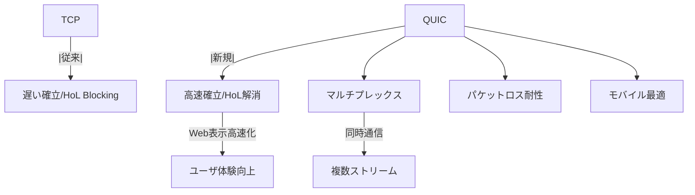

---

## テストと検証

QUICの動作検証にはWiresharkやquic-goのテストツール、Chromeのデベロッパーツール、curlのHTTP/3対応版などが利用できる。パケットキャプチャやログ解析により、ハンドシェイクやストリーム管理の挙動を詳細に確認できる。QUICは暗号化が標準のため、パケット内容の解析にはTLSキーの取得や専用ツールが必要となる。負荷試験やネットワーク障害時の挙動検証も重要である。

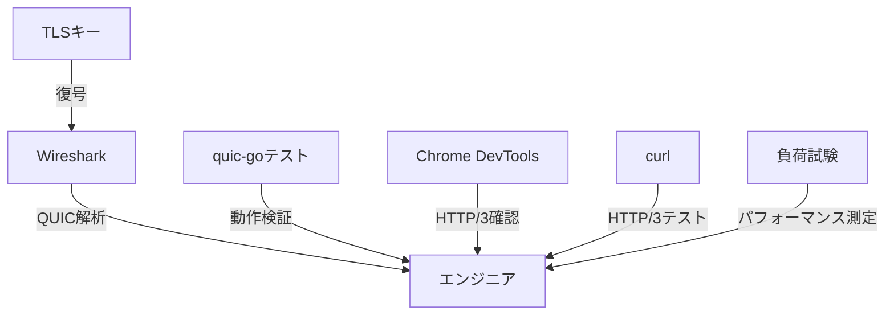

---

## トラブルシューティング

UDPがブロックされていないか、NATやファイアウォールの設定を確認することが重要である。パケットロスや遅延が発生した場合はネットワーク経路の調査や、QUICの再送制御・フロー制御の挙動を確認する。QUIC特有の問題として、コネクションIDの管理やバージョンネゴシエーションの失敗にも注意が必要である。運用時には、QUIC対応の監視・可視化ツールや、TLSキーを用いたパケット復号ツールの活用が推奨される。MTU問題やパス切替時の挙動も検証が必要。

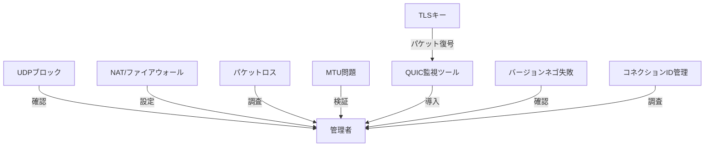

---

## 今後の展望

IoTやリアルタイム通信分野での活用が期待されている。今後はさらなる最適化や新機能（例えばマルチパスQUIC、拡張フロー制御、より高度なセキュリティ機能）の追加も進められている。QUICの普及により、インターネット全体の通信効率とセキュリティが向上することが期待される。標準化の進展とともに、より多様なアプリケーションやサービスでの採用が進む見込みである。QUICのエコシステム拡大に伴い、運用ノウハウやツールの充実も進むだろう。

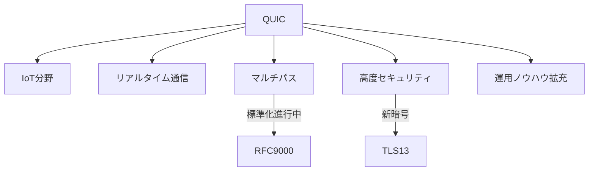

---

## 参考文献

- RFC 9000: QUIC: A UDP-Based Multiplexed and Secure Transport
- RFC 9114: HTTP/3
- RFC 9204: QPACK
- IETF QUIC Working Group
- Google QUIC Project
- Cloudflare Blog: QUIC and HTTP/3
- Akamai Blog: HTTP/3 and QUIC
- Wireshark QUIC Dissector
- curl HTTP/3 Support