# React

---

## 概要

ReactはFacebookによって開発されたユーザーインターフェース構築のためのJavaScriptライブラリである。コンポーネント指向で再利用性が高く、宣言的な記述が特徴である。

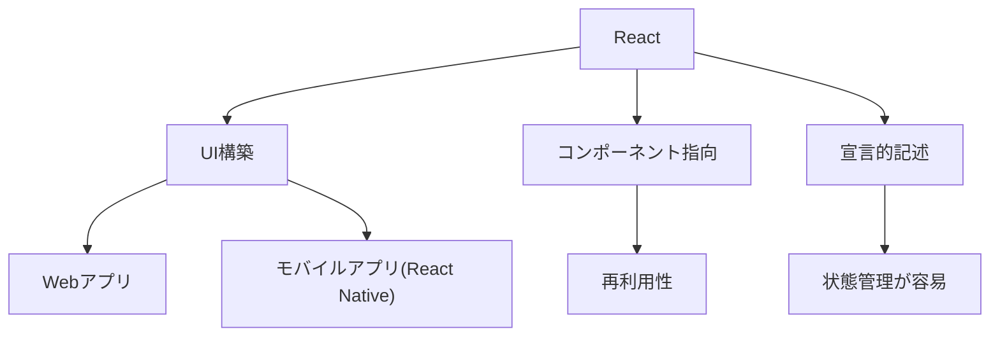

---

## Reactの特徴

- 仮想DOM: 実際のDOM操作を最小限に抑え、高速な描画を実現する。
- 宣言的UI: UIの状態を宣言的に記述でき、状態管理が容易である。
- コンポーネント指向: UIを小さな部品（コンポーネント）に分割して開発できる。
- 単方向データフロー: データの流れが一方向で、バグが発生しにくい。

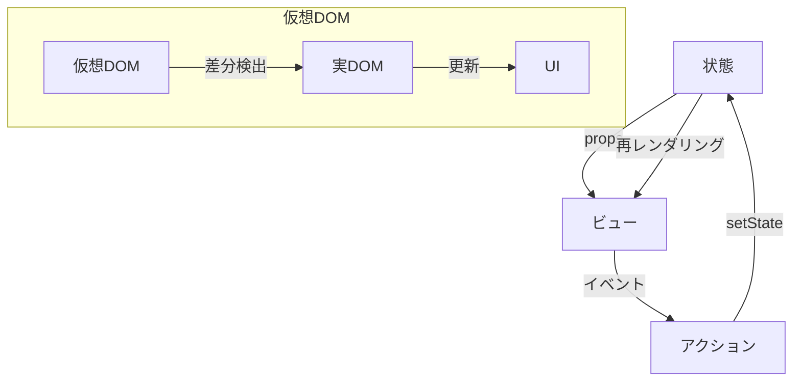

---

## 開発環境構築

### 必要なツール

- Node.js: JavaScript実行環境である。
- npm / yarn: パッケージ管理ツールである。

### プロジェクトの作成

- Create React App: 標準的なReactプロジェクトの雛形を作成する。
- Vite: 高速なビルドツールである。
- Next.js: サーバーサイドレンダリングや静的サイト生成に対応する。

### ディレクトリ構成例

```
my-app/
├── node_modules/
├── public/
├── src/
│   ├── components/
│   ├── App.js
│   └── index.js
├── package.json
└── README.md
```

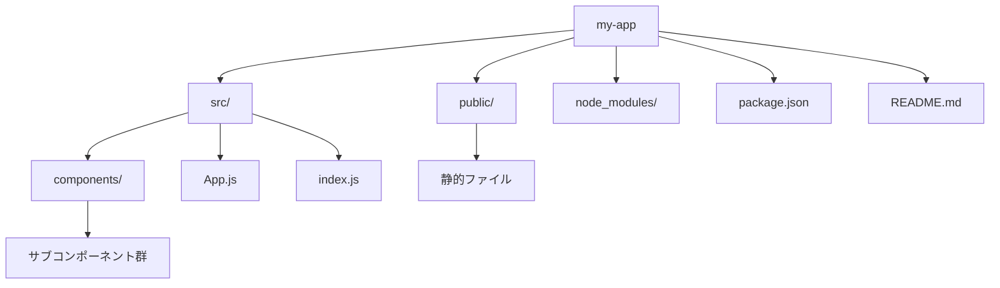

---

## JSX

### JSXとは

JavaScript内でHTMLのような構文を記述できる拡張構文である。

### 式の埋め込み

`{}`でJavaScriptの式を埋め込むことができる。

```jsx
<h1>{user.name}さん、こんにちは！</h1>
```

### 属性の指定方法

キャメルケースで属性を指定する。

```jsx
<button onClick={handleClick}>クリック</button>
```

### 子要素の扱い

複数要素を返す場合は、`<>...</>`で囲む。

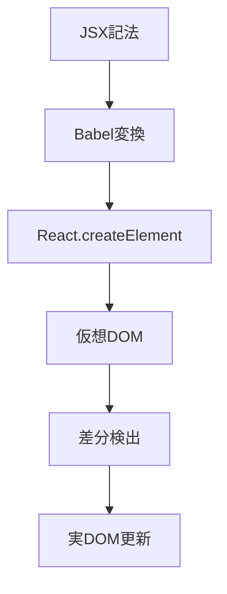

---

## コンポーネント

### 関数コンポーネント

#### 基本構文

```jsx
function Hello(props) {
  return <h1>Hello, {props.name}</h1>;
}
```

#### Propsの受け渡し

親から子へ値を渡す仕組みである。

#### Stateの利用

`useState`フックで状態を管理する。

```jsx
import { useState } from 'react';
function Counter() {
  const [count, setCount] = useState(0);
  return <button onClick={() => setCount(count + 1)}>{count}</button>;
}
```

### クラスコンポーネント

#### 基本構文

```jsx
class Welcome extends React.Component {
  render() {
    return <h1>こんにちは, {this.props.name}</h1>;
  }
}
```

#### ライフサイクルメソッド

`componentDidMount`などで副作用処理を記述する。

### PropsとState

#### Propsの型定義（TypeScript）

```tsx
type HelloProps = { name: string };
function Hello(props: HelloProps) { /* ... */ }
```

#### Stateの初期化と更新

`useState`や`this.state`で管理する。

### コンポーネントの再利用

#### コンポジション

複数の子コンポーネントを組み合わせて親コンポーネントを作成する。

#### 継承

Reactでは継承よりもコンポジションが推奨される。

#### 子コンポーネントのレンダリング

`props.children`で子要素をレンダリングする。

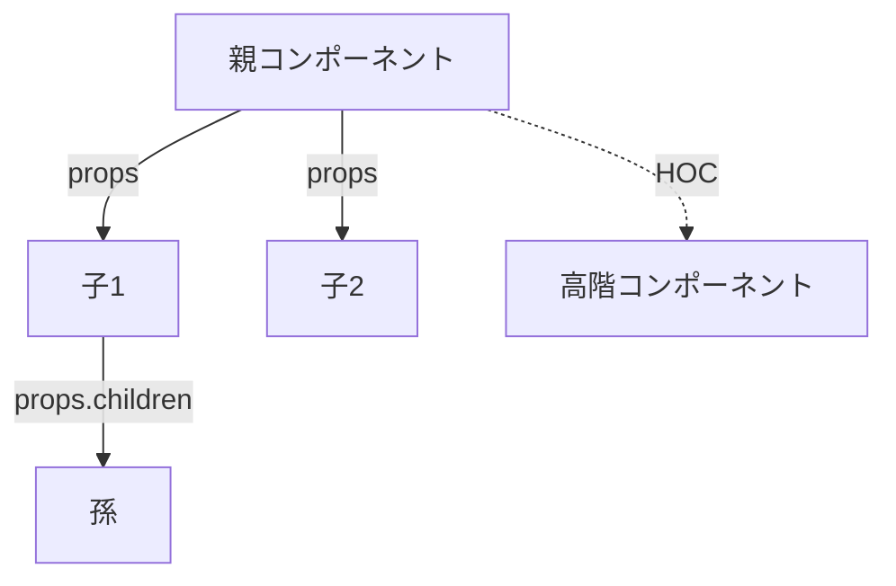

---

## ライフサイクル

### クラスコンポーネントのライフサイクル

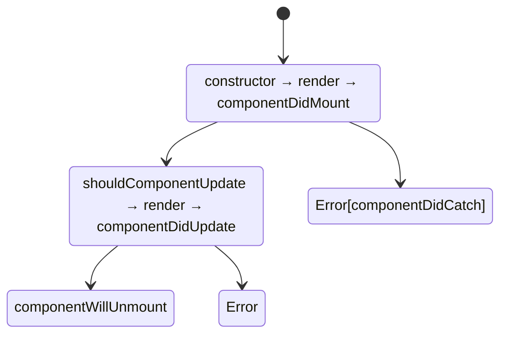

- constructor: 初期化を行う。
- render: 描画を行う。
- componentDidMount: マウント後に呼ばれる。
- componentDidUpdate: 更新後に呼ばれる。
- componentWillUnmount: アンマウント前に呼ばれる。
- componentDidCatch: エラー補足時に呼ばれる。

### useEffectによるライフサイクル管理

`useEffect`で副作用処理を記述する。

```jsx
useEffect(() => {
  // マウント時
  return () => {
    // アンマウント時
  };
}, []);
```

- 依存配列で実行タイミングを制御できる。

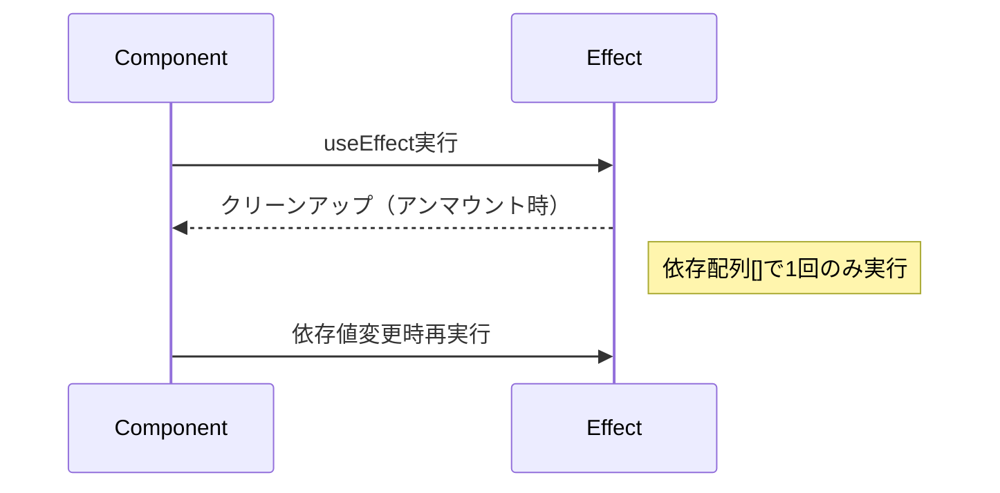

---

## フック（Hooks）

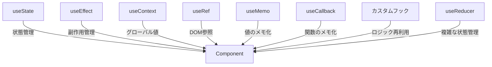

### useState

状態管理用フックである。  
関数コンポーネント内で状態（state）を持つことができる。

#### 基本構文

```jsx
const [state, setState] = useState(初期値);
```

#### 例

```jsx
import { useState } from 'react';
function Counter() {
  const [count, setCount] = useState(0);
  return <button onClick={() => setCount(count + 1)}>{count}</button>;
}
```

- `useState`は配列（[現在の値, 更新関数]）を返す。
- 状態の更新は非同期で行われる。
- 前回の値を参照して更新する場合は、関数型で渡す。

```jsx
setCount(prev => prev + 1);
```

---

### useEffect

副作用処理用フックである。  
データ取得や購読、DOMの直接操作など、レンダリング以外の処理を記述する。

#### 基本構文

```jsx
useEffect(() => {
  // 副作用処理
  return () => {
    // クリーンアップ処理（アンマウント時）
  };
}, [依存値]);
```

#### 例

```jsx
import { useEffect, useState } from 'react';
function Timer() {
  const [count, setCount] = useState(0);
  useEffect(() => {
    const id = setInterval(() => setCount(c => c + 1), 1000);
    return () => clearInterval(id);
  }, []);
  return <div>{count}</div>;
}
```

- 依存配列が空の場合、マウント時のみ実行される。
- 依存値が変化するたびに再実行される。
- クリーンアップ関数はアンマウント時や依存値変更時に呼ばれる。

---

### useContext

グローバルな値を扱うフックである。  
Context APIと組み合わせて、ツリー全体に値を渡す。

#### 基本構文

```jsx
const value = useContext(MyContext);
```

#### 例

```jsx
import React, { createContext, useContext } from 'react';

const ThemeContext = createContext('light');

function ThemedButton() {
  const theme = useContext(ThemeContext);
  return <button className={theme}>ボタン</button>;
}

function App() {
  return (
    <ThemeContext.Provider value="dark">
      <ThemedButton />
    </ThemeContext.Provider>
  );
}
```

- Providerで指定した値が、ツリー内のどこからでも取得できる。
- グローバルな状態管理やテーマ切り替えなどに利用される。

---

### useRef

DOM参照や値の保持に利用する。  
再レンダリングを発生させずに値を保持したい場合に使う。

#### 基本構文

```jsx
const ref = useRef(初期値);
```

#### 例（DOM参照）

```jsx
import { useRef } from 'react';
function InputFocus() {
  const inputRef = useRef(null);
  const handleClick = () => {
    inputRef.current.focus();
  };
  return (
    <>
      <input ref={inputRef} />
      <button onClick={handleClick}>フォーカス</button>
    </>
  );
}
```

#### 例（値の保持）

```jsx
const countRef = useRef(0);
countRef.current += 1;
```

- `ref.current`で値やDOM要素にアクセスできる。
- 値の変更では再レンダリングされない。

---

### useMemo

値のメモ化に利用する。  
計算コストの高い処理の結果をキャッシュし、依存値が変わった時のみ再計算する。

#### 基本構文

```jsx
const memoizedValue = useMemo(() => 計算処理, [依存値]);
```

#### 例

```jsx
import { useMemo, useState } from 'react';
function ExpensiveComponent({ num }) {
  const result = useMemo(() => {
    // 重い計算
    let sum = 0;
    for (let i = 0; i < 1e7; i++) sum += i;
    return sum + num;
  }, [num]);
  return <div>{result}</div>;
}
```

- 依存値が変わらない限り、前回の計算結果を再利用する。

---

### useCallback

関数のメモ化に利用する。  
依存値が変わらない限り、同じ関数インスタンスを返す。

#### 基本構文

```jsx
const memoizedCallback = useCallback(() => {
  // コールバック処理
}, [依存値]);
```

#### 例

```jsx
import { useState, useCallback } from 'react';
function Parent() {
  const [count, setCount] = useState(0);
  const handleClick = useCallback(() => setCount(c => c + 1), []);
  return <Child onClick={handleClick} />;
}
function Child({ onClick }) {
  return <button onClick={onClick}>クリック</button>;
}
```

- 子コンポーネントにコールバックを渡す際、不要な再レンダリングを防ぐために使う。
- `useMemo`は値のメモ化、`useCallback`は関数のメモ化。

---

## 状態管理

### Reactのローカル状態

`useState`や`useReducer`で管理する。

### Context API

#### Contextの作成と利用

```jsx
const MyContext = React.createContext();
<MyContext.Provider value={...}>...</MyContext.Provider>
```

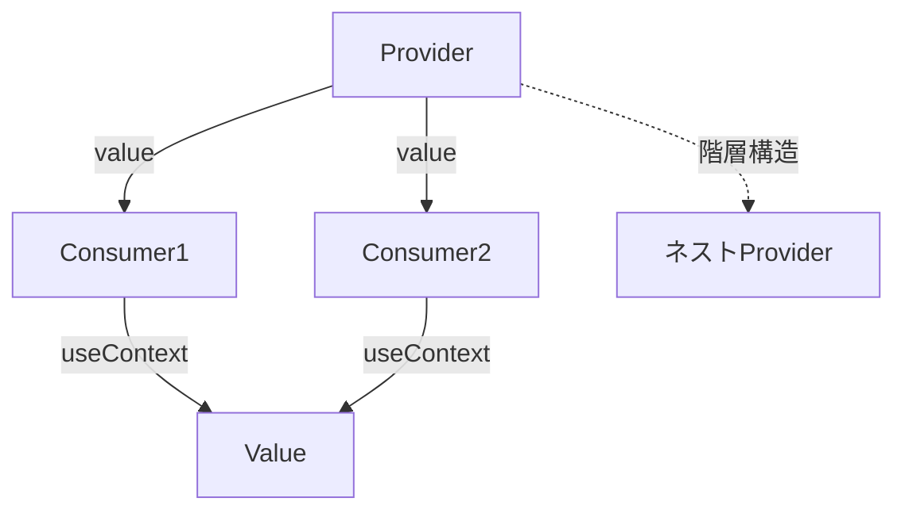

### 外部状態管理

- Redux: 大規模向けである。
- Recoil, Zustand: シンプルな状態管理である。

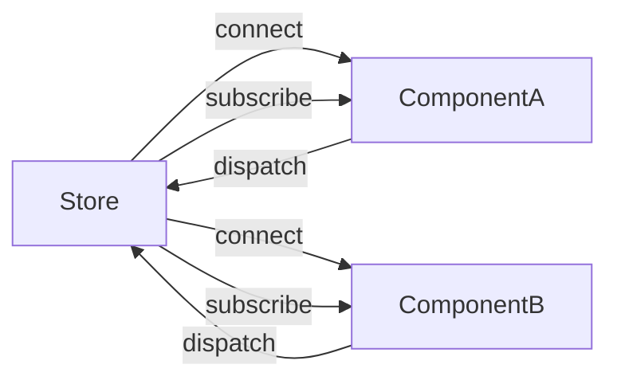

---

## イベント処理

### イベントハンドラの記述方法

```jsx
<button onClick={handleClick}>クリック</button>
```

### フォーム入力の管理

#### 入力値のバインディング

```jsx
<input value={value} onChange={e => setValue(e.target.value)} />
```

#### バリデーション

入力値の検証処理を追加する。

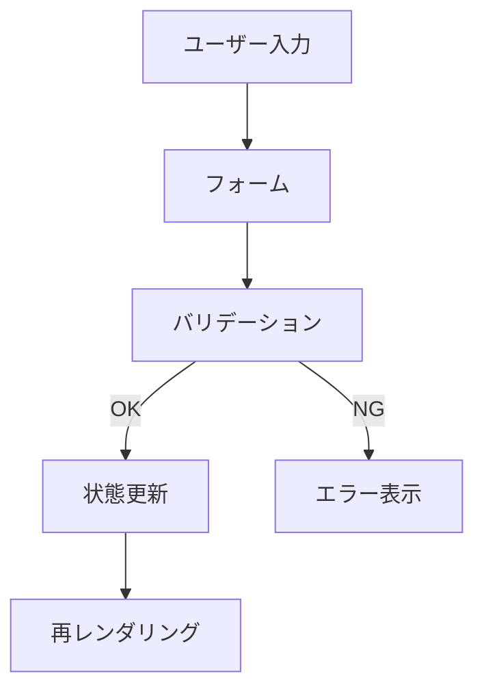

---

## ルーティング

### React Routerの導入

`react-router-dom`を利用する。

### ルート定義

```jsx
<Routes>
  <Route path="/" element={<Home />} />
  <Route path="/about" element={<About />} />
</Routes>
```

### パラメータ付きルート

`/users/:id`のように定義する。

### ネストされたルート

子ルートを定義できる。

### リダイレクトとナビゲーション

`useNavigate`で遷移する。

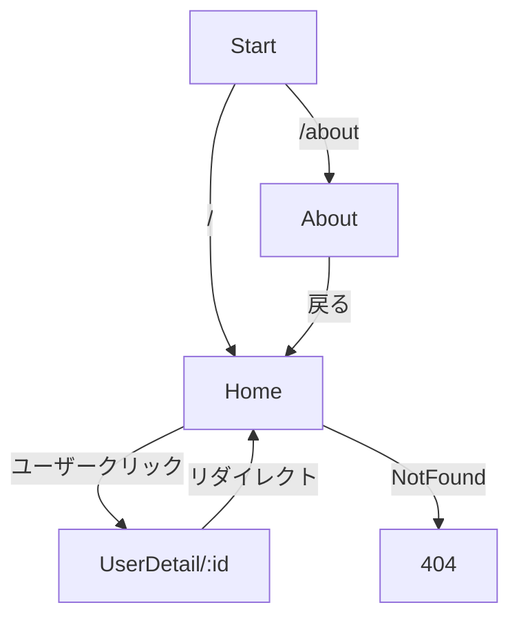

---

## サンプルコード

### カウンターアプリ

```jsx
import { useState } from 'react';
function Counter() {
  const [count, setCount] = useState(0);
  return <button onClick={() => setCount(count + 1)}>{count}</button>;
}
```

### ToDoリスト

```jsx
import { useState } from 'react';
function TodoList() {
  const [todos, setTodos] = useState([]);
  const [text, setText] = useState('');
  return (
    <div>
      <input value={text} onChange={e => setText(e.target.value)} />
      <button onClick={() => { setTodos([...todos, text]); setText(''); }}>追加</button>
      <ul>
        {todos.map((todo, i) => <li key={i}>{todo}</li>)}
      </ul>
    </div>
  );
}
```

### API連携サンプル

```jsx
import { useEffect, useState } from 'react';
function UserList() {
  const [users, setUsers] = useState([]);
  useEffect(() => {
    fetch('https://jsonplaceholder.typicode.com/users')
      .then(res => res.json())
      .then(setUsers);
  }, []);
  return (
    <ul>
      {users.map(user => <li key={user.id}>{user.name}</li>)}
    </ul>
  );
}
```

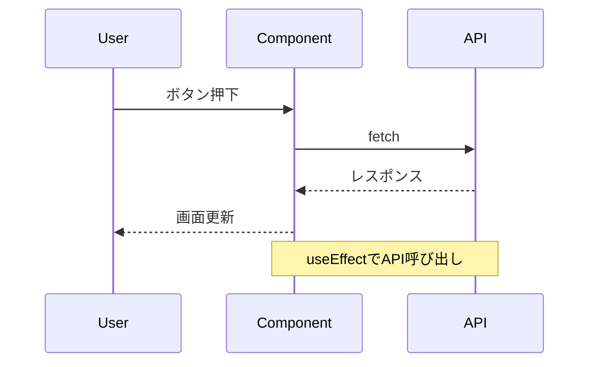

---

## よくあるエラーと対処法

### JSXの構文エラー

- タグの閉じ忘れに注意すること。

### Stateの更新に関する注意点

- 非同期であるため、前回の値を参照する場合は関数型で更新すること。

### 非同期処理の落とし穴

- useEffect内でasync/awaitを使う場合は注意すること。

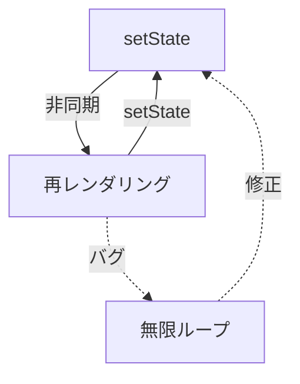

---

## パフォーマンス最適化

### レンダリング最適化

- 不要な再レンダリングを防ぐ。

### React.memoの活用

- コンポーネントのメモ化を行う。

### useMemo・useCallbackの使い所

- 計算コストの高い処理や関数の再生成防止に利用する。

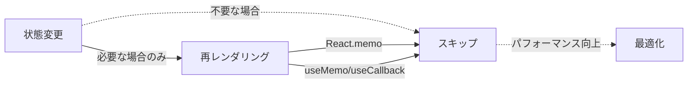

---

## テスト

### ユニットテスト（Jest）

- 関数やロジックのテストを行う。

### コンポーネントテスト（React Testing Library）

- 実際のユーザー操作を模したテストを行う。

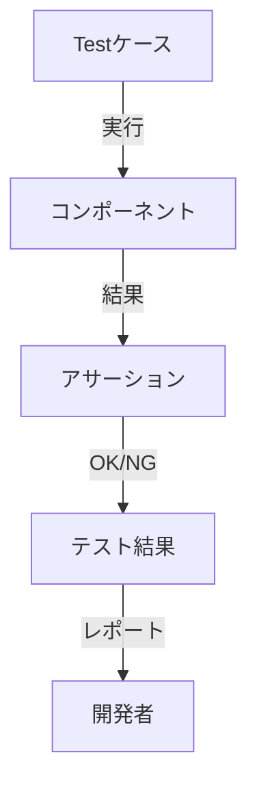

---

## 参考リンク

- [React公式ドキュメント](https://ja.react.dev/)
- [React Router](https://reactrouter.com/)
- [Redux](https://redux.js.org/)
- [Vite](https://vitejs.dev/)
- [Next.js](https://nextjs.org/)

---