# Redux

---

## 概要

ReduxはJavaScriptアプリケーションの状態管理を行うためのライブラリである。主にReactと組み合わせて利用されるが、他のフレームワークや純粋なJavaScriptとも連携可能である。状態を一元管理し、予測可能な方法で状態遷移を実現する。  
Reduxの設計思想は「すべての状態を一つのストアで管理し、状態の変更は必ずActionを通じて行う」ことである。これにより、アプリケーションの状態変化が明確になり、デバッグやテストが容易になる。

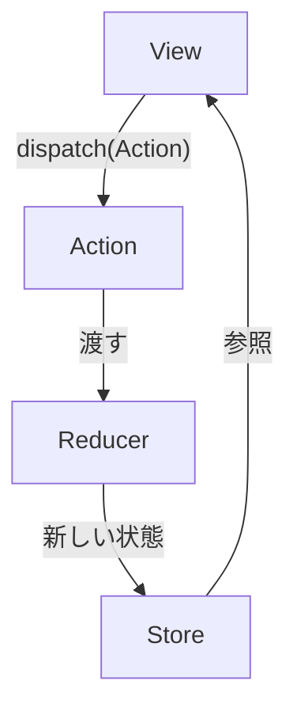

---

## 歴史

Reduxは2015年にDan AbramovとAndrew Clarkによって開発された。Fluxアーキテクチャの課題を解決するために設計され、シンプルかつ拡張性の高い状態管理を提供する。  
FluxはFacebookによって提唱されたが、実装が複雑であったため、ReduxはよりシンプルなAPIと明確なデータフローを提供することを目指した。  
ReduxはReactコミュニティで急速に普及し、現在では多くのJavaScriptフレームワークで利用されている。

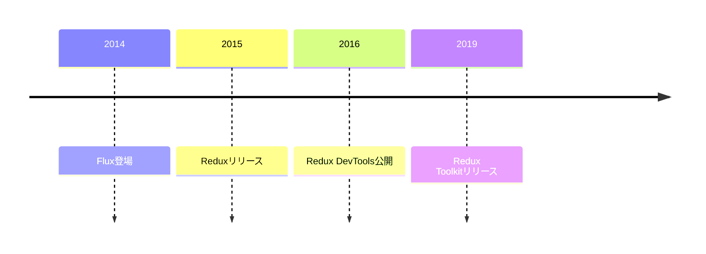

---

## 基本概念

Reduxは以下の3つの原則に基づいている。

- 単一の状態ツリー（Single Source of Truth）  
  アプリケーション全体の状態は一つのストア（オブジェクトツリー）で管理される。
- 状態は読み取り専用（State is Read-Only）  
  状態の変更は必ずActionを通じて行われ、直接変更することはできない。
- 変更は純粋関数で行う（Changes are made with Pure Functions）  
  状態の変更ロジックはReducerという純粋関数で記述する。副作用を含めてはならない。

これらの原則により、状態管理の一貫性と予測可能性が担保される。

---

## アーキテクチャ

Reduxのアーキテクチャは以下のような構成である。

Actionが発行されるとReducerが状態を更新し、Storeに新しい状態が保存される。ViewはStoreの状態を参照し、ユーザー操作に応じてActionをdispatchする。  
この一方向データフローにより、状態の流れが明確になり、複雑なアプリケーションでも状態管理が容易になる。

---

## 主な機能

- 状態の一元管理  
  アプリ全体の状態を一つのストアで集中管理する。
- ミドルウェアによる拡張性  
  Actionのdispatch処理を拡張できる（例：非同期処理、ロギング）。
- DevToolsによるデバッグ支援  
  Redux DevToolsを使うことで、Actionや状態遷移を時系列で追跡・巻き戻しできる。
- 時系列での状態追跡  
  すべてのActionと状態の履歴を記録できるため、バグの原因特定が容易である。

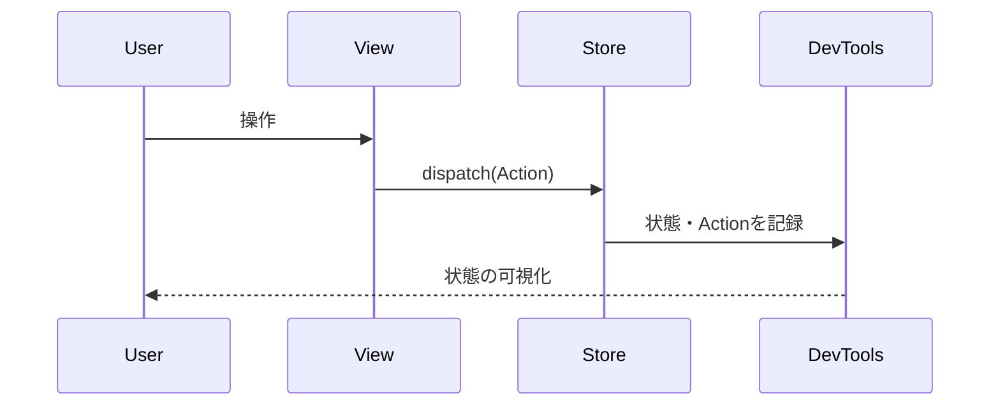

---

## メリット・デメリット

**メリット**
- 状態管理の一元化による可読性・保守性の向上
- 状態遷移の予測可能性
- 豊富なエコシステム
- テスト容易性（Reducerは純粋関数であるため）

**デメリット**
- 小規模アプリでは冗長になりやすい
- ボイラープレートコードが多い
- 学習コストがやや高い
- ActionやReducerの設計を誤ると複雑化しやすい

---

## 代表的な利用例

- 大規模なSPA（Single Page Application）
- 複数のコンポーネント間で状態を共有する必要がある場合
- Undo/Redoなどの高度な状態管理が必要な場合
- サーバーサイドレンダリングやオフライン対応が必要なアプリ

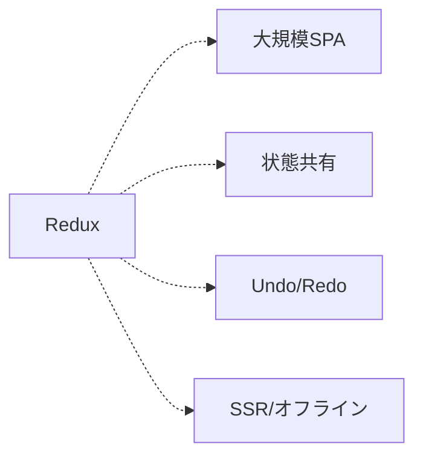

---

## 参考資料・学習リソース

- [Redux公式ドキュメント](https://redux.js.org/)
- [Redux Toolkit公式](https://redux-toolkit.js.org/)
- [Redux入門記事（Qiita）](https://qiita.com/tags/redux)
- [Redux DevTools Extension](https://github.com/reduxjs/redux-devtools)
- [Reduxの設計思想と実装解説（Zenn）](https://zenn.dev/topics/redux)

---

## 拡張機能・サードパーティライブラリ

- Redux Toolkit：公式推奨のツールセット。ボイラープレート削減と型安全性向上。
- Redux Thunk：非同期処理をActionとして記述可能にするミドルウェア。
- Redux Saga：Generatorを用いた複雑な非同期処理の管理。
- Reselect：セレクタのメモ化によるパフォーマンス最適化。
- Redux Logger：Actionや状態の変化をログ出力するミドルウェア。

---

## よくある課題と対策

- ボイラープレートの多さ → Redux Toolkitの利用で記述量を削減できる。
- 非同期処理の複雑化 → Redux ThunkやSagaの導入でロジックを整理できる。
- 型安全性の確保 → TypeScriptとの連携で型エラーを防止できる。
- 巨大なReducer → Reducerの分割とcombineReducersの活用。

---

## 他の状態管理ライブラリとの比較

| ライブラリ         | 特徴                       | 主な用途・特徴例                      |
|--------------------|----------------------------|---------------------------------------|
| Redux              | 一元管理・予測可能性       | 大規模SPA、厳格な状態管理             |
| MobX               | リアクティブ・柔軟性       | 小〜中規模、リアクティブなUI           |
| Recoil             | アトミックな状態管理       | React専用、細粒度な状態分割            |
| Zustand            | シンプル・軽量             | 小規模、ボイラープレート最小           |

---

## 導入手順

1. reduxパッケージのインストール  
   `npm install redux react-redux`
2. Storeの作成  
   `createStore`や`configureStore`でストアを生成する。
3. Reducer・Actionの定義  
   状態の初期値や変更ロジック、Action Creatorを作成する。
4. Providerでアプリ全体をラップ  
   React-Reduxの`<Provider>`でストアをコンテキストに渡す。
5. useSelector/useDispatchで状態・Actionを利用  
   Reactコンポーネント内で状態取得やAction発行を行う。

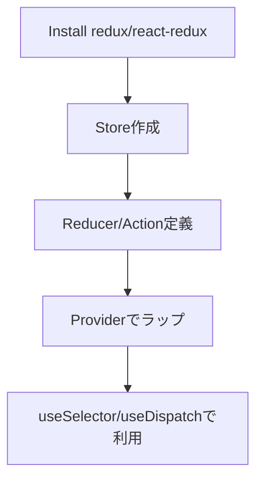

---

## よくある質問（FAQ）

- Q: Reduxは必須か？  
  - A: 小規模アプリでは不要な場合が多い。状態共有が複雑な場合に有効。
- Q: Context APIとの違いは？  
  - A: Contextは状態の伝播のみ、Reduxは状態管理の仕組み全体を提供。
- Q: 非同期処理はどう書く？  
  - A: Redux ThunkやSagaなどのミドルウェアを利用する。

---

## 用語集

- Store: 状態を保持するオブジェクト。`getState()`や`dispatch()`などのAPIを持つ。
- Action: 状態変更を表すプレーンなオブジェクト。`{ type: 'INCREMENT' }`のような形式。
- Reducer: 状態とActionから新しい状態を生成する純粋関数。副作用を持たない。
- Middleware: Actionのdispatchを拡張する仕組み。非同期処理やロギングなどに利用。

---

## サンプルコード・アプリケーション

```javascript
// カウンターの例
import { createStore } from 'redux';

function counter(state = 0, action) {
  switch (action.type) {
    case 'INCREMENT':
      return state + 1;
    case 'DECREMENT':
      return state - 1;
    default:
      return state;
  }
}

const store = createStore(counter);
store.subscribe(() => console.log(store.getState()));
store.dispatch({ type: 'INCREMENT' }); // 1
store.dispatch({ type: 'INCREMENT' }); // 2
store.dispatch({ type: 'DECREMENT' }); // 1
```

Reactとの連携例：

```javascript
import React from 'react';
import { Provider, useSelector, useDispatch } from 'react-redux';
import { createStore } from 'redux';
// ...counter reducerは上記と同じ...

const store = createStore(counter);

function Counter() {
  const count = useSelector(state => state);
  const dispatch = useDispatch();
  return (
    <div>
      <span>{count}</span>
      <button onClick={() => dispatch({ type: 'INCREMENT' })}>+</button>
      <button onClick={() => dispatch({ type: 'DECREMENT' })}>-</button>
    </div>
  );
}

export default function App() {
  return (
    <Provider store={store}>
      <Counter />
    </Provider>
  );
}
```

---

## ベストプラクティス

- 状態はできるだけ正規化する（ネストを避け、ID参照で管理）
- Action/Reducerは小さく分割し、責務を明確にする
- Redux Toolkitを活用し、記述量とバグを減らす
- セレクタ関数を活用し、再利用性とパフォーマンスを高める

---

## アンチパターン・設計ミス

- すべての状態をReduxで管理する（UIローカル状態はuseStateで十分）
- 巨大なReducerを作成する（分割してcombineReducersを使うべき）
- 非同期処理をReducer内で行う（副作用はミドルウェアで扱う）

---

## ミドルウェア

ReduxのミドルウェアはActionのdispatchを横断的に処理できる。代表例はRedux ThunkやRedux Sagaである。  
ミドルウェアは`applyMiddleware`でストアに適用する。

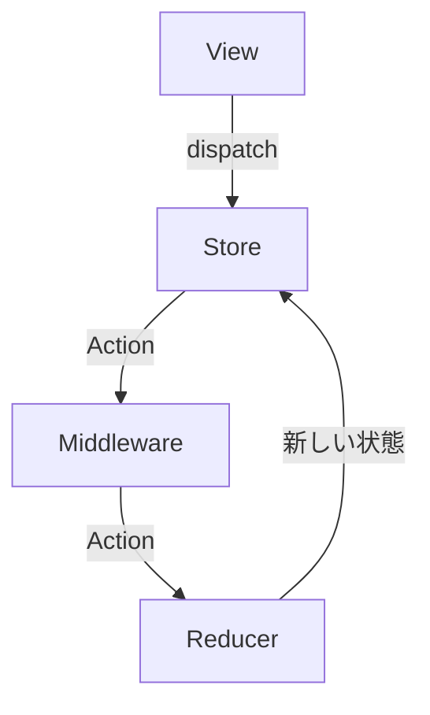

---

## テスト戦略

- Reducerは純粋関数なので単体テストが容易である
- Action Creatorやミドルウェアもテスト可能
- Redux DevToolsで状態遷移を可視化できる
- JestやTesting Libraryを用いた統合テストも推奨される

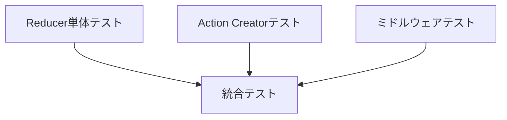

---

## パフォーマンス最適化

- Reselectによるセレクタのメモ化で再計算を抑制
- コンポーネントの分割とReact.memoの活用で再レンダリングを最小化
- 不要な再レンダリングの抑制にはuseSelectorの引数関数の工夫も重要

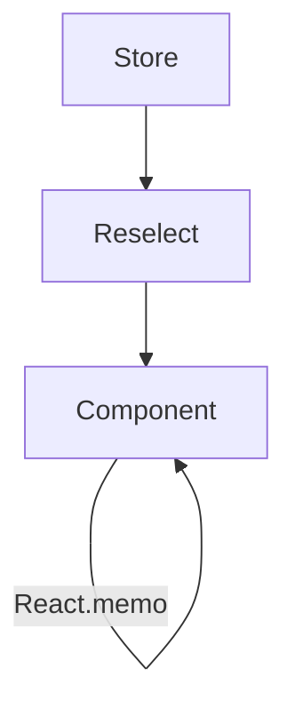

---

## エコシステム

Reduxは多くの公式・非公式ライブラリやツールと連携できる。  
Redux ToolkitやDevTools、各種ミドルウェア、型定義、React Native対応など幅広いエコシステムが存在する。

---

## バージョンごとの違い

- v3: レガシーなAPI。現在は非推奨。
- v4: 現在主流の安定版。APIの安定化とパフォーマンス向上。
- Redux Toolkitの登場で記述量が大幅に削減され、推奨される実装方法が変化した。

---

## トラブルシューティング・エラー対処

- Actionがdispatchされない場合はミドルウェアやReducerの設定を確認する
- 状態が更新されない場合はReducerの実装を見直す
- 無限ループやパフォーマンス低下はセレクタやuseSelectorの使い方を見直す

---

## セキュリティ考慮事項

- 状態に個人情報や機密情報を保存しない
- DevToolsの公開範囲に注意する
- Actionや状態のログ出力時は情報漏洩に注意する

---

## モバイルアプリでの利用

React NativeでもReduxは利用可能である。Webと同様の設計で状態管理ができる。  
永続化にはredux-persistなどのライブラリを利用する。

---

## サーバーサイドでの利用

サーバーサイドレンダリング（SSR）でもReduxは活用できる。Next.jsとの組み合わせが一般的である。  
サーバー側で初期状態を生成し、クライアントに引き継ぐ設計が推奨される。

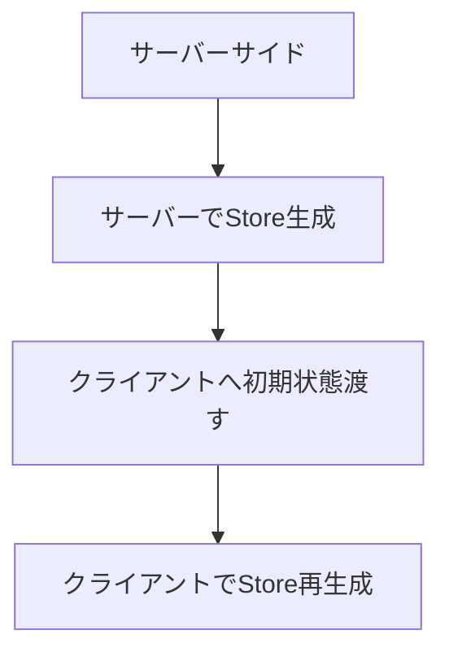

---

## マイグレーション戦略

- Fluxや他の状態管理からの移行は段階的に行う
- 既存のAction/ReducerをRedux Toolkitに置き換える
- テストを充実させて安全に移行する

---

## コミュニティとサポート

Reduxは活発なコミュニティと豊富なドキュメントがある。GitHubやStack Overflowで多くの情報が得られる。  
公式DiscordやZenn、Qiitaなど日本語情報も充実している。

---

## Redux Toolkit

Redux Toolkitは公式の推奨ツールセットであり、ボイラープレートの削減や型安全性の向上を実現する。  
`createSlice`や`createAsyncThunk`などのAPIで、Reducerや非同期処理を簡潔に記述できる。

```javascript
import { configureStore, createSlice } from '@reduxjs/toolkit';

const counterSlice = createSlice({
  name: 'counter',
  initialState: 0,
  reducers: {
    increment: state => state + 1,
    decrement: state => state - 1,
  },
});

const store = configureStore({
  reducer: counterSlice.reducer,
});
```

---

## TypeScriptとの連携

ReduxはTypeScriptと高い親和性がある。型定義を活用することで安全な状態管理が可能となる。  
Redux ToolkitはTypeScript対応が強化されており、型推論も効きやすい。

---

## 非同期処理

Redux ThunkやRedux Sagaなどのミドルウェアを利用することで、非同期処理をシンプルに記述できる。  
APIリクエストやタイマー処理などもActionとして管理できる。

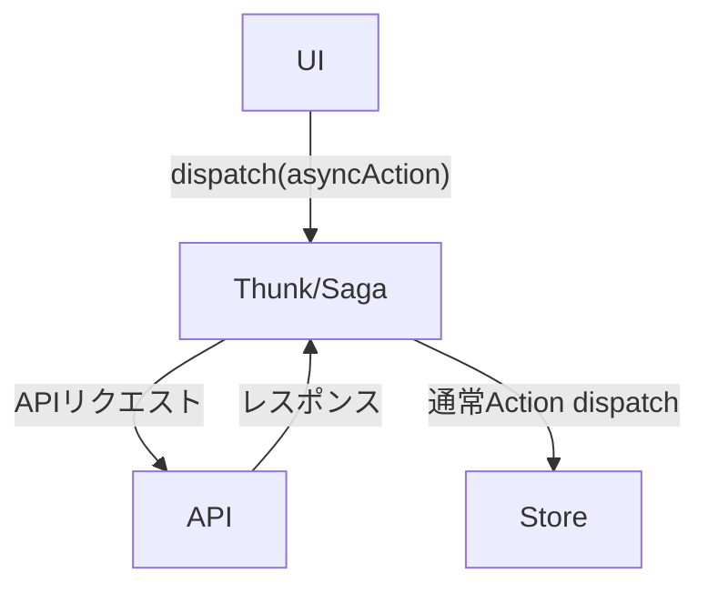

---

## デバッグツール

Redux DevToolsを利用することで、Actionや状態遷移を可視化できる。  
タイムトラベルデバッグやActionの巻き戻し・再実行も可能である。

---

## コード分割とスケーラビリティ

コード分割（Code Splitting）やReducerの動的追加（Dynamic Reducer）により、大規模アプリにも対応できる。  
必要な機能ごとにReducerを分割し、必要なタイミングでストアに追加する設計が推奨される。

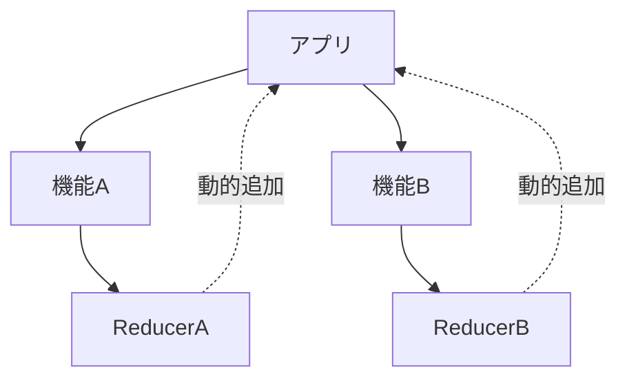

---

## 今後の展望

Reduxは今後もReactエコシステムの中核として進化が期待される。Redux Toolkitの普及や型安全性の強化が進む見込みである。  
また、Reactの新しい機能（Context, Suspense, Server Components等）との連携も進化していく。

---

## 導入事例

- Twitter Lite：大規模SPAでの状態管理にReduxを採用
- Instagram Web：複雑な状態管理をReduxで実現
- OSSプロジェクト各種：Reactベースの多くのOSSで利用実績あり

---
---

## 今後の展望

Reduxは今後もReactエコシステムの中核として進化が期待される。Redux Toolkitの普及や型安全性の強化が進む見込みである。  
また、Reactの新しい機能（Context, Suspense, Server Components等）との連携も進化していく。

---

## 導入事例

- Twitter Lite：大規模SPAでの状態管理にReduxを採用
- Instagram Web：複雑な状態管理をReduxで実現
- OSSプロジェクト各種：Reactベースの多くのOSSで利用実績あり

---


