# Rust

---

## 概要

RustはMozillaによって開発されたシステムプログラミング言語である。安全性、速度、並行性を重視して設計されており、メモリ安全性を保証しつつ高いパフォーマンスを実現する。C/C++の代替として注目されており、現代的な言語機能と強力な型システムを持つ。  
**主な特徴**として、所有権システム、ゼロコスト抽象化、強力な型推論、クロスプラットフォーム対応、並行性の安全性などが挙げられる。  
Rustは「安全性と速度の両立」を目指し、低レベル制御と高レベル抽象化を両立する数少ない言語である。  
**用途例**: OS・ブラウザ・Webサーバ・CLI・組み込み・ゲーム・ブロックチェーン・科学技術計算など。

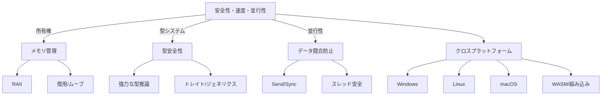

---

## 歴史

Rustは2006年にGraydon Hoareによって個人プロジェクトとして開始された。2010年にMozillaが支援を開始し、2015年にバージョン1.0がリリースされた。以降も安定したリリースサイクルで進化を続けている。2021年にはRust Foundationが設立され、より中立的な運営体制となった。  
**主なマイルストーン**:
- 2010年: Mozillaによる支援開始
- 2012年: Servo（Rust製ブラウザエンジン）開発開始
- 2015年: 1.0リリース
- 2018年: Edition 2018リリース（大規模な言語改善）
- 2021年: Rust Foundation設立
- 2024年: Rust 1.77リリース（2024年6月時点最新）

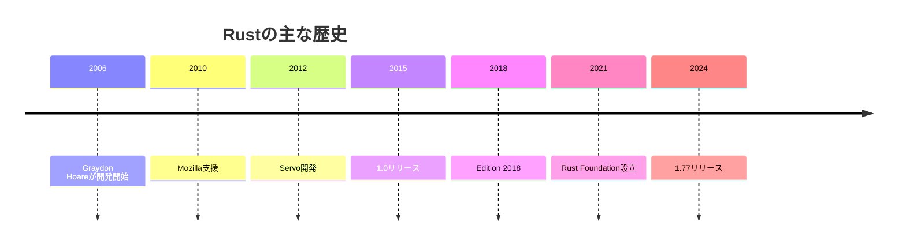

---

## 特徴

- **メモリ安全性の保証**：所有権システムにより、バッファオーバーフローやダングリングポインタを防止する。  
  例: ポインタの解放忘れや二重解放がコンパイル時に検出される。
- **ゼロコスト抽象化**：抽象化によるオーバーヘッドが発生しない設計である。  
  例: イテレータやクロージャも最適化され、C言語並みの速度を実現。
- **所有権システム**：リソース管理をコンパイラが静的に検証する。  
  例: 値の所有権が明確で、スコープを抜けると自動で解放される。
- **強力な型推論**：明示的な型注釈が少なくて済む。  
  例: `let x = 42;` のように型を書かなくても自動推論される。
- **クロスプラットフォーム対応**：多様なOSやアーキテクチャで動作する。  
  例: Windows, Linux, macOS, WebAssembly, 組み込み向けなど。
- **並行性**：データ競合をコンパイル時に検出する。  
  例: マルチスレッドプログラムでも安全性が保証される。
- **豊富なエコシステム**：Cargoによるパッケージ管理、crates.ioによるライブラリ共有。
- **ドキュメント生成・テスト・Lintが標準搭載**。

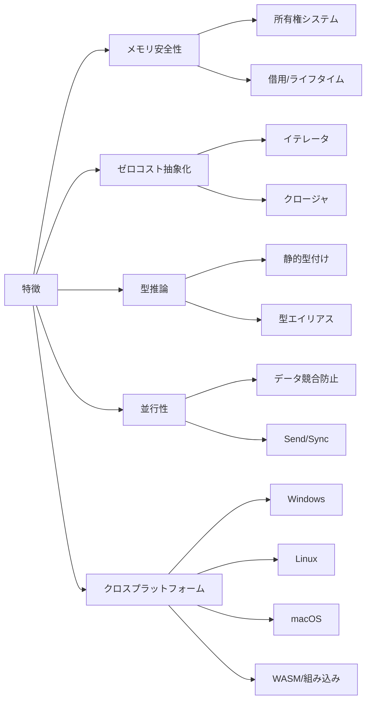

---

## 構文

Rustの構文はC系言語に似ているが、独自の特徴も多い。

```rust
fn main() {
    let mut count = 0;
    for i in 1..=5 {
        count += i;
    }
    println!("合計: {}", count);
}
```

- `let`で変数宣言、`mut`で可変変数
- `for`ループやパターンマッチなど高水準な構文を持つ
- **関数定義**: `fn`キーワードで定義
- **スコープ**: `{}`で囲む
- **制御構文**: `if`, `match`, `while`, `loop` など
- **パターンマッチ**: `match`による強力な分岐
- **クロージャ**: `|x| x + 1` のような無名関数

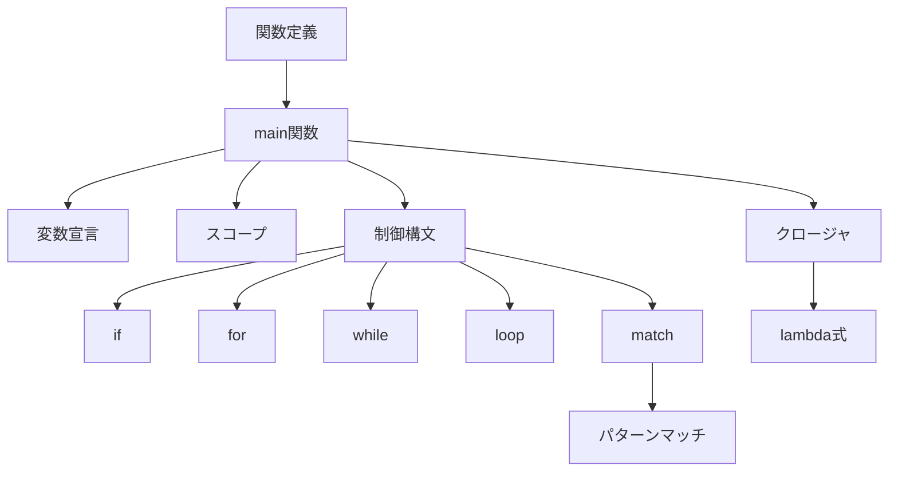

---

## 型システム

Rustは静的型付け言語であり、型安全性を重視している。型推論も強力である。

```rust
let x: i32 = 5;
let y = 10; // 型推論によりi32と推定される
let z: f64 = 3.14;
```

- プリミティブ型（i32, u32, f64, bool, char など）
- 構造体、列挙型、タプル、配列、スライスなどの複合型
- Option型やResult型による安全な値の扱い
- **型エイリアス**: `type Kilometers = i32;`
- **新しい型の定義**: `struct`, `enum`, `union`
- **トレイト**: インターフェースのような抽象型
- **型パラメータ**: ジェネリクスで利用

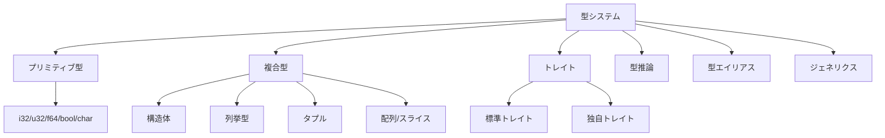

---

## マクロ

Rustのマクロはコード生成を強力にサポートする。`macro_rules!`による宣言型マクロと、手続き型マクロがある。

```rust
macro_rules! say_hello {
    () => {
        println!("Hello!");
    };
}
say_hello!();
```

- 標準マクロ例：`println!`, `vec!`, `format!` など
- 手続き型マクロでDSLや属性マクロも実現可能
- **手続き型マクロ例**:
  ```rust
  #[derive(Debug, Clone, PartialEq)]
  struct Point { x: i32, y: i32 }
  ```
- **ドキュメントマクロ**: `///`でdocコメントを記述

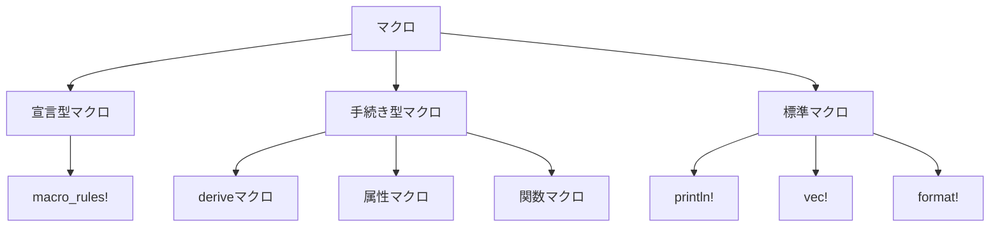

---

## ジェネリクス

ジェネリクスにより、型に依存しない汎用的なコードを書くことができる。

```rust
fn add<T: std::ops::Add<Output = T>>(a: T, b: T) -> T {
    a + b
}
```

- トレイト境界（`T: Trait`）で型制約を指定
- 標準ライブラリや独自型で広く利用されている
- **構造体や列挙型にも利用可能**:
  ```rust
  struct Point<T> { x: T, y: T }
  ```
- **where句**で複雑な制約も記述可能

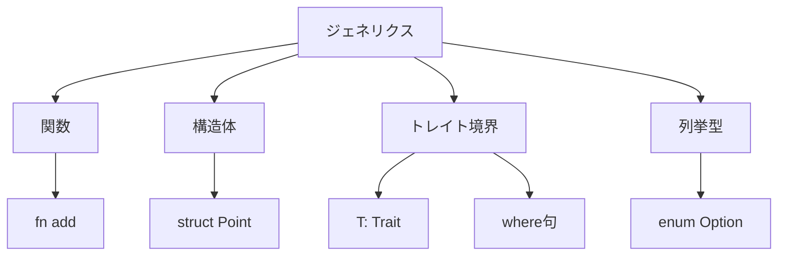

---

## 所有権と借用

Rustの所有権システムはメモリ安全性の根幹である。値の所有権は一つだけで、所有権の移動（ムーブ）、借用（参照）によってリソース管理を行う。

```rust
let s = String::from("hello");
let t = s; // sの所有権がtにムーブされる
// println!("{}", s); // エラー: sは無効

let u = &t; // tを借用（イミュータブル参照）
```

- **ミュータブル参照**: `let v = &mut t;`
- **借用規則**: 同時に複数のミュータブル参照は不可、イミュータブル参照とミュータブル参照の混在不可
- **Copyトレイト**: i32など一部型はムーブでなくコピー
- **スライス**: `&[T]`で配列の一部を借用

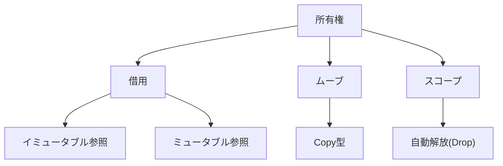

---

## ライフタイム

ライフタイムは参照の有効期間を明示的に管理する仕組みである。複雑な参照関係でも安全性を保証する。

```rust
fn longest<'a>(x: &'a str, y: &'a str) -> &'a str {
    if x.len() > y.len() { x } else { y }
}
```

- `'a`はライフタイムパラメータ
- ライフタイム省略規則も存在する
- **静的ライフタイム**: `'static`はプログラム全体で有効な参照
- **構造体のライフタイム**: 参照を持つ構造体は明示的なライフタイム指定が必要

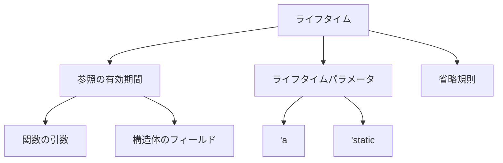

---

## 安全性

Rustはコンパイル時にメモリ安全性を保証する。ヌルポインタやデータ競合を防ぐ。unsafeブロック内でのみ危険な操作が許可される。

```rust
let p: *const i32 = std::ptr::null();
unsafe {
    if !p.is_null() {
        println!("{}", *p);
    }
}
```

- **unsafeでできること**: 生ポインタの操作、FFI呼び出し、グローバル変数の可変アクセスなど
- **unsafeは最小限に**: 安全なAPIでラップするのが推奨される
- **Send/Syncトレイト**: スレッド間共有の安全性を型で保証

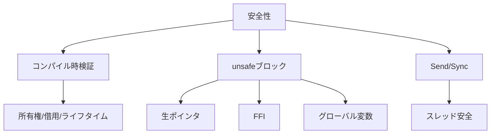

---

## パフォーマンス

C/C++に匹敵するパフォーマンスを持つ。ゼロコスト抽象化により、抽象度を上げても実行速度が低下しない。LLVMバックエンドによる最適化も強力である。

- **ベンチマーク**: Rust製CLIツール（ripgrep等）はC/C++製より高速な場合もある
- **SIMDや並列化**: 標準ライブラリやクレートでサポート
- **アロケーション最適化**: Box, Vec, SmallVecなどで制御可能

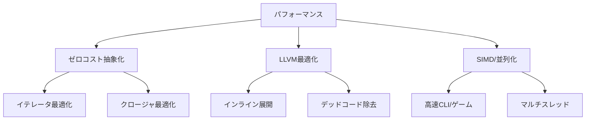

---

## メモリ管理

ガーベジコレクションを持たず、所有権と借用によってメモリ管理を行う。スコープを抜けると自動でリソースが解放される（RAII）。

- **Box, Rc, Arc**: ヒープ確保や参照カウントによる共有所有権
- **Dropトレイト**: スコープ終了時のクリーンアップ処理
- **Cell/RefCell**: 実行時借用チェックによる内部可変性

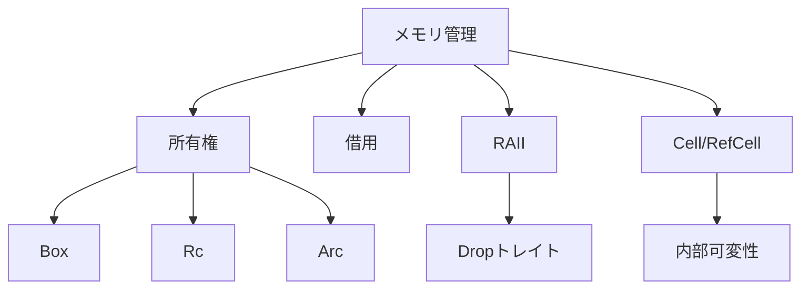

---

## エラーハンドリング

RustはパニックとResult型によるエラーハンドリングを提供する。例外機構は持たず、明示的なエラー処理を推奨する。

```rust
fn divide(a: i32, b: i32) -> Result<i32, String> {
    if b == 0 {
        Err("division by zero".to_string())
    } else {
        Ok(a / b)
    }
}

let result = divide(10, 0).unwrap_or(-1);
```

- `unwrap`, `expect`, `?`演算子による簡易なエラー伝播
- **panic!**: 回復不能なエラー時にスレッドを終了
- **anyhow, thiserror**: エラー型の拡張クレート

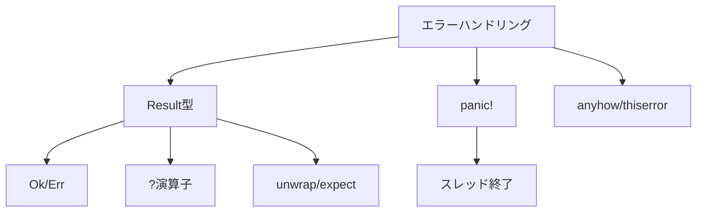

---

## 非同期処理

async/await構文により効率的な非同期処理が可能である。Futureトレイトを用いて非同期タスクを記述する。

```rust
async fn fetch_data() -> String {
    "data".to_string()
}
```

- tokioやasync-stdなどのランタイムが利用される
- **非同期ストリーム**: `Stream`トレイトで複数値の非同期処理
- **spawn**: 非同期タスクの生成
- **select!**: 複数Futureの同時待機

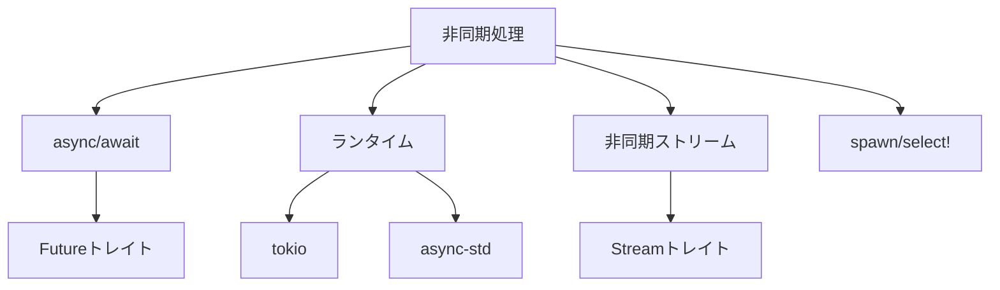

---

## FFI（他言語連携）

C言語など他言語との連携が容易である。`extern`ブロックや`#[no_mangle]`属性を利用する。

```rust
#[no_mangle]
pub extern "C" fn add(a: i32, b: i32) -> i32 {
    a + b
}
```

- C/C++との相互運用や、DLL/SOの作成が可能
- **bindgen**: CヘッダからRustバインディング自動生成
- **cxx, ffi-support**: C++/Rust間の安全な橋渡し

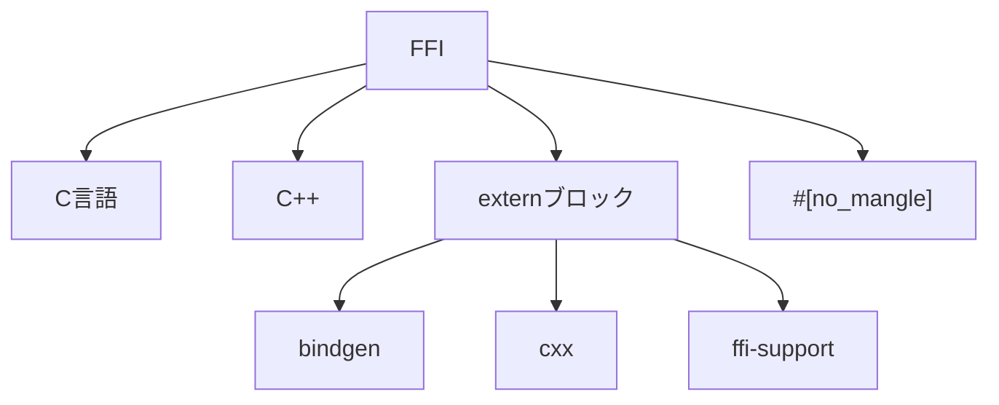

---

## 標準ライブラリ

標準ライブラリは豊富であり、コレクション、I/O、スレッド、ファイル操作、ネットワークなど多くの機能を提供する。

- Vec, HashMap, Option, Result, String, Path, Thread, Mutex など
- **std::fs**: ファイル操作
- **std::net**: ネットワーク通信
- **std::sync**: スレッド間同期
- **std::time**: 時間計測
- **std::env**: 環境変数

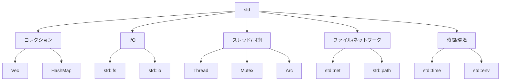

---

## 主な用途

- システムプログラミング（OS、ドライバ）
- Webサーバ・Webアプリケーション（Actix, Rocket）
- 組み込み開発（no_std, embedded-hal）
- CLIツール（ripgrep, fd, bat など）
- ゲーム開発（bevy, ggez）
- **ブロックチェーン**: Parity, Solana
- **機械学習**: burn, tch-rs
- **WebAssembly**: フロントエンドやサーバレス
- **科学技術計算**: ndarray, nalgebra

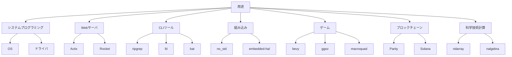

---

## エコシステム

Cargoによるパッケージ管理、crates.ioによるライブラリ共有が活発である。多くのOSSプロジェクトがRustで開発されている。

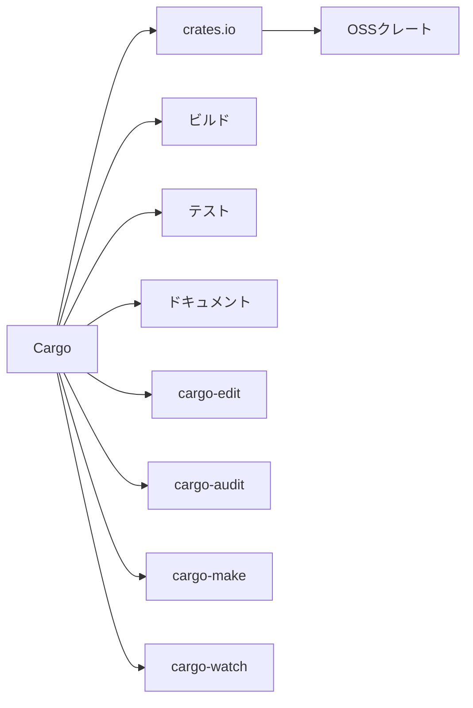

---

## コミュニティ

活発なコミュニティが存在し、公式フォーラムやDiscord、GitHub、Zulipなどで情報交換が行われている。日本語コミュニティも存在する。

- **公式フォーラム**: https://users.rust-lang.org/
- **日本語Discord**: https://discord.gg/rust-lang-ja
- **Zulip**: https://rust-lang.zulipchat.com/
- **GitHub Discussions**: https://github.com/rust-lang/rust/discussions

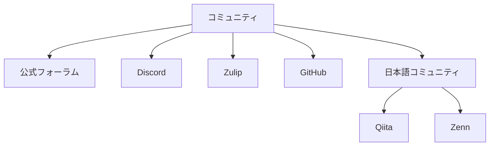

---

## 導入事例

- Firefoxの一部（Servo, Stylo）
- Dropbox（バックエンドの一部）
- Cloudflare（Edgeサービス）
- Microsoft Azure（セキュリティ関連）
- AWS Lambda（ランタイム）
- **Figma**: レンダリングエンジン
- **npm**: 一部ツールの高速化
- **Discord**: インフラ高速化
- **npm**: パッケージ管理ツールの一部

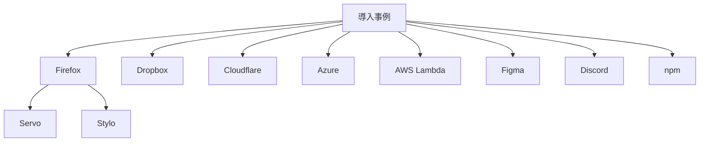

---

## ツールチェーン

- rustc（コンパイラ）
- Cargo（ビルド・パッケージ管理）
- rustfmt（コード整形）
- clippy（Lint）
- rust-analyzer（言語サーバ）
- **miri**: 未定義動作検出
- **cargo-expand**: マクロ展開の可視化
- **cargo-bench**: ベンチマーク
- **cargo-tarpaulin**: カバレッジ計測

```mermaid
flowchart TD
    A[ツールチェーン]
    A --> B[rustc]
    A --> C[Cargo]
    A --> D[rustfmt]
    A --> E[clippy]
    A --> F[rust-analyzer]
    A --> G[miri]
    A --> H[cargo-expand]
    A --> I[cargo-bench]
    A --> J[cargo-tarpaulin]
```

---

## パッケージ管理

Cargoによって依存関係の管理やビルドが容易に行える。`Cargo.toml`で依存クレートを宣言する。

```toml
[dependencies]
serde = "1.0"
tokio = { version = "1", features = ["full"] }
```

- **dev-dependencies**: テストやビルド時のみ必要な依存
- **build-dependencies**: ビルドスクリプト用依存
- **features**: オプション機能の切り替え

```mermaid
graph TD
    A[Cargo.toml]
    A --> B[dependencies]
    B --> B1[serde]
    B --> B2[tokio]
    A --> C[dev-dependencies]
    A --> D[build-dependencies]
    A --> E[features]
    E --> E1[オプション機能]
```

---

## バージョン管理

rustupにより複数バージョンのRustを簡単に切り替え可能である。nightly, beta, stableの各チャンネルが存在する。

- **rustup toolchain install nightly**
- **rustup override set stable**
- **rustup update**: 全バージョン一括更新
- **rust-toolchainファイル**: プロジェクトごとにバージョン固定

```mermaid
flowchart TD
    A[rustup]
    A --> B[stable]
    A --> C[beta]
    A --> D[nightly]
    A --> E[toolchainファイル]
    E --> F[プロジェクトごとに固定]
    A --> G[rustup update]
```

---

## ビルドシステム

Cargoがビルドシステムとして機能し、依存解決やビルド、テスト、ドキュメント生成を一元管理する。

- **cargo build**: ビルド
- **cargo test**: テスト実行
- **cargo doc**: ドキュメント生成
- **cargo run**: 実行
- **cargo clean**: ビルド成果物削除

```mermaid
graph TD
    A[Cargo]
    A --> B[build]
    A --> C[test]
    A --> D[doc]
    A --> E[run]
    A --> F[clean]
    A --> G[features切替]
```

---

## テスト

テストフレームワークが標準で組み込まれている。ユニットテスト、統合テスト、ドキュメントテストが可能。

```rust
#[cfg(test)]
mod tests {
    #[test]
    fn test_add() {
        assert_eq!(2 + 2, 4);
    }
}
```

- **統合テスト**: `tests/`ディレクトリに配置
- **ドキュメントテスト**: docコメント内のコード例が自動テストされる
- **モック**: mockall, doubleなどのクレート

```mermaid
flowchart TD
    A[テスト]
    A --> B[ユニットテスト]
    B --> B1["/#[test/]"]
    A --> C[統合テスト]
    C --> C1[tests/ディレクトリ]
    A --> D[ドキュメントテスト]
    D --> E[docコメント]
    A --> F[モック]
    F --> F1[mockall]
    F --> F2[double]
```

---

## デバッグ

gdbやlldb、VSCodeなどのデバッガが利用可能である。`println!`によるデバッグ出力も一般的である。

- **RUST_BACKTRACE=1**: パニック時のスタックトレース表示
- **cargo run --release**: 最適化ビルドでのデバッグ
- **dbg!マクロ**: 変数のデバッグ出力

```mermaid
graph TD
    A[デバッグ]
    A --> B[gdb/lldb]
    A --> C[VSCode]
    A --> D[println!/dbg!]
    A --> E[RUST_BACKTRACE]
    A --> F[breakpoint/step]
```

---

## 最適化

rustcはLLVMをバックエンドとしており、高度な最適化が可能である。`--release`ビルドで最適化オプションが有効になる。

- **LTO（リンク時最適化）**: Cargo.tomlで有効化可能
- **プロファイリング**: perf, flamegraph, cargo-bench
- **インライン展開・デッドコード除去**: LLVM最適化

```mermaid
flowchart TD
    A[最適化]
    A --> B[--release]
    A --> C[LTO]
    A --> D[プロファイリング]
    D --> D1[perf]
    D --> D2[flamegraph]
    D --> D3[cargo-bench]
    A --> E[インライン展開]
    A --> F[デッドコード除去]
```

---

## ドキュメント生成

rustdocにより自動的にドキュメントを生成できる。コードコメントからHTMLドキュメントを作成する。

```rust
/// 2つの数値を加算する
fn add(a: i32, b: i32) -> i32 {
    a + b
}
```

- **cargo doc --open**: ドキュメントを生成しブラウザで開く
- **外部クレートのドキュメント**: https://docs.rs/
- **ドキュメントテスト**: コード例の自動検証

```mermaid
graph TD
    A[rustdoc]
    A --> B[HTML生成]
    A --> C[docコメント]
    A --> D[ドキュメントテスト]
    D --> D1[コード例自動検証]
    A --> E[docs.rs]
    A --> F[cargo doc --open]
```

---

## 開発環境

VSCode（rust-analyzer拡張）、IntelliJ Rust、Emacs、Vim、CLionなど多様な開発環境が利用できる。

- **rust-analyzer**: 高速な補完・リント
- **cargo-watch**: ファイル変更時に自動ビルド
- **LLDB/gdb統合**: デバッグ支援

```mermaid
flowchart TD
    A[開発環境]
    A --> B[VSCode]
    B --> B1[rust-analyzer]
    A --> C[IntelliJ Rust]
    A --> D[Emacs]
    A --> E[Vim]
    A --> F[CLion]
    A --> G[cargo-watch]
    A --> H[LLDB/gdb統合]
```

---

## 移植性

多くのプラットフォーム（Windows, macOS, Linux, WASM, ARM, RISC-Vなど）に対応しており、クロスコンパイルも容易である。

- **ターゲット追加**: `rustup target add`
- **クロスビルド支援ツール**: cross
- **musl, mingw, WASI**: 多様なターゲット

```mermaid
graph TD
    A[移植性]
    A --> B[Windows]
    A --> C[macOS]
    A --> D[Linux]
    A --> E[WASM]
    A --> F[ARM]
    A --> G[RISC-V]
    A --> H[クロスコンパイル]
```

---

## クロスコンパイル

ターゲット指定によりクロスコンパイルが可能である。`rustup target add`でターゲット追加。

```sh
rustup target add armv7-unknown-linux-gnueabihf
cargo build --target=armv7-unknown-linux-gnueabihf
```

- **muslターゲット**: 静的リンクバイナリの作成
- **WASMターゲット**: `wasm32-unknown-unknown`
- **Dockerと連携したクロスビルド**: crossコマンド

```mermaid
flowchart TD
    A[クロスコンパイル]
    A --> B[ターゲット追加]
    B --> B1[rustup target add]
    A --> C[musl]
    A --> D[WASM]
    D --> D1[wasm32-unknown-unknown]
    A --> E[Docker/cross]
    E --> E1[クロスビルド自動化]
```

---

## 組み込み開発

no_std属性により標準ライブラリ非依存で組み込み開発が可能である。Cortex-MやRISC-Vなどのマイコン向けクレートも充実している。

- **embedded-hal**: 組み込み向け抽象化レイヤ
- **RTIC**: リアルタイムOSフレームワーク
- **cortex-m-rt, stm32f4xx-hal**: マイコン向けHAL

```mermaid
graph TD
    A[組み込み]
    A --> B[no_std]
    A --> C[embedded-hal]
    C --> C1[抽象化レイヤ]
    A --> D[RTIC]
    D --> D1[リアルタイムOS]
    A --> E[Cortex-M]
    A --> F[RISC-V]
    A --> G[stm32f4xx-hal]
```

---

## WebAssembly

RustはWebAssemblyへのコンパイルを公式にサポートしている。wasm-packやwasm-bindgenを利用することで、Webアプリやサーバレス開発が可能である。

- **wasm-bindgen**: JSとの相互運用
- **yew**: Rust製SPAフレームワーク
- **wasm-pack**: npmパッケージ化支援

```mermaid
flowchart TD
    A[WebAssembly]
    A --> B[wasm-pack]
    B --> B1[npmパッケージ化]
    A --> C[wasm-bindgen]
    C --> C1[JS連携]
    A --> D[yew]
    D --> D1[SPAフレームワーク]
    A --> E[npm連携]
```

---

## GUI開発

egui、druid、icedなどのGUIフレームワークが存在する。クロスプラットフォームなGUIアプリケーション開発が可能である。

- **egui**: 軽量な即時モードGUI
- **iced**: Elm風アーキテクチャ
- **druid**: データ駆動型GUI

```mermaid
graph TD
    A[GUI]
    A --> B[egui]
    B --> B1[即時モード]
    A --> C[iced]
    C --> C1[Elmアーキテクチャ]
    A --> D[druid]
    D --> D1[データ駆動型]
    A --> E[クロスプラットフォーム]
```

---

## ネットワークプログラミング

tokioやasync-stdなどの非同期ネットワークライブラリが利用できる。HTTPクライアント/サーバ、WebSocket、gRPCなどのクレートも豊富である。

- **hyper**: HTTPライブラリ
- **reqwest**: HTTPクライアント
- **tonic**: gRPC
- **warp, axum**: Webフレームワーク

```mermaid
flowchart TD
    A[ネットワーク]
    A --> B[tokio]
    B --> B1[非同期ランタイム]
    A --> C[async-std]
    A --> D[hyper]
    D --> D1[HTTPサーバ/クライアント]
    A --> E[reqwest]
    E --> E1[HTTPクライアント]
    A --> F[tonic]
    F --> F1[gRPC]
    A --> G[warp]
    G --> G1[Webフレームワーク]
    A --> H[axum]
    H --> H1[Webフレームワーク]
```

---

## データベース

dieselやsqlxなどのORMやデータベースクライアントが利用可能である。PostgreSQL, MySQL, SQLiteなど主要なDBに対応している。

- **diesel**: 型安全なORM
- **sqlx**: 非同期DBクライアント
- **sea-orm**: アクティブレコード型ORM
- **mongodb, redis**: NoSQL対応クレート

```mermaid
graph TD
    A[データベース]
    A --> B[diesel]
    B --> B1[型安全ORM]
    A --> C[sqlx]
    C --> C1[非同期クライアント]
    A --> D[sea-orm]
    D --> D1[アクティブレコード]
    A --> E[mongodb]
    A --> F[redis]
```

---

## 科学技術計算

ndarrayやnalgebraなどの数値計算ライブラリが存在する。高速な数値演算や線形代数、統計処理が可能である。

- **ndarray**: 多次元配列
- **nalgebra**: 線形代数
- **plotters**: グラフ描画
- **polars**: データフレーム

```mermaid
flowchart TD
    A[科学技術計算]
    A --> B[ndarray]
    B --> B1[多次元配列]
    A --> C[nalgebra]
    C --> C1[線形代数]
    A --> D[plotters]
    D --> D1[グラフ描画]
    A --> E[polars]
    E --> E1[データフレーム]
```

---

## ゲーム開発

bevyやggezなどのゲームエンジンが利用できる。高速な描画、物理エンジン、音声再生などの機能を持つ。

- **bevy**: ECSベースの次世代ゲームエンジン
- **ggez**: 2Dゲーム向け軽量エンジン
- **macroquad**: WASM対応のゲームエンジン
- **rapier**: 物理エンジン

```mermaid
graph TD
    A[ゲーム]
    A --> B[bevy]
    B --> B1[ECSエンジン]
    A --> C[ggez]
    C --> C1[2Dゲーム]
    A --> D[macroquad]
    D --> D1[WASM対応]
    A --> E[rapier]
    E --> E1[物理エンジン]
```

---

## セキュリティ

メモリ安全性や型安全性により、セキュアなソフトウェア開発が可能である。バッファオーバーフローやUse-After-Freeなどの脆弱性を防止する。

- **cargo-audit**: 依存クレートの脆弱性検出
- **unsafeコードの最小化**: セキュリティリスク低減
- **Fuzzing**: cargo-fuzzによる自動テスト

```mermaid
graph TD
    A[セキュリティ]
    A --> B[メモリ安全性]
    A --> C[型安全性]
    A --> D[cargo-audit]
    D --> D1[脆弱性検出]
    A --> E[Fuzzing]
    E --> E1[cargo-fuzz]
    A --> F[unsafe最小化]
```

---

## CI/CD

GitHub ActionsやGitLab CIなどでRustのビルド・テストが容易に自動化できる。Cargoコマンドを利用したCI/CDパイプラインの構築が一般的である。

- **actions-rs/toolchain**: Rustツールチェーンセットアップ
- **cargo test --all**: 全テスト実行
- **clippy, fmt**: 静的解析・整形の自動化
- **Dockerイメージの自動ビルド**: crossと連携

```mermaid
graph TD
    A[CI/CD]
    A --> B[GitHub Actions]
    B --> B1[ビルド]
    B --> B2[テスト]
    B --> B3[clippy/fmt]
    A --> C[GitLab CI]
    A --> D[cargo test]
    D --> D1[全テスト]
    A --> E[Docker/cross]
    E --> E1[クロスビルド]
```

---

## 学習リソース

- 公式ドキュメント（The Rust Programming Language, 通称「The Book」）
- Rust By Example（例題集）
- Rustlings（実践的な練習問題）
- QiitaやZennなどの日本語記事
- YouTubeやUdemyの動画教材
- **Rust Advent Calendar**: 季節ごとの記事まとめ
- **公式YouTubeチャンネル**: https://www.youtube.com/c/RustVideos
- **Rust Playground**: https://play.rust-lang.org/ （Web上でRustを試せる）

```mermaid
flowchart TD
    A[学習リソース]
    A --> B[The Book]
    B --> B1[公式ドキュメント]
    A --> C[Rust By Example]
    C --> C1[例題集]
    A --> D[Rustlings]
    D --> D1[練習問題]
    A --> E[Qiita/Zenn]
    E --> E1[日本語記事]
    A --> F[YouTube/Udemy]
    F --> F1[動画教材]
    A --> G[Rust Playground]
    G --> G1[Web上で実行]
```

---

## 参考リンク

- [公式サイト](https://www.rust-lang.org/)
- [crates.io](https://crates.io/)
- [docs.rs](https://docs.rs/)
- [The Rust Programming Language](https://doc.rust-lang.org/book/)
- [Rust By Example](https://doc.rust-lang.org/rust-by-example/)
- [Rust日本ユーザーグループ](https://rust-jp.github.io/)
---