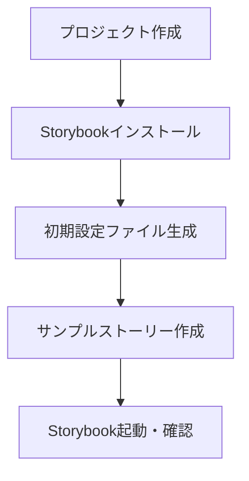

# Storybook

---

## 概要

Storybookは、UIコンポーネントを個別に開発・検証・ドキュメント化できるツールである。  
フロントエンド開発の効率化や品質向上に寄与する。  
本ドキュメントでは、Storybookの概要、導入手順、基本的な使い方、トラブルシューティング、参考情報について解説する。

---

## Storybookとは

Storybookは、ReactやVue、Angularなど様々なフレームワークに対応したUIコンポーネント開発支援ツールである。  
コンポーネント単位で動作確認やデザインレビューが行え、開発・デザイン・テスト・ドキュメント化を効率的に進めることができる。

### Storybookの特徴

- **コンポーネントのカタログ化**  
  プロジェクト内の全UIコンポーネントを一覧表示し、状態ごとに確認できる。
  デザイナーやQA担当者もWebブラウザから簡単にアクセス可能である。
- **インタラクティブなUI検証**  
  Propsやイベントを操作しながら、動的な挙動を確認できる。
  Controlsアドオンを使えば、UI上で値を変更しながらリアルタイムに動作を確認できる。
- **ドキュメント自動生成**  
  JSDocやTypeScript型情報からAPIドキュメントを自動生成できる。
  MDXを使えば、MarkdownとJSXを組み合わせたリッチなドキュメントも作成可能である。
- **アドオンによる拡張性**  
  アクセシビリティチェックやビジュアルリグレッションテストなど、多数のアドオンで機能拡張が可能である。
  Storybookのエコシステムは活発で、公式・非公式問わず多くのアドオンが提供されている。

### なぜStorybookを使うのか

- **UIの品質向上**  
  単体での動作確認により、バグやデザイン崩れを早期発見できる。  
  デザイナーやQA担当者もUIを直接確認できるため、フィードバックサイクルが短縮される。
- **デザイナー・開発者間のコミュニケーション促進**  
  UI仕様を共有しやすくなり、認識齟齬を減らすことができる。  
  Storybook上でコメントや指摘を行う運用も可能である。
- **回帰テストの効率化**  
  変更差分をビジュアルで比較でき、リグレッションチェックが容易である。  
  Chromaticなどのサービスと連携することで、CI上で自動的にUI差分を検出できる。
- **ドキュメントの一元管理**  
  コードとドキュメントを同じリポジトリで管理でき、常に最新状態を保てる。  
  API仕様や利用例も一元的に管理できるため、オンボーディングや保守性が向上する。

---

## 導入手順

### 必要な前提条件

- Node.js（推奨バージョン: 16以上）
- npmまたはyarn
- 既存のフロントエンドプロジェクト（React, Vue, Angular等）

### インストール方法

StorybookはCLIで簡単に導入できる。  
以下のコマンドをプロジェクトルートで実行する。

```sh
npx storybook@latest init
```

- 対応フレームワークを自動検出し、必要な依存パッケージをインストールする。
- 主要な設定ファイル（`main.js`, `preview.js`など）が`storybook`ディレクトリに生成される。
- サンプルのストーリーファイルが自動生成される。

### 初期設定

- `storybook`ディレクトリが作成され、初期設定ファイルが生成される。
- プロジェクトの`package.json`にStorybook用スクリプト（`storybook`, `build-storybook`）が追加される。
- サンプルのストーリーファイルが自動生成される。
- 必要に応じて、`main.js`でstoriesのパスやアドオンをカスタマイズする。

#### 導入フロー（Mermaid図）



#### Storybookの起動

インストール後、以下のコマンドでStorybookを起動できる。

```sh
npm run storybook
```

ブラウザで `http://localhost:6006` にアクセスすると、StorybookのUIが表示される。

---

## 基本的な使い方

### ストーリーの作成方法

1. `src/components/Button.stories.tsx`のように、コンポーネントごとに`.stories`ファイルを作成する。
2. 各ストーリーでは、コンポーネントのバリエーション（例：ラベル違い、サイズ違いなど）をエクスポートする。
3. CSF（Component Story Format）やMDX形式で記述できる。

例（CSF形式）:
```typescript
import { Button } from './Button';

export default {
  title: 'Components/Button',
  component: Button,
  argTypes: {
    onClick: { action: 'clicked' },
    size: { control: 'select', options: ['small', 'medium', 'large'] },
  },
};

export const Primary = {
  args: {
    primary: true,
    label: 'Primary',
  },
};

export const Secondary = {
  args: {
    label: 'Secondary',
  },
};
```
- `argTypes`や`args`を使うことで、UI上でPropsを動的に変更できる。

### アドオンの利用方法

- 代表的なアドオン:
  - `@storybook/addon-actions`: イベントログ表示
  - `@storybook/addon-controls`: Propsの動的操作
  - `@storybook/addon-a11y`: アクセシビリティチェック
  - `@storybook/addon-docs`: ドキュメント自動生成
  - `@storybook/addon-viewport`: デバイスごとの表示確認
- インストール例:
  ```sh
  npm install @storybook/addon-actions @storybook/addon-controls @storybook/addon-docs --save-dev
  ```
- `storybook/main.js`の`addons`配列に追加する。
  ```js
  module.exports = {
    // ...existing code...
    addons: [
      '@storybook/addon-actions',
      '@storybook/addon-controls',
      '@storybook/addon-docs',
      // ...other addons...
    ],
  };
  ```

### コンポーネントのドキュメント化

- Storybook Docsアドオンを利用すると、Propsやイベント、使用例などのドキュメントが自動生成される。
- JSDocコメントやTypeScript型情報も反映される。
- MDXを使えば、MarkdownとJSXを組み合わせたリッチなドキュメントも作成可能である。
- ドキュメントページはStorybook UI上で「Docs」タブとして表示される。

例（MDX形式）:
```mdx
import { Button } from './Button';

# ボタンコンポーネント

<Button primary label="Primary" />

<ArgsTable story="Primary" />
```

---

## よくあるトラブルと対処法

### Storybookが起動しない場合

- Node.jsや依存パッケージのバージョンを確認する。
- キャッシュクリア後に再インストールする。
- エラーメッセージを確認し、必要に応じて`node_modules`や`package-lock.json`を削除して再インストールする。
- ポート競合やファイルパスの誤りも確認する。

### コンポーネントが表示されない場合

- storiesファイルのエクスポート形式（default export, named export）を確認する。
- Storybookの設定ファイル（main.js等）でstoriesのパスが正しいか確認する。
- コンポーネントの依存関係やimportパスの誤りがないか確認する。
- BabelやTypeScriptの設定ミスも原因となる場合がある。

### アドオンの不具合

- アドオンのバージョン互換性を確認する（Storybook本体とアドオンのバージョンを揃える）。
- 設定ファイルの記述ミスをチェックする。
- アドオンの公式ドキュメントやGitHub Issuesも参考にする。
- キャッシュクリアや再インストールで解決する場合もある。

---

## 参考リンク

### 公式ドキュメント

- [Storybook公式サイト](https://storybook.js.org/)
- [Storybook Docs](https://storybook.js.org/docs/)
- [Storybook Addons一覧](https://storybook.js.org/addons/)

### チュートリアル・サンプル

- [Learn Storybook](https://www.learnstorybook.com/)
- [Storybook Examples](https://storybook.js.org/docs/react/get-started/examples)
- [Storybook GitHubリポジトリ](https://github.com/storybookjs/storybook)
- [Chromatic（ビジュアルテストSaaS）](https://www.chromatic.com/)

---

