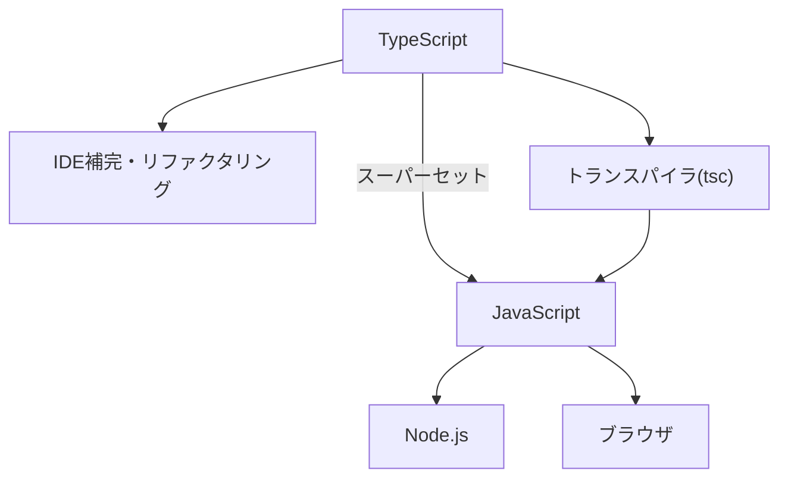
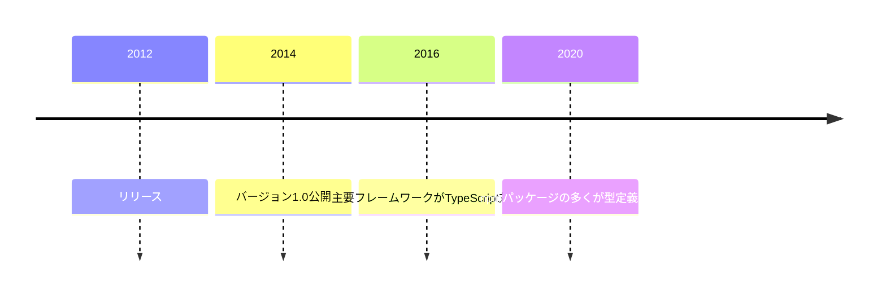
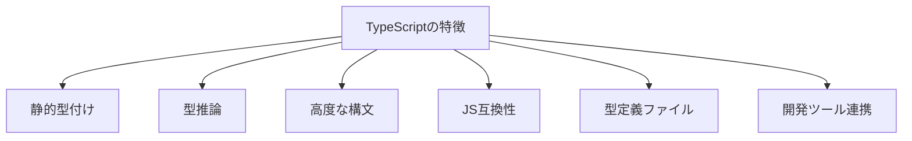
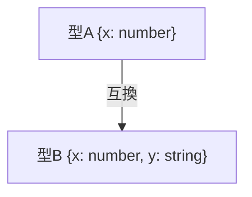
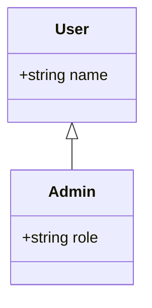

# Typescript

---

## 概要

TypeScriptは、JavaScriptに静的型付けを導入したスーパーセットである。JavaScriptの構文をそのまま利用できるため、既存のJavaScript資産を活かしつつ、型安全性や保守性を向上させることができる。型定義により、IDEの補完やリファクタリング支援が強化されるため、大規模開発や長期運用に適している。  
TypeScriptはトランスパイラ（tsc）によってJavaScriptに変換され、Node.jsや各種ブラウザで動作する。型情報は実行時には消失し、開発時の品質向上に寄与する。

<!-- Mermaid: TypeScriptの全体像 -->


---

## 歴史

TypeScriptは2012年にMicrosoftからリリースされた。当初はJavaScriptの大規模開発における可読性や保守性の課題を解決するために設計された。バージョン1.0は2014年に公開され、以降はオープンソースとしてGitHub上で活発に開発が続けられている。  
2016年以降、AngularやReact、Vueなど主要なフレームワークがTypeScript対応を進めたことで普及が加速した。現在ではnpmパッケージの多くが型定義ファイルを同梱またはDefinitelyTypedで提供している。

<!-- Mermaid: TypeScriptの歴史年表 -->


---

## 特徴

- 静的型付けによる型安全性の向上。型エラーをコンパイル時に検出できる。
- 型推論による記述量の削減。明示的な型注釈がなくても多くの場合で型が自動推論される。
- クラス、インターフェース、ジェネリクス、デコレーターなどの高度な構文をサポート。
- JavaScriptとの高い互換性（既存のJSコードをそのまま利用可能）。
- 型定義ファイル（.d.ts）による外部ライブラリの型サポート。型定義がない場合はany型で利用可能だが、型安全性は損なわれる。
- 豊富な開発ツール・エディタ連携。VSCodeなどのエディタで型補完やリファクタリングが容易。

<!-- Mermaid: TypeScriptの特徴まとめ -->


---

## JavaScriptとの違い

- 静的型付けの有無
- クラスやインターフェース、ジェネリクスなどの構文拡張
- 型安全な開発が可能
- 型定義ファイルによる外部ライブラリの型サポート

TypeScriptは静的型付けや型安全性、型定義ファイルの活用など、JavaScriptにはない特徴を持つ。

---

## 導入方法

TypeScriptはnpm経由でインストールできる。グローバルインストールの場合は以下のコマンドを利用する。

```sh
npm install -g typescript
```

プロジェクトごとにローカルインストールする場合は、プロジェクトディレクトリで以下を実行する。

```sh
npm install --save-dev typescript
```

TypeScriptのバージョンは`tsc --version`で確認できる。  
既存のJavaScriptプロジェクトにTypeScriptを導入する場合は、まず`tsconfig.json`を作成し、徐々に`.ts`や`.tsx`ファイルへ移行していくのが一般的である。

---

## 設定ファイル(tsconfig)

TypeScriptプロジェクトのルートには`tsconfig.json`を配置する。主な設定項目は以下の通り。

- `compilerOptions.target`: 出力するJavaScriptのバージョン（例: ES5, ES2015, ES2020）
- `compilerOptions.module`: モジュールシステム（例: commonjs, esnext）
- `compilerOptions.strict`: 厳格な型チェックを有効化
- `include`/`exclude`: コンパイル対象・除外ファイルの指定
- `compilerOptions.allowJs`: JavaScriptファイルもコンパイル対象に含めるか
- `compilerOptions.outDir`: 出力先ディレクトリ
- `compilerOptions.baseUrl`や`paths`: モジュール解決のパスエイリアス設定

```json
{
  "compilerOptions": {
    "target": "ES2020",
    "module": "commonjs",
    "strict": true,
    "esModuleInterop": true,
    "forceConsistentCasingInFileNames": true
  },
  "include": ["src/**/*"],
  "exclude": ["node_modules"]
}
```

---

## コンパイルと実行

TypeScriptファイル（.ts）は`tsc`コマンドでJavaScriptに変換する。デフォルトでは同名の.jsファイルが生成される。

```sh
tsc index.ts
node index.js
```

複数ファイルを一括でビルドする場合は、`tsconfig.json`を用意し、`tsc`のみで全体をビルドできる。  
`ts-node`を使えばTypeScriptファイルを直接実行できる。

```sh
npx ts-node src/index.ts
```

---

## 型システム

TypeScriptの型システムは静的型付けであり、プリミティブ型（string, number, boolean, null, undefined, symbol, bigint）や配列、タプル、列挙型、リテラル型、ユニオン型、交差型、関数型、クラス型、インターフェース型など多様な型をサポートする。  
型推論や型ガード、条件型、マッピング型など高度な型表現も可能である。  
型はサブタイプ関係や構造的部分型（duck typing）に基づいて互換性が判定される。

---

## 基本構文

TypeScriptはJavaScriptの構文を拡張している。主な構文例は以下の通り。

```typescript
let message: string = "Hello";
const PI: number = 3.14;

function greet(name: string): string {
  return `Hello, ${name}`;
}

class Person {
  constructor(public name: string) {}
  greet(): void {
    console.log(`Hi, I'm ${this.name}`);
  }
}
```

---

## クラスとインターフェース

クラスはオブジェクト指向プログラミングの基本構文であり、インターフェースは型の契約を定義する。クラスはインターフェースを実装できる。

```typescript
interface Person {
  name: string;
  greet(): void;
}
class Student implements Person {
  constructor(public name: string) {}
  greet() {
    console.log(`Hello, ${this.name}`);
  }
}
```

---

## 名前空間

名前空間（namespace）は、グローバルスコープの汚染を防ぐための仕組みである。ES Modulesの普及により利用頻度は減少している。

```typescript
namespace Geometry {
  export function area(radius: number): number {
    return Math.PI * radius * radius;
  }
}
```

---

## ジェネリクス

ジェネリクスは型にパラメータを持たせ、汎用的な型定義を可能にする。ジェネリクスは、型安全性を保ちつつ汎用的な関数やクラス、インターフェースを定義できる。

```typescript
function identity<T>(arg: T): T {
  return arg;
}
```

---

## デコレーター

デコレーターはクラスやプロパティ、メソッドにメタデータや追加処理を付与する構文である。デコレーターは、クラスやプロパティ、メソッドに対して動的な機能追加やメタデータ付与を実現する。Angularなどのフレームワークで活用されている。

```typescript
function Log(target: any, key: string) {
  console.log(`${key}が呼ばれました`);
}
class Example {
  @Log
  method() {}
}
```

---

## 非同期処理

TypeScriptはPromiseやasync/awaitによる非同期処理をサポートする。非同期処理は、Promiseやasync/await構文を用いて、コールバック地獄を回避し、可読性の高い非同期コードを記述できる。

```typescript
async function fetchData(): Promise<string> {
  return await Promise.resolve("data");
}
```

---

## モジュールシステム

TypeScriptはES Modules（import/export）やCommonJS（require/module.exports）など複数のモジュールシステムに対応している。ES Modules（import/export）は標準的なモジュールシステムであり、TypeScriptでも推奨される。

---

## ユニオン型・交差型

ユニオン型（|）は複数の型のいずれかを許容し、交差型（&）は複数の型を合成する。

```typescript
type Result = string | number;
type Point3D = { x: number; y: number } & { z: number };
```

---

## 型推論

TypeScriptは初期値や関数の戻り値から型を自動推論する。明示的な型注釈がなくても型安全性が保たれる。  
関数の引数や戻り値、オブジェクトリテラルのプロパティなど、さまざまな箇所で型推論が働く。

```typescript
let count = 10; // number型と推論される
const flag = true; // boolean型と推論される

function add(a: number, b: number) {
  return a + b; // 戻り値はnumber型と推論される
}
```

---

## 型ガード

型ガードは、実行時に型を絞り込むための仕組みである。`typeof`や`instanceof`、ユーザー定義型ガードを利用できる。  
型ガードは複数の型が混在するユニオン型で特に有効である。  
ユーザー定義型ガードは`x is 型`の構文で記述する。

```typescript
function printId(id: string | number) {
  if (typeof id === "string") {
    console.log(id.toUpperCase());
  } else {
    console.log(id.toFixed(2));
  }
}
```

---

## 型エイリアス

型エイリアスは複雑な型やユニオン型、交差型、条件型などにも利用できる。

```typescript
type UserID = string | number;
type Point = { x: number; y: number };
```

---

## 型の制約

ジェネリクスにおいて、`extends`を使って型パラメータに制約を設けることができる。型パラメータに制約を設けることで、特定のプロパティや構造を持つ型のみを受け入れることができる。

```typescript
function identity<T extends { id: number }>(arg: T): number {
  return arg.id;
}
```

---

## 型の拡張

インターフェースや型エイリアスは`extends`や交差型で拡張できる。インターフェース同士は多重継承が可能であり、型エイリアスは交差型で複数の型を合成できる。

```typescript
interface Animal { name: string; }
interface Dog extends Animal { breed: string; }
type Cat = Animal & { color: string };
```

---

## 型の再利用

共通の型定義を複数箇所で利用することで、重複を避け、保守性を高める。型定義を共通化することで、変更時の影響範囲を限定し、保守性を高めることができる。

---

## 型の分割

型定義を複数ファイルに分割し、import/exportで管理することで、可読性と再利用性が向上する。型定義ファイル（.d.ts）を活用し、型のみを分離して管理することも推奨される。

---

## 型の合成

交差型（&）を用いて複数の型を合成し、新たな型を作成できる。交差型は複数の型のプロパティをすべて持つ新しい型を生成する。

```typescript
type A = { a: number };
type B = { b: string };
type AB = A & B; // { a: number; b: string }
```

---

## 型の分割代入

分割代入と型注釈を組み合わせて、オブジェクトや配列の要素に型を付与できる。分割代入は配列やオブジェクトの要素を個別の変数に展開する構文であり、型注釈と組み合わせて利用できる。

```typescript
const { x, y }: { x: number; y: number } = { x: 1, y: 2 };
```

---

## 型の再帰

再帰的な型定義により、入れ子構造やツリー構造を表現できる。再帰型はツリー構造やネストされたデータ構造の表現に有用である。

```typescript
type NestedArray<T> = Array<T | NestedArray<T>>;
```

---

## 型のパターンマッチ

条件型（Conditional Types）を用いて、型レベルでパターンマッチが可能である。条件型は型レベルでif-elseのような分岐を記述できる。

```typescript
type IsString<T> = T extends string ? true : false;
type Result = IsString<"abc">; // true
```

---

## 型の省略記法

Partial型やOmit型などのユーティリティ型を使うことで、型の一部を省略・除外できる。ユーティリティ型は標準ライブラリで多数提供されており、型定義の簡略化や柔軟な型操作に役立つ。

```typescript
interface User { id: number; name: string; age: number; }
type UserWithoutAge = Omit<User, "age">;
type PartialUser = Partial<User>;
```

---

## 型の変換

型アサーション（as）やマッピング型を使って型変換ができる。型アサーションは型安全性を一時的に無効化するため、乱用は避けるべきである。

```typescript
const value: any = "123";
const num: number = value as number;

type ReadonlyUser = Readonly<User>;
```

---

## 型の互換性

TypeScriptは構造的部分型（duck typing）を採用しており、型の互換性はプロパティの構造で判断される。構造的部分型のため、プロパティ名や型が一致していれば異なる型同士でも代入可能である。

---

## 型の互換性チェック

Mermaidで型の互換性の例を示す。



---

## 型のユーティリティ関数

型操作のためのユーティリティ関数を定義し、型安全な処理を実現できる。ユーティリティ関数は型パラメータを活用し、汎用的な処理を型安全に実装できる。

```typescript
function toArray<T>(item: T): T[] {
  return [item];
}
```

---

## 型のカスタムガード

独自の型ガード関数を実装することで、複雑な型の絞り込みが可能となる。複雑な型の判定や外部データのバリデーションにも応用できる。

```typescript
function isUser(obj: any): obj is User {
  return obj && typeof obj.id === "number" && typeof obj.name === "string";
}
```

---

## 型の制御フロー解析

TypeScriptはif文やswitch文などの制御フローに基づき、変数の型を自動的に絞り込む。TypeScriptはnullチェックや型ガードの結果を自動的に型推論に反映する。

---

## 型のデバッグテクニック

型エラーの原因特定には、型エイリアスや`infer`、`as const`などを活用する。型エラーの原因を特定するために、型エイリアスや型の一時変数を導入して型推論結果を明示的に確認することが有効である。

---

## 型の循環参照

型定義が循環参照する場合、型の分割や設計の見直しが必要となる。循環参照が避けられない場合は、型の分割や依存関係の見直しを検討する。

---

## 型の進化とバージョン管理

型定義の変更は、既存コードへの影響を考慮し、バージョン管理を徹底する。型定義のバージョン管理には、Semantic Versioning（semver）を適用するのが一般的である。

---

## 型の設計指針

型設計では、拡張性・保守性・可読性・再利用性を重視する。型の粒度や命名規則、拡張性を意識した設計が重要である。過度な型の複雑化は避け、必要最小限の型定義を心がける。

---

## 型のパフォーマンス最適化

型の複雑化はコンパイル速度や型チェック性能に影響する。型のネストや条件型の多用は型チェックのパフォーマンス低下を招くため、必要最小限に留める。

---

## 型安全性の向上

型安全性を高めることで、実行時エラーの発生を未然に防止できる。strictNullChecksやnoImplicitAnyなどのオプションを有効化することで、型安全性をさらに高めることができる。

---

## 型のユースケース集

- APIレスポンスの型定義（例：REST APIやGraphQLのレスポンス型）
- フロントエンド状態管理の型（例：ReduxやVuexのストア型）
- フォーム入力値の型（例：バリデーションやフォーム送信時の型安全性確保）
- 外部ライブラリの型ラップ（例：サードパーティAPIの型安全なラッパー作成）

---

## 型のテスト戦略

型のテストには、型専用のテストツール（tsd, dtslintなど）や型レベルのユニットテストを活用する。型のテストは、型の変更による破壊的影響を検知し、型安全性を維持するために重要である。

---

## 型の自動生成

OpenAPIやGraphQLスキーマから型定義を自動生成することで、API仕様と型定義の乖離を防ぐ。自動生成された型定義は手動編集せず、元となるスキーマや仕様書を修正する運用が推奨される。

---

## 型のドキュメンテーション

型定義にJSDocコメントを付与し、TypeDocなどのツールでドキュメントを自動生成できる。JSDocコメントを活用することで、型定義の意図や利用例を明示できる。

---

## 型のリファクタリング

型定義の整理や統合、不要な型の削除、命名規則の統一などを行い、保守性を向上させる。型のリファクタリングは、型定義の肥大化や重複を解消し、保守性を高めるために定期的に実施する。

---

## 型の互換性維持

型の変更時は既存コードとの互換性を重視し、段階的な移行や型エイリアスの併用を検討する。型の変更時は、既存コードへの影響を最小限に抑えるため、段階的な移行や型エイリアスの併用を検討する。

---

## 型の設計パターン

- DTOパターン
- Value Objectパターン
- マッピング型による変換パターン
- 条件型による型分岐パターン

DTOパターンやValue Objectパターンは、ドメイン駆動設計（DDD）でもよく利用される。

---

## 型のアンチパターン

- any型の多用
- 複雑すぎる型定義
- 型の重複定義
- 型の過剰なネスト

any型の多用や複雑すぎる型定義は、型安全性や可読性を損なうため避けるべきである。

---

## 型の将来展望

TypeScriptの型システムは今後も進化が期待される。型レベルの計算や型推論のさらなる強化、標準ライブラリの拡充などが議論されている。  
今後は型推論の精度向上や型エラーの分かりやすさ改善も期待される。

---

## 型のバージョンアップ時の注意点

型定義のバージョンアップ時は、破壊的変更の有無を確認し、互換性テストやリリースノートの整備を徹底する。破壊的変更がある場合は、メジャーバージョンアップとリリースノートの整備を徹底する。

---

## 型の互換性テスト自動化

CI/CDパイプラインで型の互換性テストを自動化し、型の破壊的変更を早期に検知する。型の互換性テストは、型定義の変更による既存コードへの影響を自動的に検知するために有効である。

---

## 型のレビュー観点

- 型の冗長性や重複の有無
- 拡張性・再利用性
- 命名規則の統一
- 型安全性の担保

型の設計意図や利用範囲、拡張性・再利用性を重視してレビューを行う。

---

## 型の設計ドキュメント作成例

Mermaidで型設計の関係図を示す。Mermaid記法を活用することで、型の継承関係や依存関係を視覚的に表現できる。



---

## 型の運用ルール

- 型定義の命名規則
- 型ファイルの配置ルール
- 型のレビュー・テストフロー
- 型のバージョン管理方針

型定義の命名規則や配置ルール、レビュー・テストフローを明文化し、プロジェクト全体で統一する。

---

## 型定義ファイル

型定義ファイル（.d.ts）は、JavaScriptライブラリの型情報を提供する。型定義ファイルは、外部ライブラリやグローバル変数の型情報を提供し、型安全な開発を支援する。DefinitelyTypedプロジェクト（@types/xxx）から多くの型定義が公開されている。

---

## サンプルコード

```typescript
interface User {
  id: number;
  name: string;
}
const user: User = { id: 1, name: "Taro" };

function getUserName(user: User): string {
  return user.name;
}
```

---

## よくあるエラーと対処法

- `Type 'string' is not assignable to type 'number'.`  
  → 型注釈や型推論を見直す。
- `Property 'foo' does not exist on type 'Bar'.`  
  → 型定義にプロパティを追加する。
- `Argument of type 'X' is not assignable to parameter of type 'Y'.`  
  → 関数の引数型を確認する。

型エラーの原因を特定し、型注釈や型定義、型推論の見直しを行うことが重要である。

---

## よくある課題

- 型定義の複雑化による可読性低下
- any型の乱用による型安全性の低下
- 外部ライブラリの型定義不足
- 型推論の限界

型定義の複雑化や型推論の限界、外部ライブラリの型定義不足などが現場で直面しやすい課題である。

---

## ベストプラクティス

- strictモードの有効化
- 型エイリアス・インターフェースの積極活用
- any型の使用を最小限に抑える
- 型定義の共通化と再利用

型定義の共通化や再利用、strictモードの有効化、any型の最小化などが推奨される。

---

## 移行ガイド

JavaScriptからTypeScriptへの移行は、まず`tsconfig.json`の作成とファイル拡張子の.ts化から始める。段階的な移行や型定義の追加、strictモードの段階的有効化が推奨される。

---

## 開発ツール

Visual Studio CodeなどのエディタはTypeScriptに最適化されており、型補完やリファクタリング、型エラーの即時検出が可能である。VSCodeはTypeScriptの公式エディタであり、型補完やリファクタリング、型エラーの即時検出が可能である。  
ts-nodeやwebpack、Babelなどのビルドツールとも連携できる。

---

## Lintツールとの連携

ESLintやTSLintと連携し、型チェックと静的解析を同時に行うことで、コード品質を高めることができる。ESLintはTypeScript対応のプラグイン（@typescript-eslint）を利用することで、型チェックと静的解析を同時に実現できる。

---

## CI/CDでの利用

CI/CDパイプラインで`tsc`や`eslint`を実行し、型チェックや静的解析を自動化することで、品質を担保できる。CI/CDパイプラインでは、型チェック・テスト・ビルド・デプロイを自動化し、品質と開発効率を向上させる。

---

## コーディング規約

プロジェクトごとにコーディング規約（命名規則、型注釈の方針、ファイル構成など）を定め、コードの統一感と可読性を維持する。コーディング規約はプロジェクトの規模やチームの方針に応じて柔軟に設計する。

---

## テスト手法

JestやMocha、AVAなどのテストフレームワークと組み合わせて、ユニットテストや統合テストを実施できる。ユニットテスト、統合テスト、型レベルのテストを組み合わせることで、堅牢なシステムを構築できる。

---

## 参考リンク

- [TypeScript公式ドキュメント](https://www.typescriptlang.org/)
- [TypeScript Deep Dive](https://basarat.gitbook.io/typescript/)
- [DefinitelyTyped](https://github.com/DefinitelyTyped/DefinitelyTyped)

---

## コミュニティとサポート

TypeScriptのコミュニティは活発であり、GitHub IssuesやDiscussions、Stack Overflow、Qiita、Zennなどで情報交換が行われている。TypeScriptの公式DiscordやGitter、GitHub Discussionsなどで質問や議論が可能である。

---

## よくある質問(FAQ)

- Q. JavaScriptのコードはそのままTypeScriptで動くか？  
  A. 基本的に動作するが、型注釈や型定義の追加が推奨される。

- Q. any型は使ってもよいか？  
  A. やむを得ない場合のみ使用し、極力型安全性を保つべきである。

- Q. 型定義ファイルがないライブラリはどうするか？  
  A. @types/xxxを探すか、自作の型定義ファイルを作成する。

---

## 型の制限事項

TypeScriptの型システムでは、実行時の値に依存する型や、複雑な型計算、循環参照のある型など、表現できないケースも存在する。設計時には型の限界を理解し、必要に応じてany型や型アサーションを活用する。

---