# Vertical Slice Architecture

---

## 概要

### アーキテクチャの定義

Vertical Slice Architectureとは、従来のレイヤー型アーキテクチャ（UI層、ビジネスロジック層、データアクセス層など）による水平分割ではなく、ユーザーの操作や業務ユースケースごとに「スライス」と呼ばれる単位で垂直に分割するアーキテクチャである。  
各スライスは、UIからデータアクセスまで一貫した責任を持ち、独立して開発・テスト・デプロイが可能である。  
このアーキテクチャは、複雑な業務システムや頻繁な機能追加が求められる現場で特に有効であり、変更の影響範囲を最小限に抑えつつ、開発効率と保守性を最大化することを目的とする。  
また、スライスごとに異なる技術スタックや設計パターンを採用できる柔軟性も持つ。

#### 構成要素

スライスは以下の要素で構成されることが多い。
- エンドポイント（APIや画面）: REST API、GraphQL、Web画面、バッチ処理など、外部からの入力を受け付ける。
- アプリケーションサービス（ユースケースの実装）: 業務ロジックやワークフロー、トランザクション管理などを実装する。
- ドメインモデル（ビジネスロジック）: エンティティ、値オブジェクト、ドメインサービスなど、業務ルールを表現する。
- インフラストラクチャ（DBアクセス、外部サービス連携）: データの永続化、外部API連携、メッセージング、ファイルI/Oなどを担う。

各スライスは、これらの要素を自分自身の内部に持ち、他のスライスとは疎結合となる。  
例えば「注文作成」スライスは、注文作成API、注文作成サービス、注文ドメインモデル、注文リポジトリを内包し、他のスライス（例：注文一覧取得）とは直接依存しない。  
スライスごとに異なるDBスキーマや外部サービスを利用することも可能であり、段階的な技術刷新やマイクロサービス化にも対応しやすい。

#### 基本的な考え方

従来のレイヤー分割では、UI層の変更がドメイン層やインフラ層に波及しやすい。Vertical Sliceでは、ユースケースごとに必要な機能をまとめて実装するため、変更の影響範囲が限定され、保守性が高まる。  
また、スライスごとに異なる設計や技術選定も可能であり、例えば一部のスライスのみ新技術を導入するなど、段階的な技術刷新にも柔軟に対応できる。  
さらに、スライス単位での独立したテスト・デプロイが可能なため、継続的デリバリーやマイクロサービス移行の足がかりにもなる。


#### スライス全体像（複数スライス）

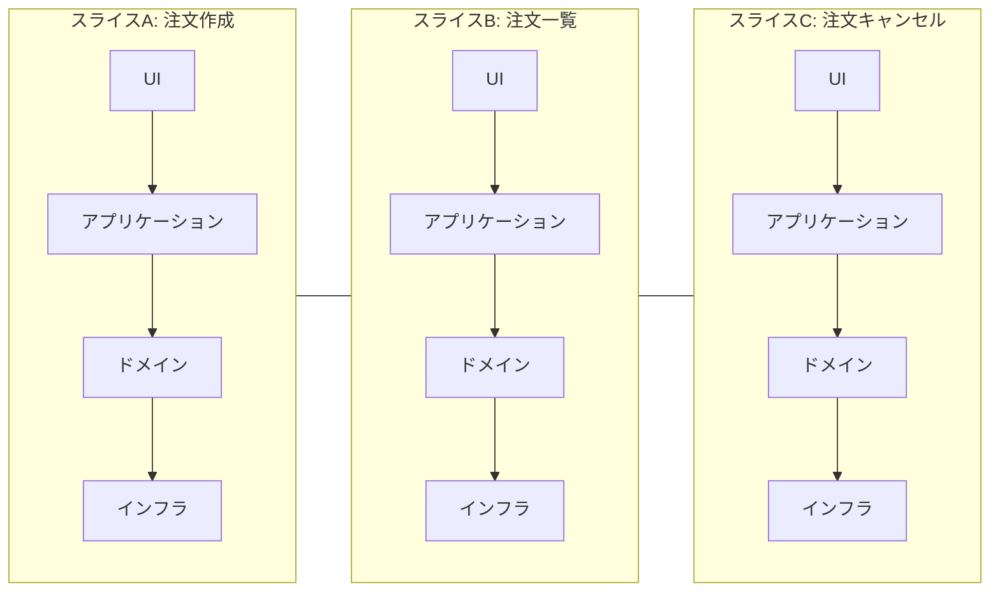

### 背景と目的

#### 従来アーキテクチャの課題

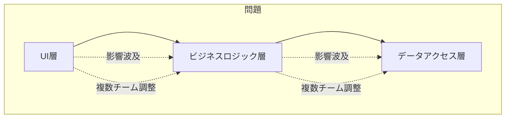

#### 導入の動機

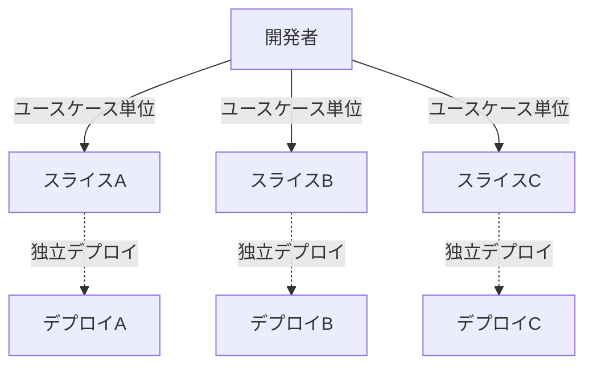

---

## 歴史

### 誕生の経緯

#### 初期の提唱者

本アーキテクチャはJimmy Bogard氏によって提唱された。彼は.NETコミュニティでの実践を通じて、従来のレイヤードアーキテクチャの課題を解決するためにこの手法を広めた。  
彼のブログや講演資料では、実際の業務システムでの適用例や、レイヤー分割による弊害の具体的な事例が多数紹介されている。

#### 影響を受けたアーキテクチャ

CQRS（Command Query Responsibility Segregation）やドメイン駆動設計（DDD）の考え方から強い影響を受けている。  
特に、コマンドとクエリの分離や、ユースケース中心の設計思想が根底にある。  
また、マイクロサービスアーキテクチャの「独立性」「疎結合」といった思想とも親和性が高い。

### 普及の流れ

#### コミュニティでの広がり

OSSプロジェクトや技術カンファレンス、ブログ記事などを通じて、.NETだけでなくJavaやNode.jsなど他言語にも広がった。  
近年では、フロントエンド（React/Next.jsなど）でも「機能単位の分割」思想が取り入れられている。

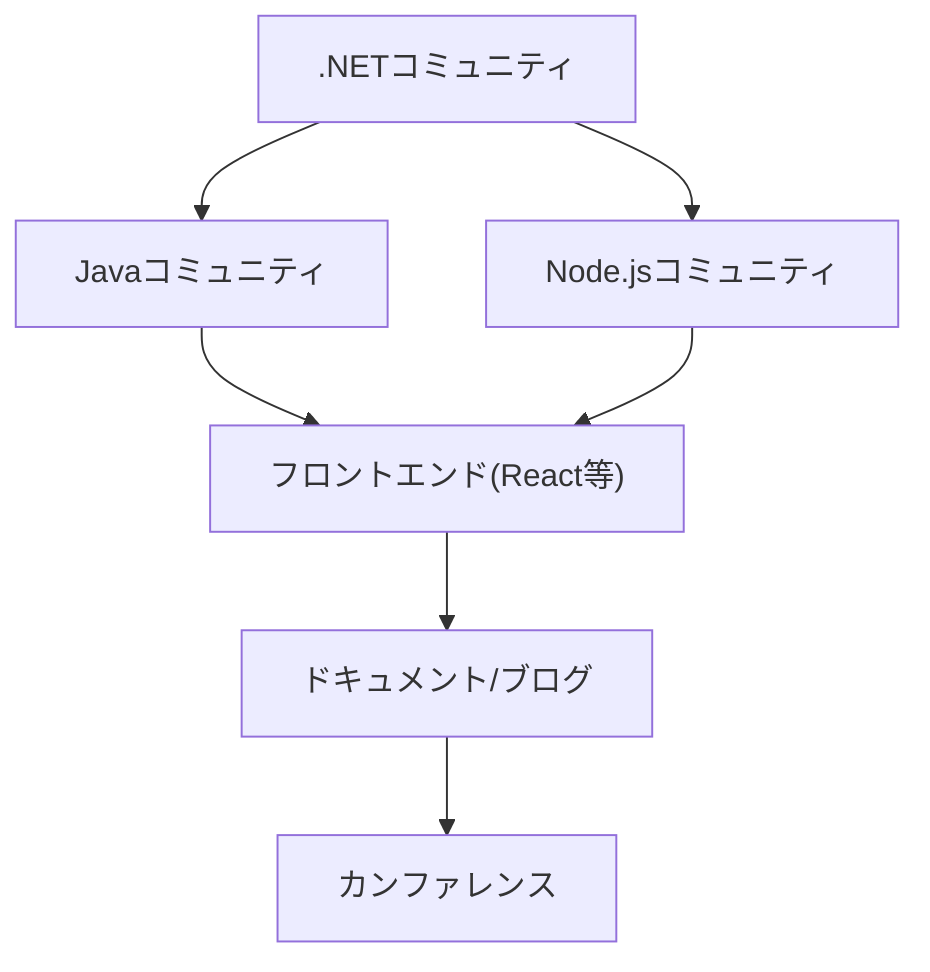

#### 主要な採用事例

大規模な業務システムや、頻繁な機能追加が求められるWebサービス、マイクロサービスアーキテクチャの一部として採用されている。  
たとえばMicrosoftのContoso Universityサンプルや、国内外のSaaSプロダクトなどで実践例が報告されている。

---

## 特徴

### 機能単位の分割

#### スライスの定義方法

スライスは、ユーザーの操作やAPIエンドポイント、業務ユースケースごとに定義する。  
例えば「注文作成」「注文一覧取得」「注文キャンセル」など、1つの業務機能が1スライスとなる。  
スライスの粒度は「1ユースケース＝1スライス」が基本だが、複雑なユースケースはさらに細分化することもある。  
現場では「画面単位」「API単位」「バッチ単位」など、プロジェクトの性質や開発体制に応じて柔軟に粒度を調整する。

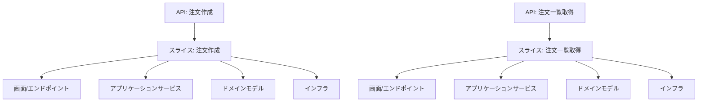

#### スライス間の独立性

各スライスは、他のスライスの内部実装に依存しない。データの受け渡しや共通処理はインターフェースやイベントを介して行うことで、疎結合を維持する。  
スライス間で共通のドメインモデルを利用する場合も、直接参照ではなくDTOやインターフェース経由とすることで、依存方向を明確にする。  
また、スライスごとに異なるDBスキーマや外部サービスを利用することも可能であり、段階的なマイクロサービス化や技術刷新にも対応しやすい。

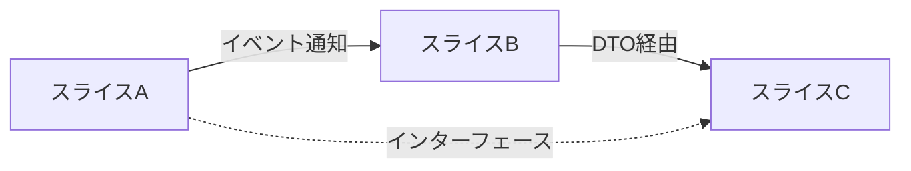

### レイヤー横断的設計

#### レイヤーの役割

スライス内にUI、アプリケーション、ドメイン、インフラの各レイヤーを内包し、スライス外部とのやり取りは最小限に抑える。  
各レイヤーの責任範囲を明確にしつつ、スライス単位で一貫した実装を行う。  
例えば、UI層はAPIや画面、アプリケーション層はユースケースの実装、ドメイン層は業務ルール、インフラ層はDBや外部API連携を担当する。

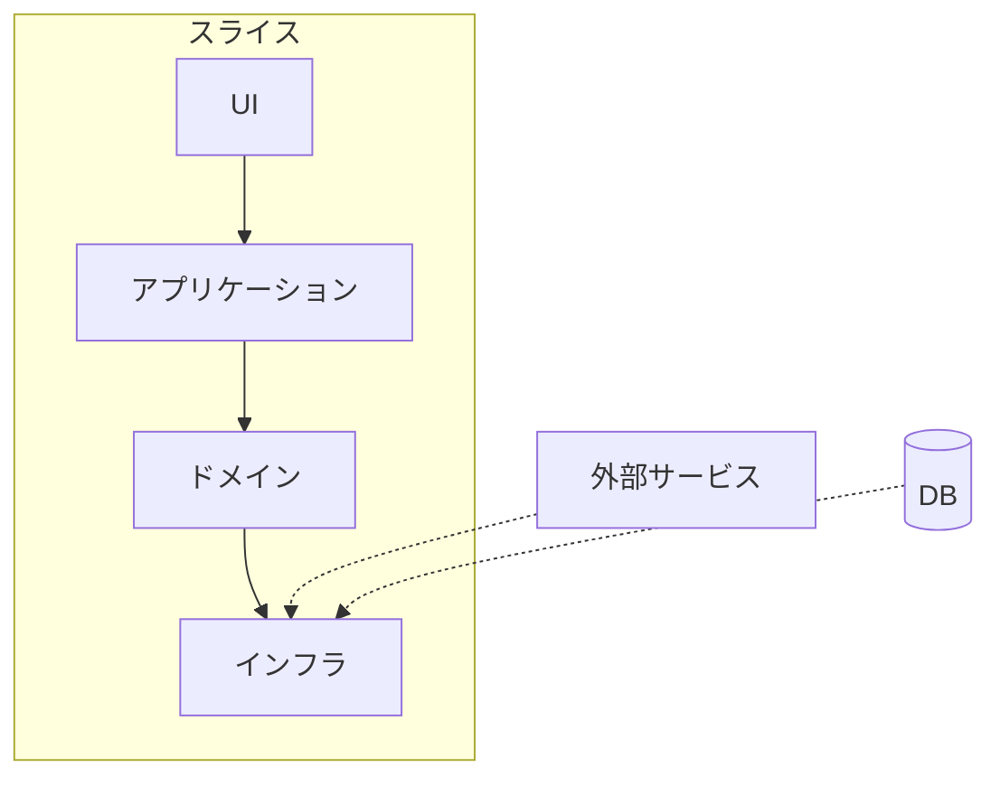

#### レイヤーの統合方法

スライス内で必要なレイヤーを統合し、外部とのやり取りはインターフェース経由で行う。  
例えば、DBアクセスはリポジトリインターフェースを介して行い、実装はインフラ層に隠蔽する。  
外部API連携やメッセージングも同様に抽象化し、スライスの独立性を保つ。  
現場では「インターフェースの粒度」「共通処理の範囲」「依存性注入の方法」などを設計ガイドラインとして明文化することが多い。

---

## メリット

### 開発効率の向上

#### 機能追加の容易さ

新しいユースケースやAPIを追加する際、既存のスライスに影響を与えずに新規スライスを追加できる。  
設計や実装の自由度が高く、技術的負債の局所的な解消や新技術の試験導入も容易である。

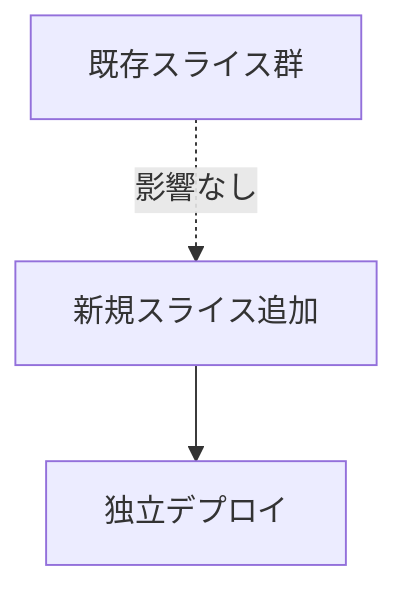

#### 変更の局所化

バグ修正や仕様変更が発生した場合、該当スライスのみを修正すればよい。他のスライスへの影響が最小限となる。  
これにより、リグレッションのリスクも低減できる。

### テスト容易性

#### テスト対象の明確化

スライス単位でテスト対象が明確になるため、ユニットテストや統合テストの設計が容易である。  
テストコードもスライスごとに分割でき、保守性が高い。

#### モックの利用

外部依存（DBや外部API）はインターフェース経由でモック化できるため、テストの自動化が進めやすい。  
CI/CDパイプラインでの自動テストにも適している。

### チーム分業のしやすさ

#### スライス単位での担当分け

複数チームで開発する場合、スライスごとに担当を分けることで、作業の重複やコンフリクトを減らせる。  
チームごとに異なる開発プロセスや技術スタックを採用することも可能である。

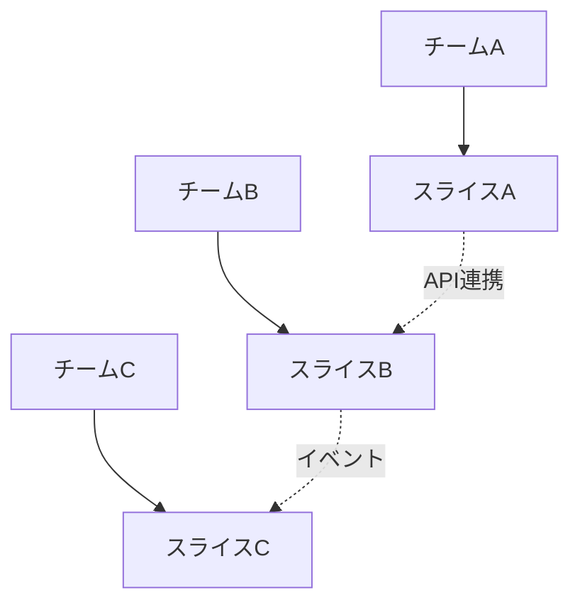

#### コンフリクトの減少

同じファイルやクラスを複数人が同時に編集することが減り、バージョン管理上の競合が起きにくい。  
Pull Requestのレビューもスライス単位で行えるため、レビュワーの負担も軽減される。

---

## デメリット

### 共通処理の重複

#### 重複発生の原因

スライスごとに同じようなバリデーションやロギング処理を実装してしまうことがある。  
特に、開発初期や設計方針が統一されていない場合に発生しやすい。

#### 解決策

共通処理はライブラリ化し、必要に応じて各スライスで利用する。ただし、共通化しすぎるとスライスの独立性が損なわれるため、バランスが重要である。  
共通処理の導入は、実際に重複が顕在化してから検討するのが望ましい。

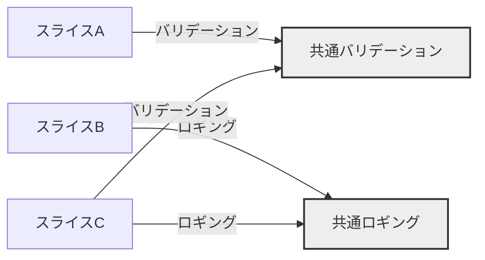

### 学習コスト

#### 新規メンバーへの教育

従来のレイヤー分割に慣れた開発者には、スライス単位の設計思想を理解するための教育が必要となる。  
設計意図や実装例をドキュメント化し、オンボーディング時に共有することが重要である。

#### ドキュメントの必要性

スライスの粒度や設計方針を明文化し、プロジェクト全体で共有することが重要である。  
設計レビューやコードレビューの際にも、ドキュメントを参照しながら判断する。

---

## 実装例

### .NETでの実装

#### MediatRの利用

MediatRは、CQRSやMediatorパターンを実現するための.NETライブラリである。各スライスのコマンドやクエリをハンドラーで処理する。  
MediatRを利用することで、コントローラからビジネスロジックへの依存を排除し、疎結合な設計が可能となる。

#### サンプルコード

```csharp
public class CreateOrderCommand : IRequest<Order> {
    public string ProductId { get; set; }
    public int Quantity { get; set; }
}
public class CreateOrderHandler : IRequestHandler<CreateOrderCommand, Order> {
    public Task<Order> Handle(CreateOrderCommand request, CancellationToken cancellationToken) {
        // バリデーション
        // ドメインモデル生成
        // リポジトリ保存
        // 結果返却
    }
}
```

### Javaでの実装

#### Spring Bootとの組み合わせ

Spring Bootでは、Controller単位でスライスを構成し、ServiceやRepositoryを内部に持たせることで、スライスごとの独立性を保つ。  
AOPやDIを活用することで、共通処理や外部依存の抽象化も容易である。

#### サンプルコード

```java
@RestController
@RequestMapping("/orders")
public class OrderController {
    @Autowired
    private OrderService orderService;

    @PostMapping
    public Order create(@RequestBody OrderRequest req) {
        return orderService.createOrder(req);
    }
}
@Service
public class OrderService {
    public Order createOrder(OrderRequest req) {
        // バリデーション
        // ドメインモデル生成
        // リポジトリ保存
        // 結果返却
    }
}
```

### Node.jsでの実装

#### Expressでの構成例

Expressでは、ルーティング単位でスライスを分割し、各ルートごとにコントローラ・サービス・リポジトリを持つ。  
ミドルウェアで共通処理を実装し、スライスごとの独立性を維持する。

#### サンプルコード

```javascript
const express = require('express');
const router = express.Router();
const orderService = require('./orderService');

router.post('/orders', async (req, res) => {
    // バリデーション
    const order = await orderService.createOrder(req.body);
    res.json(order);
});
module.exports = router;
```

---

## 他アーキテクチャとの比較

### レイヤードアーキテクチャとの違い

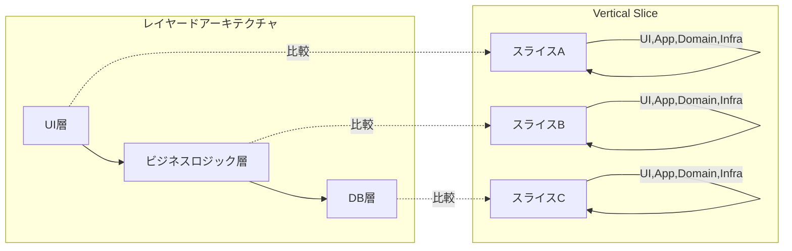

#### 関心の分離方法

レイヤードアーキテクチャは技術関心ごと（UI、ビジネスロジック、データアクセス）に分離するが、Vertical Sliceはユースケースごとに分離する。  
これにより、機能追加や変更の影響範囲が限定される。

#### 依存関係の持ち方

レイヤードでは下位レイヤーへの依存が強くなるが、Vertical Sliceではスライス内で依存を閉じるため、外部への依存が減る。  
依存性逆転の原則（DIP）を適用しやすい。

### クリーンアーキテクチャとの違い

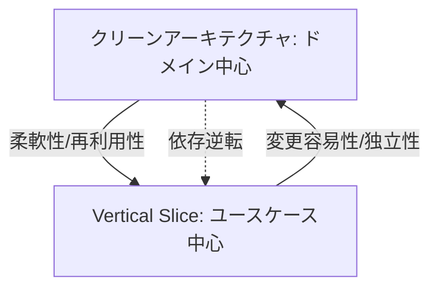

#### ドメイン駆動設計との関係

クリーンアーキテクチャはドメインモデルを中心に設計するが、Vertical Sliceはユースケース（アプリケーションサービス）を中心に設計する。  
ドメインモデルの再利用性よりも、ユースケースごとの独立性を重視する。

#### 柔軟性の比較

Vertical Sliceは変更や追加に強く、クリーンアーキテクチャは再利用性やテスト容易性に優れる。  
プロジェクトの規模や要件に応じて使い分けることが重要である。

---

## 参考文献

### Web記事

#### 公式ブログ

- https://jimmybogard.com/vertical-slice-architecture/

#### 技術解説記事

- https://zenn.dev/okazuki/articles/vertical-slice-architecture

### 書籍

#### 推奨書籍

- 実践ドメイン駆動設計

#### 関連書籍

- Clean Architecture 達人に学ぶソフトウェアの構造と設計

---

## 用語解説

### スライス

#### 定義

スライスとは、1つのユースケースやAPIエンドポイントに対応する、UIからインフラまでを一貫して実装した単位である。  
スライスは「注文作成」「ユーザー登録」など、明確な業務目的を持つ。

#### 役割

各スライスは、特定の業務機能やユースケースの実現に責任を持つ。  
スライスごとに独立した設計・実装・テスト・デプロイが可能である。

### ハンドラー

#### 定義

ハンドラーは、コマンドやクエリなどのリクエストを受け取り、ビジネスロジックを実行するクラスである。  
MediatRやSpringのServiceクラスなどが該当する。

#### 役割

アプリケーションサービス層の中心的な役割を担い、外部からの入力を受けて処理を実行する。  
バリデーション、ドメインモデル操作、永続化、レスポンス生成などを担当する。

---

## 適用シナリオ

### 大規模開発

#### 複数チームでの開発

スライス単位で担当を分けることで、チーム間の依存を減らし、並行開発が容易になる。  
各チームが独自の開発サイクルや技術スタックを採用することも可能である。

#### 長期運用

長期間にわたり機能追加や修正が発生するシステムでは、スライスごとに変更を局所化できるため、保守性が高まる。  
技術的負債の解消やリファクタリングも段階的に実施できる。

### 機能追加が頻繁な場合

#### アジャイル開発

イテレーションごとに新しいスライスを追加することで、アジャイルな開発サイクルに適応できる。  
ユーザーストーリー単位でスライスを設計し、迅速なフィードバックを得られる。

#### 継続的デリバリー

スライス単位でリリースやデプロイが可能となり、継続的デリバリーを実現しやすい。  
障害発生時も該当スライスのみをロールバックできる。

---

## アンチパターン

### スライス間の密結合

#### 発生原因

共通のドメインモデルやサービスを直接参照することで、スライス間の依存が強くなる。  
設計方針が曖昧な場合や、共通処理を安易に導入した場合に発生しやすい。

#### 回避策

インターフェースやイベント駆動設計を活用し、スライス間の直接的な依存を避ける。  
共通処理は必要最小限にとどめ、スライスごとの独立性を優先する。

### 共通処理の乱用

#### 問題点

共通化しすぎると、スライスの独立性が損なわれ、変更の影響範囲が広がる。  
共通処理のバグが全スライスに波及するリスクもある。

#### 解決策

本当に必要な処理のみを共通化し、スライスごとの独立性を優先する。  
共通処理の導入は、実際の重複や運用上の課題を見極めてから行う。

---

## よくある質問

### 小規模プロジェクトへの適用

#### メリット・デメリット

小規模プロジェクトでは、Vertical Sliceは過剰設計となる場合がある。しかし、将来的な拡張や保守性を考慮する場合には有効である。  
設計コストと将来の拡張性のバランスを見極めて採用を判断する。

### 既存システムへの導入

#### 移行手順

既存のレイヤードアーキテクチャから段階的にスライス化し、ユースケース単位でリファクタリングを進めるのが現実的である。  
まずは新規機能や変更頻度の高い機能からスライス化を始め、徐々に全体へ展開する。

---

## 設計パターンとの関係

### CQRSとの関係

#### コマンドとクエリの分離

Vertical Sliceは、CQRSの「コマンド（書き込み）」と「クエリ（読み取り）」をスライス単位で分離しやすい構造となっている。  
コマンドスライスとクエリスライスを明確に分けることで、責任範囲が明確になる。

### Mediatorパターンとの関係

#### メッセージングの活用

Mediatorパターンを利用することで、各スライスのハンドラー間の依存を排除し、疎結合な設計を実現できる。  
MediatRやSpringのEvent機構などが代表例である。

---

## テスト戦略

### ユニットテスト

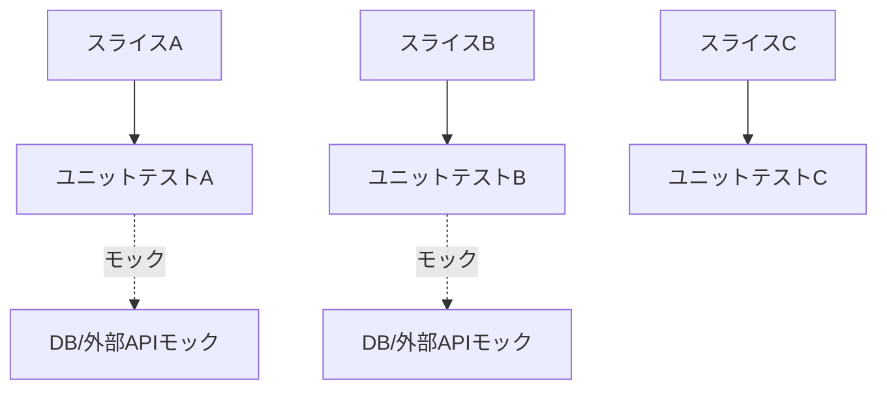

### 統合テスト

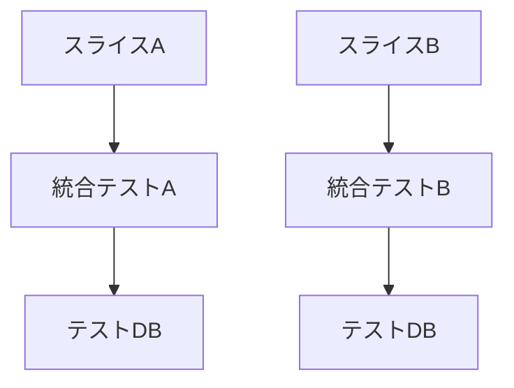

---

## 導入時の注意点

### 段階的導入

#### 移行計画の立案

既存システムを一度にスライス化するのは困難なため、まずは新規機能や一部機能からスライス化を始め、徐々に全体へ展開する。  
移行計画は、現状の課題や将来の拡張計画を踏まえて策定する。

### ドキュメント整備

#### サンプルコードの用意

設計意図やスライスの粒度、実装例をドキュメント化し、チーム全体で共有することが重要である。  
設計レビューやオンボーディング時に活用する。

---

## よく使われるツール・ライブラリ

### .NET系

#### MediatR

CQRSやMediatorパターンの実装に利用され、スライスごとのハンドラーを簡潔に記述できる。

#### ASP.NET Core

APIやWebアプリケーションの基盤として、スライス単位のルーティングやDIが容易である。

### Java系

#### Spring Boot

ControllerやService、Repositoryをスライス単位で構成しやすい。

#### Spring WebFlux

非同期・リアクティブなスライス実装に適している。

### JavaScript系

#### Express

ルーティング単位でスライスを構成し、ミドルウェアで共通処理を実装できる。

#### NestJS

モジュール単位でスライスを実現し、依存性注入やテストも容易である。

---

## サンプルプロジェクト

### 公開リポジトリ

#### GitHub例

- https://github.com/jbogard/ContosoUniversityDotNetCore  
  .NETによるVertical Sliceの実装例。MediatRやEntity Frameworkを活用している。

### チュートリアル

#### ハンズオン資料

- https://zenn.dev/okazuki/articles/vertical-slice-architecture  
  日本語による解説とサンプルコードが掲載されている。

---

## よくある落とし穴

### 設計の形骸化

#### 原因

スライスの粒度が大きすぎたり小さすぎたりすると、設計意図が形骸化しやすい。  
粒度が大きいと従来のレイヤー分割と変わらなくなり、小さすぎると管理コストが増大する。

#### 対策

ユースケース単位で粒度を見直し、設計レビューを定期的に実施する。  
設計意図や粒度の基準をドキュメント化し、全員で共有する。

### ドメイン知識の分散

#### 問題点

ドメイン知識が各スライスに分散し、全体像の把握や横断的な最適化が困難になる。  
特に、複数チームで開発する場合に発生しやすい。

#### 解決策

ドキュメントや設計レビューを徹底し、知識の共有を図る。  
ドメインモデルや業務ルールは、共通ドキュメントやワークショップで整理する。

---

## 導入事例

### 海外事例

#### 企業名・プロジェクト名

- Microsoft, Contoso University  
  教育機関向けのサンプルアプリケーションで、Vertical Sliceの実装例として有名である。

### 国内事例

#### 企業名・プロジェクト名

- サイボウズ, 業務システム  
  業務アプリケーションの一部でVertical Sliceを採用し、機能追加の効率化を実現している。

---

## 開発プロセス

### 要件定義

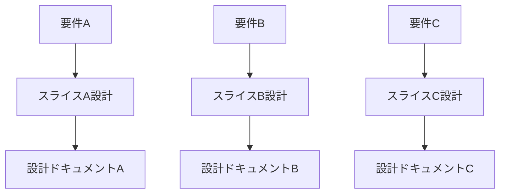

### 実装フロー

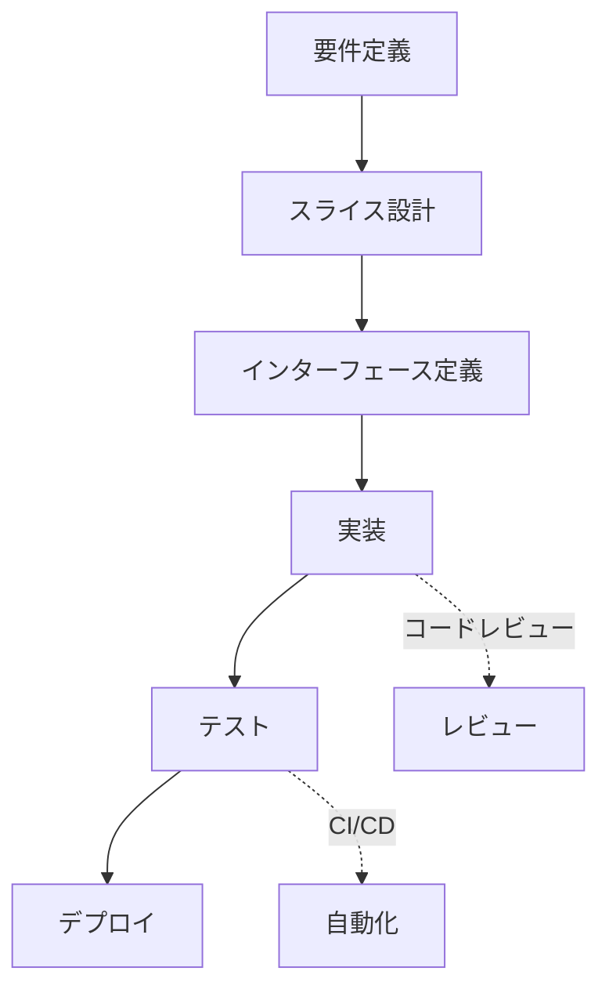

---

## 運用・保守

### 保守性の確保

#### コードの可読性

スライスごとに責任範囲を明確にし、ドキュメントや命名規則を統一することで、可読性と保守性を高める。  
コードレビューやリファクタリングもスライス単位で実施できる。  
現場では「スライスごとにREADMEや設計書を用意する」「命名規則やディレクトリ構成を統一する」などの工夫が有効である。

### 運用時の課題

#### 障害対応

障害発生時は該当スライスのみを調査・修正できるため、影響範囲を限定できる。  
ただし、共通処理やインフラ層の障害は全体に波及する可能性があるため注意が必要である。  
障害対応手順や監視設計もスライス単位で整理しておくとよい。  
また、スライス単位でのロギングやメトリクス収集を行うことで、障害発生時の原因特定や影響範囲の把握が容易になる。

---

## パフォーマンスへの影響

### レスポンス速度

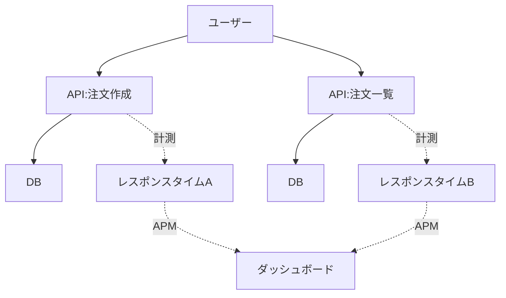

### スケーラビリティ

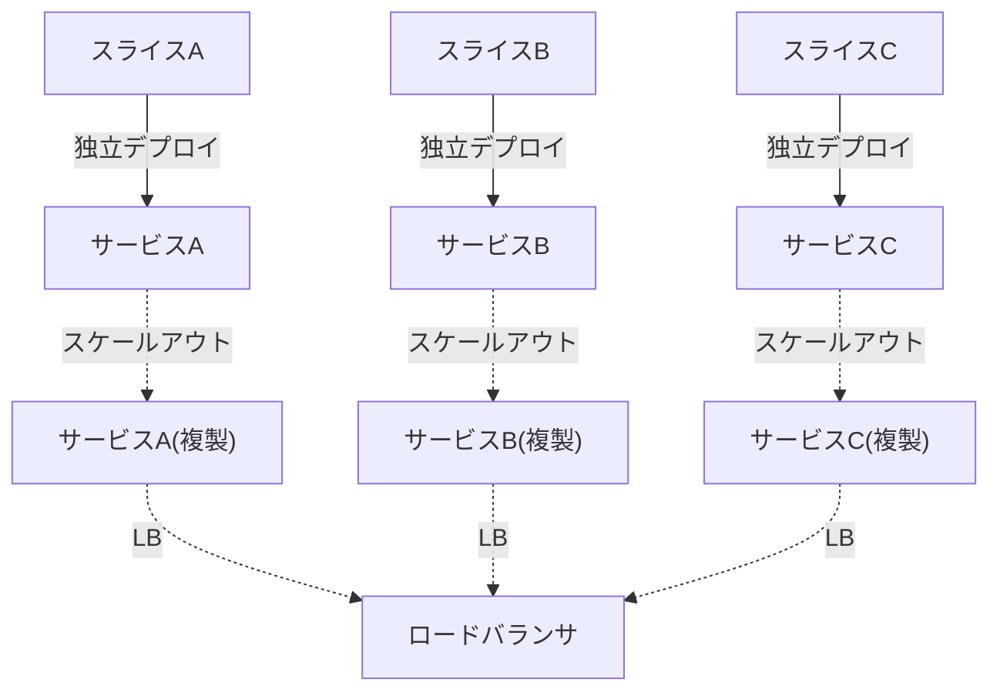

---