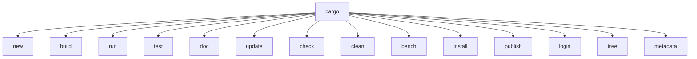
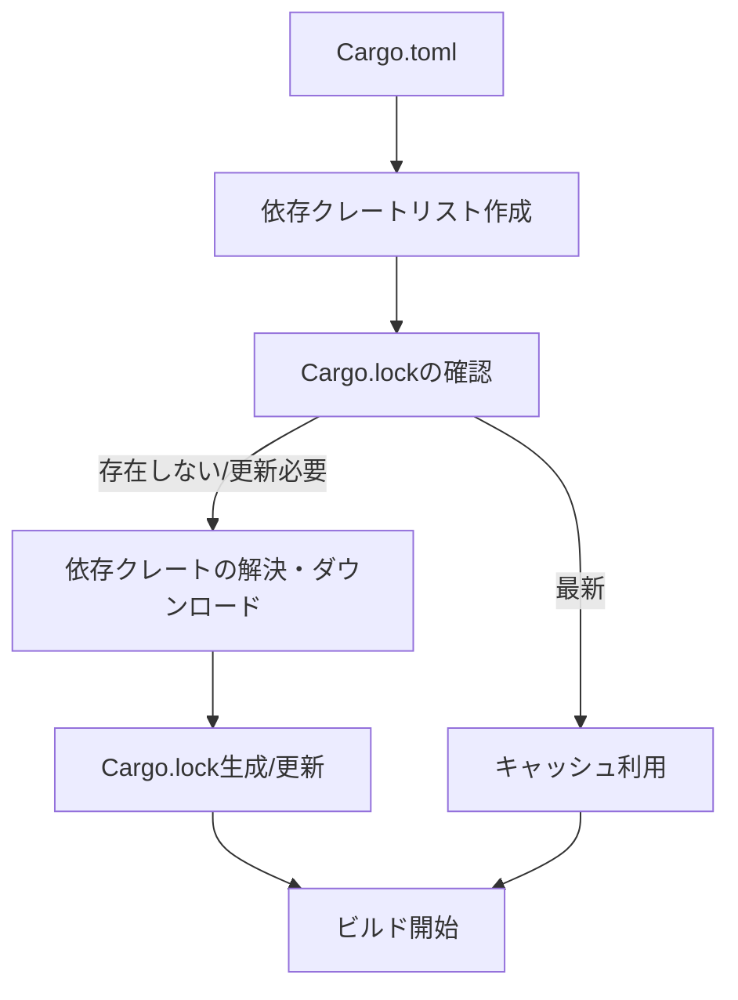
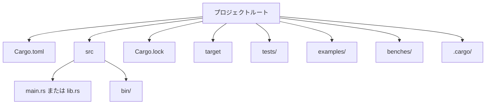
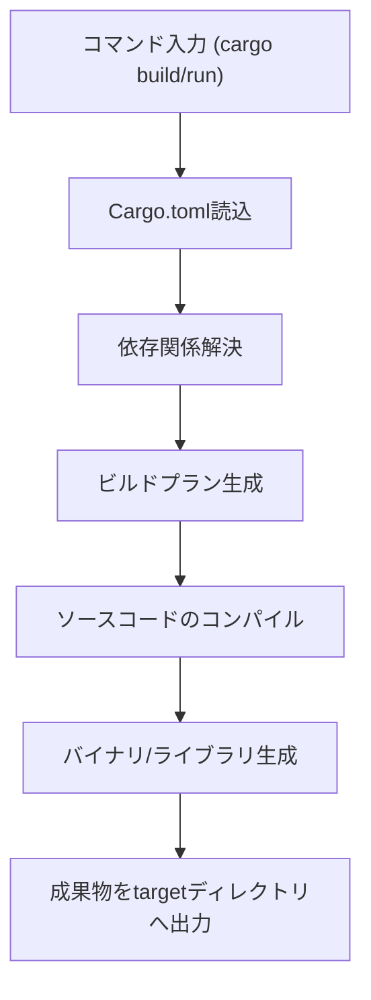
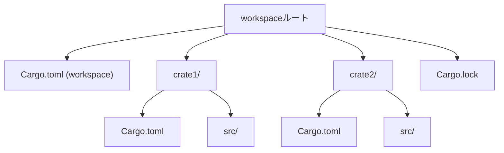

# cargo

---

## 概要

cargoはRust言語の公式パッケージマネージャ兼ビルドツールである。プロジェクトの作成、依存関係の管理、ビルド、テスト、ドキュメント生成、クレートの公開など、Rust開発に必要な機能を一元的に提供する。cargoを利用することで、開発者は複雑なビルドスクリプトや依存解決を意識せずに効率的な開発が可能となる。  
cargoはRustのエコシステムの中心的存在であり、ほぼすべてのRustプロジェクトで利用されている。cargoはクレートのバージョン管理や依存解決を自動化し、再現性の高いビルド環境を提供する。

---

## 歴史

cargoはRustコミュニティの要望に応じて開発が始まり、2014年に初期バージョンがリリースされた。それ以前はrustpkgなどが存在したが、機能や安定性に課題があった。cargoの登場により、Rustのエコシステムは大きく発展し、クレートの共有や再利用が容易になった。現在ではRustプロジェクトの事実上の標準ツールとなっている。  
cargoの開発はRust本体と密接に連携しており、Rustのバージョンアップに合わせてcargoも進化している。cargoの設計思想は「シンプルさ」と「拡張性」であり、サードパーティ製のサブコマンドやプラグインによる機能拡張も活発である。

---

## インストール方法

Rust公式インストーラであるrustupを利用することでcargoも同時にインストールされる。rustupはクロスプラットフォームで動作し、Windows、macOS、Linuxの各環境で利用可能である。以下のコマンドを実行する。

```sh
curl --proto '=https' --tlsv1.2 -sSf https://sh.rustup.rs | sh
```

インストール後、`cargo --version`でインストール確認ができる。  
Windowsではインストーラ（.exe）も提供されている。  
既存のRust/cargoをアップデートする場合は`rustup update`を実行する。

---

## バージョン管理

cargoのバージョンは`cargo --version`で確認できる。Rust本体とcargoはrustupで一括管理されている。特定バージョンのRust/cargoを利用したい場合は、rustupのツールチェーン機能を活用する。例えば、安定版、ベータ版、nightly版の切り替えや、プロジェクトごとにツールチェーンを固定することが可能である。

```sh
rustup default stable
rustup override set nightly
```

プロジェクトディレクトリに`rust-toolchain.toml`を配置することで、CIやチーム開発でもツールチェーンのバージョンを統一できる。

---

## 基本コマンド

cargoの主なコマンドは以下の通りである。

- `cargo new`: 新規プロジェクト作成。`--bin`でバイナリ、`--lib`でライブラリを指定可能。
- `cargo build`: プロジェクトのビルド。デフォルトはdebugビルド。`--release`で最適化ビルド。
- `cargo run`: ビルド後にバイナリを実行。引数は`--`以降に指定。
- `cargo test`: テストコードのビルドと実行。`-- --nocapture`で標準出力を表示。
- `cargo doc`: ドキュメントの生成。`--open`でブラウザ表示。
- `cargo clean`: ビルド成果物の削除。
- `cargo update`: 依存クレートのバージョンを最新化。
- `cargo check`: ビルドせず型チェックのみを行う。高速なフィードバックが得られる。

---

## サブコマンド一覧

cargoには多くのサブコマンドが存在する。代表的なものを以下に示す。



#### 依存関係解決フロー



`cargo install`はサードパーティ製ツールのインストール、`cargo tree`は依存関係の可視化、`cargo metadata`はプロジェクト情報の取得に利用される。

---

## コマンドのエイリアス

cargoは`.cargo/config.toml`でエイリアスを定義できる。これにより独自のコマンド名で既存コマンドや複数コマンドの組み合わせを実行可能である。例えば、`b`を`build`のエイリアスに設定できる。

```toml
[alias]
b = "build"
t = "test --all"
r = "run --release"
```

エイリアスはプロジェクト単位またはユーザー全体で設定可能である。

---

## プロジェクトの作成

新規プロジェクトは以下のコマンドで作成する。

```sh
cargo new myapp --bin
```

`--bin`でバイナリ、`--lib`でライブラリプロジェクトを作成できる。  
`cargo init`は既存ディレクトリをcargoプロジェクト化するコマンドである。  
プロジェクト作成時に`--vcs none`でバージョン管理を無効化できる。

---

## プロジェクト構成

cargoプロジェクトのディレクトリ構成は以下のようになる。



#### Cargoプロジェクトのビルドプロセス



- `src/`：ソースコード。バイナリは`main.rs`、ライブラリは`lib.rs`。
- `bin/`：複数バイナリを配置可能。
- `tests/`：統合テスト。`cargo test`で自動実行。
- `examples/`：サンプルコード。`cargo run --example xxx`で実行。
- `benches/`：ベンチマーク。`cargo bench`で実行。
- `.cargo/`：プロジェクト固有の設定ファイル。

---

## 設定ファイル（Cargo.toml）

Cargo.tomlはプロジェクトのメタデータや依存関係を記述する設定ファイルである。主なセクションは以下の通り。

```toml
[package]
name = "myapp"
version = "0.1.0"
edition = "2021"
authors = ["Your Name <you@example.com>"]
license = "MIT OR Apache-2.0"
description = "プロジェクトの説明"
repository = "https://github.com/yourname/myapp"

[dependencies]
serde = "1.0"
rand = { version = "0.8", features = ["std"] }

[dev-dependencies]
tempfile = "3.3"

[features]
default = []
cli = []
```

- `[package]`：パッケージ情報
- `[dependencies]`：通常依存
- `[dev-dependencies]`：開発時のみ依存
- `[build-dependencies]`：ビルドスクリプト用依存
- `[features]`：オプション機能（条件付きコンパイル）

---

## Cargo.lockについて

Cargo.lockは依存クレートのバージョンを固定するロックファイルである。バイナリプロジェクトでは必須、ライブラリでは通常Git管理対象外とする。  
Cargo.lockはプロジェクトの再現性を担保し、CIや本番環境での動作保証に役立つ。  
依存関係の更新は`cargo update`で行う。

---

## 環境変数

cargoはビルドや実行時に多くの環境変数を利用できる。

- `CARGO_TARGET_DIR`：ビルド成果物の出力先を変更
- `RUSTFLAGS`：rustcへの追加フラグ（例：最適化や警告制御）
- `CARGO_HOME`：cargoのホームディレクトリ
- `CARGO_INCREMENTAL`：インクリメンタルビルドの有効化/無効化

例：

```sh
CARGO_TARGET_DIR=build cargo build
RUSTFLAGS="-C target-cpu=native" cargo build --release
```

---

## ビルドと実行

ビルドは`cargo build`、実行は`cargo run`で行う。デフォルトでは`debug`ビルドとなる。  
`cargo run --release`でリリースビルドの実行も可能である。  
バイナリが複数ある場合は`cargo run --bin バイナリ名`で指定する。

---

## リリースビルド

最適化されたリリースビルドは以下で行う。

```sh
cargo build --release
```

成果物は`target/release`に出力される。リリースビルドは最適化が有効なため、実行速度が向上する。  
リリースビルド時の最適化オプションはCargo.tomlの`[profile.release]`でカスタマイズ可能である。

---

## クロスコンパイル

cargoはターゲット指定によりクロスコンパイルが可能である。ターゲット追加後、`--target`オプションでビルドする。

```sh
rustup target add x86_64-unknown-linux-musl
cargo build --target x86_64-unknown-linux-musl
```

クロスコンパイルには追加のリンカやツールチェーンが必要な場合がある。  
Dockerやcross（https://github.com/cross-rs/cross）を利用するとクロスコンパイル環境の構築が容易になる。

---

## ビルドキャッシュ

cargoは`target`ディレクトリにビルド成果物をキャッシュし、差分ビルドを高速化する。  
インクリメンタルビルドはデフォルトで有効。`CARGO_INCREMENTAL=0`で無効化可能。  
`cargo clean`でキャッシュを削除できる。

---

## テストの実行

テストは`cargo test`で実行する。Rustのテストフレームワークと連携しており、ユニットテストや統合テストをサポートする。テスト関数は`#[test]`属性を付与して記述する。

```rust
#[cfg(test)]
mod tests {
    #[test]
    fn it_works() {
        assert_eq!(2 + 2, 4);
    }
}
```

統合テストは`tests/`ディレクトリに配置し、`cargo test`で自動実行される。  
テストの並列実行やフィルタリングも可能である。

---

## ベンチマーク

ベンチマークは`cargo bench`で実行できる。nightlyツールチェーンが必要な場合がある。  
`benches/`ディレクトリにベンチマークコードを配置し、`#[bench]`属性を付与する。  
criterionクレートを利用すると安定したベンチマークが可能である。

---

## ドキュメント生成

`cargo doc`でAPIドキュメントを生成できる。生成物は`target/doc`に出力される。`cargo doc --open`でブラウザで閲覧可能。  
ドキュメントコメントは`///`や`//!`で記述する。  
外部クレートのドキュメントも同時に生成可能である。

---

## ドキュメントの公開

生成したドキュメントはGitHub Pages等で公開可能である。crates.ioに公開した場合は自動的にdocs.rsにも公開される。docs.rsはCargo.tomlの設定に従いドキュメントをビルドする。  
公開時はREADME.mdやexamplesもドキュメントに含めるとよい。

---

## 依存関係の管理

Cargo.tomlの`[dependencies]`セクションで依存クレートを管理する。バージョン指定やオプション機能も記述可能である。バージョン指定にはキャレット（^）、チルダ（~）、イコール（=）などが利用できる。

```toml
[dependencies]
serde = "^1.0"
rand = "0.8"
log = { version = "0.4", optional = true }
```

依存関係の詳細は`cargo tree`で可視化できる。  
依存クレートのバージョン競合はcargoが自動的に解決する。

---

## 外部クレートの利用

外部クレートはCargo.tomlに記載し、`cargo build`で自動的にダウンロード・ビルドされる。Gitリポジトリやローカルパスからの指定も可能である。

```toml
[dependencies]
mycrate = { git = "https://github.com/example/mycrate" }
localcrate = { path = "../localcrate" }
```

プライベートリポジトリやレジストリも利用可能である。

---

## クレートの公開

自身のクレートは`cargo publish`でcrates.ioに公開できる。公開前に`cargo login`でAPIトークンの設定が必要である。Cargo.tomlの`[package]`セクションに必要な情報（著者、ライセンス等）を記載する。  
公開前に`cargo package`でパッケージ内容を確認できる。  
バージョンアップ時は`Cargo.toml`のバージョンを必ず更新すること。

---

## ワークスペースの利用

複数クレートをまとめて管理する場合、Cargo.tomlでワークスペースを定義する。ワークスペース内の全クレートを一括でビルド・テストできる。

```toml
[workspace]
members = [
    "crate1",
    "crate2"
]
```

#### Cargoワークスペース構成例



ワークスペースのルートにはCargo.lockが1つだけ生成される。  
依存関係の共有やパス依存の管理が容易になる。

---

## プラグインと拡張

cargoはサードパーティ製のサブコマンド（例：`cargo-edit`、`cargo-audit`、`cargo-expand`）による拡張が可能である。`cargo install`で導入する。

```sh
cargo install cargo-edit
cargo add anyhow
cargo install cargo-audit
cargo audit
```

プラグインは`cargo-xxx`形式でインストールされ、`cargo xxx`として利用できる。

---

## カスタムコマンド

`cargo-xxx`形式のバイナリをPATHに置くことで、`cargo xxx`として利用できる。独自ツールの開発・配布も容易である。例えば、`cargo-generate`はテンプレートからプロジェクトを生成する。  
カスタムコマンドはプロジェクト固有の自動化やCI/CDにも活用できる。

---

## CI/CDとの連携

cargoはGitHub Actions等のCI/CDサービスと容易に連携できる。ビルド、テスト、公開などの自動化が可能である。以下はGitHub Actionsの例である。

```yaml
name: Rust

on: [push, pull_request]

jobs:
  build:

    runs-on: ubuntu-latest

    steps:
    - uses: actions/checkout@v2
    - name: Install Rust
      uses: actions-rs/toolchain@v1
      with:
        toolchain: stable
        override: true
    - name: Build
      run: cargo build --verbose
    - name: Test
      run: cargo test --verbose
    - name: Lint
      run: cargo clippy -- -D warnings
    - name: Format
      run: cargo fmt -- --check
```

CIでは`cargo clippy`や`cargo fmt`による静的解析・整形も推奨される。

---

## よくあるエラーと対処法

- 依存クレートの解決失敗：`cargo update`でロックファイルを更新する。Cargo.tomlの記述ミスやネットワーク障害も確認する。プロキシ環境下では`CARGO_HTTP_PROXY`等の設定も必要な場合がある。
- ビルドエラー：エラーメッセージを確認し、依存関係やRustバージョンを見直す。`cargo clean`でキャッシュを削除して再ビルドする。`cargo check`で型エラーのみを素早く検出できる。
- コンパイルエラー：型やライフタイム、所有権の問題が多い。エラーメッセージをよく読むこと。`rustc --explain エラーコード`で詳細解説が得られる。
- テスト失敗：`cargo test -- --nocapture`で標準出力を確認し、失敗原因を特定する。

---

## トラブルシューティング

問題発生時は`cargo clean`でキャッシュを削除し、再ビルドを試みる。`-v`オプションで詳細なログも取得できる。依存クレートのバージョン競合やビルドツールのバージョン不一致も疑うこと。  
`cargo tree`や`cargo metadata`で依存関係やビルド情報を可視化し、問題解決に役立てる。  
ビルドが遅い場合は`CARGO_INCREMENTAL=0`や`RUSTFLAGS`の最適化オプションを調整する。

---

## 参考リンク

- [公式ドキュメント](https://doc.rust-lang.org/cargo/)
- [crates.io](https://crates.io/)
- [docs.rs](https://docs.rs/)
- [The Cargo Book](https://doc.rust-lang.org/cargo/index.html)
- [GitHub Actions for Rust](https://github.com/actions-rs)
- [cargo-edit](https://github.com/killercup/cargo-edit)
- [cargo-audit](https://github.com/rustsec/rustsec)
- [cargo-generate](https://github.com/cargo-generate/cargo-generate)

---