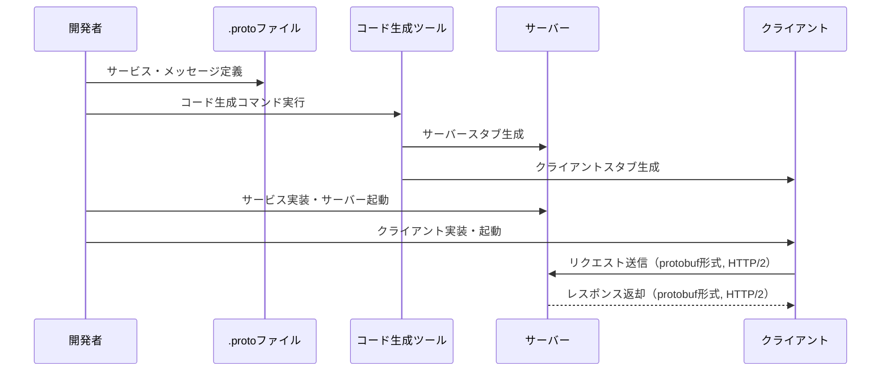

# gRPC

---

## 概要

gRPCはGoogleが開発した高性能なRPC（Remote Procedure Call）フレームワークである。Protocol Buffers（protobuf）をデフォルトのインターフェース定義言語およびメッセージ交換フォーマットとして使用し、異なる言語間で高速かつ型安全な通信を実現する。  
gRPCはマイクロサービス間通信やモバイル・Webアプリケーションのバックエンド通信など、さまざまな用途で利用されている。

**主な特徴:**
- HTTP/2ベースの通信である
- Protocol Buffersによる効率的なシリアライズが可能である
- 双方向ストリーミング通信をサポートしている
- 多言語対応（C#, Go, Java, Python, Ruby, Rust, Typescript など）である

---

## 通信方法

gRPCはHTTP/2をベースにしており、以下の特徴的な通信方法を持つ。



1. **サービス定義**  
   `.proto`ファイルでサービスとメッセージ型を定義する。  
   例:
   ```proto
   syntax = "proto3";
   service Greeter {
     rpc SayHello (HelloRequest) returns (HelloReply);
   }
   message HelloRequest {
     string name = 1;
   }
   message HelloReply {
     string message = 1;
   }
   ```

2. **コード生成**  
   各言語用のgRPCプラグインで、サーバー・クライアントのスタブコードを自動生成する。

3. **通信の流れ**  
   - クライアントはgRPCクライアントスタブを使い、サーバーのメソッドをローカル関数のように呼び出す。
   - サーバーはリクエストを受け取り、定義されたサービスロジックを実行し、レスポンスを返す。
   - 通信はHTTP/2上で行われ、バイナリ形式（protobuf）でデータが送受信される。

4. **通信パターン**  
   - Unary RPC（1リクエスト:1レスポンス）
   - サーバーストリーミングRPC
   - クライアントストリーミングRPC
   - 双方向ストリーミングRPC

---

## RESTとの違い

```mermaid
flowchart TD
    subgraph REST
        RESTClient[クライアント]
        REST_HTTP[HTTP/1.1]
        REST_Data[JSON/XML<br>テキストデータ]
        REST_Endpoint[APIエンドポイント<br>（/api/resource など）]
        REST_Def[OpenAPI/Swagger<br>（API仕様）]
        REST_Stream[ストリーミング: ×<br>双方向通信: ×]
        REST_Type[型安全性: 低い]
        REST_Ext[拡張性: URI/バージョン管理]
        RESTServer[サーバー]
        RESTClient-->|リクエスト|REST_HTTP
        REST_HTTP-->|テキストデータ|REST_Data
        REST_Data-->|エンドポイント指定|REST_Endpoint
        REST_Endpoint-->|API仕様|REST_Def
        REST_HTTP-->|同期通信|REST_Stream
        REST_Stream-->|型安全性|REST_Type
        REST_Type-->|拡張性|REST_Ext
        REST_Stream-->|処理|RESTServer
        RESTServer-->|レスポンス|REST_HTTP
    end

    subgraph gRPC
        gRPCClient[クライアント]
        gRPC_HTTP[HTTP/2]
        gRPC_Data[Protocol Buffers<br>バイナリデータ]
        gRPC_Service[サービス/メソッド<br>（.proto定義）]
        gRPC_Def[IDL（.protoファイル）<br>厳密な型定義]
        gRPC_Stream[ストリーミング: ○<br>双方向通信: ○]
        gRPC_Type[型安全性: 高い]
        gRPC_Ext[拡張性: 柔軟なフィールド追加]
        gRPCServer[サーバー]
        gRPCClient-->|リクエスト|gRPC_HTTP
        gRPC_HTTP-->|バイナリデータ|gRPC_Data
        gRPC_Data-->|サービス/メソッド呼び出し|gRPC_Service
        gRPC_Service-->|API仕様|gRPC_Def
        gRPC_HTTP-->|ストリーミング/双方向|gRPC_Stream
        gRPC_Stream-->|型安全性|gRPC_Type
        gRPC_Type-->|拡張性|gRPC_Ext
        gRPC_Stream-->|処理|gRPCServer
        gRPCServer-->|レスポンス|gRPC_HTTP
    end

    style REST fill:#ffdddd,stroke:#c00,stroke-width:2px
    style gRPC fill:#dde6ff,stroke:#0066cc,stroke-width:2px

    %% 矢印の色を黒にする
    linkStyle default stroke:#222,stroke-width:1.5px,color:#222
```



### 違い

- **データ形式**  
  gRPCはバイナリ形式（protobuf）でデータをやり取りし、RESTは主にJSONやXMLなどのテキスト形式を使用する。
- **通信プロトコル**  
  gRPCはHTTP/2を利用し、RESTは通常HTTP/1.1を利用する。
- **通信パターン**  
  gRPCはストリーミング通信（双方向含む）が可能であるが、RESTはリクエスト/レスポンス型が基本である。
- **API定義**  
  gRPCは.protoファイルで厳密にAPIを定義し、RESTはOpenAPI(Swagger)などで定義する。

### 優位性

- **高速な通信と低いオーバーヘッド**  
  バイナリ形式とHTTP/2の活用により、ネットワーク帯域やレイテンシが最適化される。
- **型安全なインターフェース**  
  サーバー・クライアント間で型が保証されるため、開発効率と安全性が向上する。
- **多言語対応**  
  公式・サードパーティ含め多くの言語で利用可能である。
- **ストリーミング通信のサポート**  
  大量データやリアルタイム通信に適している。

---

## 作成方法

### Typescript

1. Node.jsとnpmをインストールする（未インストールの場合）。
2. 新しいプロジェクトフォルダを作成し、`npm init -y`で初期化する。
3. 必要なパッケージをインストールする。
   ```sh
   npm install @grpc/grpc-js @grpc/proto-loader
   ```
4. gRPCで使う`.proto`ファイルを作成する（例: `greeter.proto`）。
5. サーバーとクライアントのプログラムを作成する。
   - サーバーは`@grpc/proto-loader`でprotoファイルを読み込み、サービスを実装する。
   - クライアントはサーバーにリクエストを送る。
6. サーバーを起動し、クライアントからリクエストを送って動作を確認する。

### Rust

1. Rustをインストールする（https://www.rust-lang.org/）。
2. 新しいプロジェクトを作成する。
   ```sh
   cargo new grpc-sample
   cd grpc-sample
   ```
3. `Cargo.toml`に以下を追加する。
   ```toml
   tonic = "0.9"
   prost = "0.11"
   ```
4. `proto`フォルダを作り、`.proto`ファイルを配置する。
5. `build.rs`を作成し、ビルド時にgRPCコードを自動生成する設定を行う。
6. サーバーとクライアントのRustコードを作成する。
7. `cargo run`でサーバーを起動し、クライアントからリクエストを送って動作を確認する。

### Python

1. Pythonをインストールする（https://www.python.org/）。
2. 新しいフォルダを作り、仮想環境を作成する（任意）。
   ```sh
   python -m venv venv
   source venv/bin/activate  # Windowsは venv\Scripts\activate
   ```
3. 必要なパッケージをインストールする。
   ```sh
   pip install grpcio grpcio-tools
   ```
4. gRPC用の`.proto`ファイルを作成する。
5. コード生成コマンドを実行する。
   ```sh
   python -m grpc_tools.protoc -I. --python_out=. --grpc_python_out=. ./greeter.proto
   ```
6. サーバーとクライアントのPythonコードを作成する。
7. サーバーを起動し、クライアントからリクエストを送って動作を確認する。

### C#

1. .NET SDKをインストールする（https://dotnet.microsoft.com/）。
2. 新しいプロジェクトを作成する。
   ```sh
   dotnet new console -n GrpcSample
   cd GrpcSample
   ```
3. 必要なNuGetパッケージを追加する。
   ```sh
   dotnet add package Grpc.Tools
   dotnet add package Grpc.Net.Client
   dotnet add package Google.Protobuf
   ```
4. `.proto`ファイルをプロジェクトに追加し、プロパティで「ビルドアクション」を「Protobufファイル」に設定する。
5. サーバーとクライアントのC#コードを作成する。
6. サーバーを起動し、クライアントからリクエストを送って動作を確認する。

---