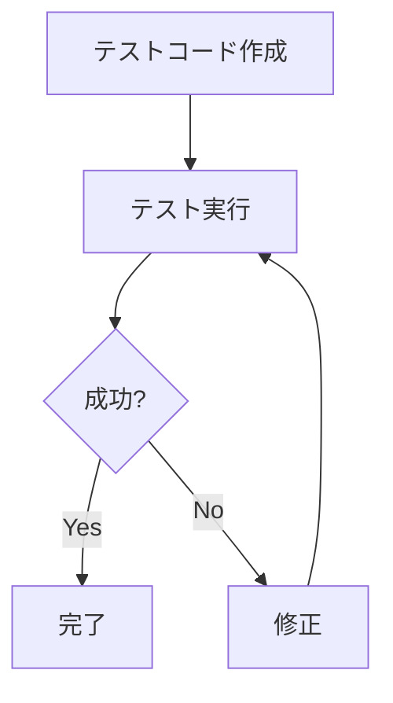
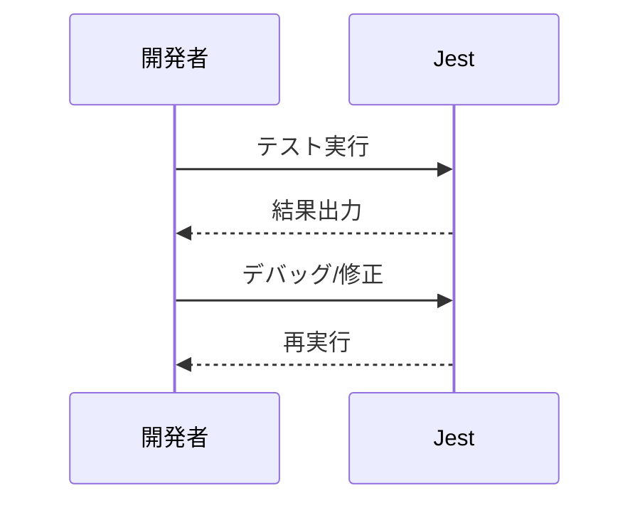

# jest

---

## 概要

### jestとは

JestはFacebookが開発したJavaScriptのテストフレームワークである。  
主にReactアプリケーションのテストで利用されるが、Node.jsや他のフレームワークでも利用可能である。

### 特徴

#### シンプルなAPI

直感的なAPIでテストコードが書きやすい。

#### 高速な実行

並列実行やキャッシュ機能により高速にテストを実行できる。

#### 豊富なプラグイン

スナップショットテストやモック機能など、多彩な機能が標準搭載されている。

### 他のテストフレームワークとの比較

#### Mochaとの違い

Mochaは柔軟性が高いが、Jestは設定不要ですぐに使える。

#### Jasmineとの違い

JestはJasmineのAPIをベースにしつつ、より多機能である。

---

## インストール方法

### 必要なパッケージ

- `jest`
- `ts-jest`
- `@types/jest`
- `babel-jest`
- `@babel/core`
- `@babel/preset-env`

### インストール手順

#### npmを使ったインストール

```sh
npm install --save-dev jest
```

##### グローバルインストール

```sh
npm install -g jest
```

##### プロジェクトローカルインストール

```sh
npm install --save-dev jest
```

#### yarnを使ったインストール

```sh
yarn add --dev jest
```

##### グローバルインストール

```sh
yarn global add jest
```

##### プロジェクトローカルインストール

```sh
yarn add --dev jest
```

### TypeScript対応

#### ts-jestの導入

```sh
npm install --save-dev ts-jest @types/jest
```

#### 型定義ファイルの追加

TypeScriptでJestを使う場合、`@types/jest`が必要である。

#### tsconfig.jsonの設定

`"types": ["jest"]`を`tsconfig.json`に追加する。

---

## 基本的な使い方

### テストファイルの作成

#### ファイル命名規則

- `*.test.js` または `*.spec.js`

##### .test.js/.spec.js

どちらもJestが自動で認識する。

##### ディレクトリ構成例

```
project-root/
├── src/
│   └── sum.js
└── __tests__/
    └── sum.test.js
```

#### サンプルテストコード

##### シンプルなテスト例

```js
// sum.js
function sum(a, b) {
  return a + b;
}
module.exports = sum;

// sum.test.js
const sum = require('./sum');
test('adds 1 + 2 to equal 3', () => {
  expect(sum(1, 2)).toBe(3);
});
```

##### 非同期テスト例

```js
test('async test', async () => {
  const data = await fetchData();
  expect(data).toBe('value');
});
```

### テストの実行方法

#### コマンドラインからの実行

```sh
npx jest
```

#### package.jsonのscripts利用

```json
"scripts": {
  "test": "jest"
}
```

#### IDEからの実行

多くのIDEがJestに対応している。

### テスト結果の確認

#### 成功・失敗の見方

テスト結果がコンソールに表示される。

#### 詳細レポートの出力

`--verbose`オプションで詳細表示が可能である。

#### カバレッジレポートの確認

`--coverage`オプションでカバレッジを確認できる。



---

## よく使うコマンド

### テストの実行

```sh
npx jest
```

### 特定ファイル・テストの実行

```sh
npx jest sum.test.js
```

### 特定テストケースの実行

```sh
npx jest -t 'adds 1 + 2'
```

### ウォッチモード

```sh
npx jest --watch
```

### カバレッジ計測

```sh
npx jest --coverage
```

### テスト結果の出力形式指定

```sh
npx jest --json --outputFile=results.json
```

---

## 設定例

### jest.config.jsの例

#### 最小構成

```js
module.exports = {
  testEnvironment: 'node',
};
```

#### TypeScript対応構成

```js
module.exports = {
  preset: 'ts-jest',
  testEnvironment: 'node',
};
```

#### Babel対応構成

```js
module.exports = {
  transform: {
    '^.+\\.js$': 'babel-jest',
  },
};
```

### BabelやTypeScriptとの連携

#### Babel設定例

```json
{
  "presets": ["@babel/preset-env"]
}
```

#### ts-jest設定例

```js
module.exports = {
  preset: 'ts-jest',
  testEnvironment: 'node',
};
```

### カバレッジレポートの設定

#### 出力ディレクトリ指定

```js
coverageDirectory: "coverage"
```

#### 除外ファイル指定

```js
coveragePathIgnorePatterns: ["/node_modules/"]
```

### モジュールパスのエイリアス設定

#### tsconfig.jsonとの連携

```json
{
  "compilerOptions": {
    "baseUrl": ".",
    "paths": {
      "@/*": ["src/*"]
    }
  }
}
```

---

## テストの書き方

### describe/itの使い方

#### describeの使い方

テストグループ化に利用する。

```js
describe('sum', () => {
  // テストケース
});
```

#### it/testの使い方

個々のテストケースを記述する。

```js
it('adds 1 + 2', () => {
  expect(sum(1, 2)).toBe(3);
});
```

### マッチャーの例

#### 基本的なマッチャー

- `toBe`
- `toEqual`
- `toContain`

#### 非同期テストのマッチャー

- `resolves`
- `rejects`

#### 例外の検証

```js
expect(() => {
  throw new Error('error');
}).toThrow('error');
```

### モック・スタブの利用

#### 関数のモック

```js
const fn = jest.fn();
```

#### モジュールのモック

```js
jest.mock('./module');
```

#### タイマーのモック

```js
jest.useFakeTimers();
```

#### fetchやaxiosのモック

```js
global.fetch = jest.fn();
```

---

## 応用テクニック

### スナップショットテスト

#### スナップショットの作成

```js
expect(tree).toMatchSnapshot();
```

#### スナップショットの更新

```sh
npx jest -u
```

### 非同期処理のテスト

#### Promiseのテスト

```js
return expect(Promise.resolve('value')).resolves.toBe('value');
```

#### async/awaitのテスト

```js
test('async/await', async () => {
  const data = await fetchData();
  expect(data).toBe('value');
});
```

### フック（beforeEach/afterEach）の活用

#### グローバルフック

```js
beforeAll(() => {});
afterAll(() => {});
```

#### ローカルフック

```js
beforeEach(() => {});
afterEach(() => {});
```

### カスタムマッチャーの作成

#### 独自マッチャーの追加方法

```js
expect.extend({
  toBeWithinRange(received, floor, ceiling) {
    const pass = received >= floor && received <= ceiling;
    if (pass) {
      return { message: () => `ok`, pass: true };
    } else {
      return { message: () => `ng`, pass: false };
    }
  },
});
```

---

## トラブルシューティング

### テストが失敗する場合

#### よくある原因

- モジュール解決エラー
- 非同期処理のタイムアウト

#### ログ出力による調査

`console.log`で値を確認する。

### よくあるエラーと対処法

#### 設定ファイル関連

設定ファイルのパスや内容を確認する。

#### モジュール解決エラー

パスやエイリアス設定を見直す。

#### 非同期テストのタイムアウト

`jest.setTimeout()`でタイムアウト時間を延長できる。

### デバッグ方法

#### --runInBandオプション

テストを直列実行する。

```sh
npx jest --runInBand
```

#### --detectOpenHandlesオプション

開いたままのハンドルを検出する。

```sh
npx jest --detectOpenHandles
```

#### IDEのデバッグ機能

ブレークポイントを設定してデバッグ可能である。



---

