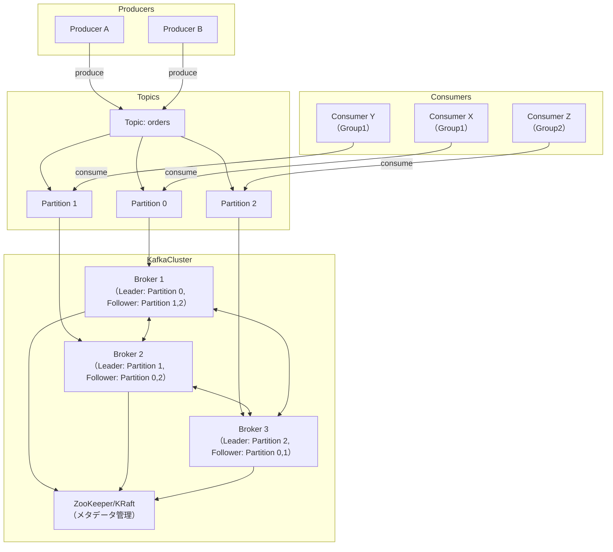
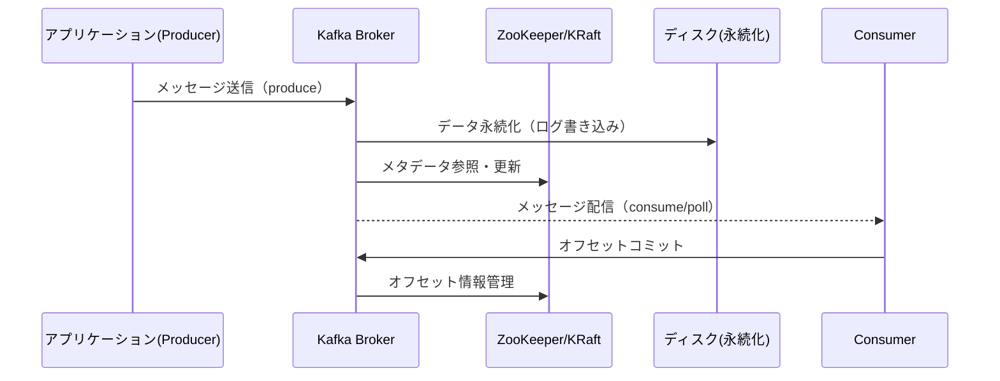
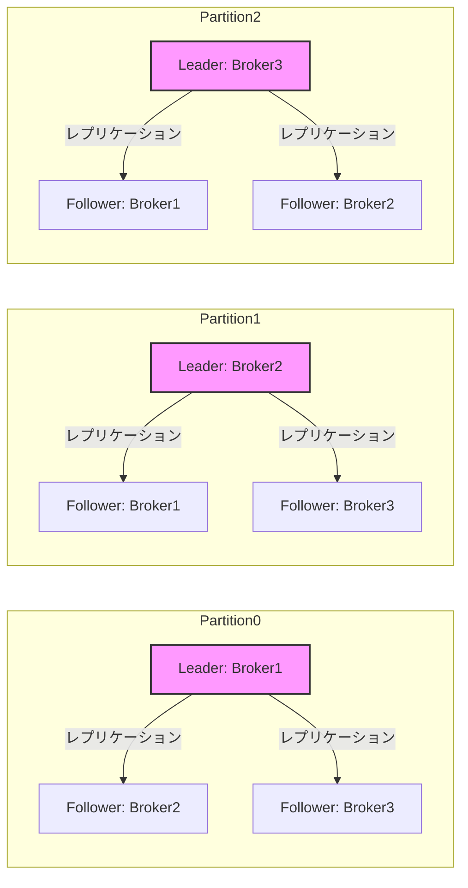
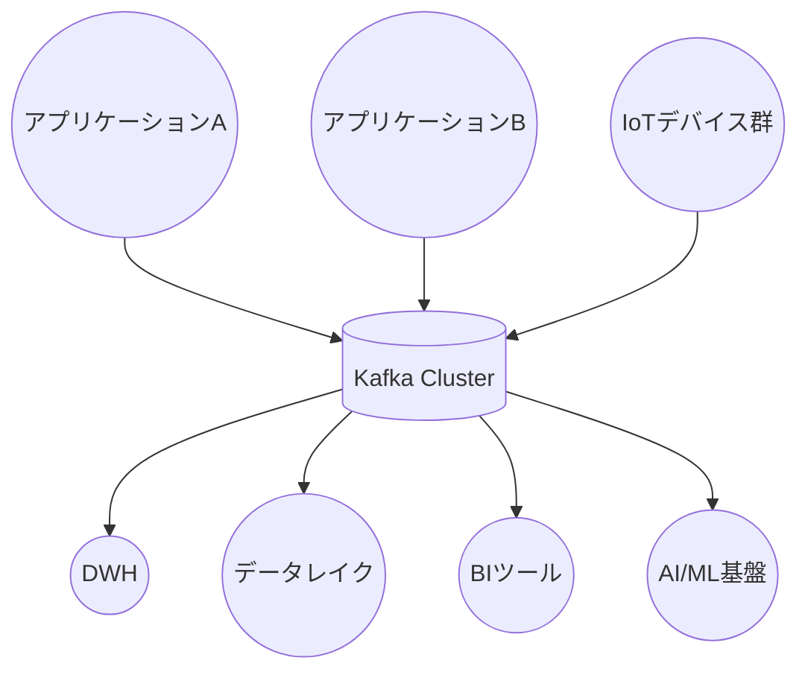

# kafka

---

## 概要

Kafkaは、分散型ストリーミングプラットフォームであり、リアルタイムかつ大規模なデータ処理を可能とするメッセージングシステムである。主な用途は、リアルタイムデータストリーミング、イベント駆動アーキテクチャ、ログ集約、データパイプラインの構築、IoTデータ収集、AI/ML基盤へのデータ供給など多岐にわたる。Kafkaは、複数のProducerからのデータを受け取り、複数のConsumerに効率的かつ確実に配信できる。耐障害性、スケーラビリティ、パフォーマンス、データ保持の柔軟性に優れ、企業の基幹システムや大規模なデータ分析基盤でも広く利用されている。

Kafkaは「パブリッシュ・サブスクライブ」モデルを採用し、データの発生源（Producer）と消費先（Consumer）を疎結合にできる。これにより、システム間の連携や拡張が容易となり、マイクロサービス、IoT、AI/ML基盤など多様な分野で活用されている。Kafkaの特徴的な設計として、ディスクへの永続化、パーティションによるデータ分散、レプリケーションによる高可用性、Consumer Groupによる並列処理が挙げられる。

---

## 歴史

Kafkaは2010年にLinkedInの社内プロジェクトとしてJay Krepsらによって開発が始まり、2011年にApache Software Foundationのオープンソースプロジェクトとなった。当初はログ集約基盤として設計されたが、後にストリーム処理やデータ連携の基盤として進化した。2014年にはKafka Streams、2015年にはKafka Connectが追加され、エコシステムが拡大した。2019年以降はKRaftモード（ZooKeeperレス運用）が開発され、2023年にはKRaftがデフォルトとなるなど、クラウドネイティブな運用や自律的なクラスタ管理へと進化している。

Kafkaは、GoogleのChubbyやAmazonのDynamo、FacebookのScribeなど、他の分散システムの設計思想を取り入れつつ、独自の高スループット・高可用性アーキテクチャを実現している。現在では、世界中の大規模サービスや金融機関、IoTプラットフォームなどで標準的に利用されている。

---

## 特徴

- **高スループット・低レイテンシ**: 1秒間に数百万件のメッセージを処理可能。バッチ書き込みやゼロコピー転送などの最適化により、ディスクI/Oやネットワーク負荷を最小化。
- **水平スケーラビリティ**: Brokerやパーティションを追加することで、システム全体の処理能力を容易に拡張可能。クラスタ構成により、負荷分散や障害時の自動復旧も実現。
- **永続化と耐障害性**: データはディスクに永続化され、複数Broker間でレプリケーションされるため、障害発生時もデータ損失を最小限に抑えられる。リーダー・フォロワー構成により、Broker障害時も自動で役割が切り替わる。
- **パブリッシュ・サブスクライブモデル**: 複数のProducer/Consumerが同時に接続でき、柔軟なデータ配信が可能。Consumer Groupを活用することで、並列処理や負荷分散も容易。
- **ストリーム処理との統合**: Kafka StreamsやksqlDBと連携し、リアルタイムなデータ変換・集計・分析が可能。外部のSpark/Flinkなどとも連携できる。
- **柔軟なデータ保持**: 保持期間や容量をトピックごとに設定でき、用途に応じた運用が可能。ログとしての長期保存や一時的なバッファとしても利用できる。
- **高い可搬性・拡張性**: 多様なクライアント言語、コネクタ、クラウドサービスとの連携が可能であり、システム拡張や移行も容易。

---

## アーキテクチャ

Kafkaは、以下の主要コンポーネントで構成される。

- **Producer**: メッセージをKafkaクラスタに送信するクライアント。データの発生源となるアプリケーションやサービスが該当する。Producerはラウンドロビンやパーティションキーに基づき、メッセージをパーティションに振り分ける。
- **Broker**: メッセージを受信・保存・配信するサーバ。Kafkaクラスタは複数のBrokerで構成される。各Brokerは複数のパーティションを管理し、リーダー・フォロワーの役割を持つ。
- **Consumer**: Kafkaクラスタからメッセージを取得するクライアント。データ処理や分析を行うアプリケーションが該当する。Consumer Groupを構成することで、複数Consumerによる並列処理が可能。
- **ZooKeeper/KRaft**: クラスタのメタデータ管理やリーダー選出を担う。Kafka 2.8以降はKRaftモード（ZooKeeper不要）も利用可能。KRaftはKafka自身がメタデータ管理を行う新方式。



- 上記は、3台のBroker、3パーティション、2つのConsumer Group（Group1, Group2）、ZooKeeper/KRaftによるメタデータ管理を含む詳細な構成例である。
- 各パーティションはリーダーBrokerが決まり、フォロワーBrokerがレプリケーションを保持する。
- Consumer Groupごとにパーティションが割り当てられ、並列処理が実現される。
- ZooKeeper/KRaftはBrokerの状態やパーティションリーダーの選出、クラスタ構成情報を管理する。

---

## データフロー詳細

Kafkaのデータフロー全体像を以下に示す。



- ProducerはBrokerにメッセージを送信し、Brokerはディスクに永続化する。
- BrokerはZooKeeper/KRaftと連携し、パーティションリーダーやメタデータを管理する。
- ConsumerはBrokerからメッセージを取得し、処理後にオフセットをコミットすることで再処理や重複処理を防ぐ。

---

## レプリケーションとフェイルオーバー

Kafkaの高可用性を支えるレプリケーションとフェイルオーバーの仕組みを示す。



- 各パーティションは1つのリーダーと複数のフォロワーで構成される。
- リーダー障害時はISR（In-Sync Replicas）から新リーダーが自動昇格し、可用性を維持する。

---

## バージョン管理

Kafkaはセマンティックバージョニング（MAJOR.MINOR.PATCH）を採用している。メジャーバージョンアップ時にはAPIやプロトコルの互換性に注意が必要である。バージョンごとにサポートされる機能やAPIが異なるため、運用時は公式リリースノートの確認が推奨される。

Kafka Improvement Proposals（KIP）により、新機能や仕様変更が管理されている。アップグレード時はBroker、ZooKeeper/KRaft、クライアントの互換性を十分に検証することが重要である。

---

## インストール方法

1. [公式サイト](https://kafka.apache.org/downloads)からKafkaのバイナリをダウンロードする。
2. アーカイブを展開し、`config/server.properties`などの設定ファイルを編集する。
3. ZooKeeper（またはKRaft）を起動する。KRaftモードの場合は`kafka-storage.sh`で初期化が必要。
4. `bin/kafka-server-start.sh`（Windowsは`.bat`）でBrokerを起動する。
5. 必要に応じてトピック作成やクライアント設定を行う。Kafka ConnectやSchema Registryなどの周辺ツールも同様にセットアップ可能。

クラウド環境では、AWS MSKやConfluent Cloudなどのマネージドサービスを利用することで、インフラ構築・運用負荷を大幅に軽減できる。

---

## 設定例

```properties
# filepath: c:\work\KisoFramework\docs\03_tech\kafka.md
broker.id=1
log.dirs=/tmp/kafka-logs
zookeeper.connect=localhost:2181
num.network.threads=3
num.io.threads=8
log.retention.hours=168
log.segment.bytes=1073741824
log.retention.check.interval.ms=300000
num.partitions=6
default.replication.factor=3
min.insync.replicas=2
auto.create.topics.enable=false
```
- `broker.id`: Brokerの一意なID
- `log.dirs`: メッセージログの保存ディレクトリ
- `zookeeper.connect`: ZooKeeperの接続先
- `log.retention.hours`: データ保持期間（時間）
- `log.segment.bytes`: セグメントファイルの最大サイズ
- `num.partitions`: デフォルトのパーティション数
- `default.replication.factor`: デフォルトのレプリケーション数
- `min.insync.replicas`: 書き込み時に必要な同期レプリカ数
- `auto.create.topics.enable`: トピックの自動作成可否

---

## サポートされるOS

KafkaはJavaで実装されているため、JVMが動作する主要なOS（Linux、Windows、macOS）で利用可能である。商用運用ではLinux（特にRedHat系やDebian系）が推奨される。DockerやKubernetes上での運用も一般的である。

---

## サポートされるクライアント

公式Javaクライアントのほか、Python（confluent-kafka-python）、Go（sarama）、C#（Confluent.Kafka）、Node.js（kafkajs）、Ruby（ruby-kafka）、C++（librdkafka）など、多様な言語向けクライアントライブラリが提供されている。Kafka REST Proxyを利用すればHTTP経由での操作も可能。

---

## サポートされる言語

Java、Scala、Python、Go、C#、Node.js、Ruby、C++、Rust、PHPなど、多数の言語でKafkaクライアントが利用できる。公式・サードパーティ製ライブラリが充実している。

---

## サポートされるAPIバージョン

KafkaはバージョンごとにAPI互換性を維持しているが、古いクライアントやBrokerとの組み合わせでは一部機能制限や非互換が発生する場合がある。APIバージョンはプロトコルネゴシエーションにより自動調整される。バージョンアップ時はクライアント・Broker双方の互換性を事前に検証すること。

---

## サポートされるAPIクライアント

公式クライアント（Java、Scala）に加え、Confluentやコミュニティによるサードパーティ製クライアントが多数存在する。REST Proxy経由でHTTPベースのAPI利用も可能である。Kafka StreamsやKafka Connectなどの高レベルAPIも提供されている。

---

## サポートされるプロトコル

Kafka独自のバイナリプロトコルを使用しており、高速な通信と効率的なデータ転送を実現している。SSL/TLSによる暗号化通信もサポートし、SASL認証やクライアント証明書認証も利用可能。

---

## サポートされるデータフォーマット

Kafka自体はデータフォーマットに依存しないが、Avro、JSON、Protobuf、String、バイナリなどが一般的に利用される。スキーマ管理にはSchema Registryが活用される。データの互換性や品質担保のため、スキーマ定義の運用が推奨される。

---

## サポートされるデータベース

Kafka Connectを利用することで、MySQL、PostgreSQL、Oracle、SQL Server、MongoDB、Cassandra、Elasticsearch、Redisなど各種RDBMSやNoSQLデータベースと連携し、データのインポート・エクスポートが可能である。公式・サードパーティ製コネクタが豊富に提供されている。

---

## サポートされるクラウドサービス

AWS MSK、Azure Event Hubs、Confluent Cloud、Google Cloud Pub/Sub for Kafkaなど、主要クラウドベンダーがマネージドKafkaサービスを提供している。オンプレミスからクラウドへの移行やハイブリッド運用も容易である。

---

## サポートされるネットワーク構成

シングルクラスタ、マルチクラスタ、クロスデータセンター構成、VPCピアリング、VPN接続、プライベートリンクなど多様なネットワーク構成に対応する。MirrorMakerを用いたクラスタ間レプリケーションも可能である。グローバル分散やDR構成も実現できる。

---

## サポートされる認証方式

SASL/PLAIN、SASL/SCRAM、SASL/GSSAPI（Kerberos）、SSL/TLSクライアント証明書認証など、多様な認証方式をサポートする。ACLによるアクセス制御も可能である。セキュリティ要件に応じて組み合わせて利用する。

---

## セキュリティ

- 通信経路の暗号化（SSL/TLS）
- クライアント認証（SASL、証明書）
- アクセス制御リスト（ACL）による認可
- 監査ログによる操作履歴の記録
- データの暗号化やマスキングは外部ツールと連携して実現可能
- セキュリティパッチやバージョン管理の徹底が重要

---

## 認証・認可

SASLやSSL/TLSによる認証、ACLによるトピック・グループ単位の細粒度なアクセス制御が可能である。運用時は最小権限の原則に基づく設定が推奨される。監査ログと組み合わせることで、セキュリティインシデントの早期検知も可能。

---

## GDPR対応

トピックごとのデータ保持期間設定や、Kafka APIによるデータ削除機能により、GDPR等のデータ保護規制に対応できる。データマスキングや匿名化はストリーム処理や外部ツールで実装する。データ主体からの削除要求に応じた運用設計が必要。

---

## サンプルコード

```java
// filepath: c:\work\KisoFramework\docs\03_tech\kafka.md
// JavaによるProducerの例
Properties props = new Properties();
props.put("bootstrap.servers", "localhost:9092");
props.put("key.serializer", "org.apache.kafka.common.serialization.StringSerializer");
props.put("value.serializer", "org.apache.kafka.common.serialization.StringSerializer");
KafkaProducer<String, String> producer = new KafkaProducer<>(props);
producer.send(new ProducerRecord<>("topic", "key", "value"));
producer.close();
```

```java
// JavaによるConsumerの例
Properties props = new Properties();
props.put("bootstrap.servers", "localhost:9092");
props.put("group.id", "test-group");
props.put("key.deserializer", "org.apache.kafka.common.serialization.StringDeserializer");
props.put("value.deserializer", "org.apache.kafka.common.serialization.StringDeserializer");
KafkaConsumer<String, String> consumer = new KafkaConsumer<>(props);
consumer.subscribe(Arrays.asList("topic"));
while (true) {
    ConsumerRecords<String, String> records = consumer.poll(Duration.ofMillis(100));
    for (ConsumerRecord<String, String> record : records) {
        System.out.printf("offset = %d, key = %s, value = %s%n", record.offset(), record.key(), record.value());
    }
}
```
- 上記は最小構成の例。実運用では例外処理やリトライ、バッチ送信、非同期処理、認証設定なども考慮すること。

---

## API

Kafkaは以下のAPIを提供する。

- **Producer API**: メッセージの送信
- **Consumer API**: メッセージの受信
- **Streams API**: ストリーム処理
- **Connect API**: 外部システムとの連携
- **Admin API**: トピックやパーティションの管理

---

## APIゲートウェイ連携

Kafka REST Proxyを利用することで、HTTP経由でKafkaクラスタにアクセスできる。APIゲートウェイと連携することで、外部サービスやサーバーレスアーキテクチャとの統合が容易になる。API Gateway経由での認証・認可やスロットリングも実装可能。

---

## スキーマ管理

Confluent Schema Registryを利用することで、AvroやProtobufなどのスキーマを一元管理できる。スキーマ進化や互換性チェックも自動化される。スキーマバリデーションにより、データ品質や互換性を担保できる。

---

## レプリケーション

Kafkaはパーティション単位で複数Brokerにデータをレプリケーションする。リーダーBroker障害時はフォロワーが自動昇格し、可用性を確保する。レプリケーションファクタやISR（In-Sync Replicas）の設定が重要。

---

## データシャーディング

トピックのパーティション機能により、データを複数Brokerに分散配置できる。パーティションキーによりデータの分散先を制御可能である。シャーディング設計はスケーラビリティやパフォーマンスに直結する。

---

## ストリーム処理

Kafka StreamsやksqlDBを利用して、リアルタイムなデータ変換・集計・フィルタリング・結合などのストリーム処理が可能である。外部のSpark StreamingやFlinkとも連携できる。ストリーム処理の状態管理や障害復旧もサポートされている。

---

## バッチ処理

Kafka ConnectやSpark、Hadoopなどと連携し、バッチデータの取り込みやエクスポートも実現できる。バッチ処理とストリーム処理のハイブリッド運用も可能である。データウェアハウスやデータレイクへの連携も容易。

---

## リアルタイム分析

Kafka Streamsや外部分析基盤（Elasticsearch、DWH等）と連携し、リアルタイムなデータ分析やダッシュボード表示が可能である。BIツールや可視化基盤との統合も進んでいる。

---

## データ連携

Kafka Connectを利用して、RDBMS、NoSQL、ファイルシステム、クラウドストレージなど多様なシステムとデータ連携が可能である。コネクタは公式・サードパーティ含め多数存在する。データ連携の監視やエラー処理も重要。

---

## データ統合

Kafkaをハブとして複数のデータソースを統合し、データレイクやDWH、BIツールに連携できる。データの正規化や変換もストリーム処理で実現可能である。企業全体のデータ統合基盤としても活用される。

---

## データ移行

Kafka ConnectやMirrorMakerを利用して、オンプレミスからクラウド、または異なるKafkaクラスタ間でデータ移行が可能である。ゼロダウンタイム移行も実現できる。移行時のデータ整合性や順序保証に注意。

---

## データアーカイブ

長期間のデータ保持や、外部ストレージ（S3、HDFS等）へのアーカイブが可能である。保持期間を超えたデータは自動削除される。アーカイブデータの再利用や分析も容易。

---

## データ保持戦略

トピックごとに保持期間（`log.retention.hours`）や最大容量（`log.retention.bytes`）を設定できる。要件に応じて柔軟に運用可能である。保持戦略はコストやパフォーマンスにも影響する。

---

## データ品質管理

スキーマ検証やデータ検証により、データの整合性や品質を担保できる。エラー時のリトライやデッドレターキュー運用も可能である。データ品質の可視化や監査も重要。

---

## データ可搬性

標準フォーマット（Avro、JSON等）やKafka Connectコネクタにより、システム間のデータ可搬性が高い。クラウド移行やシステム統合時にも柔軟に対応できる。

---

## データ圧縮

メッセージ圧縮（gzip、snappy、lz4、zstd）により、ストレージ効率やネットワーク帯域を最適化できる。圧縮方式はProducerごとに指定可能である。圧縮率とCPU負荷のバランスを考慮する。

---

## データ圧縮率

圧縮方式ごとに圧縮率やCPU負荷が異なる。用途やシステムリソースに応じて最適な方式を選択する。zstdは高圧縮率・高速性で近年推奨される。

---

## サポートされる圧縮方式

gzip、snappy、lz4、zstdなどをサポートし、用途に応じて選択できる。デフォルトはProducer設定に依存する。

---

## データ暗号化

SSL/TLSによる通信暗号化、ディスク暗号化（OSやストレージ側）により、データの機密性を確保できる。暗号化運用時は証明書管理や鍵管理も重要。

---

## データマスキング

ストリーム処理や外部ツールを用いて、個人情報や機密情報のマスキング・匿名化が可能である。GDPRや各種法令対応にも有効。

---

## データ削除ポリシー

保持期間や容量超過時に自動削除される。明示的な削除APIは存在しないが、保持設定で制御可能である。削除要件が厳しい場合は、ストリーム処理や外部連携で対応する。

---

## データ復旧

レプリケーションやバックアップからの復旧が可能である。障害発生時は自動的にフォロワーがリーダーに昇格する。バックアップ運用やDR設計も重要。

---

## バックアップとリカバリ

MirrorMakerや外部ストレージ連携でバックアップ・リカバリが可能である。定期的なスナップショット取得やクラスタ間レプリケーションも推奨される。

---

## データフィルタリング

Consumer側やKafka Streamsで、条件に応じたデータフィルタリングが可能である。不要なデータの除外やサンプリングも実現できる。フィルタリング設計はパフォーマンスやコストにも影響。

---

## データサンプリング

ストリーム処理や外部ツールでサンプリング処理を実装できる。大量データの分析やテスト用途に有効である。サンプリング率や方法は要件に応じて調整。

---

## データガバナンス

スキーマ管理、監査ログ、アクセス制御により、データガバナンスを強化できる。コンプライアンス要件にも対応可能である。データカタログやメタデータ管理との連携も進んでいる。

---

## データレイク連携

Kafka ConnectでS3、HDFS、GCS等のデータレイクと連携し、ストリーミングデータを蓄積・分析できる。データレイクへの連携はビッグデータ分析やAI/ML基盤で重要。

---

## データ可視化

Grafana、Kibana、Superset等と連携し、Kafkaのメトリクスやストリームデータを可視化できる。リアルタイムダッシュボードやアラート設定も容易。

---

## モニタリングツール

Prometheus、Grafana、Confluent Control Center、Datadog、New Relicなどが利用できる。JMX経由で詳細なメトリクス取得も可能である。運用監視の自動化やアラート連携も推奨。

---

## メトリクス

レイテンシ、スループット、パーティションごとの遅延、Consumer Lag、Brokerリソース使用率など、多数のメトリクスが取得可能である。メトリクス監視は運用安定化に不可欠。

---

## ロギング

Kafka Brokerやクライアントのログレベルや出力先を設定できる。障害解析や運用監視に活用される。ログの集約・分析基盤との連携も一般的。

---

## アラート設定

モニタリングツールと連携し、閾値超過時のアラート通知が可能である。例：Consumer Lag増大、Brokerダウン、ディスク使用率超過など。アラート設計は運用効率化に直結する。

---

## 運用・監視

専用ツールやダッシュボードで運用・監視が容易である。自動復旧やスケーリングもサポートされる。運用自動化やIaC（Infrastructure as Code）との連携も進んでいる。

---

## トラブルシューティング

ログやメトリクス、JMX情報を活用し、障害発生時の原因特定や対応が可能である。公式ドキュメントやコミュニティのナレッジも豊富である。障害対応手順やFAQの整備も推奨。

---

## 障害対応

レプリケーションやフェイルオーバーにより、Broker障害時もサービス継続が可能である。パーティションリーダーの自動切替も実装されている。障害時の自動通知や復旧手順の標準化も重要。

---

## 自動スケーリング

Brokerやパーティションの追加・削除により、負荷やデータ量に応じた自動スケーリングが実現できる。クラウド環境ではオートスケーリング連携も可能である。スケーリング設計はコストやパフォーマンスに影響。

---

## パフォーマンスチューニング

設定調整（バッファサイズ、スレッド数、圧縮方式等）やハードウェア増強（SSD、メモリ増設等）により、パフォーマンス最適化が可能である。パーティション設計やネットワーク構成も重要な要素。

---

## コスト管理

リソース利用状況を監視し、不要なトピックやパーティションの削除、Broker数の最適化などでコスト最適化が可能である。クラウド利用時は従量課金に注意する。コスト分析や予算管理も推奨。

---

## アップグレード手順

1. 新バージョンのBrokerを追加し、ローリングアップグレードを実施する。
2. ZooKeeperやKRaftの互換性を確認する。
3. クライアントのAPIバージョン互換性を検証する。
4. 必要に応じて設定ファイルやスキーマの更新を行う。
5. アップグレード後は動作確認やパフォーマンステストを実施する。

---

## 監査ログ

アクセスや操作履歴を監査ログとして記録できる。セキュリティやコンプライアンス要件への対応に有効である。監査ログの保管・分析基盤との連携も推奨。

---

## ベストプラクティス

- パーティション設計の最適化（データ分散・並列処理効率化）
- 適切なレプリケーション設定（高可用性確保）
- モニタリングとアラートの徹底
- スキーマ管理と互換性維持
- セキュリティ設定の強化（認証・認可・暗号化）
- 運用自動化・IaCの活用
- 障害対応手順やFAQの整備

---

## リファレンスアーキテクチャ


- アプリケーションやIoTデバイスからKafkaにデータを送信し、DWHやデータレイク、BIツール、AI/ML基盤に連携する構成例である。Kafka ConnectやStreams、ksqlDBを組み合わせることで、柔軟なデータパイプラインを構築できる。

---

## サードパーティツール

Confluent Platform、Lenses.io、Redpanda、Aiven、Instaclustrなどが存在し、運用管理や可視化、クラウドサービス提供など多様な機能を補完する。各種コネクタや監視ツール、GUI管理ツールも充実している。

---

## マイクロサービス連携

マイクロサービス間の非同期通信基盤としてKafkaを利用することで、疎結合・高可用なシステム設計が可能となる。イベント駆動アーキテクチャの中核としても活用される。サービス間の依存関係やスケーラビリティも向上する。

---

## イベントソーシング

イベントソーシングパターンのイベントストアとしてKafkaを利用することで、全ての状態変化をイベントとして記録・再生できる。マイクロサービスやCQRSパターンと相性が良い。イベントの再生やリプレイも容易。

---

## CI/CD連携

Kafkaの設定ファイルやスキーマ管理、コネクタ設定をGit等で管理し、CI/CDパイプラインに組み込むことで、インフラの自動化・再現性向上が実現できる。IaCツール（Terraform、Ansible等）との連携も推奨。

---

## デプロイメントパターン

オンプレミス、クラウド、ハイブリッド、マルチクラウドなど多様なデプロイメントパターンに対応する。要件や運用体制に応じて最適な構成を選択できる。Kubernetes上での運用も一般化している。

---

## クラウド対応

AWS、Azure、GCPなど主要クラウドでKafkaが利用可能であり、マネージドサービスも充実している。クラウドネイティブな運用や自動スケーリングも実現できる。クラウド間レプリケーションやDR構成も容易。

---

## マルチテナンシー

トピックやACL、クライアントIDを活用し、複数組織やサービスのデータを安全に分離・管理できる。大規模なSaaS基盤にも適用可能である。リソース制限や監査ログ運用も重要。

---

## IoT連携

IoTデバイスからの大量データをKafkaで収集・蓄積し、リアルタイム分析や機械学習基盤に連携できる。MQTTブリッジや専用コネクタも利用可能である。エッジ処理やデータ前処理も組み合わせて運用。

---

## AI/ML連携

Kafkaをデータパイプラインの中核として、ストリーミングデータをAI/ML基盤に連携し、リアルタイム推論やモデル学習に活用できる。特徴量抽出やデータ前処理もストリーム処理で実装可能。

---

## 分散トレーシング

OpenTracingやJaeger、Zipkinと連携し、Kafka経由の分散トレーシングが可能である。マイクロサービス間の依存関係やパフォーマンス分析に有効である。トレースIDの伝播設計も重要。

---

## 比較：他のメッセージングシステム

RabbitMQやActiveMQはキューイング用途に強みがあるが、Kafkaは高スループット・永続化・スケーラビリティに優れる。用途や要件に応じて使い分けが推奨される。Kafkaはイベントストリーム処理や大規模データ連携に最適。

---

## コミュニティとサポート

活発なOSSコミュニティが存在し、公式ドキュメントやフォーラム、Slack、Stack Overflow等で情報交換が可能である。商用サポートはConfluentやクラウドベンダーが提供している。KIPによる仕様改善も活発。

---

## 今後の展望

KRaftモードの標準化、クラウドネイティブ運用、スキーマ管理やセキュリティ機能の強化、エコシステムの拡大が進展している。今後も大規模データ基盤の中核技術として発展が期待される。AI/MLやIoT、分散トレーシングとの連携も深化する見込み。

---

## 用語集

- **Broker**: メッセージを保存・配信するサーバ
- **Producer**: メッセージを送信するクライアント
- **Consumer**: メッセージを受信するクライアント
- **Topic**: メッセージの分類単位
- **Partition**: トピック内のデータ分割単位
- **Offset**: パーティション内のメッセージ位置
- **Consumer Group**: 複数Consumerによる並列処理単位
- **ISR**: In-Sync Replicas、同期済みレプリカ群
- **KRaft**: Kafka Raft、ZooKeeperレスのメタデータ管理方式

---

## 関連技術

Kafka Connect、Kafka Streams、ksqlDB、Schema Registry、MirrorMaker、ZooKeeper、KRaft、Prometheus、Grafana、Confluent Control Centerなど。

---

## FAQ

- Q: Kafkaはどのような用途に向いているか？
  - A: リアルタイムデータ処理、大規模イベント集約、マイクロサービス連携、ログ集約、IoTデータ収集など。
- Q: Kafkaのデータはどのくらい保持できるか？
  - A: トピックごとに保持期間や容量を柔軟に設定できる。
- Q: Kafkaはどのようにスケールするか？
  - A: Brokerやパーティションの追加で水平スケールが可能である。
- Q: Kafkaの障害時の対応は？
  - A: レプリケーションや自動フェイルオーバーにより高可用性を確保できる。

---

## 参考文献

- [Kafka公式ドキュメント](https://kafka.apache.org/documentation/)
- 「Kafka: The Definitive Guide」
- Confluent公式ブログ
- [Confluent Documentation](https://docs.confluent.io/)
- [Kafka Improvement Proposals (KIP)](https://cwiki.apache.org/confluence/display/KAFKA/Kafka+Improvement+Proposals)