# Nodejs

---

## 概要

Node.jsは、Google ChromeのV8 JavaScriptエンジン上に構築されたサーバーサイドJavaScript実行環境である。非同期I/Oを得意とし、高いパフォーマンスとスケーラビリティを実現する。JavaScriptをサーバーサイドで動作させることで、フロントエンドとバックエンドの言語統一が可能となり、開発効率の向上や人材の流動性向上にも寄与する。Node.jsはシングルスレッドモデルを採用しているが、イベントループとノンブロッキングI/Oにより、多数の同時接続を効率的に処理できる。Webアプリケーション、APIサーバ、リアルタイム通信、バッチ処理、IoTなど幅広い用途で利用されている。

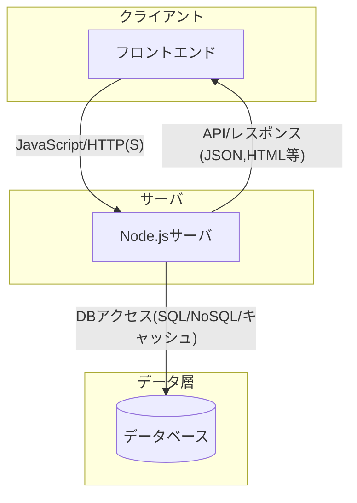

---

## 歴史

Node.jsは2009年にRyan Dahlによって開発された。当時のWebサーバはスレッドベースの同期I/Oが主流であり、同時接続数の増加に伴うスケーラビリティの課題があった。Node.jsはイベント駆動・ノンブロッキングI/Oモデルを採用し、これらの課題を解決した。2010年にはnpm（Node Package Manager）が登場し、エコシステムが急速に拡大した。2015年にはio.jsとの統合により、Node.js Foundationが設立され、開発体制が強化された。現在はOpenJS Foundationのもとで開発が進められている。バージョン管理やLTS（Long Term Support）ポリシーも整備され、企業利用も増加している。

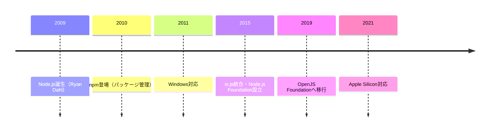

---

## 特徴

- 非同期・イベント駆動型アーキテクチャにより、高いパフォーマンスとスケーラビリティを実現する。
- シングルスレッドで動作するが、内部的にlibuvによるスレッドプールを活用し、I/O処理を効率化している。
- npmによる豊富なパッケージエコシステムが存在し、Webフレームワーク、データベースドライバ、ユーティリティなど多様なモジュールが利用可能である。
- クロスプラットフォーム対応であり、主要なOSで動作する。
- JavaScriptの知識のみでサーバーサイド開発が可能であるため、フロントエンドエンジニアの参入障壁が低い。
- マイクロサービスやサーバレスアーキテクチャとの親和性が高い。
- 高速な起動時間と低いメモリ消費。

---

## アーキテクチャ

Node.jsはイベントループとノンブロッキングI/Oを中心に設計されている。リクエストはイベントキューに登録され、イベントループが順次処理する。I/O処理はバックグラウンドで実行され、完了時にコールバックが呼ばれる。libuvというCライブラリがI/Oの抽象化を担い、OSごとの差異を吸収している。

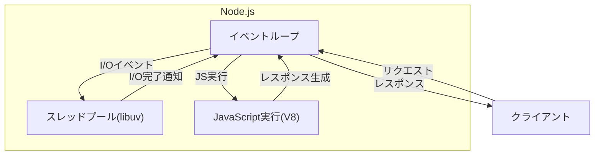

Node.jsのアーキテクチャは、CPUバウンドな処理よりもI/Oバウンドな処理に適している。CPU集約的な処理は、child_processやworker_threadsを利用して分散させることが推奨される。  
イベントループの各フェーズ（timers, pending callbacks, idle, poll, check, close callbacks）は、公式ドキュメントで詳細に解説されている。

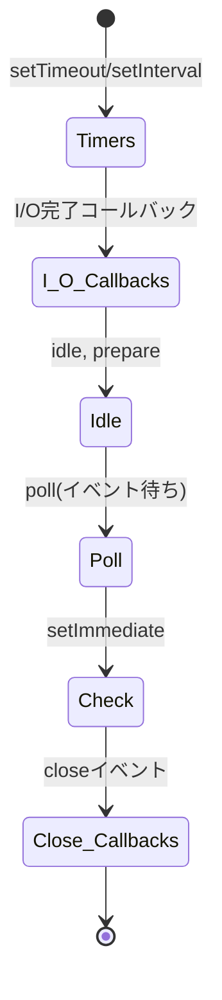

---

## 利用事例

- Webアプリケーションサーバ：ExpressやNestJSなどのフレームワークを利用したSPAやSSRのバックエンド
- APIサーバ：REST APIやGraphQL APIの実装
- チャットアプリ：WebSocketを利用したリアルタイム通信
- IoTデバイス制御：軽量なサーバとしてIoTゲートウェイやデバイス管理に活用
- バッチ処理：node-cronやスクリプトによる定期処理やデータ変換
- サーバレスアーキテクチャ：AWS LambdaやGoogle Cloud Functionsなどでの実行
- ストリーミングサービス：動画や音声のリアルタイム配信

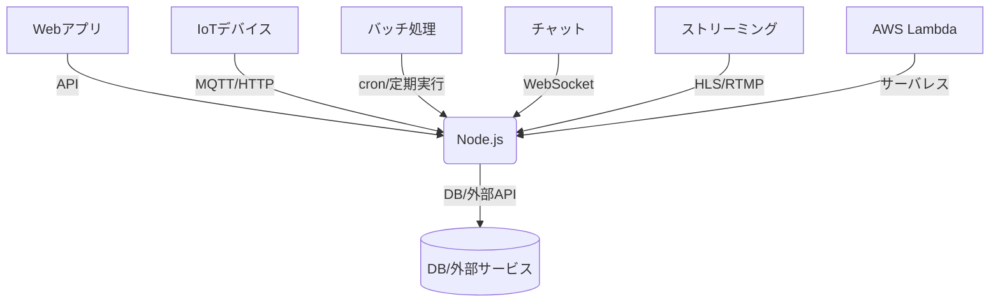

---

## エコシステム

npmを中心としたパッケージエコシステムが発展しており、ExpressやNestJS、Koa、FastifyなどのWebフレームワーク、SequelizeやTypeORMなどのORM、JestやMochaなどのテストフレームワークが利用できる。npmには200万件以上のパッケージが登録されている。  
また、TypeScriptとの親和性も高く、多くのパッケージが型定義を提供している。

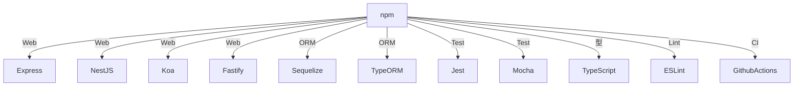

---

## バージョンの違い（LTS/Current）

LTS（Long Term Support）は長期サポート版であり、約30ヶ月間のサポートが提供される。企業や本番環境ではLTSの利用が推奨される。Currentは最新機能を含むが、サポート期間が短く、主に新機能の検証や開発用途で利用される。  
LTSは偶数バージョン（例：18, 20）が割り当てられ、Currentは奇数バージョンとなる。

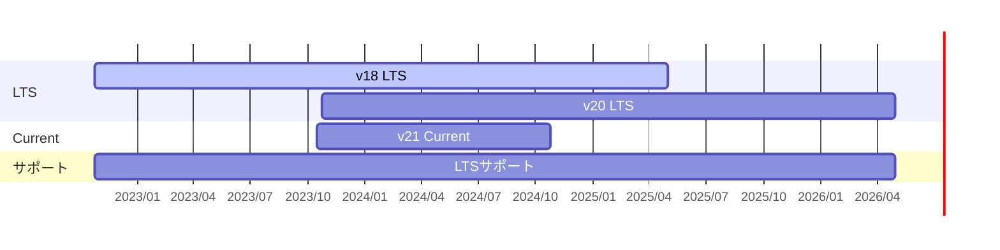

---

## サポートされているプラットフォーム

- Windows（x64, ARM）
- macOS（Intel, Apple Silicon）
- Linux（各種ディストリビューション、x64, ARM）
- 各種クラウドサービス（AWS Lambda, Google Cloud Functions, Azure Functions等）
- Dockerコンテナ環境

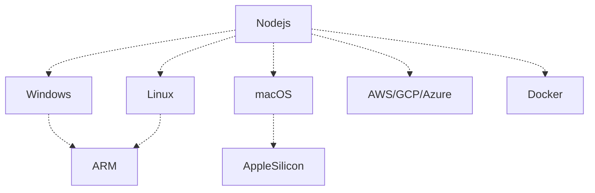

---

## サポートポリシー

Node.jsは公式にLTSとCurrentの2系統をサポートしている。LTSはActive LTS（18ヶ月）とMaintenance LTS（12ヶ月）に分かれ、合計約30ヶ月間サポートされる。Currentは次のLTSリリースまでサポートされる。  
セキュリティフィックスやバグ修正はLTS期間中に提供される。

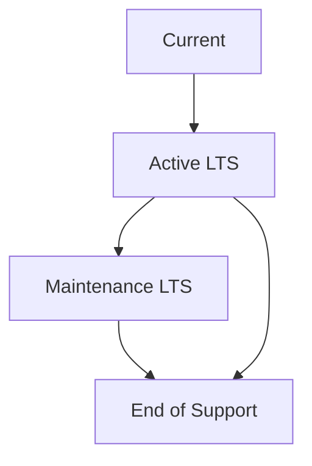

---

## インストール方法

公式サイトからバイナリをダウンロードする方法、パッケージマネージャ（apt, yum, brew等）を利用する方法、nvmやnodenvなどのバージョン管理ツールを利用する方法がある。

```bash
# nvmを使ったインストール例
nvm install 18
nvm use 18

# Homebrew（macOS）の場合
brew install node

# apt（Ubuntu）の場合
sudo apt update
sudo apt install nodejs npm
```

インストール後は`node -v`や`npm -v`でバージョン確認ができる。

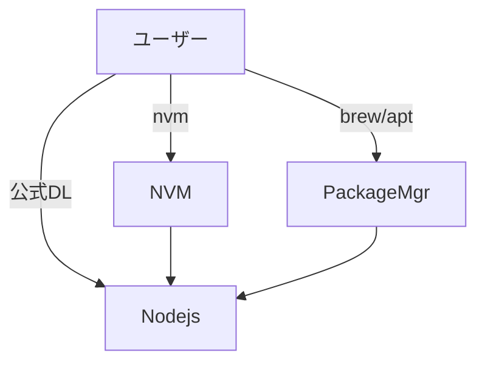

---

## バージョン管理

nvm（Node Version Manager）やnodenvなどのツールを利用することで、複数バージョンのNode.jsを切り替えて利用できる。プロジェクトごとに異なるバージョンを指定する場合に有用である。  
`.nvmrc`ファイルをプロジェクトルートに配置することで、nvmで自動的にバージョンを切り替えられる。

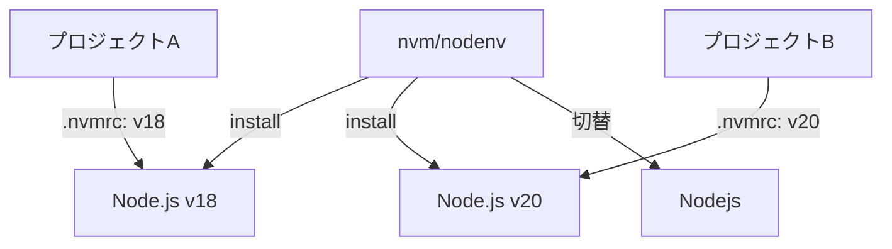

---

## よく使うコマンド

- `node app.js` : JavaScriptファイルの実行
- `npm install` : 依存パッケージのインストール
- `npm run start` : package.jsonで定義されたstartスクリプトの実行
- `npm update` : パッケージのアップデート
- `npm audit` : 依存パッケージの脆弱性チェック
- `npx` : ローカルインストールされたパッケージの一時実行
- `npm init` : 新規プロジェクトの初期化
- `npm ci` : lockファイルに基づくクリーンインストール

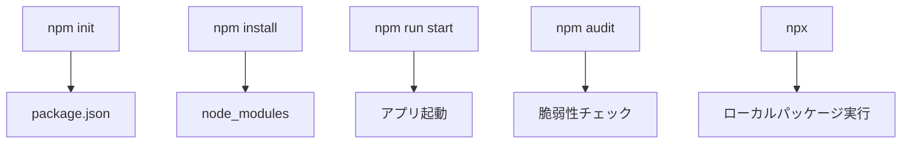

---

## 主要なモジュール

- `fs` : ファイルシステム操作（読み書き、監視等）
- `http` : HTTPサーバ・クライアントの実装
- `path` : ファイルパスの操作
- `os` : OS情報の取得（CPU、メモリ等）
- `crypto` : 暗号化・ハッシュ化処理
- `stream` : ストリーム処理
- `events` : イベントエミッタ
- `child_process` : 外部プロセスの生成・管理
- `cluster` : マルチプロセスによるスケーリング

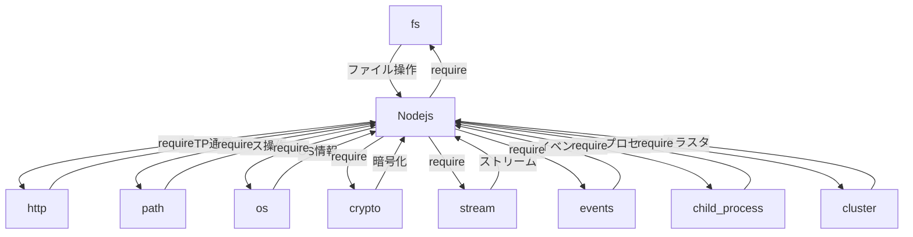

---

## パッケージ管理（npm/yarn）

npmはNode.js標準のパッケージ管理ツールであり、依存パッケージのインストール・管理・公開が可能である。yarnはFacebookが開発した高速な代替ツールであり、ワークスペースやキャッシュ機能が強化されている。  
npm scriptsを活用することで、ビルドやテスト、デプロイなどのタスク自動化も可能である。

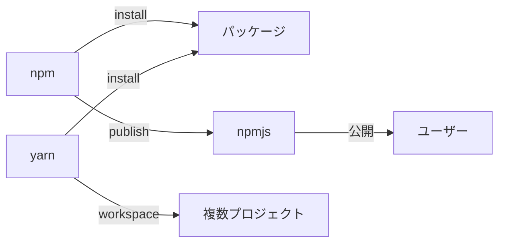

---

## プロジェクト構成例

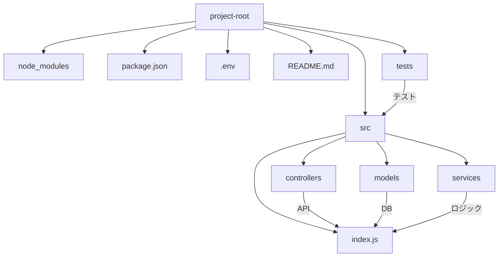

- srcディレクトリにアプリケーション本体を配置し、controllers/models/servicesなどで責務分割する構成が一般的である。
- testsディレクトリにテストコードを配置することで、テストの管理が容易になる。

---

## 設定ファイル

- `package.json` : プロジェクト設定、依存パッケージ、スクリプト等を管理
- `.env` : 環境変数を定義し、dotenv等で読み込む
- `.npmrc` : npmの設定（レジストリ、キャッシュ等）
- `tsconfig.json` : TypeScriptプロジェクトの場合の設定ファイル
- `.eslintrc` : コーディング規約の定義
- `.prettierrc` : フォーマッタ設定

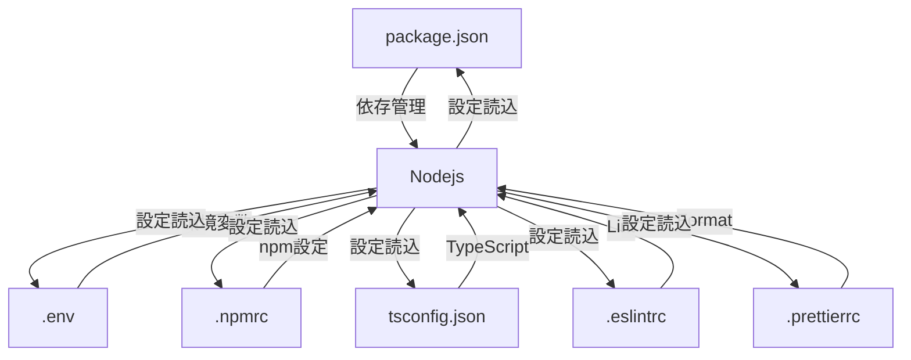

---

## 環境変数の管理

dotenvなどのライブラリを利用し、`.env`ファイルで環境変数を管理する。セキュリティ上、機密情報は環境変数で管理し、ソースコードに直接記載しない。  
CI/CD環境では、環境変数をシークレットとして管理することが推奨される。

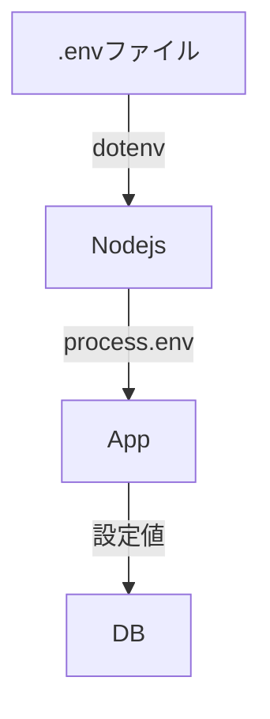

---

## 非同期処理

Node.jsはPromiseやasync/awaitを利用した非同期処理が主流である。コールバック地獄（callback hell）を回避するため、async/awaitの利用が推奨される。  
また、イベントエミッタやストリームも非同期処理の一部として活用される。

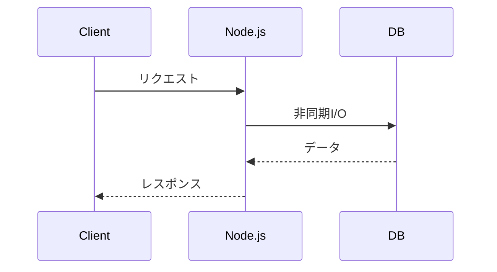

---

## イベントループ

イベントループはNode.jsの中核であり、非同期I/Oを効率的に処理する。イベントループは複数のフェーズ（timers, I/O callbacks, idle, poll, check, close callbacks）で構成されている。  
setTimeoutやsetImmediate、process.nextTickなどの挙動の違いもイベントループの理解に重要である。


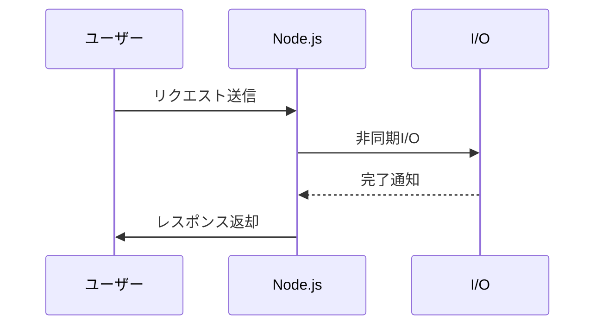

---

## タイマー

`setTimeout`や`setInterval`でタイマー処理が可能である。タイマーはイベントループのtimersフェーズで処理される。  
`setImmediate`や`process.nextTick`もタイミング制御に利用できる。

```mermaid
sequenceDiagram
    participant App
    App->>App: setTimeout/Interval登録
    App->>App: timersフェーズで実行
    App->>App: setImmediate/nextTick
```

---

## エラーハンドリング

try-catchやPromiseのcatchメソッドでエラー処理を行う。非同期処理では、コールバックの第1引数にエラーを渡すNode.js標準のエラーハンドリングパターンがある。  
未処理のPromise例外や未捕捉例外は、`process.on('unhandledRejection')`や`process.on('uncaughtException')`で検知できるが、これらは最終手段とする。

```mermaid
flowchart TD
    Try[try] -->|成功| Next[処理継続]
    Try -->|失敗| Catch[catch]
    Catch --> Log[エラーログ]
    Catch -->|throw| 上位処理
```

---

## ストリーム処理

大量データの逐次処理にストリームAPIを利用する。ファイルの読み書きやネットワーク通信などで効率的なデータ処理が可能である。  
Readable, Writable, Duplex, Transformなどのストリームクラスが用意されている。

```mermaid
flowchart LR
    File[ファイル] --> R[Readable Stream] --> T[Transform Stream] --> W[Writable Stream] --> Out[出力先]
```

---

## ファイル操作

`fs`モジュールでファイルの読み書き、監視、ディレクトリ操作が可能である。非同期APIと同期APIが用意されているが、パフォーマンスの観点から非同期APIの利用が推奨される。  
ファイル監視には`fs.watch`や`chokidar`などのライブラリも利用できる。

```mermaid
sequenceDiagram
    participant App
    participant FS as ファイルシステム
    App->>FS: ファイル読み込み要求(fs.readFile)
    FS-->>App: データ返却
    App->>FS: ファイル書き込み要求(fs.writeFile)
    FS-->>App: 書き込み完了
```

---

## ネットワーク通信

`http`や`https`モジュールでサーバやクライアントを実装できる。TCP/UDP通信には`net`や`dgram`モジュールを利用する。  
プロキシやロードバランサとの連携も容易である。

```mermaid
graph LR
    Client -- HTTP/HTTPS --> Nodejs
    Nodejs -- TCP/UDP --> OtherServer
    Nodejs -- WebSocket --> Client
```

---

## データベース連携

MySQL、PostgreSQL、MongoDB、Redisなど各種データベースと連携可能である。ORM/ODM（Sequelize, TypeORM, Mongoose等）を利用することで、効率的なデータ操作が可能となる。  
コネクションプールやトランザクション管理も重要なポイントである。

```mermaid
flowchart LR
    App -- ORM/ODM --> DB[(データベース)]
    DB -- レプリケーション/フェイルオーバー --> DB
```

---

## ロギング

winstonやpinoなどのライブラリでログ管理を行う。ログレベルや出力先（ファイル、コンソール、外部サービス）を柔軟に設定できる。  
構造化ログやJSONログを活用することで、ログ解析やモニタリングが容易になる。

```mermaid
flowchart LR
    App -- ログ出力 --> winston
    winston -- ファイル出力 --> File
    winston -- コンソール出力 --> Console
    winston -- 外部サービス --> CloudLog
```

---

## ミドルウェア

Expressなどのフレームワークでは、リクエスト処理の中間層としてミドルウェアを利用する。認証、バリデーション、ロギング、エラーハンドリングなどを分離して実装できる。  
独自ミドルウェアの実装も容易であり、再利用性が高い。

```mermaid
flowchart LR
    Client --> MW1[認証ミドルウェア] --> MW2[バリデーション] --> MW3[ロギング] --> MW4[エラーハンドリング] --> App
```

---

## API開発

REST APIやGraphQL APIの開発が容易である。OpenAPI（Swagger）によるAPI仕様管理や、自動ドキュメント生成も可能である。  
APIバージョニングや認証・認可、レートリミットなどの実装も重要である。

```mermaid
flowchart TD
    Client -->|REST/GraphQL| API[Node.js APIサーバ]
    API -->|OpenAPI| Doc[ドキュメント]
    API -->|認証| Auth[認証サービス]
    API -->|DBアクセス| DB
```

---

## WebSocket

リアルタイム通信にはwsやsocket.ioなどのライブラリを利用する。チャットや通知、ゲーム等の用途で活用される。  
WebSocketは双方向通信を実現し、HTTPとは異なるプロトコルで動作する。

```mermaid
sequenceDiagram
    participant Client
    participant Server
    Client->>Server: WebSocket接続
    Server-->>Client: メッセージ送信
    Client-->>Server: メッセージ送信
    Server-->>Client: ブロードキャスト
```

---

## バッチ処理

cronやnode-cronなどで定期的なバッチ処理を実装できる。大量データの一括処理や定期レポート生成などに利用される。  
バッチ処理の監視やエラーハンドリングも重要である。

```mermaid
gantt
    dateFormat  HH:mm
    section バッチ処理
    データ集計 :done, 00:00, 00:30
    レポート生成 :active, 00:30, 01:00
    メール送信 : 01:00, 01:10
    section 監視
    エラー検知 : 01:10, 01:20
```

---

## 開発のベストプラクティス

- コードの分割とモジュール化により、保守性・再利用性を高める。
- 適切なエラーハンドリングとロギングを実装し、障害発生時の原因特定を容易にする。
- テストコードを充実させ、品質を担保する。
- セキュリティ対策（入力値検証、依存パッケージの脆弱性チェック等）を徹底する。
- CI/CDや自動化ツールの活用による開発効率向上。
- ドキュメント整備とコードコメントの充実。

```mermaid
flowchart TD
    設計 --> 実装 --> テスト --> デプロイ --> 運用
    テスト -->|自動化| CI
    デプロイ -->|自動化| CD
    運用 -->|監視| モニタリング
    モニタリング -->|障害通知| 開発者
```

---

## コーディング規約

ESLintやPrettierを利用し、コード品質を維持する。プロジェクトごとにルールを定義し、CIで自動チェックを行うことが推奨される。  
AirbnbやGoogleなどのスタイルガイドをベースにカスタマイズする例も多い。

---

## テスト

JestやMocha、Chai、Supertestなどのテストフレームワークを利用し、ユニットテスト・結合テスト・E2Eテストを実施する。CIと連携して自動テストを行うことで品質を担保する。  
カバレッジ計測やモック・スタブの活用も重要である。

```mermaid
flowchart LR
    UnitTest[ユニットテスト] --> CI
    IntegrationTest[結合テスト] --> CI
    E2ETest[E2Eテスト] --> CI
    CI -->|合格| Deploy[デプロイ]
    CI -->|失敗| Dev[開発者へ通知]
```

---

## デバッグ

VSCodeなどのIDEでデバッグが可能である。`node --inspect`オプションを利用することで、ブレークポイントやステップ実行ができる。  
Chrome DevToolsとの連携も可能であり、プロファイリングやメモリリーク解析も行える。

```mermaid
flowchart TD
    Dev[開発者] --> IDE
    IDE -->|デバッグ接続| Nodejs
    Nodejs -->|ブレークポイント| IDE
    Nodejs -->|プロファイリング| IDE
```

---

## トラブルシューティング

公式ドキュメントやエラーメッセージ、スタックトレースを参照し、問題解決を行う。`console.log`やデバッガ、ロギングツールを活用する。  
パフォーマンス問題やメモリリークの調査には、`node --inspect`や`clinic.js`などのツールが有効である。

```mermaid
flowchart TD
    App -->|エラー発生| Log[ログ出力]
    Log -->|分析| Dev[開発者]
    Dev -->|修正| App
```

---

## セキュリティ

- 依存パッケージの脆弱性チェック（`npm audit`、`yarn audit`）
- 入力値のバリデーションとサニタイズ
- セキュアな通信（HTTPS、TLS）
- 認証・認可の実装（JWT、OAuth等）
- 環境変数やシークレットの安全な管理
- XSS、CSRF、SQLインジェクション等の対策

```mermaid
flowchart TD
    入力値 -->|バリデーション| サーバ
    サーバ -->|認証| ユーザー
    サーバ -->|暗号化| データ
    サーバ -->|脆弱性チェック| npm_audit[npm audit]
    サーバ -->|CSRF/XSS対策| WebApp
```

---

## パフォーマンス最適化

- キャッシュの活用（メモリキャッシュ、Redis等）
- クラスタリングによる負荷分散（`cluster`モジュール）
- コードのプロファイリングとボトルネックの特定
- 非同期処理の最適化とバックプレッシャー制御
- レスポンス圧縮や静的ファイル配信の最適化

```mermaid
flowchart LR
    Client --> CDN
    CDN --> Nodejs
    Nodejs --> Redis
    Nodejs --> DB
    Nodejs -->|クラスタ| Nodejs2[Node.jsプロセス]
```

---

## スケーラビリティ

Node.jsはクラスタリングやマイクロサービス構成でスケールアウトが可能である。DockerやKubernetesと組み合わせることで、柔軟なスケーリングが実現できる。  
ロードバランサやサービスディスカバリとの連携も重要である。

```mermaid
graph LR
    LB[ロードバランサ] --> N1[Node.jsインスタンス1]
    LB --> N2[Node.jsインスタンス2]
    LB --> N3[Node.jsインスタンス3]
    N1 -->|サービス発見| Consul
    N2 -->|サービス発見| Consul
    N3 -->|サービス発見| Consul
```

---

## モニタリング

PrometheusやNewRelic、Datadogなどのツールでアプリケーションの監視を行う。メトリクス収集やアラート設定により、障害の早期検知が可能となる。  
APM（Application Performance Monitoring）ツールの導入も推奨される。

```mermaid
flowchart LR
    Nodejs -->|メトリクス| Prometheus
    Nodejs -->|APM| NewRelic
    Nodejs -->|APM| Datadog
    Prometheus -->|アラート| Dev[開発者]
    NewRelic -->|ダッシュボード| Dev
    Datadog -->|通知| Dev
```

---

## デプロイ

Dockerやクラウドサービス（AWS Elastic Beanstalk, GCP App Engine, Azure App Service等）を利用したデプロイが一般的である。CI/CDパイプラインと連携することで、継続的デリバリーが実現できる。  
Blue-Greenデプロイやカナリアリリースなどの手法も活用される。

```mermaid
flowchart LR
    GitHub --> CI
    CI --> Docker
    Docker --> Cloud
    Cloud --> User
    CI -->|Blue-Green| ProdA
    CI -->|Canary| ProdB
```

---

## CI/CD

GitHub ActionsやJenkins、CircleCI、GitLab CIなどで自動化されたビルド・テスト・デプロイを実現する。プルリクエスト時の自動テストや本番環境への自動デプロイが可能である。  
CI/CDパイプラインの構築により、品質とリリース速度の両立が図れる。

```mermaid
flowchart TD
    Commit -->|CI| Build
    Build -->|Test| Deploy
    Deploy -->|CD| Production
    Build -->|静的解析| Lint
    Build -->|ユニットテスト| UnitTest
    Build -->|結合テスト| IntegrationTest
```

---

## ドキュメント生成

jsdocやtypedocなどのツールでAPIドキュメントを自動生成できる。OpenAPI（Swagger）と連携することで、API仕様書の自動生成も可能である。  
READMEや設計ドキュメントの整備も重要である。

```mermaid
flowchart LR
    SourceCode --> jsdoc
    jsdoc --> Doc[APIドキュメント]
    SourceCode --> Swagger
    Swagger --> Spec[OpenAPI仕様書]
    Doc -->|公開| Dev[開発者]
    Spec -->|API設計| Dev
```

---

## コミュニティとサポート

Node.jsは活発なコミュニティが存在し、公式フォーラム、Stack Overflow、GitHub Issuesなどでサポートが受けられる。日本語コミュニティも存在し、勉強会やカンファレンスが開催されている。  
OSS活動やコントリビューションも盛んである。

```mermaid
flowchart LR
    User --> Forum
    User --> StackOverflow
    User --> GitHub
    User --> JPCommunity[日本コミュニティ]
    JPCommunity -->|勉強会| Event
    JPCommunity -->|カンファレンス| Conf
```

---

## 事例紹介

- Netflix：高トラフィックな動画配信サービスのサーバサイドにNode.jsを採用し、パフォーマンスと開発効率を両立
- PayPal：従来のJavaからNode.jsへ移行し、開発効率とパフォーマンスを向上
- LinkedIn：モバイルバックエンドをNode.jsで構築し、サーバ台数を削減
- Uber：リアルタイム配車システムの一部にNode.jsを利用し、低遅延なサービスを実現
- NASA：宇宙関連データのAPIサーバとしてNode.jsを活用

```mermaid
graph TD
    Netflix -->|動画配信| Nodejs
    PayPal -->|決済API| Nodejs
    LinkedIn -->|モバイルAPI| Nodejs
    Uber -->|リアルタイム| Nodejs
    NASA -->|データAPI| Nodejs
    Nodejs -->|OSS/事例共有| Community
```

---

## 参考リンク

- [Node.js公式サイト](https://nodejs.org/ja/)
- [npm公式サイト](https://www.npmjs.com/)
- [Node.jsドキュメント](https://nodejs.org/ja/docs/)
- [Node.js日本ユーザグループ](https://nodejs.jp/)
- [Node.js公式GitHub](https://github.com/nodejs/node)
---