# npm

---

## 概要

npm（Node Package Manager）は、Node.jsのパッケージ管理ツールである。JavaScriptのライブラリやツールを簡単にインストール・管理できる。

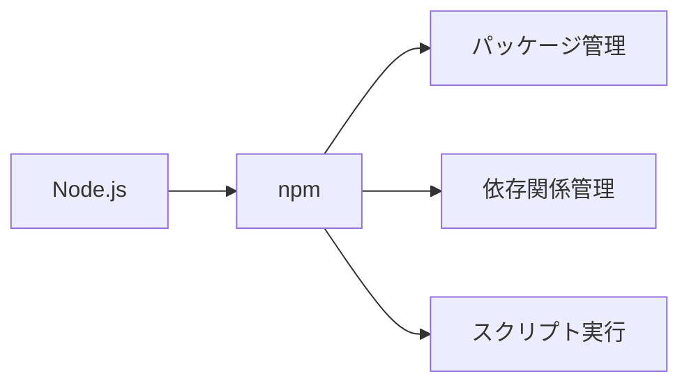

---

## npmとは

### npmの特徴
- オープンソースパッケージが豊富である
- コミュニティによる活発な開発が行われている
- クロスプラットフォームに対応している

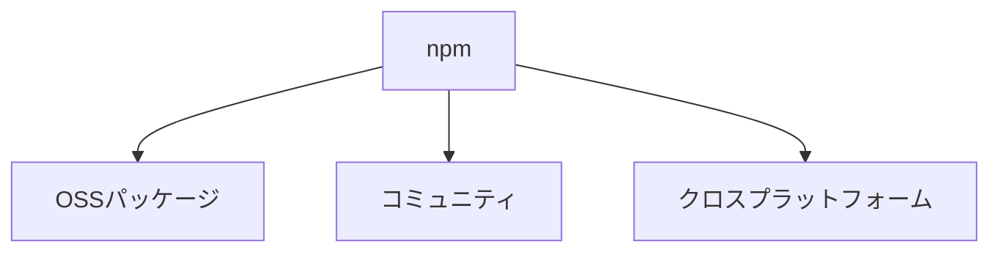

### npmの仕組み

#### レジストリ

npmはパッケージを「レジストリ」と呼ばれるサーバーで管理している。

##### npm公式レジストリ
https://registry.npmjs.org/

##### プライベートレジストリ
企業や組織内で独自に構築可能である。

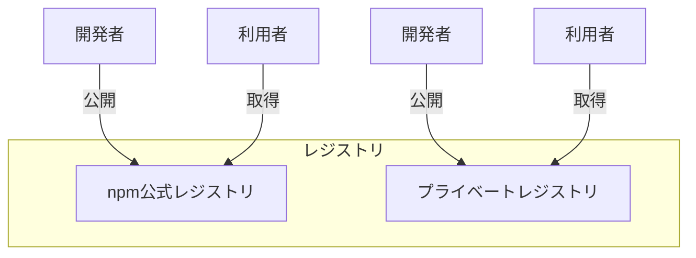

#### CLI（コマンドラインインターフェース）

npmはCLIツールとして提供され、コマンドで操作する。

##### コマンドの構成
例: `npm install express`

##### 設定ファイル（.npmrc）
ユーザーやプロジェクトごとに設定可能である。

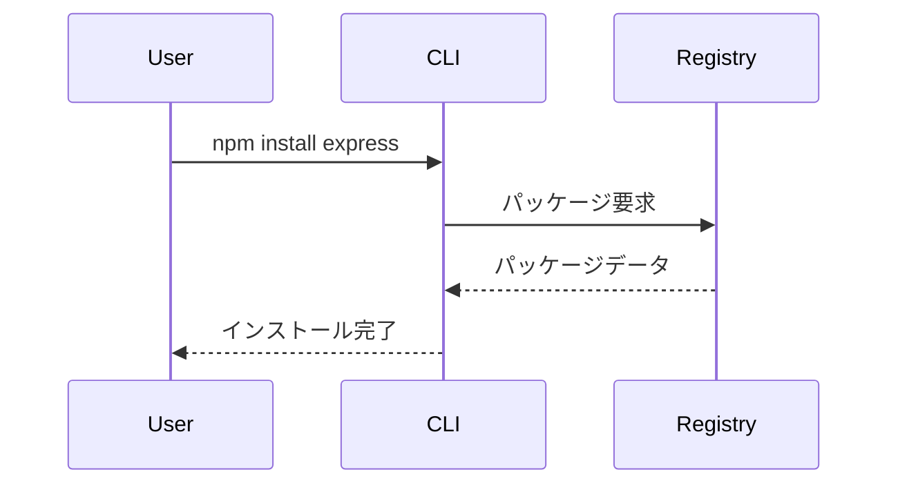

#### パッケージの公開と取得

##### パッケージの公開手順
`npm publish` コマンドで公開する。

##### バージョン管理と公開
セマンティックバージョニングに従い管理する。

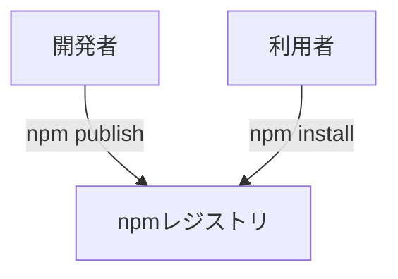

---

## インストール方法

### Node.jsのインストール手順

#### Windowsでのインストール
- 公式サイトからインストーラーをダウンロードする
- インストール時の注意点: パスを通す必要がある

#### macOSでのインストール
- Homebrew: `brew install node` でインストールできる
- インストーラー: 公式サイトからダウンロードする

#### Linuxでのインストール
- apt: `sudo apt install nodejs npm` でインストールできる
- nvm: バージョン管理が容易である

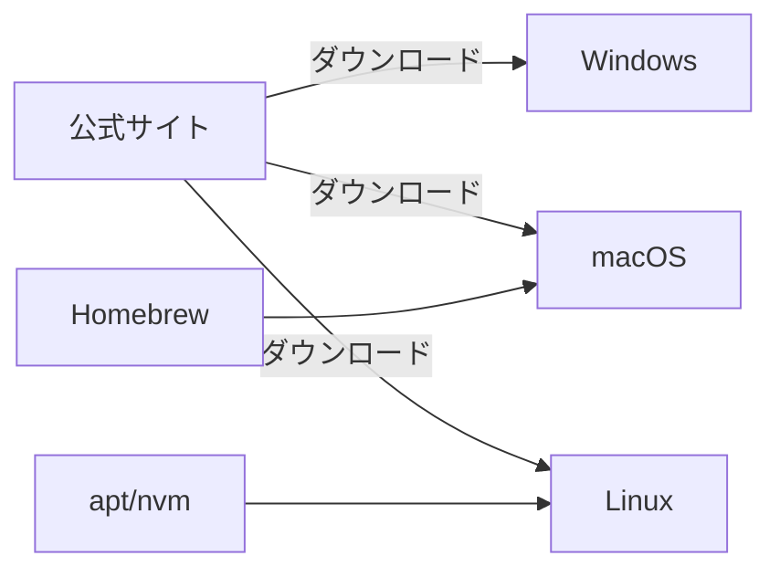

### npmのインストール確認

```sh
npm -v
```
出力例: `9.6.7`

### npmのバージョン確認コマンド

```sh
npm -v
```
バージョン確認はトラブルシュート時に重要である。

### npmのアップデート方法

#### npm自体のアップデート

```sh
npm install -g npm
```

#### Node.jsとnpmの同時アップデート

nvmを利用すると便利である。

```sh
nvm install node
```

### Windowsでの注意点

#### パスの設定
環境変数PATHにNode.jsとnpmのパスが含まれているか確認する。

#### 権限の問題
管理者権限でコマンドプロンプトを実行する。

### macOS/Linuxでの注意点

#### sudoの利用
グローバルインストール時は`sudo`が必要な場合がある。

#### 権限エラーの回避
npmのグローバルディレクトリをユーザー権限に変更することで回避可能である。

---

## 基本コマンド

### パッケージのインストール

#### ローカルインストール

```sh
npm install <package>
```

##### --saveオプション
（npm5以降はデフォルトである）

##### --save-devオプション

```sh
npm install --save-dev <package>
```

##### --save-optionalオプション

```sh
npm install --save-optional <package>
```

#### グローバルインストール

```sh
npm install -g <package>
```

##### グローバルパスの確認

```sh
npm root -g
```

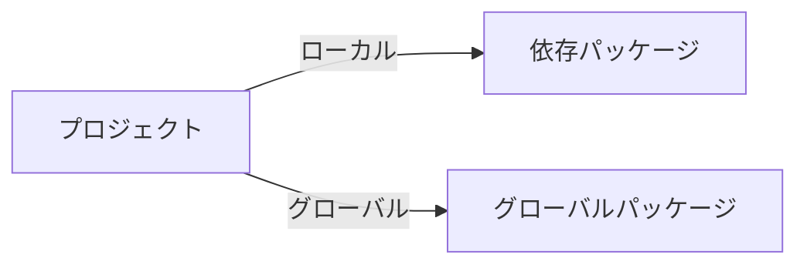

### パッケージのアンインストール

#### ローカルパッケージの削除

```sh
npm uninstall <package>
```

#### グローバルパッケージの削除

```sh
npm uninstall -g <package>
```

### パッケージのアップデート

#### 個別アップデート

```sh
npm update <package>
```

#### すべてのパッケージのアップデート

```sh
npm update
```

### インストール済みパッケージの一覧表示

#### ローカル一覧

```sh
npm list
```

#### グローバル一覧

```sh
npm list -g --depth=0
```

### パッケージの検索

#### npm searchコマンド

```sh
npm search <keyword>
```

#### npm公式サイトでの検索
https://www.npmjs.com/

### プロジェクトの初期化

#### package.jsonの作成

```sh
npm init
```

##### npm init -y
対話なしでデフォルト値で作成できる。

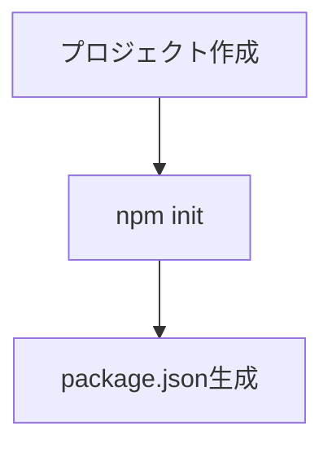

---

## パッケージ管理

### package.jsonの役割

プロジェクトの依存関係やスクリプト、メタ情報を管理する。

#### 基本構成

```json
{
  "name": "sample",
  "version": "1.0.0",
  "description": "サンプルプロジェクト"
}
```

#### scriptsセクション

```json
"scripts": {
  "start": "node index.js",
  "test": "echo \"No test specified\" && exit 0"
}
```

#### enginesセクション

```json
"engines": {
  "node": ">=16.0.0"
}
```

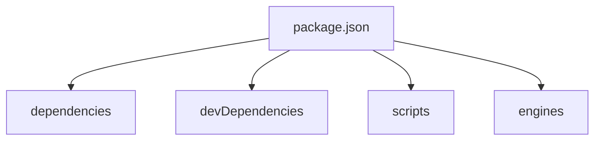

### package-lock.jsonの役割

依存関係のバージョンを固定し、再現性を担保する。

#### lockfileVersion
npmのバージョンによって異なる。

#### チーム開発での重要性
同じ環境を再現できる。

### 依存関係の種類

#### dependencies
本番環境で必要なパッケージである。

#### devDependencies
開発時のみ必要なパッケージである。

#### peerDependencies
プラグインやライブラリで利用する。

#### optionalDependencies
インストール失敗時も処理継続可能である。

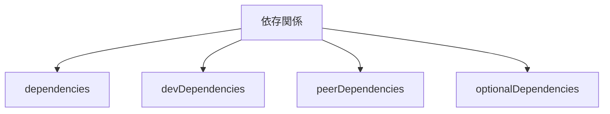

### 依存関係の追加・削除

#### npm install

```sh
npm install <package>@<version>
```

#### npm uninstall

```sh
npm uninstall <package1> <package2>
```

### スクリプトの利用方法

#### npm run

```sh
npm run <script>
```

#### カスタムスクリプトの作成

複数コマンドの連結例:

```json
"scripts": {
  "build": "npm run clean && tsc"
}
```

### バージョン指定の方法

#### セマンティックバージョニング

- メジャー.マイナー.パッチ（例: 1.2.3）である

#### 範囲指定（^, ~, > など）

- `^1.2.3`: 1.x.x
- `~1.2.3`: 1.2.x

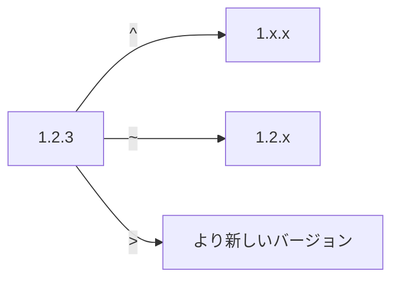

---

## よくあるトラブルと対処法

### パーミッションエラーの対処法

#### グローバルインストール時のエラー

エラー例: `EACCES: permission denied`

##### エラー例と解決策

- sudoを使う
- グローバルディレクトリを変更する

#### フォルダ権限の修正

```sh
sudo chown -R $USER:$GROUP ~/.npm
```

### キャッシュの問題とクリア方法

#### npm cache cleanコマンド

```sh
npm cache clean --force
```

#### キャッシュディレクトリの場所

```sh
npm config get cache
```

### 依存関係の競合解決

#### npm audit

```sh
npm audit
npm audit fix
```

#### npm dedupe

```sh
npm dedupe
```

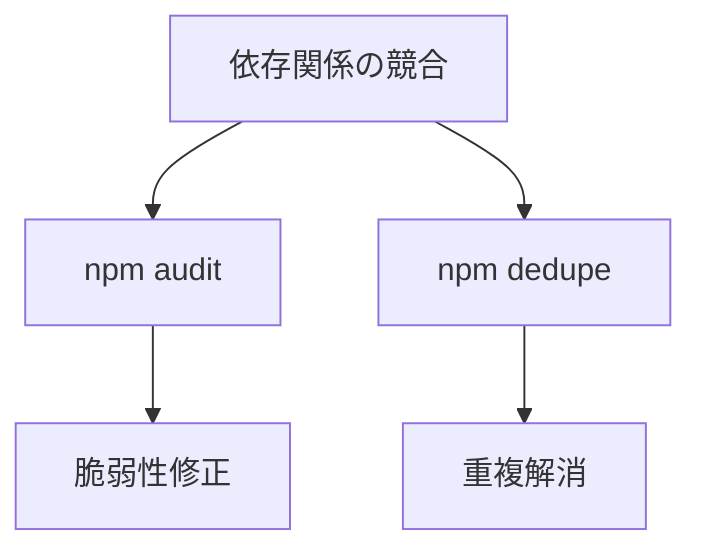

### node_modulesやpackage-lock.jsonの削除

#### クリーンアップ手順

```sh
rm -rf node_modules
rm package-lock.json
```

#### 再インストール手順

```sh
npm install
```

### プロキシ環境での利用

#### プロキシ設定方法

```sh
npm config set proxy http://proxy.example.com:8080
```

#### 設定ファイルの編集

.npmrcファイルに記載例:

```
proxy=http://proxy.example.com:8080
https-proxy=http://proxy.example.com:8080
```

---

## 参考リンク

- [npm公式ドキュメント](https://docs.npmjs.com/)
- [Node.js公式サイト](https://nodejs.org/ja/)
- [npmパッケージ検索](https://www.npmjs.com/)

---