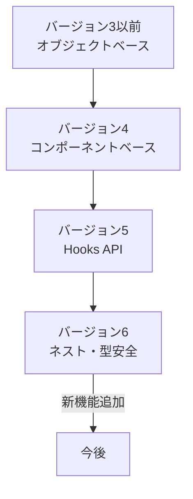
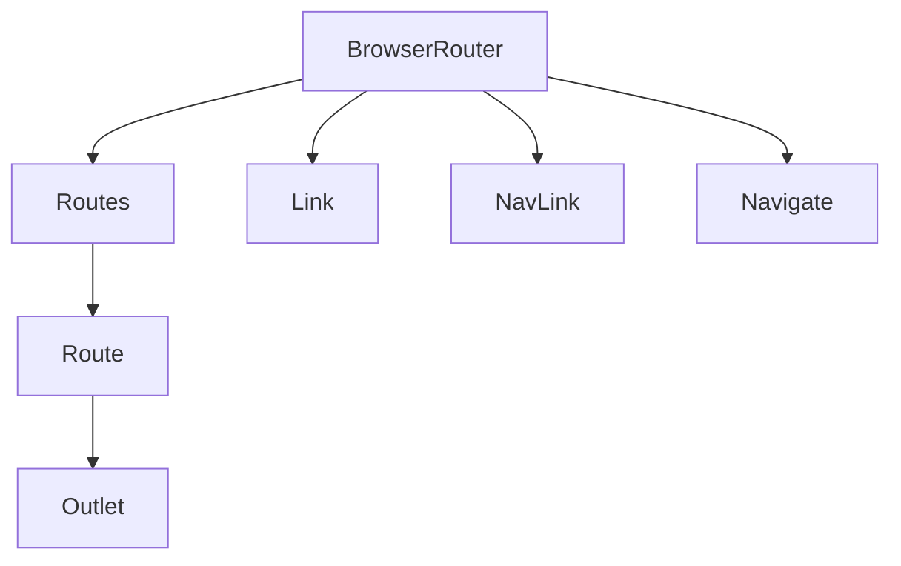
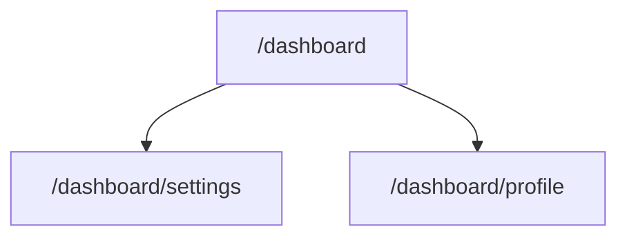
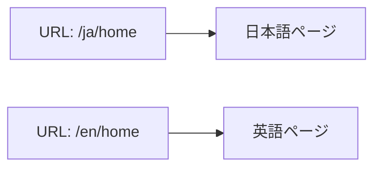

# react-router-dom

---

## 概要

react-router-domは、Reactアプリケーションにおけるルーティング機能を提供する代表的なライブラリである。SPA（Single Page Application）において、URLのパスやクエリに応じて表示するコンポーネントを切り替える役割を担う。これにより、ページ遷移時にもページ全体の再読み込みを行わず、ユーザー体験を向上させることができる。  
また、ルーティングの状態管理や履歴管理、パラメータの受け渡し、認証・認可、SSR（サーバーサイドレンダリング）対応など、Webアプリケーション開発に必要な多くの機能を備えている。

---

## 歴史

react-routerは2014年にReactのエコシステムの一部として登場した。当初はシンプルなルーティング機能のみを提供していたが、Reactの普及とともに複雑なルーティング要件に対応するため進化してきた。  
バージョン4以降は宣言的なルーティングが導入され、ルート定義がコンポーネントベースとなった。バージョン5ではHooks APIが追加され、より柔軟な設計が可能となった。バージョン6ではルートのネストやデータフェッチ、型安全性の向上など、より大規模なアプリケーションにも対応できる設計となっている。

---

## バージョンごとの違い

- バージョン3以前: ルート定義はオブジェクトベースであり、ルートの順序やマッチングに注意が必要であった。  
- バージョン4以降: ルート定義がコンポーネントベースとなり、柔軟なネストや動的ルーティングが容易になった。  
- バージョン5: Hooks APIの導入により、関数コンポーネントでルーティング情報を簡単に扱えるようになった。  
- バージョン6: `Routes`/`Route`の新構文、ネストルート、データローディングAPI、型安全なパラメータ取得などが追加された。ルートの順序依存がなくなり、より直感的な設計が可能となった。



---

## インストール方法

npmまたはyarnでインストール可能である。バージョン指定が必要な場合は`@6`などを付与する。  
TypeScriptを利用する場合は型定義も自動でインストールされる。

```sh
npm install react-router-dom
# または
yarn add react-router-dom
```

依存関係として`react`および`react-dom`が必要であるため、事前にインストールしておくこと。

---

## 主なコンポーネント

- `BrowserRouter`: HTML5のhistory APIを利用したルーター。アプリ全体をラップする。  
- `Routes`/`Route`: ルート定義。`Route`は`path`と`element`を指定する。  
- `Link`: ページ遷移用リンク。`<a>`タグの代替として利用する。  
- `NavLink`: 現在のパスと一致した場合にスタイルを変更できるリンク。  
- `Navigate`: プログラム的なリダイレクトを行う。  
- `Outlet`: ネストされたルートの描画位置を指定する。  
- `MemoryRouter`, `HashRouter`, `StaticRouter`: 特殊な用途向けのルーター。



---

## ルーティングの基本

ルーティングは`BrowserRouter`でアプリ全体をラップし、`Routes`と`Route`でパスごとに表示するコンポーネントを割り当てる。`element`にはReact要素を指定する。  
`Route`の`path`は絶対パスまたは相対パスで指定できる。`element`にはJSX要素を直接渡す。

```jsx
import { BrowserRouter, Routes, Route } from "react-router-dom";
import Home from "./Home";
import About from "./About";

function App() {
  return (
    <BrowserRouter>
      <Routes>
        <Route path="/" element={<Home />} />
        <Route path="/about" element={<About />} />
      </Routes>
    </BrowserRouter>
  );
}
```

---

## 動的ルーティング

パスにコロン（:）を付けてパラメータを含めることで、動的なルーティングが可能である。  
例えばユーザーIDや記事IDなどをURLに含めて表示内容を切り替える。

```jsx
<Route path="/users/:id" element={<User />} />
```

`/users/123`のようなURLでアクセスすると、`id`パラメータに`123`が渡される。  
複数パラメータも指定可能である。

```jsx
<Route path="/posts/:postId/comments/:commentId" element={<Comment />} />
```

---

## ネストされたルート

ルートの中にさらにルートを定義できる。親ルートのコンポーネント内で`<Outlet />`を配置することで、子ルートの内容が描画される。  
ネストルートは管理しやすく、共通レイアウトやガード処理を親ルートでまとめて実装できる。

```jsx
<Route path="/dashboard" element={<DashboardLayout />}>
  <Route path="settings" element={<Settings />} />
  <Route path="profile" element={<Profile />} />
</Route>
```



---

## URL パラメータの利用

`useParams`フックでパラメータを取得できる。取得した値は文字列型で返されるため、必要に応じて型変換を行う。  
パラメータが存在しない場合は`undefined`となるので、デフォルト値やバリデーションを行うこと。

```jsx
import { useParams } from "react-router-dom";
function User() {
  const { id } = useParams();
  // idを利用してAPIリクエストなどを行う
  if (!id) return <div>ユーザーIDが指定されていません</div>;
  return <div>ユーザーID: {id}</div>;
}
```

---

## クエリパラメータの扱い

`useSearchParams`フックでクエリパラメータを取得・設定できる。URLの`?key=value`部分を操作する。  
クエリパラメータはURLの状態管理やフィルタリング、ページングなどに利用される。

```jsx
import { useSearchParams } from "react-router-dom";
function Search() {
  const [searchParams, setSearchParams] = useSearchParams();
  const q = searchParams.get("q");
  // setSearchParams({ q: "new" }) でクエリを変更できる
  return (
    <div>
      <input
        value={q || ""}
        onChange={e => setSearchParams({ q: e.target.value })}
      />
      <div>検索ワード: {q}</div>
    </div>
  );
}
```

---

## ナビゲーションの実装

`Link`コンポーネントで画面遷移用のリンクを作成できる。  
`useNavigate`フックを使うと、ボタン押下時などにプログラム的に遷移できる。  
`replace`オプションを指定すると履歴を上書きできる。

```jsx
import { Link, useNavigate } from "react-router-dom";
function Example() {
  const navigate = useNavigate();
  return (
    <>
      <Link to="/about">About</Link>
      <button onClick={() => navigate("/home", { replace: true })}>Go Home</button>
    </>
  );
}
```

---

## 外部リンクとの連携

外部サイトへのリンクは通常の`<a href="...">`タグを使用する。  
内部リンクは`Link`や`NavLink`を利用することで、ページ全体のリロードを防げる。  
外部リンクには`target="_blank"`や`rel="noopener noreferrer"`を付与することが推奨される。

---

## よく使うフック

- `useNavigate`: プログラム的にルート遷移を行う。履歴の追加や置換も可能。
- `useLocation`: 現在のロケーション（パス、クエリ、状態など）を取得する。画面遷移時の状態管理にも利用できる。
- `useParams`: パスパラメータを取得する。動的ルーティングで必須。
- `useSearchParams`: クエリパラメータを取得・設定する。フィルタやページングに便利。

---

## カスタムフックの作成

ルーティングに関する共通処理（例：認証チェックや履歴管理）をカスタムフックとして切り出すことで、複数コンポーネントで再利用できる。  
例えば、認証ガードやページタイトルの動的変更などが挙げられる。

```jsx
import { useNavigate } from "react-router-dom";
import { useEffect } from "react";
function useAuthGuard(isAuthenticated) {
  const navigate = useNavigate();
  useEffect(() => {
    if (!isAuthenticated) {
      navigate("/login");
    }
  }, [isAuthenticated]);
}
```

---

## ルートごとのレイアウト

親ルートで共通レイアウト（ヘッダー、サイドバー等）を定義し、`Outlet`で子ルートを描画することで、ルートごとに異なるレイアウトを実現できる。  
これにより、ページごとに共通部分と個別部分を明確に分離できる。

```jsx
function DashboardLayout() {
  return (
    <div>
      <Header />
      <Sidebar />
      <main>
        <Outlet />
      </main>
    </div>
  );
}
```

---

## レイジーローディング

`React.lazy`と`Suspense`を利用し、ルートごとにコンポーネントを遅延読み込みすることで初期表示速度を向上させる。  
大規模アプリケーションでは必須の最適化手法である。

```jsx
import { lazy, Suspense } from "react";
const About = lazy(() => import("./About"));

<Suspense fallback={<div>Loading...</div>}>
  <Routes>
    <Route path="/about" element={<About />} />
  </Routes>
</Suspense>
```

---

## ルートガードの実装

認証や権限チェックなど、特定の条件を満たさない場合にリダイレクトするガード用コンポーネントを作成し、`element`に指定する。  
ガードは親ルートでまとめて実装することで、子ルート全体に適用できる。

```jsx
function RequireAuth({ children }) {
  const isAuthenticated = useAuth();
  if (!isAuthenticated) {
    return <Navigate to="/login" />;
  }
  return children;
}
<Route path="/private" element={<RequireAuth><PrivatePage /></RequireAuth>} />
```

---

## 認証とルーティング

認証状態に応じて表示するルートを切り替えることで、保護されたページへのアクセスを制御できる。  
トークンの有無やユーザー情報をグローバルステート（例：Redux, Context API）で管理することが多い。  
ログイン後のリダイレクトや、未認証時のアクセス制限もルーティングで実装可能である。

---

## ブラウザ履歴の操作

`useNavigate`で`-1`や`1`を指定することで、履歴の前後に遷移できる。  
`useLocation`で現在のパスやクエリ情報を取得できる。  
履歴の状態を活用することで、戻る・進むボタンやページ遷移時のアニメーション制御も実現できる。

```jsx
const navigate = useNavigate();
<button onClick={() => navigate(-1)}>戻る</button>
```

---

## サーバーサイドレンダリング対応

react-router-dom v6以降はSSRに対応している。サーバー側では`StaticRouter`を利用し、クライアント側では`BrowserRouter`を利用する。  
SSR時はリクエストURLを`location`として渡す必要がある。

```jsx
import { StaticRouter } from "react-router-dom/server";
<StaticRouter location={req.url}>
  <App />
</StaticRouter>
```

---

## パフォーマンス最適化

- レイジーローディングによる初期ロードの軽量化
- ルートごとのコード分割（Webpack, Viteのdynamic import）
- メモ化（React.memo, useMemo）による再レンダリング抑制
- 必要なデータのみをフェッチする設計
- ルートごとにキャッシュやプリフェッチを活用する

---

## モバイル対応

モバイル端末での操作性を考慮し、タッチイベントやレスポンシブデザインを組み合わせてルーティング設計を行う。  
Drawerナビゲーションやボトムナビゲーションとの連携も重要である。  
PWA対応やWebViewでの動作も考慮する。

---

## SEO対策

SSRを活用し、検索エンジンがページ内容を正しく認識できるようにする。  
`react-helmet`等でメタタグを動的に設定し、OGPやタイトルの最適化も行う。  
クローラがアクセスできるように、ルーティング設計やURL設計にも注意する。

---

## アクセシビリティ対応

`Link`や`NavLink`の利用に加え、ARIA属性やキーボード操作への配慮を行うことで、アクセシビリティを高める。  
フォーカス管理やスクリーンリーダー対応も重要である。  
ナビゲーションの順序やラベル付けにも注意する。

---

## 国際化対応

ルートに言語コードを含めることで、多言語対応が可能である。  
言語ごとにルートを分岐させ、i18nライブラリ（react-i18next等）と組み合わせて運用する。  
URL設計例：



---

## テスト戦略

JestやReact Testing Libraryを用いて、ルーティングの動作や画面遷移をテストする。  
`MemoryRouter`を利用することで、テスト環境でもルーティングを再現できる。  
ルートごとのレンダリングや、パラメータ・クエリの受け渡しもテスト可能である。

```jsx
import { render } from "@testing-library/react";
import { MemoryRouter } from "react-router-dom";
render(
  <MemoryRouter initialEntries={["/about"]}>
    <App />
  </MemoryRouter>
);
```

---

## デバッグ方法

`useLocation`や`useParams`で現在の状態をログ出力し、ルーティングの問題を特定する。  
React DevToolsやRedux DevToolsと組み合わせて状態管理も確認する。  
ルートのマッチングやパラメータの受け渡し、履歴の状態などを逐次確認することが重要である。

---

## マイグレーションガイド

バージョンアップ時は公式ドキュメントのマイグレーションガイドを参照し、APIの変更点や非推奨となった機能に注意する。  
特にv5→v6ではルート定義やフックの使い方が大きく変わっているため、既存コードの全面的な見直しが必要となる場合がある。  
移行時は段階的なリファクタリングやテストの追加を推奨する。

---

## よくあるエラーと対処法

- ルートが一致しない: `path`や`element`の指定ミス、`Routes`/`Route`のネストミスを確認する。
- パラメータ取得不可: `useParams`の利用箇所やパス定義を見直す。
- リダイレクトが動作しない: `Navigate`の使い方や条件分岐を確認する。
- クエリパラメータが反映されない: `useSearchParams`の依存配列や更新方法を見直す。
- SSR時のエラー: `StaticRouter`の`location`指定や、クライアント・サーバーでのルーターの使い分けを確認する。

---

## よくある質問

- Q: ルート定義の順序は重要か？  
  - A: v6以降は順序に依存しないが、ネスト構造には注意が必要である。
- Q: クエリパラメータはどのように取得するか？  
  - A: `useSearchParams`を利用する。
- Q: ルートごとにレイアウトを変えるには？  
  - A: ネストルートと`Outlet`を活用する。
- Q: SSRで使うには？  
  - A: サーバー側で`StaticRouter`、クライアント側で`BrowserRouter`を使い分ける。

---

## サンプルコード

```jsx
import { BrowserRouter, Routes, Route, Link, useParams } from "react-router-dom";
function App() {
  return (
    <BrowserRouter>
      <nav>
        <Link to="/">Home</Link>
        <Link to="/about">About</Link>
        <Link to="/users/42">User 42</Link>
      </nav>
      <Routes>
        <Route path="/" element={<div>Home</div>} />
        <Route path="/about" element={<div>About</div>} />
        <Route path="/users/:id" element={<User />} />
      </Routes>
    </BrowserRouter>
  );
}
function User() {
  const { id } = useParams();
  return <div>User ID: {id}</div>;
}
```

---

## 参考リンク

- [公式ドキュメント](https://reactrouter.com/)
- [GitHubリポジトリ](https://github.com/remix-run/react-router)
- [React Router v6 Migration Guide](https://reactrouter.com/en/main/start/overview)
- [React Router Examples](https://reactrouter.com/en/main/start/examples)

