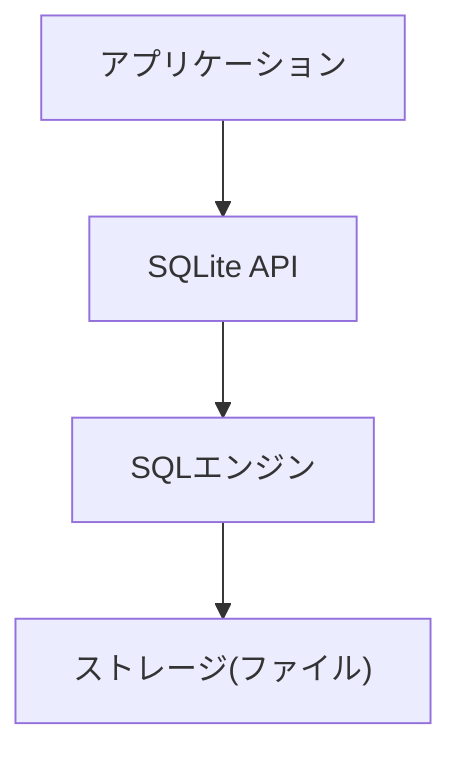
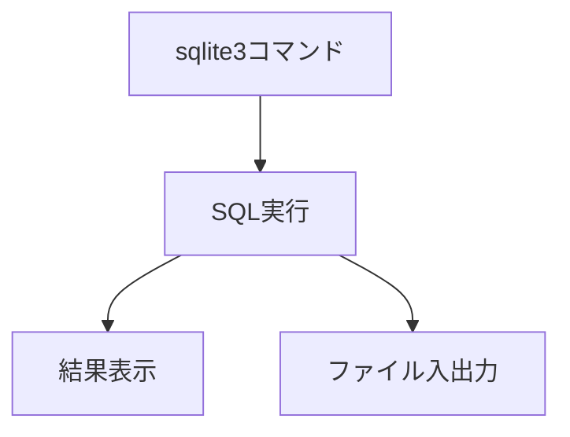
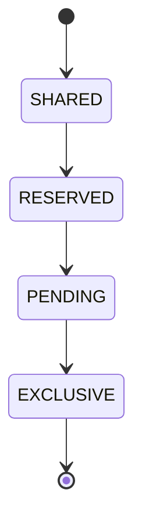

# sqlite

---

## 概要

SQLiteは、自己完結型でサーバーレスなリレーショナルデータベース管理システムである。サーバープロセスを必要とせず、アプリケーションに直接組み込んで利用できる点が最大の特徴である。データベースは単一のファイルとして管理され、インストールや設定が不要であるため、モバイルアプリや組み込み機器、デスクトップアプリケーションなど幅広い用途で採用されている。SQL標準の多くをサポートし、トランザクションやインデックス、ビュー、トリガーなどの機能も備えている。  
SQLiteは、データベースエンジンのソースコード全体が1つのCファイル（amalgamation）として提供されており、組み込みや移植性に優れる。  
また、データベースファイルはプラットフォーム間でバイナリ互換性があり、異なるOS間でもそのまま利用できる。

---

## 歴史

SQLiteは2000年にD. Richard Hippによって開発が開始された。当初は軍事用途のソフトウェアに組み込むために設計されたが、その後オープンソースとして公開され、世界中で利用されるようになった。2004年にはバージョン3系がリリースされ、データ型サポートやパフォーマンスが大幅に向上した。現在も活発に開発が続けられており、最新のSQL標準や新機能への対応も進んでいる。  
SQLiteはMozilla FirefoxやGoogle Chrome、Skype、Adobe製品など、多数の有名ソフトウェアで採用されている。

---

## 特徴

- サーバーレスで動作し、インストールや設定が不要である。
- データベースは単一のファイルで管理され、ファイルのコピーや移動が容易である。
- 軽量かつ高速で、リソース消費が少ない。
- トランザクションやACID特性（Atomicity, Consistency, Isolation, Durability）をサポートしている。
- SQL92の大部分をサポートし、複雑なクエリやサブクエリも利用可能である。
- クロスプラットフォームで動作し、主要なOSやアーキテクチャで利用できる。
- パブリックドメインで公開されており、ライセンスの制約がない。
- データベースファイルはロック制御により同時アクセスが可能だが、書き込みは単一プロセスに制限される。
- データベースサイズは最大140TBまで対応し、1テーブルあたり最大32,767カラム、1行あたり最大2GBのデータを格納できる。

---

## バージョンの違い

| バージョン | 主な特徴 |
|------------|----------|
| 2.x        | 初期リリース、基本的なSQLサポート。データ型は全て文字列として扱われる。 |
| 3.x        | データ型サポートの拡張、BLOB型や型親和性の導入、パフォーマンス向上、トランザクション制御の強化。 |

バージョン3以降は後方互換性を重視しており、ファイルフォーマットの互換性も高い。  
また、3.x系ではWALモードやJSON1、FTS5など多くの拡張機能が追加されている。

---

## ライセンス

SQLiteはパブリックドメインで公開されている。著作権表示やライセンス表記の義務がなく、商用・非商用問わず自由に利用・改変・再配布できる。企業や組織での利用においてもライセンス上の制約は一切ない。  
一部の拡張（SEEなど）は有償ライセンスとなる。

---

## サポートされているプラットフォーム

SQLiteはC言語で実装されており、Windows、Linux、macOS、iOS、Android、FreeBSD、Solarisなど、ほぼ全ての主要プラットフォームで動作する。エンディアンやファイルシステムの違いにも対応しているため、組み込み機器やIoTデバイスでも広く利用されている。  
また、Raspberry Piや各種マイコンボードでも動作実績がある。

---

## サポートされている言語バインディング

SQLiteはC/C++向けのAPIを標準で提供しているが、Python（sqlite3モジュール）、Java（JDBC）、C#（System.Data.SQLite）、Go、Ruby、PHP、Rust、Node.jsなど、多数の言語バインディングが公式・非公式に提供されている。これにより、さまざまな開発環境で容易に利用できる。  
各言語のバインディングは、プリペアドステートメントやトランザクション管理などの機能もサポートしている。

---

## サポートされているファイルフォーマット

SQLiteは独自のバイナリファイルフォーマット（.sqlite, .db, .sqlite3など）を採用している。1つのファイルに全てのデータ・インデックス・メタデータが格納される。バージョン3以降はファイルフォーマットの後方互換性が保たれているため、古いバージョンのファイルも新しいバージョンで読み込むことができる。  
ファイルはページ単位（デフォルト4096バイト）で管理され、ページサイズはPRAGMAで変更可能である。

---

## アーキテクチャ

SQLiteはアプリケーション、API層、SQLエンジン、ストレージ層の4層構造で動作する。APIを通じてSQL文がエンジンに渡され、解析・最適化・実行される。データはストレージ層でファイルとして管理される。  
SQLエンジンはパーサ、オプティマイザ、実行エンジンから構成される。



---

## データ型

SQLiteは動的型付けを採用しており、カラムごとに型親和性（Affinity）が設定される。主なデータ型は以下の通りである。

- NULL: 値なし
- INTEGER: 符号付き整数（1, 2, 3, 4, 6, 8バイトで格納）
- REAL: 浮動小数点数（IEEE754 8バイト）
- TEXT: 文字列（UTF-8/UTF-16）
- BLOB: バイナリデータ

カラム定義時に型を指定しない場合も、任意の型の値を格納できる。

---

## 型変換ルール

SQLiteは型親和性に基づき、データ挿入時に自動的に型変換を行う。例えば、INTEGER型カラムに文字列を挿入すると、可能な限り数値に変換される。型変換ルールにより、柔軟なデータ操作が可能である。  
ただし、厳密な型制約が必要な場合はCHECK制約やアプリケーション側でのバリデーションが推奨される。

---

## NULL値の扱い

NULL値は「値が存在しない」ことを示す。算術演算や比較では特別な扱いとなり、NULLとの比較は常に不明（UNKNOWN）となる。IS NULLやIS NOT NULL演算子で判定する。  
集約関数（SUM, AVG等）はNULL値を無視して計算される。

---

## デフォルト値

カラム定義時に`DEFAULT`句でデフォルト値を指定できる。例えば`created_at DATETIME DEFAULT CURRENT_TIMESTAMP`のように、関数も利用可能である。  
デフォルト値はリテラル値または一部の関数のみ指定可能である。

---

## 制約

主な制約には以下がある。

- PRIMARY KEY: 主キー制約。自動インクリメントも可能。
- UNIQUE: 一意制約。複数カラムにも適用可能。
- NOT NULL: NULL禁止。
- CHECK: 条件式による制約。
- FOREIGN KEY: 外部キー制約。参照整合性を保証。

---

## チェック制約

CHECK制約により、カラム値に対する条件（例：`age INTEGER CHECK(age >= 0)`）を指定できる。条件に違反するデータは挿入・更新できない。  
複数カラムを組み合わせた条件も指定可能である。

---

## 一意制約

UNIQUE制約により、重複しない値のみを許可できる。複数カラムの組み合わせにも適用可能である。  
インデックスが自動的に作成される。

---

## 外部キー制約

FOREIGN KEY制約により、テーブル間の参照整合性を保つことができる。`PRAGMA foreign_keys = ON`で有効化する必要がある。  
ON DELETE/ON UPDATE句で参照先の変更時の動作も指定できる。

---

## インデックス

インデックスを作成することで、検索やソートのパフォーマンスを向上できる。`CREATE INDEX`文で作成し、複数カラムや部分インデックスもサポートされている。  
インデックスの数が多すぎると、書き込み性能が低下するため注意が必要である。

---

## ビュー

ビューは仮想的なテーブルであり、複雑なクエリを簡潔に扱える。`CREATE VIEW`文で定義し、再利用性や保守性を高める。  
ビューは読み取り専用だが、INSTEAD OFトリガーを利用することで更新も可能となる。

---

## マテリアライズドビュー

SQLite標準ではマテリアライズドビューをサポートしないが、トリガーや一時テーブルを組み合わせて実装することができる。  
定期的に集計結果を更新する用途などで利用される。

---

## 仮想テーブル

仮想テーブルは、外部データソースや特殊なストレージをテーブルとして扱う仕組みである。FTSやSpatiaLiteなどのエクステンションが代表例である。  
独自の仮想テーブルをC言語で実装することも可能である。

---

## テンポラリテーブル

`CREATE TEMP TABLE`文で一時テーブルを作成できる。セッション終了時に自動削除され、他の接続からは参照できない。  
一時的なデータ処理やバッチ処理に有用である。

---

## アタッチデータベース

`ATTACH DATABASE`文で複数のデータベースファイルを同時に接続し、クエリで横断的に利用できる。データ移行や分割管理に有用である。  
最大10個まで同時にアタッチ可能（ビルド時に変更可）。

---

## エクステンション機能

SQLiteはユーザー定義関数（UDF）や仮想テーブル、カスタム集約関数などの拡張機能をサポートしている。C言語でエクステンションを実装し、動的にロードすることも可能である。代表的なエクステンションには、JSON1（JSON操作）、FTS（全文検索）、SpatiaLite（空間データ）がある。  
また、独自の関数や集約処理を追加することで、アプリケーション固有の要件にも柔軟に対応できる。

---

## JSONサポート

JSON1エクステンションにより、JSONデータの格納や抽出、検索、更新が可能である。`json_extract`や`json_set`などの関数が利用できる。  
JSON型は存在せず、TEXT型として格納される。

---

## FTS（全文検索）

FTS3/FTS5エクステンションを利用することで、高速な全文検索インデックスを作成できる。自然言語検索やトークナイザのカスタマイズも可能である。  
大量のテキストデータを扱うアプリケーションで有効である。

---

## 空間データサポート

SpatiaLiteエクステンションを利用することで、地理空間データ（座標、ポリゴン等）の格納・検索・空間演算が可能となる。  
GIS用途や地図アプリケーションで利用される。

---

## メモリ管理

SQLiteは内部でページキャッシュやヒープ領域を効率的に管理している。`PRAGMA cache_size`でキャッシュサイズを調整できるほか、メモリデータベース（`:memory:`）として全てをRAM上で管理することも可能である。リソース制約の厳しい環境でも動作するよう最適化されている。  
メモリ使用量はアプリケーションの規模やクエリの複雑さに応じて動的に変化する。

---

## キャッシュ機構

SQLiteはページキャッシュを利用して、ディスクI/Oを最小限に抑えている。キャッシュサイズは動的に変更可能であり、アクセスパターンに応じて最適化できる。キャッシュのヒット率向上により、クエリの応答速度が大きく向上する。  
キャッシュのフラッシュタイミングや同期モードもPRAGMAで制御できる。

---

## スレッドセーフ

SQLiteは3つのスレッドモード（シングルスレッド、マルチスレッド、フルマルチスレッド）をサポートしている。デフォルトではスレッドセーフに動作し、複数スレッドから同時に読み書きが可能である。ただし、同時書き込みには排他制御が働くため、アプリケーション設計時に考慮が必要である。  
スレッドモードはビルド時や実行時に切り替え可能である。

---

## マルチユーザー対応

SQLiteは基本的に単一ユーザー向けだが、複数プロセス・スレッドからの同時アクセスもサポートしている。読み取りは同時に複数可能だが、書き込みは1プロセスのみとなる。高頻度な書き込みや大規模な同時アクセスには不向きである。  
WALモードを利用することで、読み取りと書き込みの同時実行性が向上する。

---

## コマンドラインツール

`sqlite3`コマンドラインツールを利用することで、データベースの作成・管理・クエリ実行が可能である。SQLスクリプトのバッチ実行や、CSV/TSV形式でのインポート・エクスポートもサポートしている。  
また、`.schema`や`.tables`コマンドでスキーマ情報を確認できる。



---

## 設定ファイル

SQLite自体は設定ファイルを持たないが、アプリケーション側で接続パラメータやPRAGMA設定を管理することが一般的である。設定例としては、キャッシュサイズやジャーナルモード、同期モードなどがある。  
設定値はデータベースごと、または接続ごとに変更できる。

---

## ログ機能

SQLiteは標準で詳細なSQLログ機能を持たないが、アプリケーション側でSQL文やエラーをログ出力することができる。デバッグや監査用途では、SQLトレースやトリガーを活用することが多い。  
また、`sqlite3_trace`や`sqlite3_profile`APIを利用することで、SQL実行のトレースやプロファイリングが可能である。

---

## モニタリング

SQLiteのパフォーマンスや状態を監視するには、アプリケーション側でクエリ実行時間、ファイルサイズ、ロック状態などを監視する。`PRAGMA`コマンドや`sqlite_stat1`テーブルを利用して統計情報を取得できる。  
また、ファイルシステムの監視や、OSのリソース監視ツールと組み合わせることで、運用上の問題を早期に検知できる。

---

## アラート・通知

標準機能としてはアラートや通知は持たないが、アプリケーションでエラー検知や異常時の通知を実装できる。トリガーやコールバック関数を活用することで、特定のイベント発生時に処理を追加できる。  
例えば、データ更新時にメール送信やログ記録を行うことが可能である。

---

## パフォーマンスモニタリング

`EXPLAIN`や`EXPLAIN QUERY PLAN`コマンドを利用することで、クエリの実行計画やパフォーマンスボトルネックを分析できる。`sqlite_stat1`テーブルを活用した統計情報の収集も有効である。  
パフォーマンス改善には、インデックス設計やSQL文の見直しが重要である。

---

## トランザクション管理

`BEGIN`でトランザクションを開始し、`COMMIT`で確定、`ROLLBACK`で取り消しができる。ACID特性を満たし、データの整合性を保証する。  
IMMEDIATE/EXCLUSIVEモードでロックの粒度を制御できる。

---

## ロック機構

データベースファイルへの同時アクセス時に排他制御を行う。ロックの種類にはSHARED、RESERVED、PENDING、EXCLUSIVEがある。



ロック競合時はエラーとなるため、リトライ処理やWALモードの利用が推奨される。

---

## ジャーナルモード

データの整合性を保つために、複数のジャーナルモード（DELETE, TRUNCATE, PERSIST, MEMORY, WAL, OFF）を選択できる。WALモードは高い同時実行性を実現する。  
用途や運用方針に応じて最適なモードを選択することが重要である。

---

## WALモード

WAL（Write-Ahead Logging）モードでは、書き込み操作が専用のログファイルに記録されるため、読み取りと書き込みの同時実行が可能となり、パフォーマンスが向上する。  
WALファイルの管理やバックアップ時の注意が必要である。

---

## 自動VACUUM

自動的に不要領域を回収し、ファイルサイズを最適化できる。`PRAGMA auto_vacuum`で設定可能である。  
VACUUM処理はI/O負荷が高いため、運用時はタイミングに注意する。

---

## 自動インデックス

クエリ最適化のために、SQLiteが自動的にインデックスを作成する機能がある。`PRAGMA automatic_index`で制御できる。  
自動インデックスは一時的なもので、パフォーマンス改善に寄与する。

---

## クエリプランナー

クエリの実行計画を自動的に決定し、最適な方法で処理を行う。`EXPLAIN QUERY PLAN`で実行計画を確認できる。  
インデックスの利用状況や結合順序などを確認し、SQL文の最適化に役立てる。

---

## オプティマイザヒント

SQLiteは一部のヒント句（`INDEXED BY`など）をサポートしているが、他のRDBMSほど多くはない。  
ヒント句を活用することで、特定のインデックス利用を強制できる。

---

## ストアドプロシージャ

SQLiteはストアドプロシージャを標準サポートしないが、ユーザー定義関数（UDF）やトリガーを活用することで、複雑な処理を実装できる。  
外部言語（Python, Lua等）と連携することで、より高度な処理も可能である。

---

## トリガー

`CREATE TRIGGER`文で、INSERT/UPDATE/DELETE時に自動実行される処理を定義できる。監査や自動更新、複雑なビジネスロジックの実装に利用される。  
AFTER/BEFORE/INSTEAD OFの各タイミングで設定可能。

---

## イベント通知

標準機能としては持たないが、アプリケーション側でトリガーやコールバック関数を利用して、特定のイベント発生時に通知処理を実装できる。  
外部サービスとの連携も可能である。

---

## スケジューラ

SQLite自体はスケジューラ機能を持たないが、外部のジョブスケジューラやアプリケーション側で定期実行処理を組み合わせることが多い。  
cronやWindowsタスクスケジューラと連携してバッチ処理を実行する例が多い。

---

## バッチ処理

複数のSQL文を一括で実行することで、効率的なデータ処理が可能である。トランザクションを活用することで、処理の一貫性も確保できる。  
大量データのインポート・エクスポートや集計処理に有用である。

---

## レプリケーション

標準ではレプリケーション機能は持たないが、外部ツール（Litestream等）やファイル同期サービスを利用して実現可能である。  
クラウドストレージや分散ファイルシステムと組み合わせることで、冗長化やバックアップが容易になる。

---

## シャーディング

SQLite自体はシャーディング機能を持たない。大規模データ分割はアプリケーション側で管理する必要がある。  
IDレンジや日付ごとにファイルを分割する運用例がある。

---

## フェイルオーバー

標準ではフェイルオーバー機能は持たないが、ファイルのバックアップやクラウドストレージとの連携で可用性を高めることができる。  
ファイルのコピーやリストアは容易である。

---

## 暗号化

公式のSEE（SQLite Encryption Extension）や、SQLCipherなどのサードパーティ製エクステンションを利用することで、データベースファイル全体を暗号化できる。  
暗号化の強度や互換性はエクステンションごとに異なるため、要件に応じて選択する。

---

## SQL文の例

```sql
-- テーブル作成
CREATE TABLE users (
    id INTEGER PRIMARY KEY AUTOINCREMENT,
    name TEXT NOT NULL,
    age INTEGER CHECK(age >= 0)
);

-- データ挿入
INSERT INTO users (name, age) VALUES ('Alice', 30);

-- データ取得
SELECT * FROM users WHERE age > 20;

-- インデックス作成
CREATE INDEX idx_users_age ON users(age);

-- ビュー作成
CREATE VIEW adult_users AS SELECT * FROM users WHERE age >= 20;
```

---

## 基本的な使い方

1. データベースファイルを作成（`sqlite3 sample.db`）
2. テーブル作成（`CREATE TABLE`）
3. データ挿入・取得・更新・削除（`INSERT`, `SELECT`, `UPDATE`, `DELETE`）
4. インデックスやビューの作成
5. バックアップやエクスポート（`.backup`, `.dump`）
6. PRAGMAコマンドで各種設定を調整

---

## インストール方法

多くのOSで標準搭載されているが、公式サイトからバイナリやソースコードをダウンロードして利用することもできる。Linuxではパッケージマネージャ（apt, yum等）でインストール可能である。  
Windowsでは公式バイナリやChocolatey、macOSではHomebrew経由で導入できる。

---

## 外部ツール

- DB Browser for SQLite：GUIでデータベースを操作できる
- SQLiteStudio：クロスプラットフォーム対応のGUIツール
- DBeaver：多機能なデータベース管理ツール
- Datasette：データ公開・可視化ツール

---

## 他DBとの比較

| 項目         | SQLite | MySQL | PostgreSQL |
|--------------|--------|-------|------------|
| サーバーレス | ○      | ×     | ×          |
| 軽量         | ○      | △     | △          |
| ACID         | ○      | ○     | ○          |
| 拡張性       | △      | ○     | ○          |
| 同時書込性能 | △      | ○     | ○          |
| 空間データ   | △(拡張) | ○    | ○          |
| JSON         | ○(拡張) | ○    | ○          |

---

## よくあるトラブルと対策

- データベースロック：同時書き込み時に発生しやすい。WALモードの利用や書き込み頻度の調整で緩和可能。
- ファイル破損：電源断や強制終了時に発生することがある。定期的なバックアップとジャーナルモードの適切な設定が重要。
- 外部キー制約が効かない：`PRAGMA foreign_keys = ON`を忘れずに設定する。
- データベース肥大化：VACUUMや自動VACUUMの活用で解消可能。

---

## パフォーマンスチューニング

- 適切なインデックスの作成
- `PRAGMA`コマンドによるキャッシュサイズや同期モードの調整
- WALモードの活用
- 不要なVACUUMの抑制や自動インデックスの利用
- SQL文の最適化とバッチ処理の活用

---

## セキュリティ

- データベースファイルのパーミッション設定
- 必要に応じて暗号化エクステンションの利用
- SQLインジェクション対策としてプリペアドステートメントの利用
- バックアップファイルの管理とアクセス制御

---

## バックアップとリストア

`.backup`コマンドやファイルコピーでバックアップ・リストアが可能である。オンラインバックアップAPIも提供されており、稼働中でも安全にバックアップできる。  
WALモード利用時はWALファイルも含めてバックアップする必要がある。

---

## サポートとコミュニティ

公式サイトのドキュメントやフォーラム、Stack Overflow、GitHubなどで情報交換が活発である。バグ報告や機能要望も受け付けている。  
商用サポートやコンサルティングサービスも提供されている。

---

## 利用例

- モバイルアプリのローカルデータベース（iOS/Android標準DB）
- 組み込み機器の設定管理
- デスクトップアプリのデータ保存（Firefox, Chrome, Skype等で採用）
- テストやプロトタイピング、データ交換フォーマット
- IoTデバイスや産業機器のデータロギング

---

## よくある質問

- Q: SQLiteはどのくらいのデータ量まで扱えるか？
  - A: 最大140TBまで対応可能であるが、用途によっては他DBMSの利用を推奨する。
- Q: 同時アクセスはどの程度まで可能か？
  - A: 読み取りは多数同時に可能だが、書き込みは1プロセスのみとなる。
- Q: データベースファイルの移行は簡単か？
  - A: ファイルのコピーのみで移行可能である。異なるOS間でも互換性がある。

---

## 参考リンク

- [SQLite公式サイト](https://www.sqlite.org/)
- [DB Browser for SQLite](https://sqlitebrowser.org/)
- [SQLite Documentation](https://www.sqlite.org/docs.html)
- [SQLite FAQ](https://www.sqlite.org/faq.html)
- [SQLite Source Code](https://www.sqlite.org/src)